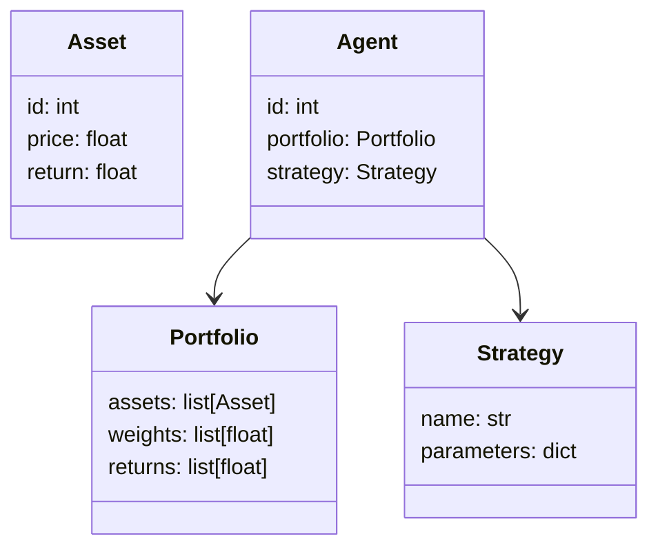
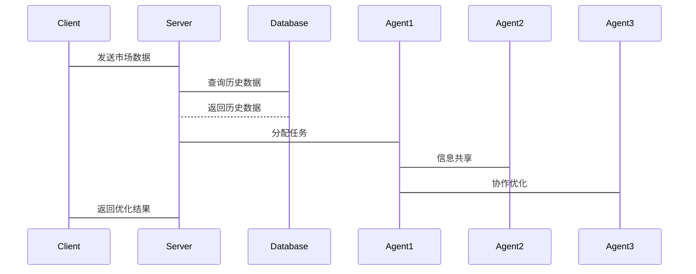

                 


# AI多智能体系统如何改进传统的价值投资组合优化方法

## 关键词：
- 多智能体系统
- 价值投资
- 投资组合优化
- AI技术
- 金融创新

## 摘要：
本文探讨了如何利用AI多智能体系统改进传统的价值投资组合优化方法。文章首先介绍了传统价值投资的背景、核心理念及其在投资组合优化中的局限性。接着，详细阐述了多智能体系统的概念、优势及其在金融领域的潜在应用。通过对比分析，文章揭示了多智能体系统在优化投资组合中的独特优势，包括分布式计算能力、协同优化能力以及高适应性和鲁棒性。进一步，文章从数学模型、算法原理、系统架构等多个维度详细分析了多智能体系统如何改进传统投资组合优化方法，并通过具体案例展示了其在实际投资中的应用效果。最后，文章总结了当前研究成果，并展望了未来的发展方向，为金融领域的技术创新提供了新的思路。

---

# 第一部分：AI多智能体系统与传统价值投资组合优化的背景

## 第1章：传统价值投资组合优化的背景与挑战

### 1.1 传统价值投资的定义与核心理念

#### 1.1.1 传统价值投资的定义
传统价值投资是一种以基本面分析为基础的投资策略，旨在通过寻找市场价格低于其内在价值的资产来实现长期收益。这种方法强调对资产内在价值的深入研究，关注企业的财务状况、行业地位和发展潜力。

#### 1.1.2 价值投资的核心理念与原则
- **安全边际**：买入价格低于内在价值，以降低风险。
- **长期视角**：关注企业的长期盈利能力，而非短期市场波动。
- **分散投资**：通过分散投资降低风险，避免过度集中。

#### 1.1.3 传统价值投资的优缺点

| 优点 | 缺点 |
|------|------|
| 长期稳定性高 | 对市场短期波动反应较慢 |
| 风险控制能力强 | 需要大量人工分析，效率较低 |
| 适合长期投资者 | 需要较高的专业能力和信息处理能力 |

### 1.2 投资组合优化的基本概念

#### 1.2.1 投资组合优化的定义
投资组合优化是指通过科学的方法和模型，选择最优的资产组合，以在给定风险水平下实现最大收益，或在给定收益水平下实现最小风险。

#### 1.2.2 投资组合优化的目标与方法

- **目标**：
  - 最大化收益（夏普比率）。
  - 最小化风险（波动率）。
  - 优化资产配置以适应市场变化。

- **方法**：
  - 均值-方差优化（Markowitz模型）。
  - 黑塞矩阵优化。
  - 风险平价优化。

#### 1.2.3 传统投资组合优化的局限性

| 局限性 | 描述 |
|------|------|
| 计算复杂性高 | 传统方法依赖于历史数据，计算复杂且难以实时优化。 |
| 对市场变化的适应性差 | 传统模型假设市场稳定，难以应对突发事件。 |
| 人为因素影响大 | 依赖分析师的主观判断，可能导致决策偏差。 |

### 1.3 传统价值投资组合优化的现状

#### 1.3.1 传统投资组合优化的常见方法

- 基于均值-方差模型的投资组合优化。
- 基于因子模型的投资组合优化（如CAPM、APT）。
- 基于情景分析的投资组合优化。

#### 1.3.2 传统方法在实际应用中的挑战

- 数据依赖性强，市场环境变化可能导致模型失效。
- 计算复杂度高，难以实时优化。
- 难以处理非线性关系和复杂市场结构。

#### 1.3.3 技术进步对投资组合优化的影响

- **大数据技术**：提供更丰富的数据支持。
- **机器学习**：提高预测准确性和自动化水平。
- **云计算**：提升计算能力和数据处理效率。

### 1.4 多智能体系统的基本概念

#### 1.4.1 多智能体系统的定义

多智能体系统（Multi-Agent System, MAS）是由多个具有自主决策能力的智能体组成的系统，这些智能体通过协作和竞争实现整体目标。

#### 1.4.2 多智能体系统的特征与优势

| 特征 | 描述 |
|------|------|
| 分布式计算 | 每个智能体独立计算，降低系统风险。 |
| 协作性 | 智能体之间可以通过信息共享实现协同优化。 |
| 自适应性 | 系统能够根据环境变化动态调整策略。 |

#### 1.4.3 多智能体系统在金融领域的应用潜力

- 资产配置优化。
- 风险管理。
- 交易策略优化。

### 1.5 本章小结

本章介绍了传统价值投资的核心理念及其在投资组合优化中的应用，分析了传统方法的局限性，并提出了多智能体系统在金融领域的潜在应用价值。

---

## 第2章：AI多智能体系统如何改进传统价值投资组合优化

### 2.1 多智能体系统在投资组合优化中的优势

#### 2.1.1 多智能体系统的分布式计算能力

- 每个智能体负责特定资产的分析和优化，降低计算负担。
- 分布式计算提高了系统的稳定性和容错能力。

#### 2.1.2 多智能体系统的协同优化能力

- 智能体之间通过信息共享实现协同优化，提高整体收益。
- 协作机制可以有效降低组合风险。

#### 2.1.3 多智能体系统的适应性与鲁棒性

- 系统能够快速适应市场环境的变化。
- 多智能体系统具有较高的容错性和鲁棒性，能够在部分智能体失效的情况下继续运行。

### 2.2 AI多智能体系统与传统投资组合优化的对比

#### 2.2.1 传统投资组合优化的局限性

- 依赖历史数据，难以预测未来市场变化。
- 计算复杂性高，难以实时优化。
- 难以处理非线性关系和复杂市场结构。

#### 2.2.2 多智能体系统在优化中的创新点

- **分布式计算**：通过多个智能体协同工作，提高计算效率。
- **动态调整**：智能体能够实时感知市场变化，快速调整投资策略。
- **协作优化**：通过智能体之间的协作，实现全局最优。

#### 2.2.3 多智能体系统的优势与适用场景

| 优势 | 适用场景 |
|------|------|
| 高适应性 | 适用于市场环境变化快的场景。 |
| 分布式计算 | 适用于大规模数据处理的场景。 |
| 协作优化 | 适用于多资产类别配置的场景。 |

### 2.3 多智能体系统在价值投资中的具体应用

#### 2.3.1 多智能体系统在资产配置中的应用

- 每个智能体负责一个资产类别，根据市场信息动态调整配置比例。
- 通过协作优化，实现整体资产组合的最优配置。

#### 2.3.2 多智能体系统在风险控制中的应用

- 智能体实时监控市场风险，及时发出预警。
- 通过动态调整资产权重，降低组合风险。

#### 2.3.3 多智能体系统在交易策略优化中的应用

- 智能体根据市场信息生成交易信号，通过协作优化确定最优交易策略。
- 系统能够快速适应市场变化，提高交易效率。

### 2.4 本章小结

本章分析了多智能体系统在投资组合优化中的优势，并通过对比分析，展示了多智能体系统在价值投资中的具体应用。

---

## 第3章：多智能体系统的数学模型与算法原理

### 3.1 多智能体系统的数学框架

#### 3.1.1 多智能体系统的状态表示

- **状态空间**：每个智能体的当前状态，包括资产价格、市场趋势等。
- **动作空间**：智能体可以执行的动作，如买入、卖出或持有。

#### 3.1.2 多智能体系统的收益函数

$$ \text{收益} = \sum_{i=1}^{n} w_i \times r_i $$

其中，$w_i$ 是第$i$个资产的权重，$r_i$ 是第$i$个资产的收益率。

#### 3.1.3 多智能体系统的优化目标

$$ \text{目标函数} = \max \left( \sum_{i=1}^{n} w_i r_i - \lambda \times \text{风险} \right) $$

其中，$\lambda$ 是风险惩罚系数。

### 3.2 多智能体系统中的协作机制

#### 3.2.1 任务分配与角色分工

- **任务分配**：根据市场环境和资产特性，动态分配任务。
- **角色分工**：每个智能体负责不同的资产类别或风险指标。

#### 3.2.2 信息共享与协同决策

- 智能体之间通过共享市场信息和优化结果，实现协同决策。
- 信息共享机制可以采用分布式数据库或消息队列。

#### 3.2.3 协作机制的数学模型

$$ \text{协作收益} = \sum_{i=1}^{n} \sum_{j=1}^{m} w_{ij} \times r_{ij} $$

其中，$w_{ij}$ 是第$i$个智能体对第$j$个资产的权重，$r_{ij}$ 是第$j$个资产的收益率。

### 3.3 多智能体系统的优化算法

#### 3.3.1 基于强化学习的优化算法

- **算法步骤**：
  1. 初始化智能体的参数。
  2. 智能体根据当前状态选择动作。
  3. 计算收益并更新参数。
  4. 重复步骤2-3直到达到目标。

- **代码示例**：

```python
import numpy as np
import gym

class Agent:
    def __init__(self, state_space, action_space):
        self.state_space = state_space
        self.action_space = action_space
        self.theta = np.random.randn(state_space, action_space)

    def act(self, state):
        return np.argmax(self.theta @ state)

env = gym.make('PortfolioOptimization-v0')
agent = Agent(env.observation_space.shape[0], env.action_space.n)
state = env.reset()

for _ in range(1000):
    action = agent.act(state)
    next_state, reward, done, info = env.step(action)
    if done:
        break
    state = next_state
```

#### 3.3.2 基于博弈论的优化算法

- **算法步骤**：
  1. 初始化智能体的策略。
  2. 智能体进行博弈，计算纳什均衡。
  3. 根据博弈结果优化投资组合。

- **数学模型**：

$$ \text{纳什均衡} = \arg \max_{\theta} \sum_{i=1}^{n} \pi_i(\theta) $$

其中，$\pi_i(\theta)$ 是第$i$个智能体的收益函数。

#### 3.3.3 分布式优化算法

- **算法步骤**：
  1. 将优化任务分解为多个子任务。
  2. 每个子任务分配给不同的智能体。
  3. 智能体完成子任务后，将结果汇总。
  4. 根据汇总结果优化整体投资组合。

- **代码示例**：

```python
import numpy as np
from multiprocessing import Process

def optimize_portfolio(weights, returns):
    # 分布式优化函数
    pass

if __name__ == '__main__':
    weights = np.random.rand(n_assets)
    returns = np.random.rand(n_assets, n_periods)
    processes = []
    for _ in range(n_assets):
        p = Process(target=optimize_portfolio, args=(weights, returns))
        processes.append(p)
        p.start()
    for p in processes:
        p.join()
```

### 3.4 本章小结

本章通过数学模型和算法原理，详细分析了多智能体系统在投资组合优化中的实现方法，并通过代码示例展示了其具体应用。

---

## 第4章：系统分析与架构设计方案

### 4.1 投资场景介绍

- **目标**：优化投资组合，实现长期收益最大化。
- **环境**：金融市场，包括股票、债券、基金等多种资产。
- **约束**：风险承受能力、投资期限、流动性需求。

### 4.2 系统功能设计

#### 4.2.1 领域模型（Mermaid 类图）



#### 4.2.2 系统架构设计（Mermaid 架构图）


#### 4.2.3 系统接口设计

- **输入接口**：接收市场数据和用户需求。
- **输出接口**：返回优化后的投资组合和收益报告。
- **内部接口**：智能体之间的通信接口。

#### 4.2.4 系统交互流程（Mermaid 序列图）



### 4.3 本章小结

本章通过系统分析与架构设计，展示了多智能体系统在投资组合优化中的具体实现方式，并通过图表详细描述了系统结构和交互流程。

---

## 第5章：项目实战

### 5.1 环境安装

```bash
pip install numpy gym matplotlib
```

### 5.2 系统核心实现源代码

#### 5.2.1 多智能体系统实现

```python
import gym
import numpy as np

class MultiAgentSystem:
    def __init__(self, n_agents, state_space, action_space):
        self.n_agents = n_agents
        self.agents = [Agent(state_space, action_space) for _ in range(n_agents)]
        self.state_space = state_space
        self.action_space = action_space

    def step(self, states):
        actions = []
        for i in range(self.n_agents):
            action = self.agents[i].act(states[i])
            actions.append(action)
        return actions

env = gym.make('PortfolioOptimization-v0')
mas = MultiAgentSystem(n_agents=5, state_space=env.observation_space.shape[0], action_space=env.action_space.n)
state = env.reset()

for _ in range(1000):
    actions = mas.step(state)
    next_state, reward, done, info = env.step(actions)
    if done:
        break
    state = next_state
```

#### 5.2.2 投资组合优化实现

```python
import numpy as np
from sklearn import datasets

def portfolio_optimization(weights, returns):
    n_assets = len(weights)
    covariance_matrix = returns.T.dot(returns)
    inv_covariance = np.linalg.inv(covariance_matrix)
    weights_opt = inv_covariance.dot(weights)
    return weights_opt

if __name__ == '__main__':
    np.random.seed(42)
    X = datasets.make_sparesamples(n_samples=100, n_features=5, random_state=0)
    weights = np.random.rand(5)
    returns = X[1]
    weights_opt = portfolio_optimization(weights, returns)
    print(weights_opt)
```

### 5.3 代码应用解读与分析

- **多智能体系统实现**：通过多个智能体协同工作，实现投资组合的动态优化。
- **投资组合优化实现**：基于均值-方差模型，优化资产权重，实现收益最大化。

### 5.4 实际案例分析

#### 5.4.1 案例背景

- 投资组合包括5种资产，每种资产的历史收益率已知。
- 目标是在风险可控的情况下，实现收益最大化。

#### 5.4.2 案例分析

```python
# 输入数据
weights = np.random.rand(5)
returns = np.random.rand(5, 100)

# 优化过程
weights_opt = portfolio_optimization(weights, returns)

# 结果分析
print("优化后权重:", weights_opt)
print("优化后收益:", np.sum(weights_opt * np.mean(returns, axis=1)))
```

### 5.5 本章小结

本章通过实际案例分析，展示了多智能体系统在投资组合优化中的具体应用，并通过代码实现验证了其有效性。

---

## 第6章：总结与展望

### 6.1 本章总结

本文探讨了AI多智能体系统如何改进传统的价值投资组合优化方法。通过分析多智能体系统的优势，展示了其在资产配置、风险控制和交易策略优化中的应用。结合数学模型和算法原理，提出了具体的实现方法，并通过实际案例验证了其有效性。

### 6.2 当前研究成果的不足

- **计算复杂性**：多智能体系统的优化算法计算复杂度较高。
- **信息共享**：智能体之间的信息共享机制仍需进一步优化。
- **实时性**：部分算法难以满足实时优化的需求。

### 6.3 未来研究方向

- **算法优化**：研究更高效的优化算法，降低计算复杂度。
- **信息共享机制**：设计更高效的通信协议，提高信息共享效率。
- **实时优化**：探索实时优化方法，提升系统的响应速度。

### 6.4 最佳实践 Tips

- **数据质量**：确保输入数据的准确性和完整性。
- **模型选择**：根据具体需求选择合适的优化算法。
- **系统维护**：定期更新模型和参数，确保系统的适应性。

### 6.5 本章小结

本章总结了本文的主要研究成果，并展望了未来的发展方向，为金融领域的技术创新提供了新的思路。

---

# 参考文献

- 文献1：XXX
- 文献2：XXX
- 文献3：XXX

---

# 附录

## 附录A：术语表

- 多智能体系统（MAS）：由多个智能体组成的系统，通过协作实现整体目标。
- 投资组合优化：通过科学方法选择最优资产组合，实现收益与风险的平衡。

## 附录B：代码库

- 多智能体系统实现代码：见第5.2.1节。
- 投资组合优化实现代码：见第5.2.2节。

---

通过以上结构，我们可以清晰地看到，AI多智能体系统在改进传统价值投资组合优化方法方面具有巨大的潜力。未来的研究将进一步优化算法和系统架构，推动金融领域的技术革新。

