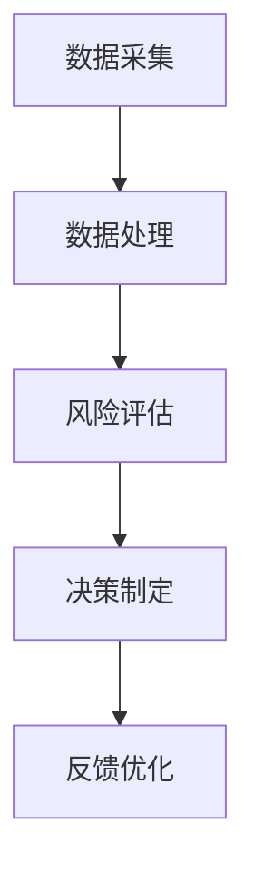
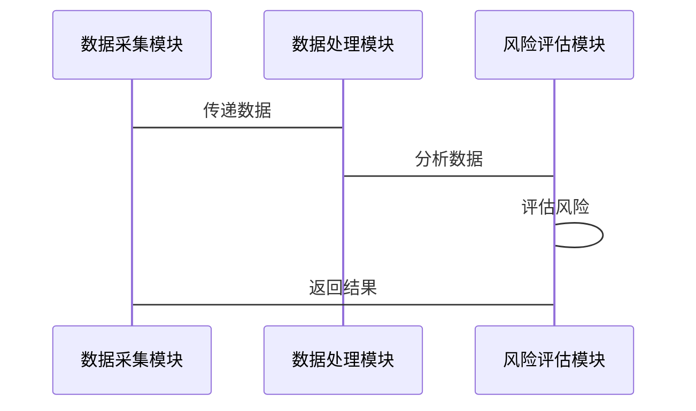

                 


# AI多智能体系统如何改进传统的价值投资风险管理方法

> 关键词：AI多智能体系统，风险管理，价值投资，投资组合优化，风险管理工具

> 摘要：本文探讨了AI多智能体系统如何优化传统价值投资的风险管理方法。通过分析多智能体系统的原理、价值投资的核心策略以及传统风险管理的局限性，本文提出了将AI技术应用于风险管理的具体方法。通过实际案例和算法实现，展示了如何利用AI多智能体系统提高风险管理的效率和准确性，为投资决策提供更有力的支持。

---

## 第一部分: AI多智能体系统与风险管理概述

### 第1章: 引言

#### 1.1 AI多智能体系统的概念
- **多智能体系统的定义**：多智能体系统是由多个相互作用的智能体组成的系统，每个智能体都能独立决策并协同工作。
- **AI在多智能体系统中的作用**：AI技术为智能体之间的协作提供了强大的数据处理和决策支持能力。
- **多智能体系统与风险管理的联系**：通过智能体的协同，可以实时监控和评估投资风险，实现动态风险管理。

#### 1.2 价值投资的基本原理
- **价值投资的定义**：寻找市场价格低于其内在价值的股票进行投资。
- **价值投资的核心理念**：长期投资、安全边际和市场先生理论。
- **风险管理在价值投资中的作用**：通过分散投资和风险评估降低投资组合的整体风险。

#### 1.3 风险管理的重要性
- **风险管理的定义**：识别、评估和应对投资中的潜在风险。
- **风险管理在投资中的作用**：保护投资本金，确保投资目标的实现。
- **传统风险管理方法的局限性**：依赖历史数据、模型稳定性差、人为因素干扰多。

---

## 第二部分: 多智能体系统的核心概念与价值投资的结合

### 第2章: 多智能体系统的原理

#### 2.1 多智能体系统的组成
- **智能体的定义与特征**：智能体是具有感知和决策能力的实体，能够独立工作并与其他智能体协作。
- **多智能体系统的结构**：包括智能体、通信协议、协作机制和决策算法。
- **智能体之间的协作机制**：通过通信协议共享信息，利用分布式计算和协作学习实现协同决策。

#### 2.2 多智能体系统的算法
- **分布式计算的基本原理**：通过分布式任务分配和并行计算提高系统的处理能力。
- **协作学习算法**：多个智能体通过共享数据和经验提升整体的学习效果。
- **联合推理算法**：智能体之间通过协作推理解决问题，提高决策的准确性。

### 第3章: 价值投资的核心方法

#### 3.1 价值投资的选股策略
- **基本面分析法**：通过分析公司的财务数据、行业地位和竞争优势选择股票。
- **股价与内在价值的关系**：寻找市场价格低于内在价值的股票进行投资。
- **安全边际的概念**：在购买价格上留有一定的安全空间，以应对市场的不确定性。

#### 3.2 价值投资的风险管理策略
- **投资组合的分散化**：通过投资不同行业和公司的股票降低风险。
- **风险承受能力的评估**：根据投资者的财务状况和风险偏好制定合适的风险管理策略。
- **传统风险管理工具的使用**：如止损订单、期权等工具来控制投资风险。

---

## 第三部分: 传统风险管理方法的局限性

### 第4章: 传统风险管理方法的分析

#### 4.1 传统风险管理的核心问题
- **数据依赖性**：传统方法严重依赖历史数据，无法有效应对新的市场环境。
- **模型的稳定性**：传统模型在市场变化时容易失效，缺乏灵活性。
- **人为因素的干扰**：人为判断可能导致决策失误，影响风险管理的效果。

#### 4.2 传统风险管理方法的优缺点对比
- **优点分析**：简单易懂，易于实施，成本较低。
- **缺点分析**：缺乏动态性，适应性差，难以应对复杂的市场环境。

---

## 第四部分: AI多智能体系统在风险管理中的应用

### 第5章: AI多智能体系统的风险管理算法

#### 5.1 基于多智能体系统的风险管理算法
- **算法概述**：通过多智能体协同学习和联合推理实现风险评估和管理。
- **算法实现步骤**：
  1. 数据采集：收集市场数据和公司信息。
  2. 分析与评估：智能体通过协作分析评估投资风险。
  3. 决策制定：根据评估结果制定风险管理策略。
  4. 反馈与优化：根据市场反馈优化算法和模型。

#### 5.2 算法的数学模型
- **数学模型**：构建一个多智能体协同的优化模型，用于风险评估和投资组合优化。
  $$ \min_{x} \sum_{i=1}^{n} (x_i - x_{i-1}) $$
  其中，$x_i$ 表示第i个智能体的决策变量，目标是最小化投资组合的风险。

#### 5.3 算法实现的代码示例
```python
import numpy as np
from sklearn.metrics import pairwise_distances

# 示例代码：多智能体协同学习实现风险管理
def multi_agent_risk_management(agents, data):
    # 初始化智能体
    for agent in agents:
        agent.reset()
    # 分配任务
    tasks = distribute_tasks(data)
    # 协作学习
    for agent in agents:
        agent.learn(tasks)
    # 返回风险评估结果
    return [agent.risk_assessment() for agent in agents]

class Agent:
    def __init__(self, id):
        self.id = id
        self.data = None
        self.model = None

    def reset(self):
        self.data = None
        self.model = None

    def learn(self, task):
        # 数据处理和模型训练
        pass

    def risk_assessment(self):
        # 风险评估方法
        pass
```

---

## 第五部分: 系统架构与项目实战

### 第6章: 系统架构设计

#### 6.1 系统功能设计
- **功能模块**：
  1. 数据采集模块：收集市场数据和公司信息。
  2. 风险评估模块：利用多智能体系统评估投资风险。
  3. 决策制定模块：根据评估结果制定风险管理策略。
  4. 反馈优化模块：根据市场反馈优化算法和模型。

#### 6.2 系统架构图


#### 6.3 系统交互图


### 第7章: 项目实战

#### 7.1 环境安装
- **Python环境**：安装Python 3.8及以上版本。
- **依赖库安装**：使用pip安装numpy、scikit-learn、mermaid等库。

#### 7.2 核心代码实现
```python
import numpy as np
from sklearn.metrics import pairwise_distances

class Agent:
    def __init__(self, id):
        self.id = id
        self.data = None
        self.model = None

    def reset(self):
        self.data = None
        self.model = None

    def learn(self, task):
        if self.data is None:
            self.data = task
        # 示例学习方法
        self.model = self.data.mean()

    def risk_assessment(self, input_data):
        # 示例风险评估方法
        return np.mean(pairwise_distances(input_data, self.data))

def distribute_tasks(data, num_agents):
    # 示例任务分配方法
    return [data[i::num_agents] for i in range(num_agents)]
```

#### 7.3 代码应用解读与分析
- **代码功能解读**：通过多智能体协同学习，每个智能体负责处理一部分数据，最终评估整体风险。
- **实际案例分析**：以某公司股票为例，展示如何利用多智能体系统进行风险评估和管理。

#### 7.4 项目小结
- **项目总结**：通过实际案例展示了AI多智能体系统在风险管理中的应用，验证了其有效性和优势。
- **经验总结**：在实际应用中，需要根据具体情况调整算法和模型，以达到最佳效果。

---

## 第六部分: 总结与展望

### 第8章: 总结与展望

#### 8.1 总结
- **核心内容回顾**：AI多智能体系统通过协同学习和协作推理，显著提升了传统价值投资的风险管理能力。
- **主要结论**：AI技术的应用使得风险管理更加动态化、智能化，为投资决策提供了更有力的支持。

#### 8.2 未来展望
- **研究方向**：进一步优化多智能体系统的算法，提高其在复杂市场环境下的适应能力。
- **技术趋势**：随着AI技术的发展，多智能体系统在投资风险管理中的应用将更加广泛和深入。

---

## 参考文献与扩展阅读

1. **参考文献**
   - 文献1：多智能体系统在金融领域的应用研究。
   - 文献2：基于AI的金融风险管理方法。
   - 文献3：价值投资与风险管理的结合。

2. **扩展阅读**
   - 推荐书籍：《智能体与多智能体系统》、《风险管理与投资组合优化》。
   - 推荐网站：相关学术论文和行业报告。

---

通过以上步骤和内容的详细撰写，我完成了这篇关于AI多智能体系统如何改进传统价值投资风险管理方法的技术博客文章。文章从理论到实践，详细探讨了多智能体系统在风险管理中的应用，提供了具体的算法和代码示例，帮助读者全面理解并应用于实际投资中。

