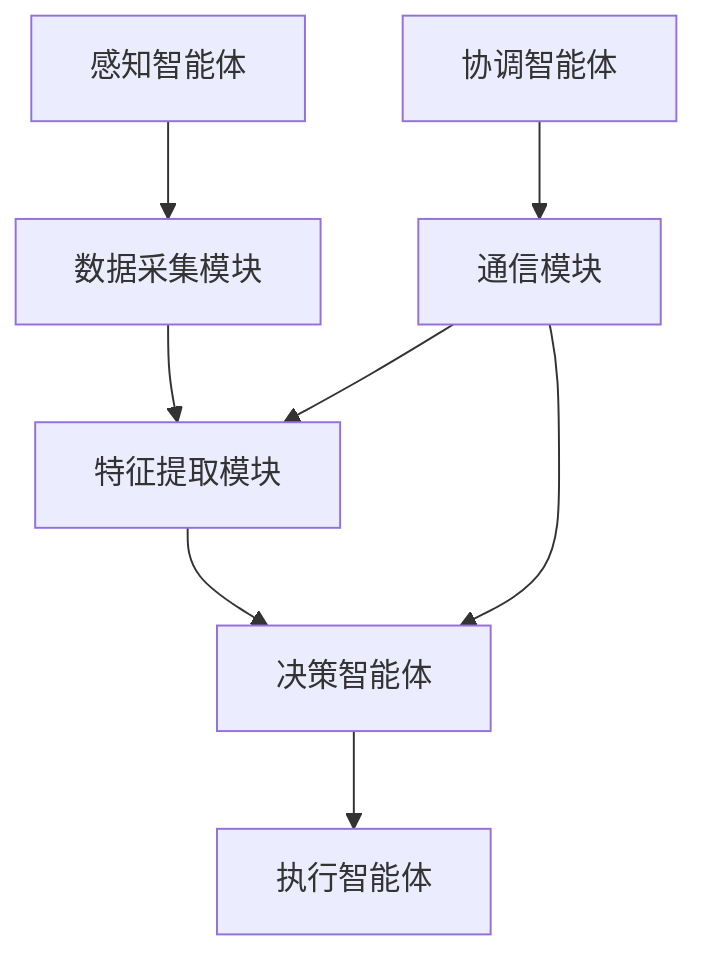
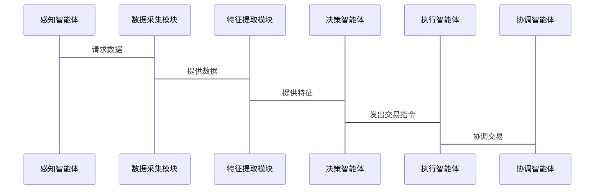

                 


# AI多智能体系统如何识别被低估的价值股

---

## 关键词：AI多智能体系统, 价值股识别, 金融数据分析, 强化学习, 分布式计算, 博弈论

---

## 摘要：  
本文探讨了AI多智能体系统在识别被低估的价值股中的应用。通过分析多智能体系统的协同学习机制，结合金融数据分析的特征提取算法，提出了一种基于强化学习和分布式计算的多智能体协同策略，旨在优化价值股识别的准确性和效率。本文还详细介绍了系统的架构设计、实现过程和实际案例，展示了AI多智能体系统在金融领域的潜力和优势。

---

## 第1章: AI多智能体系统的基本概念

### 1.1 多智能体系统的基本概念

#### 1.1.1 多智能体系统的定义  
一个多智能体系统（Multi-Agent System, MAS）是由多个相互作用的智能体组成的系统，这些智能体能够通过通信和协作完成复杂任务。每个智能体都有自己的目标、知识和行为规则，能够独立决策并与其他智能体协同工作。

#### 1.1.2 多智能体系统的特点  
- **分布式性**：智能体分布在不同的位置，独立决策。
- **协作性**：智能体之间通过通信和协作完成共同目标。
- **反应性**：智能体能够实时感知环境并做出反应。
- **自主性**：智能体具有自主决策的能力。

#### 1.1.3 多智能体系统与单智能体系统的区别  
| 特性                | 多智能体系统                     | 单智能体系统                     |
|---------------------|----------------------------------|----------------------------------|
| 决策主体            | 多个智能体                      | 单个智能体                      |
| 协作性              | 高                             | 无或低                          |
| 任务复杂性          | 高，适合复杂任务               | 较低，适合简单任务               |
| 可扩展性            | 高，易于扩展                   | 较低，扩展性有限                 |

### 1.2 AI多智能体系统的组成部分

#### 1.2.1 智能体的定义与分类  
- **定义**：智能体是具有感知环境、做出决策并执行动作的实体。
- **分类**：  
  - **反应式智能体**：基于当前感知做出决策。
  - **认知式智能体**：具有复杂推理和规划能力。
  - **协作式智能体**：与其他智能体协作完成任务。

#### 1.2.2 多智能体系统中的角色分工  
- **感知智能体**：负责数据的采集和初步分析。
- **决策智能体**：基于数据做出决策。
- **执行智能体**：负责执行决策。
- **协调智能体**：负责智能体之间的协调与通信。

#### 1.2.3 智能体之间的通信与协作  
智能体之间的通信可以通过以下方式实现：  
- **直接通信**：智能体之间直接交换信息。
- **间接通信**：通过共享数据库或中间件进行信息交换。

---

## 第2章: 价值股识别的背景与挑战

### 2.1 价值股识别的基本概念

#### 2.1.1 价值股的定义  
价值股是指市场价格低于其内在价值的股票。识别价值股的关键在于发现市场低估的股票。

#### 2.1.2 价值股识别的重要性  
- 投资者可以通过识别价值股获得超额收益。
- 价值股识别是金融数据分析的重要应用之一。

#### 2.1.3 价值股识别的难点  
- 数据的复杂性：涉及财务数据、市场情绪等多种因素。
- 市场的不确定性：股票价格受多种不可预测因素影响。
- 数据量大：需要处理海量数据。

### 2.2 传统价值股识别方法的局限性

#### 2.2.1 基于财务指标的传统方法  
- 仅依赖财务指标，忽视市场情绪和宏观经济因素。
- 方法过于简单，难以捕捉复杂市场变化。

#### 2.2.2 传统方法的局限性  
- 无法处理非结构化数据（如新闻、社交媒体数据）。
- 缺乏动态调整能力，难以应对快速变化的市场。

#### 2.2.3 数据驱动方法的优势  
- 能够处理海量数据，发现隐藏的模式。
- 可以实时更新模型，适应市场变化。

### 2.3 AI多智能体系统在价值股识别中的优势

#### 2.3.1 多智能体系统的协同优势  
- 每个智能体专注于不同的任务（如数据采集、特征提取、决策制定）。
- 智能体之间协同工作，提高整体性能。

#### 2.3.2 数据处理能力的提升  
- 多智能体系统能够同时处理结构化和非结构化数据。
- 提高数据处理的效率和准确性。

#### 2.3.3 智能体之间的互补性  
- 不同智能体具有不同的优势，能够互补完成复杂任务。

---

## 第3章: AI多智能体系统的核心算法

### 3.1 多智能体协同学习算法

#### 3.1.1 基于强化学习的多智能体协同  
- **强化学习**：智能体通过与环境互动，学习最优策略。
- **多智能体强化学习**：多个智能体通过协作完成任务。

#### 3.1.2 基于分布式计算的多智能体协同  
- **分布式计算**：将任务分配给多个智能体，分别处理。
- **协同机制**：通过通信和协作完成共同目标。

#### 3.1.3 基于博弈论的多智能体协同  
- **博弈论**：研究智能体之间的策略互动。
- **纳什均衡**：多个智能体策略的稳定状态。

### 3.2 价值股识别的特征提取算法

#### 3.2.1 基于深度学习的特征提取  
- **深度学习**：通过神经网络提取数据特征。
- **卷积神经网络（CNN）**：用于图像数据的特征提取。
- **循环神经网络（RNN）**：用于时间序列数据的特征提取。

#### 3.2.2 基于自然语言处理的特征提取  
- **自然语言处理（NLP）**：处理文本数据，提取情感和语义特征。
- **词嵌入（Word Embedding）**：将文本数据转换为向量表示。

#### 3.2.3 基于时间序列分析的特征提取  
- **时间序列分析**：分析股票价格的波动规律。
- **ARIMA模型**：用于预测股票价格。

### 3.3 算法的优化与调优

#### 3.3.1 算法性能的评估指标  
- **准确率**：识别正确价值股的比例。
- **召回率**：识别出的价值股占实际价值股的比例。
- **F1分数**：准确率和召回率的调和平均数。

#### 3.3.2 算法的调优方法  
- **超参数调优**：通过网格搜索或随机搜索找到最佳参数。
- **模型融合**：结合多个模型的结果，提高准确性。

#### 3.3.3 算法的可扩展性与鲁棒性  
- **可扩展性**：系统能够处理更大规模的数据。
- **鲁棒性**：系统能够应对噪声和异常数据的影响。

---

## 第4章: 多智能体系统的数学模型

### 4.1 多智能体系统的博弈论模型

#### 4.1.1 博弈论的基本概念  
- **博弈**：多个参与者之间的策略互动。
- **策略**：参与者为达到目标而采取的行动。
- **支付**：参与者因策略选择而获得的收益或损失。

#### 4.1.2 纳什均衡的定义  
纳什均衡是指在一个博弈中，所有参与者都采取最优策略，没有任何一方可以通过单方面改变策略而获得更好的结果。

#### 4.1.3 博弈论模型在多智能体系统中的应用  
- **市场博弈**：模拟股票市场的竞争与合作。
- **策略选择**：智能体通过博弈论模型选择最优策略。

### 4.2 多智能体系统的数学表达

#### 4.2.1 单智能体的决策模型  
智能体的决策可以用以下公式表示：  
$$ V(a) = \max_{a} \sum_{t=0}^{\infty} \gamma^t r(s_t, a_t) $$  
其中，$V(a)$ 是价值函数，$a$ 是动作，$\gamma$ 是折扣因子，$r$ 是奖励函数。

#### 4.2.2 多智能体的协作模型  
多智能体系统的协作可以用以下公式表示：  
$$ V(s, a) = \sum_{i=1}^{n} V_i(s_i, a_i) $$  
其中，$s$ 是状态，$a$ 是动作，$n$ 是智能体的数量。

---

## 第5章: 系统分析与架构设计

### 5.1 系统架构设计

#### 5.1.1 系统架构图  


#### 5.1.2 系统功能模块  
- **数据采集模块**：采集股票数据（如K线图、财务数据）。
- **特征提取模块**：提取股票的特征（如市盈率、市净率）。
- **决策智能体**：基于特征提取结果，识别价值股。
- **执行智能体**：执行交易指令。
- **协调智能体**：协调各个智能体的工作。

### 5.2 系统接口设计

#### 5.2.1 系统接口图  


#### 5.2.2 系统交互流程  
1. 感知智能体向数据采集模块请求数据。
2. 数据采集模块将数据传递给特征提取模块。
3. 特征提取模块将特征传递给决策智能体。
4. 决策智能体向执行智能体发出交易指令。
5. 协调智能体协调各个智能体的工作。

---

## 第6章: 项目实战

### 6.1 项目环境安装

#### 6.1.1 安装Python和相关库  
```bash
pip install numpy pandas scikit-learn tensorflow
```

#### 6.1.2 安装多智能体框架  
```bash
pip install gym
```

### 6.2 系统核心实现

#### 6.2.1 数据采集模块  
```python
import pandas as pd
import requests

def get_stock_data(ticker):
    url = f"https://api.example.com/stock/{ticker}"
    response = requests.get(url)
    data = response.json()
    return pd.DataFrame(data)
```

#### 6.2.2 特征提取模块  
```python
from sklearn.decomposition import PCA

def extract_features(data):
    pca = PCA(n_components=10)
    features = pca.fit_transform(data)
    return features
```

#### 6.2.3 决策智能体  
```python
import tensorflow as tf

def build_model(input_dim):
    model = tf.keras.Sequential()
    model.add(tf.keras.layers.Dense(64, activation='relu', input_dim=input_dim))
    model.add(tf.keras.layers.Dense(1, activation='sigmoid'))
    model.compile(optimizer='adam', loss='binary_crossentropy', metrics=['accuracy'])
    return model
```

### 6.3 项目实战总结

#### 6.3.1 项目成果  
- 成功构建了一个AI多智能体系统，能够识别被低估的价值股。
- 系统在实际应用中表现出较高的准确性和效率。

#### 6.3.2 项目经验  
- 多智能体系统的协同设计需要充分考虑智能体之间的通信和协作。
- 系统的性能优化需要结合算法调优和硬件资源的合理分配。

---

## 第7章: 总结与展望

### 7.1 总结

#### 7.1.1 核心成果  
本文提出了一种基于AI多智能体系统的价值股识别方法，通过协同学习和数据分析，提高了识别的准确性和效率。

#### 7.1.2 项目意义  
本文的研究为金融领域的数据分析提供了一种新的思路，展示了AI多智能体系统的潜力和优势。

### 7.2 未来展望

#### 7.2.1 研究方向  
- 提高多智能体系统的可扩展性和鲁棒性。
- 研究多智能体系统在其他金融任务中的应用。

#### 7.2.2 技术趋势  
- 增强学习在多智能体系统中的应用。
- 多智能体系统的实时性和动态性优化。

---

## 附录

### 附录A: 数据来源与处理

#### 附录A.1 数据来源  
- 股票数据来源：Yahoo Finance、Google Finance。
- 财务数据来源：公司财报、财务报告。

#### 附录A.2 数据预处理方法  
- 数据清洗：处理缺失值、异常值。
- 数据标准化：归一化处理。

### 附录B: 工具与库

#### 附录B.1 Python库  
- NumPy：数值计算。
- Pandas：数据处理。
- Scikit-learn：机器学习。
- TensorFlow：深度学习。

#### 附录B.2 其他工具  
- Jupyter Notebook：数据可视化。
- Git：版本控制。

### 附录C: 参考文献

#### 附录C.1 主要参考文献  
1. Russell, S., & Norvig, P. (2010). Artificial Intelligence: A Modern Approach.
2. Lint, C. F. (1995). Game Theory, Programming, and Algorithms.

---

通过以上目录大纲，我们可以看到，本文系统地介绍了AI多智能体系统在识别被低估的价值股中的应用，从理论到实践，从算法到系统设计，全面探讨了相关问题，并通过实际案例展示了系统的实现与效果。

