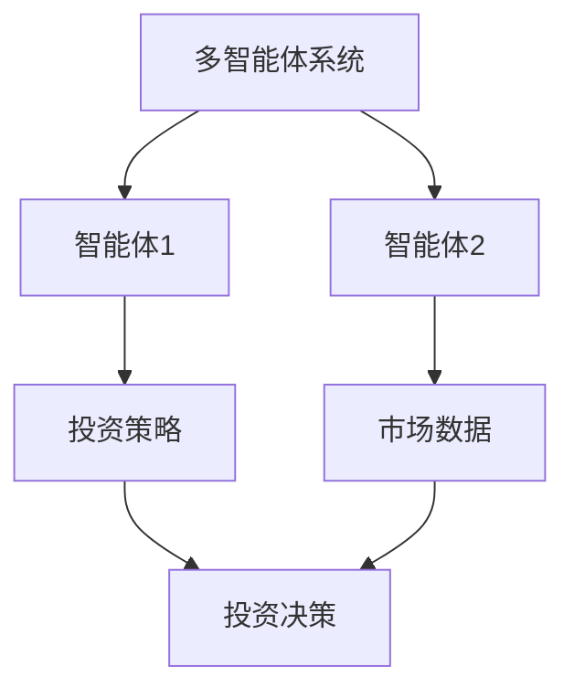
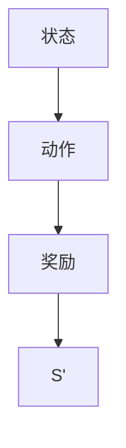
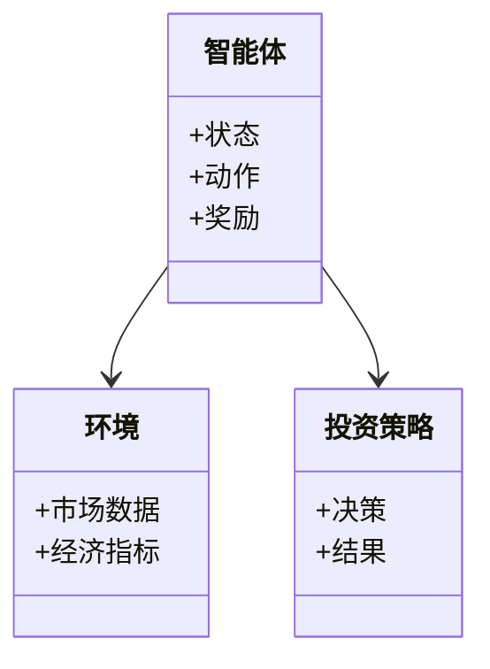
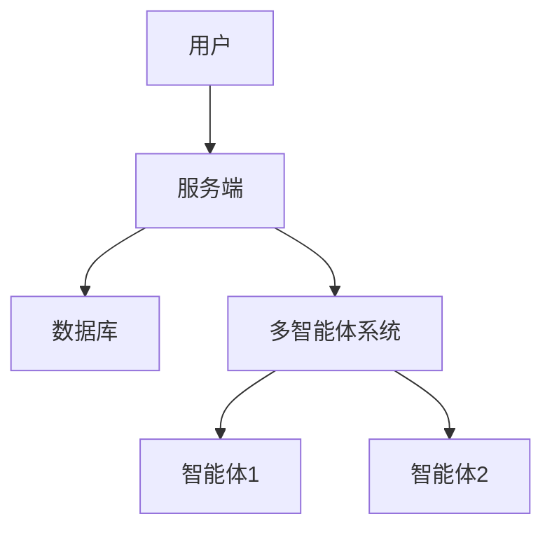
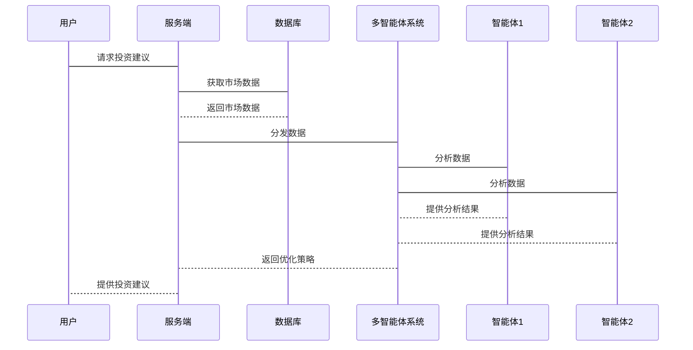

                 


```markdown
# AI多智能体系统革新价值投资策略

## 关键词
AI多智能体系统、价值投资策略、强化学习、系统架构、算法实现

## 摘要
随着人工智能技术的快速发展，多智能体系统在金融投资领域的应用日益广泛。本文通过分析多智能体系统的核心概念、算法原理以及系统架构，探讨其如何革新传统的价值投资策略。文章从背景介绍、核心概念、算法实现、系统设计、项目实战到应用案例，全面阐述了AI多智能体系统在价值投资中的潜力与应用，并通过具体案例和数学模型，深入剖析了其革新价值投资策略的关键点。

---

## 第一部分: 背景介绍

### 第1章: 多智能体系统与价值投资概述

#### 1.1 多智能体系统的定义与特点
- **多智能体系统的定义**：多智能体系统是指由多个智能体组成的系统，每个智能体能够独立感知环境并做出决策。
- **多智能体系统的核心特点**：
  - 分布式计算：多个智能体协同工作，避免单点故障。
  - 自适应性：智能体能够根据环境变化动态调整行为。
  - 协作性：智能体之间通过通信和协作完成复杂任务。

#### 1.2 价值投资策略的定义与特点
- **价值投资的基本概念**：价值投资是一种投资策略，旨在通过分析公司的基本面，寻找被市场低估的股票进行投资。
- **价值投资的核心策略**：
  - 关注公司的财务状况、行业地位和竞争优势。
  - 选择具有长期增长潜力的公司。
  - 避免短期市场波动的影响。

#### 1.3 多智能体系统与价值投资的结合
- **多智能体系统在金融领域的潜力**：
  - 提高投资决策的效率和准确性。
  - 处理海量数据，发现潜在投资机会。
  - 实现多策略协同，优化投资组合。
- **价值投资策略的AI化趋势**：
  - 利用AI技术分析公司基本面，预测市场趋势。
  - 通过多智能体协同，实现个性化投资策略。
  - 提高投资决策的科学性和可操作性。

---

## 第二部分: 核心概念与联系

### 第2章: 多智能体系统的核心原理

#### 2.1 多智能体系统的组成要素
- 智能体：能够感知环境并采取行动的实体。
- 环境：智能体所处的外部世界，包括市场数据、经济指标等。
- 通信机制：智能体之间交换信息的方式。
- 协作与竞争：智能体之间的协作与竞争关系。

#### 2.2 价值投资策略的数学模型
- **基本数学公式**：
  $$
  \text{价值} = \frac{\text{收益}}{\text{风险}}
  $$
- **关键指标分析**：
  - 市盈率（P/E）：市价与收益的比例。
  - 市净率（P/B）：市价与净资产的比例。
  - 股息率：股息与股价的比例。
- **决策树模型**：
  - 构建决策树，分析不同决策路径对投资的影响。

#### 2.3 多智能体系统与价值投资的实体关系图


---

## 第三部分: 算法原理

### 第3章: 多智能体系统的算法原理

#### 3.1 多智能体系统的算法概述
- **多智能体系统的主要算法类型**：
  - 基于强化学习的算法。
  - 基于博弈论的算法。
  - 基于分布式计算的算法。
- **算法选择**：根据具体应用场景选择合适的算法。
- **算法优化**：通过参数调整和优化策略提高算法性能。

#### 3.2 强化学习在多智能体系统中的应用
- **强化学习的基本原理**：
  - 智能体通过与环境互动，学习最优策略。
  - 通过奖励机制强化正确行为，弱化错误行为。
- **强化学习的算法流程**：

- **价值投资策略的强化学习实现**：
  - 将股票选择转化为状态-动作-奖励的循环。
  - 通过强化学习优化投资组合。

#### 3.3 价值投资策略的数学模型实现
- **数学公式**：
  $$
  \min_{x} \sum_{i=1}^{n} w_i x_i^2
  $$
  其中，\( w_i \) 是权重，\( x_i \) 是投资组合的变量。
- **优化模型的实现**：
  - 使用拉格朗日乘数法求解优化问题。
  - 通过梯度下降算法优化投资组合。

---

## 第四部分: 系统分析与架构设计

### 第4章: 系统分析与架构设计方案

#### 4.1 系统功能设计
- **核心功能**：
  - 数据采集：收集市场数据、公司财务数据等。
  - 智能体协作：多个智能体协同完成投资决策。
  - 投资策略优化：根据市场变化动态调整策略。
- **功能模块设计**：
  - 数据处理模块：处理和分析市场数据。
  - 智能体协作模块：实现智能体之间的通信和协作。
  - 投资策略优化模块：优化投资组合。

#### 4.2 系统架构设计
- **领域模型**：

- **系统架构图**：


#### 4.3 系统接口设计
- **API接口**：
  - 数据接口：获取市场数据。
  - 智能体接口：智能体之间的通信接口。
  - 投资策略接口：实现投资策略的调用。

#### 4.4 系统交互设计
- **交互流程**：


---

## 第五部分: 项目实战

### 第5章: 项目实战

#### 5.1 环境安装
- **安装Python**：确保Python版本为3.6以上。
- **安装依赖库**：
  - numpy
  - pandas
  - matplotlib
  - gym
  - ray

#### 5.2 系统核心实现
- **智能体代码**：
```python
import ray

@ray.remote
class Agent:
    def __init__(self, id):
        self.id = id
        self.state = None
    def receive(self, message):
        self.state = message
        return f"Agent {self.id} received: {message}"
```

- **多智能体系统代码**：
```python
ray.init()
agents = [Agent.remote(i) for i in range(4)]
agents[0].receive.remote("Start trading")
```

#### 5.3 案例分析
- **案例背景**：假设市场出现突发新闻，影响某公司股价。
- **分析过程**：多智能体系统协同分析，优化投资策略。
- **结果解读**：根据系统输出，调整投资组合。

#### 5.4 项目小结
- **项目总结**：通过实战项目，验证了多智能体系统在价值投资中的应用。
- **经验分享**：代码实现中的注意事项和优化技巧。

---

## 第六部分: 应用案例与总结

### 第6章: 应用案例分析

#### 6.1 案例背景
- **市场环境**：假设市场波动较大，寻找被低估的股票。

#### 6.2 系统实现
- **系统实现**：
  - 数据采集：获取市场数据和公司财务数据。
  - 智能体协作：多个智能体协同分析，找出潜在投资机会。
  - 投资策略优化：根据分析结果优化投资组合。

#### 6.3 结果分析
- **投资组合优化**：通过多智能体系统，投资组合的风险和收益达到最佳平衡。
- **案例总结**：展示了多智能体系统在价值投资中的实际应用。

### 第7章: 总结与展望

#### 7.1 总结
- **总结内容**：
  - 多智能体系统的核心概念和算法原理。
  - 价值投资策略的革新点。
  - 实战项目和应用案例的分析。

#### 7.2 展望
- **未来发展方向**：
  - 提高多智能体系统的协作效率。
  - 拓展多智能体系统在金融领域的应用。
  - 结合其他AI技术，进一步优化投资策略。

---

## 最佳实践 Tips

- **小结**：通过本文的详细讲解，读者可以全面了解AI多智能体系统在价值投资中的应用。
- **注意事项**：
  - 确保数据来源的可靠性和准确性。
  - 在实际应用中，注意风险管理。
  - 定期更新和优化投资策略。
- **拓展阅读**：
  - 推荐阅读《强化学习入门》和《多智能体系统与博弈论》。

---

通过本文的系统介绍，读者可以深入了解AI多智能体系统如何革新传统的价值投资策略，并能够在实际应用中灵活运用这些技术。
```

