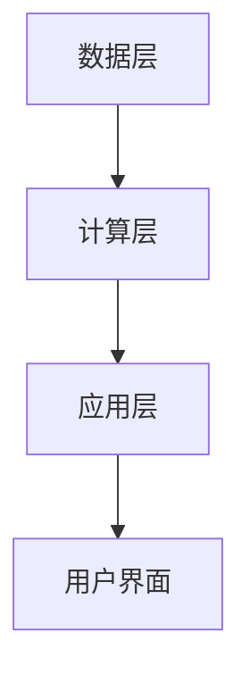
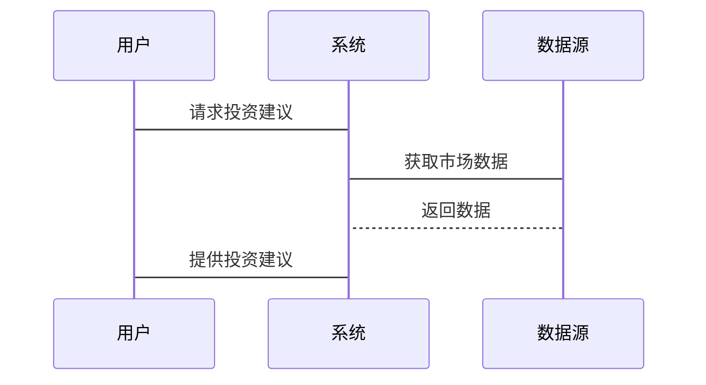

                 


# AI多智能体系统革新价值投资：传统与科技的完美融合

## 关键词
AI多智能体系统、价值投资、传统投资、科技融合、系统架构、算法原理、项目实战

## 摘要
本文探讨AI多智能体系统如何革新传统价值投资，通过分析其核心概念、算法原理、系统架构，并结合项目实战，展示传统投资与科技的完美融合。文章详细阐述了AI多智能体系统的背景、原理及应用，旨在为投资领域提供新的视角和实践方法。

---

## 第1章：AI多智能体系统与价值投资概述

### 1.1 AI多智能体系统的基本概念

#### 1.1.1 多智能体系统的定义与特点
- **定义**：多智能体系统（Multi-Agent System, MAS）由多个智能体组成，每个智能体能够独立感知环境、自主决策并协同完成任务。
- **特点**：
  - **分布式智能**：各智能体独立运行，协同完成目标。
  - **动态协作**：智能体间通过通信和协调机制动态协作。
  - **自适应性**：系统能够根据环境变化自适应调整策略。

#### 1.1.2 AI在多智能体系统中的作用
- **数据处理**：AI智能体能够高效处理大量数据，识别复杂模式。
- **决策支持**：通过机器学习模型，AI提供决策支持，优化投资策略。
- **实时反馈**：AI智能体能够实时监控市场变化，快速响应。

#### 1.1.3 价值投资的定义
- **价值投资**：寻找市场价格低于其内在价值的资产，长期持有，等待价格回归。

### 1.2 传统价值投资的局限性

#### 1.2.1 数据分析的局限性
- **数据量不足**：传统方法依赖历史数据，难以捕捉实时市场变化。
- **人工判断误差**：人为判断可能导致决策失误。

#### 1.2.2 人工决策的主观性
- **情绪影响**：投资者情绪波动可能导致非理性决策。
- **信息处理能力有限**：人类无法处理海量数据，导致分析不全面。

### 1.3 AI多智能体系统在价值投资中的应用前景

#### 1.3.1 数据处理与分析的优势
- **海量数据处理**：AI能够处理多源异构数据，识别潜在投资机会。
- **实时监控**：系统实时追踪市场动态，及时发现投资机会和风险。

#### 1.3.2 智能决策支持
- **自动化决策**：基于AI算法，系统自动生成投资建议。
- **风险管理优化**：通过多智能体协作，实时监控风险，优化投资组合。

---

## 第2章：AI多智能体系统的核心原理

### 2.1 多智能体系统的组成与功能

#### 2.1.1 多智能体系统的组成结构
- **智能体**：独立决策的单元，负责特定任务。
- **通信层**：智能体间通信的桥梁，确保信息共享。
- **协调机制**：管理智能体间的协作，确保任务顺利完成。

#### 2.1.2 智能体间的协同机制
- **任务分配**：根据智能体能力，动态分配任务。
- **信息共享**：智能体间共享信息，优化决策。
- **协作策略**：制定协作规则，确保系统高效运行。

#### 2.1.3 系统的动态适应性
- **环境感知**：智能体实时感知环境变化。
- **自适应调整**：根据环境变化，系统动态调整策略。
- **容错机制**：系统具备容错能力，确保稳定运行。

### 2.2 价值投资的关键要素

#### 2.2.1 价值评估的核心指标
- **市盈率（P/E）**：价格与收益的比例，衡量投资价值。
- **市净率（P/B）**：价格与净资产的比例，评估资产价值。
- **股息率**：股息与股价的比例，衡量分红能力。

#### 2.2.2 市场情绪的影响因素
- **市场情绪指数**：反映市场参与者的情绪，影响资产价格。
- **投资者心理**：个体或群体的心理预期，影响市场走势。
- **市场波动性**：市场波动程度，影响投资策略选择。

#### 2.2.3 风险管理的重要性
- **风险分散**：通过多元化投资降低风险。
- **风险评估模型**：量化风险，制定风险管理策略。
- **风险预警机制**：实时监控风险，提前预警。

### 2.3 AI多智能体系统与价值投资的结合点

#### 2.3.1 数据处理与分析的结合
- **数据清洗**：去除噪音数据，提高数据质量。
- **特征提取**：提取关键特征，优化模型性能。
- **模式识别**：识别数据中的潜在模式，发现投资机会。

#### 2.3.2 智能决策支持的实现
- **决策树模型**：构建决策树，辅助投资决策。
- **强化学习**：通过奖励机制优化投资策略。
- **模拟测试**：在模拟环境中测试策略，评估效果。

#### 2.3.3 风险控制的优化
- **实时监控**：实时跟踪市场变化，及时发现风险。
- **动态调整**：根据风险情况，动态调整投资组合。
- **情景分析**：模拟不同情景，制定应对策略。

---

## 第3章：AI多智能体系统的算法原理

### 3.1 分布式计算与协作机制

#### 3.1.1 分布式计算的基本原理
- **分布式系统**：多个节点协作完成任务。
- **任务分配**：根据节点能力动态分配任务。
- **负载均衡**：确保系统负载均匀，提高效率。

#### 3.1.2 智能体间的协作算法
- **协商算法**：智能体通过协商确定任务分工。
- **共识算法**：智能体达成共识，确保协作一致。
- **分布式计算算法**：如MapReduce，用于处理海量数据。

#### 3.1.3 通信协议的设计
- **通信协议**：定义智能体间通信规则。
- **数据格式**：统一数据格式，确保信息准确传递。
- **通信机制**：如发布-订阅模式，确保高效通信。

### 3.2 机器学习在多智能体系统中的应用

#### 3.2.1 监督学习与无监督学习的结合
- **监督学习**：基于标注数据，训练分类器。
- **无监督学习**：发现数据中的潜在结构。
- **半监督学习**：结合两者，提高模型性能。

#### 3.2.2 强化学习在决策中的应用
- **强化学习**：通过试错，优化决策策略。
- **状态空间**：定义系统状态，如市场情况。
- **动作空间**：定义可能的决策动作，如买入或卖出。
- **奖励机制**：定义奖励函数，指导智能体学习。

#### 3.2.3 聚类分析在数据处理中的应用
- **聚类分析**：将相似数据归类，发现数据分布。
- **K-means算法**：常用的聚类算法。
- **层次聚类**：适合处理层次结构的数据。

### 3.3 多智能体系统的数学模型

#### 3.3.1 系统状态的表示方法
- **状态表示**：如市场指数、公司财务数据等。
- **状态转移**：根据决策和环境变化，状态转移。
- **状态空间**：所有可能状态的集合。

#### 3.3.2 动作空间的建模
- **动作空间**：智能体可以执行的决策动作。
- **动作函数**：根据状态，输出决策动作。
- **动作概率**：基于模型预测的动作概率。

#### 3.3.3 奖励函数的设计
- **奖励函数**：定义智能体执行动作的奖励值。
- **即时奖励**：立即给予的奖励，如短期收益。
- **延迟奖励**：长期收益，如投资回报。

---

## 第4章：系统架构设计

### 4.1 项目介绍与目标

#### 4.1.1 项目背景
- **背景**：传统投资依赖人工分析，存在局限性。
- **目标**：利用AI多智能体系统革新价值投资。
- **范围**：涵盖数据采集、分析、决策支持等。

### 4.2 系统功能设计

#### 4.2.1 数据采集与处理模块
- **数据源**：股票市场数据、公司财报、行业报告等。
- **数据清洗**：去除异常数据，确保数据质量。
- **特征提取**：提取关键特征，如市盈率、市净率等。

#### 4.2.2 智能决策支持模块
- **决策模型**：基于机器学习的决策模型。
- **风险评估**：评估投资风险，优化投资组合。
- **策略生成**：生成投资策略，指导投资行为。

#### 4.2.3 风险管理模块
- **风险监控**：实时监控市场风险。
- **风险预警**：当风险超过阈值时，触发预警。
- **风险控制**：动态调整投资组合，降低风险。

### 4.3 系统架构设计

#### 4.3.1 分层架构设计
- **数据层**：存储数据，如数据库、数据仓库。
- **计算层**：处理数据，如分布式计算、机器学习模型。
- **应用层**：提供用户界面，展示结果，如仪表盘。

#### 4.3.2 系统架构图


#### 4.3.3 接口设计
- **API接口**：提供REST API，供其他系统调用。
- **数据接口**：与数据源对接，如股票交易平台。
- **用户接口**：提供图形界面，供用户交互。

#### 4.3.4 交互序列图


---

## 第5章：项目实战

### 5.1 环境安装

#### 5.1.1 安装Python
- **安装命令**：`python --version` 检查Python版本。
- **安装依赖**：使用`pip install`安装所需库，如`numpy`、`pandas`、`scikit-learn`等。

#### 5.1.2 安装机器学习框架
- **TensorFlow**：`pip install tensorflow`
- **Keras**：`pip install keras`

#### 5.1.3 安装数据处理工具
- **Pandas**：`pip install pandas`
- **NumPy**：`pip install numpy`

### 5.2 系统核心实现源代码

#### 5.2.1 数据采集模块
```python
import pandas as pd
import numpy as np

def get_data(ticker):
    # 从数据源获取数据
    data = pd.read_csv(f'data/{ticker}.csv')
    return data
```

#### 5.2.2 特征提取模块
```python
def extract_features(data):
    # 计算技术指标，如移动平均线、相对强弱指数等
    data['SMA_20'] = data['Close'].rolling(20).mean()
    data['RSI'] = (data['Close'].diff().fillna(0).apply(lambda x: x / data['Close'].std()) ).cumsum()
    return data
```

#### 5.2.3 机器学习模型训练
```python
from sklearn.model

