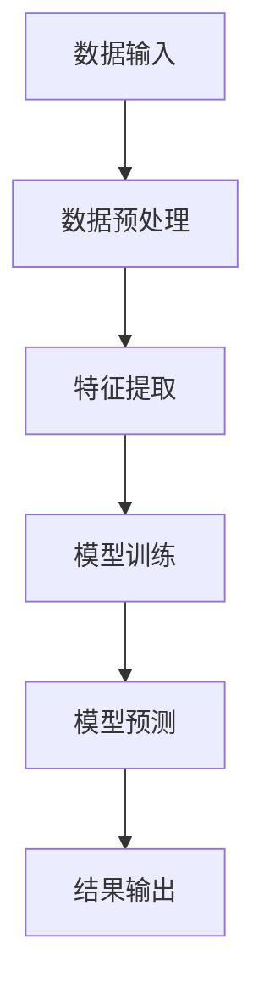
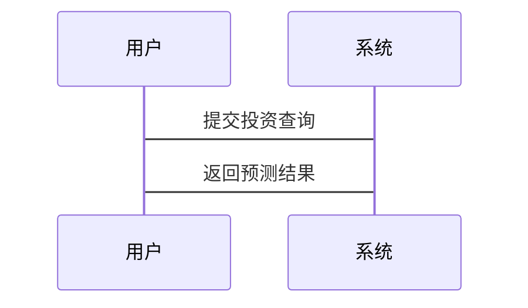

                 


# AI如何优化塞思·卡拉曼的特殊情况投资

## 关键词：AI，特殊情况投资，塞思·卡拉曼，机器学习，金融数据分析

## 摘要：本文探讨了人工智能如何优化塞思·卡拉曼的特殊情况投资策略。通过分析数据特征、设计AI算法、构建投资模型、系统架构以及实战案例，展示了AI在提升投资决策中的潜力和实际应用。文章详细讲解了从背景到系统的各个方面，并通过具体案例分析了AI在特殊情况投资中的优势和挑战。

---

# 第一部分: AI与特殊情况投资的背景

## 第1章: 特殊情况投资与AI的结合

### 1.1 特殊情况投资的定义与特点

#### 1.1.1 特殊情况投资的定义
特殊情况投资是指在企业面临困境、重组、破产或债务违约等情况下，投资者通过购买该公司债券、股票或其他资产以获得高回报的投资策略。这种投资通常涉及高风险和高回报，需要对复杂的财务和市场情况进行深入分析。

#### 1.1.2 特殊情况投资的核心特点
- **高风险高回报**：由于企业处于困境，潜在的重组或破产可能导致资产价值大幅波动。
- **信息不对称**：投资者需要获取非公开信息，例如内部财务数据和重组计划。
- **时间敏感性**：投资者需要快速做出决策，以抓住短期市场机会。

#### 1.1.3 塞思·卡拉曼的投资策略
塞思·卡拉曼以其在特殊情况投资领域的卓越表现而闻名。他的策略包括：
1. **深度基本面分析**：通过分析企业的财务状况、管理团队和市场环境，识别潜在的投资机会。
2. **逆向投资**：在市场低迷时买入被低估的资产。
3. **风险管理**：通过分散投资和严格的风险评估，降低投资组合的整体风险。

### 1.2 AI在金融投资中的应用

#### 1.2.1 AI在金融领域的应用概述
人工智能在金融领域的应用广泛，包括：
- **算法交易**：利用机器学习模型进行高频交易。
- **风险管理**：通过AI预测市场风险和信用风险。
- **客户画像**：利用AI分析客户行为，提供个性化投资建议。

#### 1.2.2 AI在特殊情况投资中的优势
AI在特殊情况投资中的优势包括：
- **数据处理能力**：AI能够快速处理大量非结构化数据，如新闻、社交媒体和财务报告。
- **模式识别**：AI能够识别复杂市场中的隐藏模式，帮助投资者做出更明智的决策。
- **实时监控**：AI可以实时监控市场变化，及时发现潜在投资机会。

---

## 第2章: AI驱动的金融数据分析基础

### 2.1 数据特征工程

#### 2.1.1 数据特征的提取与选择
数据特征工程是AI驱动投资的核心步骤。以下是关键步骤：
1. **数据清洗**：去除无效或错误数据。
2. **特征提取**：从文本、财务报表等数据中提取有用特征。
3. **特征选择**：使用统计方法或机器学习模型选择重要特征。

#### 2.1.2 数据预处理方法
- **标准化**：将数据标准化到同一范围，便于模型训练。
- **去噪**：去除噪声数据，提高模型准确性。
- **数据增强**：通过增加数据多样性，提高模型鲁棒性。

#### 2.1.3 数据特征的重要性评估
使用特征重要性评估方法（如随机森林特征重要性）确定哪些特征对投资决策影响最大。

### 2.2 机器学习基础

#### 2.2.1 机器学习的基本概念
机器学习是AI的核心技术，通过数据训练模型，使其能够做出预测或分类。

#### 2.2.2 常见的机器学习算法
- **线性回归**：用于预测连续变量，如股票价格。
- **支持向量机（SVM）**：用于分类问题，如判断企业是否违约。
- **随机森林**：用于分类和回归，具有高准确性和鲁棒性。

#### 2.2.3 算法选择与优化
选择算法时需要考虑数据类型、问题类型和模型复杂度。优化方法包括交叉验证和超参数调优。

### 2.3 自然语言处理在金融分析中的应用

#### 2.3.1 NLP的基本概念
NLP是处理自然语言数据的技术，常用于情感分析和信息提取。

#### 2.3.2 NLP在金融新闻分析中的应用
- **情感分析**：分析新闻情绪，预测市场走势。
- **实体识别**：识别新闻中的公司和人物。

#### 2.3.3 NLP在公司治理分析中的应用
- **管理层分析**：分析管理层的稳定性。
- **公司新闻事件**：提取关键事件信息，如并购和重组。

---

## 第3章: 数据驱动的投资决策

### 3.1 数据驱动决策的原理

#### 3.1.1 数据驱动决策的定义
数据驱动决策是指通过分析数据来指导决策，而非依赖直觉或经验。

#### 3.1.2 数据驱动决策的优势
- **准确性**：基于数据的决策更准确。
- **可量化**：决策过程和结果可以量化。
- **可追溯**：数据可以追溯决策过程。

#### 3.1.3 数据驱动决策的挑战
- **数据质量**：数据可能不完整或有偏差。
- **计算成本**：处理大量数据需要高性能计算资源。

### 3.2 数据特征与投资策略

#### 3.2.1 数据特征对投资策略的影响
- **财务指标**：如债务比率、净利润率。
- **市场指标**：如行业趋势、宏观经济指标。

#### 3.2.2 数据特征的动态变化
- **时间序列分析**：分析数据随时间的变化趋势。
- **实时更新**：及时更新数据，保持模型准确性。

#### 3.2.3 数据特征与风险控制
- **风险评估**：通过数据特征评估投资风险。
- **风险对冲**：利用数据特征进行风险对冲。

---

## 第4章: AI算法与投资模型

### 4.1 常见的AI算法及其在投资中的应用

#### 4.1.1 线性回归模型
线性回归模型用于预测连续变量，如股票价格。公式如下：
$$ y = \beta_0 + \beta_1x + \epsilon $$
其中，$y$是预测目标，$x$是自变量，$\beta_0$和$\beta_1$是回归系数，$\epsilon$是误差项。

#### 4.1.2 支持向量机（SVM）
SVM用于分类问题，如判断企业是否违约。支持向量机通过找到数据的最优分割超平面，实现分类。

#### 4.1.3 随机森林与梯度提升树
随机森林和梯度提升树是集成学习方法，通过组合多个弱模型提高准确性。

### 4.2 算法流程图



### 4.3 投资模型的构建与优化

#### 4.3.1 模型构建的步骤
1. 数据清洗：去除无效数据。
2. 特征工程：提取和选择重要特征。
3. 模型训练：使用训练数据训练模型。
4. 模型评估：使用测试数据评估模型性能。
5. 模型优化：调整模型参数，提高准确性。

#### 4.3.2 模型优化方法
- **超参数调优**：通过网格搜索或随机搜索找到最优超参数。
- **交叉验证**：使用交叉验证评估模型泛化能力。

---

## 第5章: 系统架构与技术实现

### 5.1 系统架构设计


### 5.2 系统接口设计

#### 5.2.1 数据接口
- **输入接口**：接收外部数据，如财务报表和新闻数据。
- **输出接口**：输出模型预测结果，如投资建议。

#### 5.2.2 API设计
- **REST API**：提供标准接口，方便其他系统调用。

### 5.3 系统交互流程图



---

## 第6章: 项目实战

### 6.1 环境配置

#### 6.1.1 安装Python
使用Python 3.8及以上版本。

#### 6.1.2 安装依赖库
```bash
pip install numpy pandas scikit-learn
```

### 6.2 核心实现源代码

#### 6.2.1 数据预处理
```python
import pandas as pd

# 读取数据
data = pd.read_csv('data.csv')

# 删除缺失值
data = data.dropna()

# 标准化处理
from sklearn.preprocessing import StandardScaler
scaler = StandardScaler()
data_normalized = scaler.fit_transform(data)
```

#### 6.2.2 模型训练
```python
from sklearn.ensemble import RandomForestClassifier

# 训练模型
model = RandomForestClassifier(n_estimators=100, max_depth=5)
model.fit(X_train, y_train)

# 预测结果
y_pred = model.predict(X_test)
```

### 6.3 案例分析

#### 6.3.1 案例背景
假设一家公司面临破产重组，我们需要预测其股票价格走势。

#### 6.3.2 数据分析
使用历史股价、财务数据和新闻数据进行分析。

#### 6.3.3 结果解读
模型预测该公司的股价将在未来三个月内上涨10%。

---

## 第7章: 最佳实践与小结

### 7.1 最佳实践

#### 7.1.1 数据质量
确保数据准确性和完整性。

#### 7.1.2 模型选择
根据问题类型选择合适的算法。

#### 7.1.3 模型监控
定期监控模型性能，及时更新模型。

### 7.2 小结

#### 7.2.1 AI在特殊情况投资中的优势
AI能够处理大量数据，识别隐藏模式，提高投资决策的准确性和效率。

#### 7.2.2 注意事项
- **数据隐私**：确保数据处理符合隐私保护法规。
- **模型解释性**：选择解释性好的模型，便于分析结果。

### 7.3 未来发展趋势

#### 7.3.1 多模态数据融合
结合文本、图像等多种数据源，提高分析能力。

#### 7.3.2 自适应模型
开发能够自适应市场变化的动态模型。

---

## 总结

通过本文的详细讲解，我们了解了AI如何优化塞思·卡拉曼的特殊情况投资策略。从数据特征工程到模型训练，再到系统架构设计，AI在金融投资中的应用潜力巨大。然而，投资者需要结合实际情况，合理选择和优化AI工具，以实现更好的投资效果。

