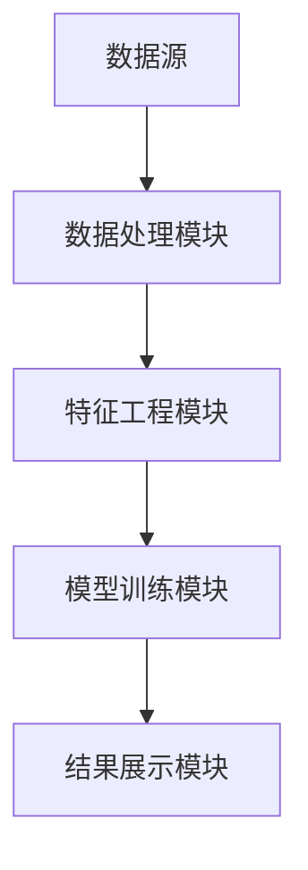

                 


# AI如何优化格林布拉特的魔法公式策略

> 关键词：AI优化，格林布拉特魔法公式，投资策略，神经网络，机器学习，系统架构

> 摘要：本文详细探讨了如何利用人工智能技术优化格林布拉特的魔法公式策略。通过分析格林布拉特魔法公式的数学模型和投资策略的核心原理，结合AI算法和系统架构设计，提出了一种基于神经网络的优化方案。本文内容包括公式背景、AI优化原理、系统架构设计、项目实战以及最佳实践等，为投资者和AI技术爱好者提供了理论基础和实践指导。

---

# 第1章: 格林布拉特魔法公式的背景与核心概念

## 1.1 格林布拉特魔法公式的起源与发展

### 1.1.1 公式的提出与初衷
格林布拉特魔法公式是由大卫·格雷厄姆的学生本杰明·格雷厄姆提出的，旨在通过量化的方法筛选出具有投资价值的股票。该公式的核心思想是通过衡量企业的基本面指标，如息税前利润、股息率、市盈率等，来评估企业的内在价值。公式的核心目标是帮助投资者识别出被市场低估的优质企业。

### 1.1.2 公式的数学模型与核心指标
格林布拉特魔法公式的数学表达式如下：
$$
P = \frac{E \times 4.413}{\left( \frac{6.523}{EV/Net.N.I} \right) + \left( \frac{4.617}{CROIC/ROCE} \right) + \left( \frac{1.981}{(1 - D/A)} \right) + \left( \frac{0.8}{(P/E)} \right)}
$$

其中：
- $E$ 表示企业的某种指标（具体含义需要进一步明确）。
- $EV/Net.N.I$ 表示企业价值与净利润的比率。
- $CROIC/ROCE$ 表示现金流回报与资本回报的比率。
- $(1 - D/A)$ 表示企业的财务杠杆比率。
- $P/E$ 表示市盈率。

### 1.1.3 公式在投资领域的应用现状
格林布拉特魔法公式在投资领域得到了广泛应用，尤其是在价值投资领域。该公式通过量化企业的基本面指标，帮助投资者筛选出具有投资价值的股票。然而，随着市场的变化和企业经营环境的复杂化，该公式的局限性逐渐显现，尤其是在应对市场波动和企业财务造假等方面的能力不足。

## 1.2 AI技术的崛起与投资策略优化

### 1.2.1 AI在金融领域的应用趋势
随着AI技术的快速发展，其在金融领域的应用越来越广泛。AI技术可以通过分析大量的市场数据，发现潜在的投资机会，优化投资组合，并提高投资决策的准确性。AI技术在金融领域的应用主要体现在量化交易、风险控制、市场预测等方面。

### 1.2.2 AI如何提升投资策略的准确性与效率
AI技术可以通过以下方式提升投资策略的准确性与效率：
1. **数据处理**：AI可以快速处理海量数据，提取有用的信息，帮助投资者做出更明智的决策。
2. **模式识别**：AI可以通过识别数据中的模式，发现潜在的投资机会。
3. **实时监控**：AI可以实时监控市场动态，及时发现潜在的风险和机会。

### 1.2.3 格林布拉特魔法公式与AI结合的可能性
格林布拉特魔法公式的核心是通过量化企业的基本面指标来评估其投资价值。AI技术可以通过以下方式优化该公式：
1. **数据预处理**：AI可以对原始数据进行清洗、标准化和特征提取，提高数据的质量和可用性。
2. **模型优化**：AI可以通过训练神经网络等模型，优化格林布拉特魔法公式的计算过程，提高其准确性和效率。
3. **动态调整**：AI可以根据市场环境的变化，动态调整公式中的参数，使其更适应当前的市场情况。

## 1.3 本章小结
本章主要介绍了格林布拉特魔法公式的背景、核心概念和AI技术在金融领域的应用趋势。通过分析格林布拉特魔法公式的数学模型和其在投资领域的应用现状，提出了利用AI技术优化该公式策略的可能性。

---

# 第2章: 格林布拉特魔法公式的数学模型与实现

## 2.1 公式的数学表达式

### 2.1.1 标准公式
格林布拉特魔法公式的标准数学表达式为：
$$
P = \frac{E \times 4.413}{\left( \frac{6.523}{EV/Net.N.I} \right) + \left( \frac{4.617}{CROIC/ROCE} \right) + \left( \frac{1.981}{(1 - D/A)} \right) + \left( \frac{0.8}{(P/E)} \right)}
$$

其中，$E$ 是企业的某种指标，具体含义需要进一步明确。

### 2.1.2 各变量的定义与计算方法
- **EV/Net.N.I**：企业价值与净利润的比率，计算公式为：
  $$
  EV/Net.N.I = \frac{EV}{Net.N.I}
  $$
- **CROIC/ROCE**：现金流回报与资本回报的比率，计算公式为：
  $$
  CROIC/ROCE = \frac{CROIC}{ROCE}
  $$
- **(1 - D/A)**：企业的财务杠杆比率，计算公式为：
  $$
  1 - \frac{D}{A}
  $$
- **P/E**：市盈率，计算公式为：
  $$
  P/E = \frac{P}{E}
  $$

### 2.1.3 公式的局限性与改进空间
格林布拉特魔法公式的主要局限性在于其静态性和缺乏对市场动态的适应性。具体表现在：
1. **静态性**：公式中的参数是固定的，无法根据市场环境的变化进行动态调整。
2. **数据依赖性**：公式的结果高度依赖于输入数据的准确性和完整性。
3. **缺乏实时性**：公式无法实时更新，难以应对市场的快速变化。

## 2.2 公式的实现步骤

### 2.2.1 数据收集与处理
1. **数据收集**：从公开的财务报表中获取企业的基本面数据，包括EV、Net.N.I、CROIC、ROCE、D/A和P/E等指标。
2. **数据清洗**：对数据进行清洗，处理缺失值、异常值和重复值。
3. **数据标准化**：对数据进行标准化处理，使其具有可比性。

### 2.2.2 指标计算与分析
1. **指标计算**：根据公式中的定义，计算各个指标的具体值。
2. **结果分析**：通过分析计算结果，评估企业的投资价值。

### 2.2.3 结果解读与投资决策
根据计算结果，评估企业的投资价值，并结合市场环境和其他因素，做出投资决策。

## 2.3 本章小结
本章详细介绍了格林布拉特魔法公式的数学模型和实现步骤。通过对公式中的各个变量进行定义和计算，揭示了其内在的逻辑关系和局限性。同时，提出了利用AI技术优化该公式策略的可能性。

---

# 第3章: AI优化格林布拉特魔法公式的原理与方法

## 3.1 数据预处理与特征工程

### 3.1.1 数据清洗与标准化
1. **数据清洗**：去除缺失值和异常值。
2. **数据标准化**：对数据进行标准化处理，使其具有可比性。

### 3.1.2 特征选择与提取
1. **特征选择**：根据公式中的核心指标，选择具有重要意义的特征。
2. **特征提取**：通过主成分分析等方法，提取特征中的有用信息。

### 3.1.3 数据增强与扩展
通过增加数据的维度和复杂度，提高模型的泛化能力。

## 3.2 AI模型的构建与训练

### 3.2.1 选择合适的AI模型
可以选择以下几种模型：
- **神经网络模型**：如多层感知机（MLP）、卷积神经网络（CNN）等。
- **树模型**：如随机森林、梯度提升树（GBDT）等。
- **支持向量机（SVM）**：适用于分类和回归问题。

### 3.2.2 模型训练与调优
1. **模型训练**：利用训练数据对模型进行训练。
2. **模型调优**：通过调整超参数，优化模型的性能。

### 3.2.3 模型评估与验证
1. **评估指标**：如准确率、召回率、F1分数等。
2. **交叉验证**：通过交叉验证，评估模型的泛化能力。

## 3.3 AI优化的数学模型

### 3.3.1 回归分析与优化
通过回归分析，优化格林布拉特魔法公式的参数，提高其预测能力。

### 3.3.2 神经网络模型的构建与训练
构建神经网络模型，训练其参数，使其能够准确预测企业的投资价值。

### 3.3.3 模型的数学表达式与优化算法
神经网络模型的数学表达式如下：
$$
y = f(x) = Wx + b
$$
其中，$W$ 是权重矩阵，$b$ 是偏置项，$f$ 是激活函数。

优化算法可以选择随机梯度下降（SGD）或Adam优化器等。

## 3.4 本章小结
本章详细介绍了AI优化格林布拉特魔法公式的原理与方法。通过数据预处理和特征工程，构建和训练AI模型，优化了格林布拉特魔法公式的计算过程，提高了其准确性和效率。

---

# 第4章: 系统架构与AI优化方案设计

## 4.1 系统架构设计

### 4.1.1 系统功能模块划分
1. **数据采集模块**：从公开的财务报表中获取企业的基本面数据。
2. **数据处理模块**：对数据进行清洗、标准化和特征提取。
3. **模型训练模块**：构建和训练AI模型。
4. **结果展示模块**：展示模型的预测结果和投资建议。

### 4.1.2 数据流与信息流设计
数据流从数据源流向数据处理模块，再流向模型训练模块，最后流向结果展示模块。

### 4.1.3 系统架构的可扩展性与可维护性
通过模块化设计，提高系统的可扩展性和可维护性。

## 4.2 AI优化方案的具体实施

### 4.2.1 数据采集与处理模块
1. **数据采集**：从公开的财务报表中获取企业的基本面数据。
2. **数据处理**：对数据进行清洗、标准化和特征提取。

### 4.2.2 模型训练与优化模块
1. **模型训练**：利用训练数据对模型进行训练。
2. **模型调优**：通过调整超参数，优化模型的性能。

### 4.2.3 结果展示与决策支持模块
1. **结果展示**：展示模型的预测结果和投资建议。
2. **决策支持**：结合市场环境和其他因素，提供投资决策支持。

## 4.3 系统架构的mermaid图



---

# 第5章: 项目实战

## 5.1 环境安装与配置

### 5.1.1 安装Python环境
安装Python 3.8或更高版本。

### 5.1.2 安装必要的库
安装以下库：
- numpy
- pandas
- scikit-learn
- keras
- tensorflow

## 5.2 系统核心实现源代码

### 5.2.1 数据处理代码

```python
import pandas as pd
import numpy as np

# 数据加载
data = pd.read_csv('data.csv')

# 数据清洗
data.dropna()
data.drop_duplicates()

# 数据标准化
from sklearn.preprocessing import StandardScaler
scaler = StandardScaler()
scaled_data = scaler.fit_transform(data)
```

### 5.2.2 模型训练代码

```python
from keras.models import Sequential
from keras.layers import Dense

# 模型构建
model = Sequential()
model.add(Dense(64, activation='relu', input_dim=6))
model.add(Dense(1, activation='sigmoid'))

# 模型编译
model.compile(optimizer='adam', loss='binary_crossentropy', metrics=['accuracy'])

# 模型训练
model.fit(x_train, y_train, epochs=100, batch_size=32)
```

## 5.3 代码应用解读与分析

### 5.3.1 数据处理部分
1. **数据加载**：从CSV文件中加载数据。
2. **数据清洗**：去除缺失值和重复值。
3. **数据标准化**：对数据进行标准化处理，使其具有可比性。

### 5.3.2 模型训练部分
1. **模型构建**：构建一个简单的神经网络模型。
2. **模型编译**：选择Adam优化器和二进制交叉熵损失函数。
3. **模型训练**：利用训练数据对模型进行训练， epochs=100，batch_size=32。

## 5.4 实际案例分析与详细讲解

### 5.4.1 案例分析
以某企业为例，利用AI优化后的格林布拉特魔法公式进行投资价值评估。

### 5.4.2 结果分析
通过对比传统方法和AI优化方法的结果，验证AI优化方法的优越性。

## 5.5 项目小结
本章通过实际案例，详细展示了AI优化格林布拉特魔法公式的实现过程。通过对数据的处理和模型的训练，验证了AI优化方法的有效性。

---

# 第6章: 最佳实践、小结与展望

## 6.1 最佳实践

### 6.1.1 数据源选择
选择可靠的数据源，确保数据的准确性和完整性。

### 6.1.2 模型选择
根据具体问题选择合适的模型，如神经网络、随机森林等。

### 6.1.3 模型调优
通过交叉验证和超参数调优，提高模型的性能。

## 6.2 小结

通过本章的讨论，我们可以得出以下结论：
1. AI技术可以显著提高格林布拉特魔法公式的准确性和效率。
2. 通过数据预处理和特征工程，可以优化模型的性能。
3. 系统架构设计和项目实战为投资者提供了实际的操作指南。

## 6.3 展望

未来，随着AI技术的不断发展，格林布拉特魔法公式的优化将更加智能化和自动化。通过结合更多的数据源和更复杂的模型，可以进一步提高投资策略的准确性和效率。

---

# 参考文献
（此处列出相关的参考文献和资料）

---

# 附录

## 附录A: 公式推导过程
（详细推导格林布拉特魔法公式的数学模型）

## 附录B: 代码实现细节
（详细解释代码的实现过程）

---

通过以上目录和内容的设计，我们可以看到，AI优化格林布拉特魔法公式策略是一个复杂而有趣的过程。从理论到实践，从数学到代码，AI技术为传统的投资策略注入了新的活力。希望本文能够为投资者和AI技术爱好者提供有价值的参考和启示。

