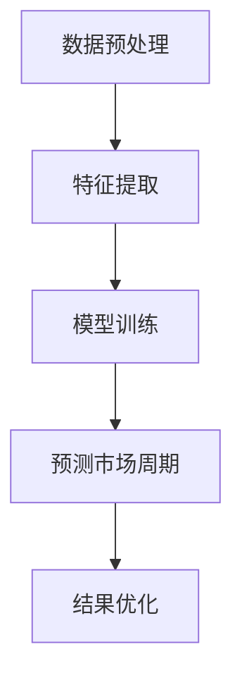
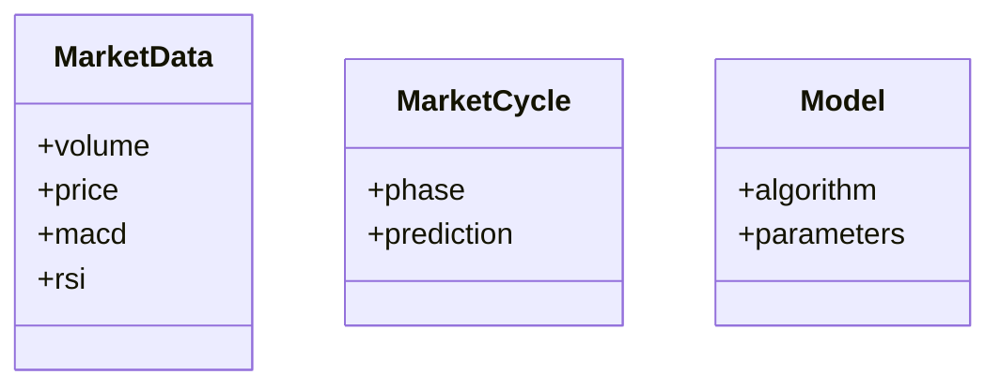
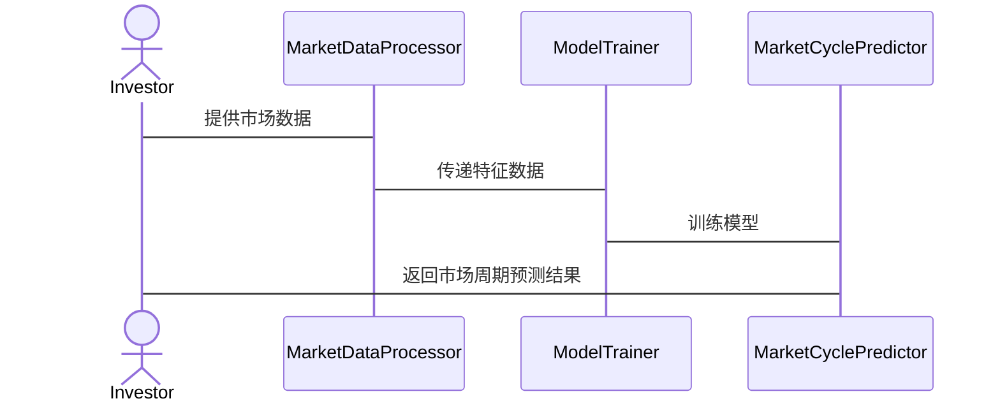

                 


# AI如何优化霍华德·马克斯的市场周期理论

## 关键词：AI，霍华德·马克斯，市场周期，投资策略，数据驱动

## 摘要：  
本文探讨了如何利用人工智能技术优化霍华德·马克斯的市场周期理论。通过分析市场周期的关键特征和AI算法的优势，提出了一种基于数据驱动的市场周期预测模型。该模型结合了传统的市场周期理论与现代AI技术，旨在提高市场周期预测的准确性和效率，为投资者提供更科学的投资决策支持。

---

# 第一部分：霍华德·马克斯市场周期理论与AI优化背景

## 第1章：霍华德·马克斯市场周期理论概述

### 1.1 市场周期理论的核心概念

#### 1.1.1 市场周期的定义与特征
市场周期是指市场在经济发展过程中经历的波动性阶段，包括繁荣、衰退、萧条和复苏。市场周期的核心特征包括波动性、非线性变化和周期性重复。

#### 1.1.2 霍华德·马克斯理论的核心观点
霍华德·马克斯认为，市场周期的主要驱动力是投资者情绪的变化，而不是市场基本面的理性分析。他强调在市场周期的不同阶段，投资者的行为模式会发生显著变化，从而影响资产价格的波动。

#### 1.1.3 市场周期理论的实际应用案例
通过分析2008年金融危机和2020年新冠疫情对市场的冲击，可以发现霍华德·马克斯的市场周期理论在实际投资中的应用价值。

---

## 第2章：AI技术在金融分析中的潜力

### 2.1 AI在金融数据处理中的优势
AI技术能够快速处理海量金融数据，提取特征并发现隐藏的模式。通过自然语言处理（NLP）技术，AI还可以分析新闻、社交媒体和公司财报中的情绪信息。

### 2.2 AI在市场预测中的应用前景
AI算法，如支持向量机（SVM）、随机森林（Random Forest）和深度学习模型（如LSTM），在时间序列预测中表现出色，能够捕捉市场周期中的非线性变化。

### 2.3 AI与市场周期理论结合的可能性
通过将AI技术与市场周期理论结合，可以实现对市场周期的实时监控和预测，从而优化投资策略。

---

# 第二部分：AI优化市场周期理论的核心概念与联系

## 第3章：市场周期模型的AI优化框架

### 3.1 市场周期模型的结构化分析

#### 3.1.1 市场周期的阶段划分
市场周期可以分为以下几个阶段：繁荣、衰退、萧条和复苏。

#### 3.1.2 市场周期的关键指标
关键指标包括市场情绪指数、资产价格波动率、成交量和宏观经济指标等。

#### 3.1.3 市场周期的动态特征
市场周期的动态特征包括波动性、周期性、非线性和滞后性。

### 3.2 数据特征提取与AI算法结合

#### 3.2.1 数据特征提取方法
通过主成分分析（PCA）和独立成分分析（ICA）等技术，可以从原始数据中提取有用的特征。

#### 3.2.2 AI算法在特征提取中的应用
深度学习模型，如卷积神经网络（CNN）和循环神经网络（RNN），可以自动提取数据中的特征。

#### 3.2.3 数据特征与市场周期的关系
通过对比分析表格和ER实体关系图，可以展示数据特征与市场周期之间的联系。

---

## 第4章：AI优化市场周期模型的原理

### 4.1 AI优化的核心原理
AI优化的核心原理是通过机器学习算法，从历史数据中学习市场周期的规律，并利用这些规律进行预测。

### 4.2 AI算法在市场周期预测中的作用
通过分析市场周期的关键指标，AI算法可以预测市场的未来走势，并为投资者提供投资建议。

### 4.3 AI优化模型的优缺点对比
与传统模型相比，AI优化模型具有更高的准确性和效率，但也存在计算成本高和模型解释性差的问题。

---

# 第三部分：AI优化市场周期理论的算法原理

## 第5章：基于AI的市场周期预测算法

### 5.1 算法原理概述

#### 5.1.1 算法输入与输出
算法输入包括历史市场数据和宏观经济指标，输出是对未来市场周期的预测。

#### 5.1.2 算法核心步骤
包括数据预处理、特征提取、模型训练和预测。

#### 5.1.3 算法的数学模型
常用的数学模型包括线性回归、支持向量机（SVM）和深度学习模型。

### 5.2 算法流程图



### 5.3 算法实现代码

```python
import pandas as pd
from sklearn.ensemble import RandomForestRegressor
from sklearn.metrics import mean_squared_error

# 数据预处理
data = pd.read_csv('market_data.csv')
data = data.dropna()

# 特征提取
features = data[['volume', 'price', 'macd', 'rsi']]
target = data['market_cycle_phase']

# 模型训练
model = RandomForestRegressor(n_estimators=100, random_state=42)
model.fit(features, target)

# 预测市场周期
predictions = model.predict(features)
print(mean_squared_error(target, predictions))
```

### 5.4 算法的数学模型和公式

#### 5.4.1 线性回归模型
$$ y = \beta_0 + \beta_1x + \epsilon $$

#### 5.4.2 支持向量机（SVM）
$$ \text{目标函数：} \min \frac{1}{2}\|w\|^2 + C \sum_{i=1}^n \xi_i $$
$$ \text{约束条件：} y_i(w \cdot x_i + b) \geq 1 - \xi_i $$
$$ \xi_i \geq 0 $$

---

## 第6章：系统分析与架构设计方案

### 6.1 问题场景介绍
市场周期预测系统需要处理海量的市场数据，并实时监控市场的波动。

### 6.2 系统功能设计

#### 6.2.1 领域模型


#### 6.2.2 系统架构设计


### 6.3 系统接口设计
系统接口包括数据输入接口、模型训练接口和预测结果输出接口。

### 6.4 系统交互流程



---

## 第7章：项目实战

### 7.1 环境安装
需要安装Python、Pandas、Scikit-learn和TensorFlow等库。

### 7.2 核心代码实现

```python
import pandas as pd
from sklearn.ensemble import RandomForestRegressor
from sklearn.metrics import mean_squared_error

# 数据预处理
data = pd.read_csv('market_data.csv')
data = data.dropna()

# 特征提取
features = data[['volume', 'price', 'macd', 'rsi']]
target = data['market_cycle_phase']

# 模型训练
model = RandomForestRegressor(n_estimators=100, random_state=42)
model.fit(features, target)

# 预测市场周期
predictions = model.predict(features)
print(mean_squared_error(target, predictions))
```

### 7.3 案例分析与解读
通过分析实际案例，展示AI优化后的市场周期预测模型在实际中的应用效果。

---

## 第8章：总结与展望

### 8.1 最佳实践 tips
- 数据预处理是关键，需要清洗和特征工程。
- 选择合适的算法，如随机森林和XGBoost。
- 定期更新模型，以适应市场变化。

### 8.2 小结
通过本文的分析，我们可以看到AI技术在优化霍华德·马克斯市场周期理论中的巨大潜力。AI可以帮助投资者更准确地预测市场周期，从而优化投资策略。

### 8.3 注意事项
- 数据质量和模型解释性是需要重点关注的问题。
- 需要定期监控模型性能，并进行调优。

### 8.4 拓展阅读
建议读者进一步学习深度学习模型在时间序列预测中的应用，以及如何将NLP技术应用于金融市场分析。

--- 

通过本文的分析，我们可以看到AI技术在优化霍华德·马克斯市场周期理论中的巨大潜力。AI可以帮助投资者更准确地预测市场周期，从而优化投资策略。

