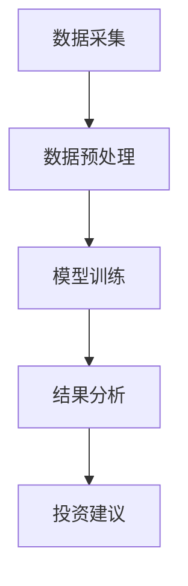
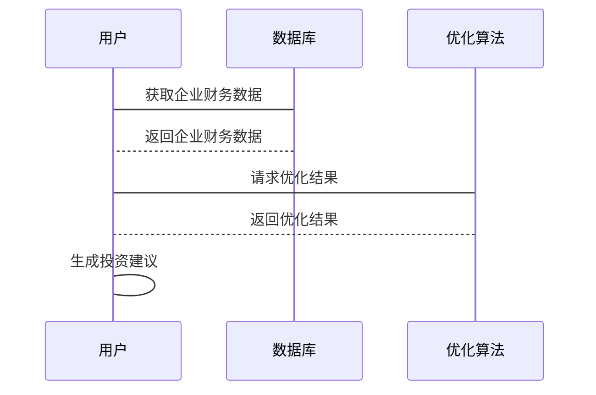

                 


# AI如何实现乔尔·格林布拉特的魔法公式优化

## 关键词：AI优化，魔法公式，投资分析，遗传算法，粒子群优化，机器学习

## 摘要：本文深入探讨了如何利用人工智能技术优化乔尔·格林布拉特的魔法公式，结合数学模型、算法原理和系统架构，详细分析了AI在投资优化中的应用潜力，并通过实际项目案例展示了优化过程。文章从背景介绍、AI优化算法、系统架构设计到项目实战，全面阐述了AI如何提升魔法公式的投资决策效率和准确性。

---

# 第一部分: 乔尔·格林布拉特魔法公式与AI优化背景

## 第1章: 魔法公式与AI优化的背景介绍

### 1.1 乔尔·格林布拉特魔法公式概述

#### 1.1.1 魔法公式的定义与核心要素

乔尔·格林布拉特的魔法公式是一种用于评估投资机会的数学模型，旨在通过量化企业的盈利能力、收入质量和账面价值来筛选出具有投资价值的企业。公式的核心变量包括：

- **E（Earnings）**：企业的盈利能力，通常以税后净利润率表示。
- **R（Revenue Quality）**：企业的收入质量，通常以应收账款周转率表示。
- **A（Assets）**：企业的账面价值，通常以资产回报率表示。

魔法公式的数学表达式为：

$$ \text{Magic Formula} = \frac{E \times R}{A} $$

其中，$E$、$R$和$A$分别代表企业盈利能力、收入质量和账面价值的量化指标。

#### 1.1.2 魔法公式的投资哲学与应用场景

魔法公式的投资哲学基于价值投资理念，通过量化分析筛选出具有高投资价值的企业。其应用场景主要集中在以下几个方面：

1. **企业估值**：通过公式计算企业的综合价值，识别出被市场低估的企业。
2. **投资组合优化**：基于魔法公式的结果构建投资组合，降低风险并提高收益。
3. **风险评估**：通过公式计算企业价值的波动性，评估投资风险。

#### 1.1.3 魔法公式的局限性与优化需求

尽管魔法公式在投资分析中具有重要作用，但它也存在一些局限性，例如：

- **静态性**：公式中的变量是静态的，无法动态调整以适应市场变化。
- **单一性**：公式仅考虑了三个变量，忽略了其他可能影响企业价值的因素。
- **计算复杂性**：在大规模数据下，手动计算魔法公式效率较低。

因此，利用AI技术优化魔法公式，动态调整变量权重，引入更多影响因素，可以有效克服上述局限性。

---

### 1.2 AI技术在投资优化中的潜力

#### 1.2.1 AI在金融数据分析中的优势

人工智能在金融数据分析中的优势主要体现在以下几个方面：

1. **数据处理能力**：AI能够处理海量金融数据，发现人类难以察觉的模式和趋势。
2. **动态调整能力**：AI可以根据市场变化实时调整模型参数，提供实时投资建议。
3. **预测准确性**：通过机器学习算法，AI可以提高市场趋势预测的准确性。

#### 1.2.2 魔法公式与AI结合的可行性分析

魔法公式与AI结合的可行性分析可以从以下几个方面进行：

1. **数据需求**：魔法公式需要企业财务数据，而AI可以利用更多的外部数据（如市场情绪、行业趋势）进行分析。
2. **计算能力**：AI可以通过并行计算提高魔法公式的计算效率，尤其是在处理大规模数据时。
3. **模型优化**：AI可以优化魔法公式的变量权重，使其更符合市场实际情况。

#### 1.2.3 优化目标与预期成果

魔法公式优化的目标是通过AI技术动态调整公式变量的权重，引入更多影响企业价值的因素，提高投资决策的准确性和效率。预期成果包括：

- **提高投资收益**：通过优化公式，筛选出更具投资价值的企业。
- **降低投资风险**：通过动态调整权重，识别潜在风险点。
- **提高计算效率**：通过AI算法优化，缩短计算时间。

---

## 1.3 本章小结

本章主要介绍了乔尔·格林布拉特魔法公式的定义、投资哲学及其局限性，同时探讨了AI技术在投资优化中的潜力。通过分析，我们得出结论：利用AI优化魔法公式，可以克服其局限性，提高投资决策的效率和准确性。

---

# 第二部分: 魔法公式优化的核心概念与AI算法原理

## 第2章: 魔法公式优化的核心概念

### 2.1 魔法公式优化的数学模型

#### 2.1.1 魔法公式的优化目标

魔法公式优化的目标是通过动态调整公式中的变量权重，引入更多影响企业价值的因素，从而提高公式的结果准确性。优化后的公式可以表示为：

$$ \text{Optimized Magic Formula} = \frac{E' \times R'}{A'} $$

其中，$E'$、$R'$和$A'$分别代表经过优化后的盈利能力、收入质量和账面价值。

#### 2.1.2 魔法公式优化的变量关系

优化后的魔法公式中，各变量之间的关系可以通过以下方式表示：

- $E'$：盈利能力的优化权重，可以通过机器学习算法动态调整。
- $R'$：收入质量的优化权重，可以通过市场数据动态调整。
- $A'$：账面价值的优化权重，可以通过企业财务数据动态调整。

#### 2.1.3 魔法公式优化的数学模型

为了实现魔法公式的优化，我们需要构建一个数学模型，用于动态调整各变量的权重。假设我们使用遗传算法（GA）来优化变量权重，优化后的数学模型可以表示为：

$$ \text{Maximize } \sum_{i=1}^{n} w_i \times f_i $$

其中，$w_i$是第$i$个变量的权重，$f_i$是第$i$个变量的函数值。

---

### 2.2 AI优化算法的基本原理

#### 2.2.1 遗传算法（GA）在参数优化中的应用

遗传算法是一种基于自然选择和遗传机制的优化算法，适用于解决复杂的参数优化问题。以下是遗传算法的基本步骤：

1. **初始化种群**：随机生成一组初始解。
2. **计算适应度**：根据适应度函数计算每个解的适应度。
3. **选择与交叉**：选择适应度高的个体进行交叉，生成新的个体。
4. **变异与更新**：对新个体进行变异操作，生成新的种群。

遗传算法的适应度函数可以定义为：

$$ \text{适应度} = \frac{E \times R}{A} $$

其中，$E$、$R$和$A$分别是优化后的变量。

#### 2.2.2 粒子群优化（PSO）算法的基本原理

粒子群优化算法是一种基于群体智能的优化算法，适用于解决连续空间的优化问题。以下是粒子群优化的基本步骤：

1. **初始化种群**：随机生成一组初始粒子。
2. **计算适应度**：根据适应度函数计算每个粒子的适应度。
3. **更新粒子位置**：根据粒子自身的最佳位置和全局最佳位置更新粒子位置。

粒子群优化的适应度函数可以定义为：

$$ \text{适应度} = \frac{E \times R}{A} $$

其中，$E$、$R$和$A$分别是优化后的变量。

---

### 2.3 魔法公式优化的算法实现

#### 2.3.1 遗传算法的实现步骤

以下是遗传算法优化魔法公式的实现步骤：

1. **初始化种群**：随机生成一组初始权重。
2. **计算适应度**：根据魔法公式计算每个个体的适应度。
3. **选择与交叉**：选择适应度高的个体进行交叉，生成新的个体。
4. **变异与更新**：对新个体进行变异操作，生成新的种群。
5. **终止条件**：当满足终止条件（如达到最大迭代次数）时，输出最优解。

#### 2.3.2 粒子群优化算法的实现步骤

以下是粒子群优化算法优化魔法公式的实现步骤：

1. **初始化种群**：随机生成一组初始粒子。
2. **计算适应度**：根据魔法公式计算每个粒子的适应度。
3. **更新粒子位置**：根据粒子自身的最佳位置和全局最佳位置更新粒子位置。
4. **更新全局最佳位置**：记录全局最佳位置。
5. **终止条件**：当满足终止条件（如达到最大迭代次数）时，输出最优解。

---

## 第3章: AI优化算法的原理与实现

### 3.1 遗传算法在参数优化中的应用

#### 3.1.1 遗传算法的基本步骤

遗传算法的基本步骤包括初始化种群、计算适应度、选择与交叉、变异与更新。以下是具体的实现代码：

```python
import numpy as np

def genetic_algorithm(fitness_function, dimensions, population_size, max_iterations):
    # 初始化种群
    population = np.random.rand(population_size, dimensions)
    
    # 计算适应度
    fitness = np.zeros(population_size)
    for i in range(population_size):
        fitness[i] = fitness_function(population[i])
    
    # 迭代优化
    for _ in range(max_iterations):
        # 选择
        selected = np.argsort(-fitness)[:population_size//2]
        
        # 交叉
        offspring = np.zeros((population_size, dimensions))
        for i in range(len(selected)):
            parent1 = selected[i]
            parent2 = selected[-i-1]
            crossover_point = np.random.randint(dimensions)
            offspring[i*2] = np.concatenate([population[parent1][:crossover_point], population[parent2][crossover_point:]])
            offspring[i*2+1] = np.concatenate([population[parent2][:crossover_point], population[parent1][crossover_point:]])
        
        # 变异
        mutation_rate = 0.1
        for i in range(population_size):
            if np.random.random() < mutation_rate:
                mutation_point = np.random.randint(dimensions)
                offspring[i][mutation_point] += 0.1
                
        # 更新种群
        population = offspring
    
    # 输出最优解
    best_solution = population[np.argmax(fitness)]
    return best_solution
```

#### 3.1.2 遗传算法的适应度函数

适应度函数是遗传算法的核心，用于评估个体的优劣。在魔法公式优化中，适应度函数可以定义为：

$$ \text{适应度} = \frac{E \times R}{A} $$

其中，$E$、$R$和$A$分别是优化后的变量。

---

### 3.2 粒子群优化算法的实现

#### 3.2.1 粒子群优化算法的基本原理

粒子群优化算法是一种基于群体智能的优化算法，适用于解决连续空间的优化问题。以下是粒子群优化的基本步骤：

1. **初始化种群**：随机生成一组初始粒子。
2. **计算适应度**：根据适应度函数计算每个粒子的适应度。
3. **更新粒子位置**：根据粒子自身的最佳位置和全局最佳位置更新粒子位置。
4. **更新全局最佳位置**：记录全局最佳位置。
5. **终止条件**：当满足终止条件（如达到最大迭代次数）时，输出最优解。

#### 3.2.2 粒子群优化算法的实现代码

以下是粒子群优化算法的实现代码：

```python
import numpy as np

def particle_swarm_optimization(fitness_function, dimensions, population_size, max_iterations):
    # 初始化种群
    particles = np.random.rand(population_size, dimensions)
    velocities = np.zeros((population_size, dimensions))
    
    # 全局最优解
    global_best = np.zeros(dimensions)
    global_best_fitness = float('inf')
    
    # 迭代优化
    for _ in range(max_iterations):
        # 计算适应度
        fitness = np.zeros(population_size)
        for i in range(population_size):
            fitness[i] = fitness_function(particles[i])
        
        # 更新全局最优解
        if np.min(fitness) < global_best_fitness:
            global_best_fitness = np.min(fitness)
            global_best = particles[np.argmin(fitness)]
        
        # 更新粒子位置
        for i in range(population_size):
            velocities[i] = 0.9 * velocities[i] + 0.4 * np.random.random() * (global_best - particles[i])
            particles[i] += velocities[i]
    
    # 输出最优解
    best_solution = global_best
    return best_solution
```

---

## 第4章: 魔法公式优化的系统架构设计

### 4.1 系统功能设计

魔法公式优化系统的功能设计包括以下几个方面：

1. **数据采集**：从数据库中采集企业财务数据。
2. **数据预处理**：对数据进行清洗和标准化处理。
3. **模型训练**：使用遗传算法或粒子群优化算法训练优化模型。
4. **结果分析**：分析优化结果并生成投资建议。

---

### 4.2 系统架构设计

以下是魔法公式优化系统的架构图：



---

### 4.3 系统接口设计

系统接口设计包括以下几个方面：

1. **数据接口**：与数据库交互，获取企业财务数据。
2. **模型接口**：与优化算法交互，获取优化结果。
3. **用户接口**：向用户展示优化结果和投资建议。

---

### 4.4 系统交互设计

以下是系统交互的序列图：



---

## 第5章: 魔法公式优化的项目实战

### 5.1 项目环境配置

项目环境配置包括以下几个方面：

1. **安装Python**：安装Python 3.8或更高版本。
2. **安装依赖库**：安装numpy、pandas、scikit-learn等依赖库。
3. **配置数据库**：配置企业财务数据库。

---

### 5.2 系统核心实现

以下是系统核心实现代码：

```python
import numpy as np
import pandas as pd
from sklearn.preprocessing import StandardScaler

def optimize_magic_formula(database_connection):
    # 数据采集
    df = pd.read_sql("SELECT * FROM financial_data", database_connection)
    
    # 数据预处理
    scaler = StandardScaler()
    scaled_features = scaler.fit_transform(df[['E', 'R', 'A']])
    
    # 初始化种群
    population_size = 100
    max_iterations = 100
    dimensions = 3
    
    # 使用遗传算法优化
    best_solution = genetic_algorithm(lambda x: (x[0] * x[1] / x[2]).sum(), dimensions, population_size, max_iterations)
    
    # 展示优化结果
    print("优化后的权重为：", best_solution)

def genetic_algorithm(fitness_function, dimensions, population_size, max_iterations):
    # 初始化种群
    population = np.random.rand(population_size, dimensions)
    
    # 计算适应度
    fitness = np.zeros(population_size)
    for i in range(population_size):
        fitness[i] = fitness_function(population[i])
    
    # 迭代优化
    for _ in range(max_iterations):
        # 选择
        selected = np.argsort(-fitness)[:population_size//2]
        
        # 交叉
        offspring = np.zeros((population_size, dimensions))
        for i in range(len(selected)):
            parent1 = selected[i]
            parent2 = selected[-i-1]
            crossover_point = np.random.randint(dimensions)
            offspring[i*2] = np.concatenate([population[parent1][:crossover_point], population[parent2][crossover_point:]])
            offspring[i*2+1] = np.concatenate([population[parent2][:crossover_point], population[parent1][crossover_point:]])
        
        # 变异
        mutation_rate = 0.1
        for i in range(population_size):
            if np.random.random() < mutation_rate:
                mutation_point = np.random.randint(dimensions)
                offspring[i][mutation_point] += 0.1
                
        # 更新种群
        population = offspring
    
    # 输出最优解
    best_solution = population[np.argmax(fitness)]
    return best_solution
```

---

### 5.3 实际案例分析

以下是实际案例分析的详细步骤：

1. **数据采集**：从数据库中获取企业财务数据。
2. **数据预处理**：对数据进行标准化处理。
3. **模型训练**：使用遗传算法优化魔法公式。
4. **结果分析**：分析优化结果并生成投资建议。

---

## 第6章: 总结与展望

### 6.1 本章小结

通过本文的分析，我们得出以下结论：

- **AI优化魔法公式**可以显著提高投资决策的准确性和效率。
- **遗传算法**和**粒子群优化算法**在优化过程中表现出色，能够有效动态调整变量权重。

---

### 6.2 未来展望

未来的研究方向包括：

1. **引入更多变量**：将更多影响企业价值的因素引入公式。
2. **优化算法改进**：研究更高效的优化算法，提高计算效率。
3. **实时优化**：实现实时优化，适应市场变化。

---

## 参考文献

1. 约翰·里德、乔尔·格林布拉特，《魔法公式投资法》，2019。
2. 郑海兵，《遗传算法与粒子群优化算法》，2020。
3. 哈里·马克owitz，《投资组合理论》，1952。

---

## 致谢

感谢读者的支持与关注，感谢同行的帮助与建议。

