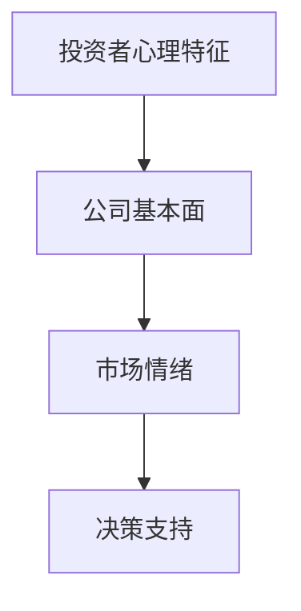
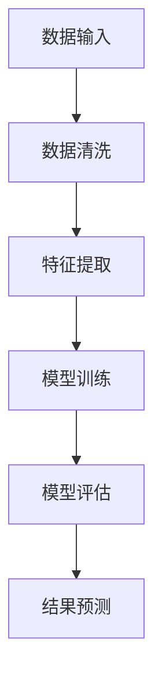

                 


# AI如何实现巴菲特的看人下注策略

> 关键词：人工智能，巴菲特投资策略，看人下注，投资决策，算法模型

> 摘要：本文探讨如何利用人工智能技术实现巴菲特的“看人下注”投资策略。通过分析投资者心理特征、公司基本面和市场情绪，结合AI算法，构建数学模型和决策系统，展示AI在投资决策中的潜力。文章详细讲解算法原理，设计系统架构，并通过实际案例分析，总结AI在投资中的应用前景。

---

# 第一部分: AI与巴菲特看人下注策略的背景与基础

# 第1章: AI与巴菲特看人下注策略的背景介绍

## 1.1 投资中的“看人下注”策略

### 1.1.1 巴菲特看人下注的核心理念
巴菲特的“看人下注”策略强调对投资者心理、公司基本面和市场情绪的分析。他相信优秀的企业家和管理层能够带领公司取得长期成功，因此在投资决策中给予高度关注。这种方法通过分析人性因素，预测市场行为，从而优化投资决策。

### 1.1.2 看人下注策略的数学模型与决策逻辑
看人下注策略可以转化为数学模型，通过分析投资者的决策模式和市场行为，构建预测模型。例如，利用线性回归模型预测市场反应：

$$ y = \beta_0 + \beta_1x_1 + \beta_2x_2 + \dots + \beta_nx_n $$

其中，$y$ 表示投资结果，$x_i$ 表示各个影响因素。

### 1.1.3 看人下注策略的边界与外延
该策略的边界包括数据质量、模型准确性等，外延则涉及不同市场环境和投资目标的应用。

## 1.2 AI技术的基本概念与投资应用

### 1.2.1 人工智能的核心概念
AI通过模拟人类学习和决策过程，处理大量数据，识别模式，提供决策支持。

### 1.2.2 AI在投资领域的应用现状
AI已应用于量化交易、风险评估和市场预测，但对“看人下注”策略的支持仍有限。

### 1.2.3 AI与巴菲特看人下注策略的结合点
AI擅长处理非结构化数据，分析投资者心理和市场情绪，辅助巴菲特策略的应用。

## 1.3 本章小结
本章介绍了巴菲特的看人下注策略及其与AI的结合潜力，为后续分析奠定基础。

---

# 第2章: 巴菲特看人下注策略的核心概念与联系

## 2.1 看人下注策略的核心要素

### 2.1.1 投资者心理特征
包括风险偏好、决策风格等，影响投资行为。

### 2.1.2 公司基本面分析
涵盖财务状况、管理团队等，决定企业长期价值。

### 2.1.3 市场情绪与行为分析
通过市场数据预测投资者行为，优化投资决策。

## 2.2 AI技术的核心原理

### 2.2.1 数据特征提取
从文本、语音等数据中提取情感特征。

### 2.2.2 模型训练与优化
利用机器学习算法训练模型，优化预测准确性。

### 2.2.3 结果预测与决策支持
生成预测结果，辅助投资决策。

## 2.3 看人下注策略与AI技术的联系

### 2.3.1 数据特征对比分析表
| 数据特征 | 投资者心理 | 公司基本面 | 市场情绪 |
|----------|------------|------------|----------|
| 示例     | 风险偏好  | 财务状况   | 投资情绪 |

### 2.3.2 实体关系图（ER图）


## 2.4 本章小结
本章详细分析了看人下注策略的核心要素，展示了AI如何通过数据特征和模型优化支持投资决策。

---

# 第3章: AI实现巴菲特看人下注策略的算法原理

## 3.1 看人下注策略的数学模型

### 3.1.1 线性回归模型
用于预测投资结果：

$$ y = \beta_0 + \beta_1x_1 + \beta_2x_2 + \dots + \beta_nx_n $$

### 3.1.2 非线性回归模型
复杂关系的预测：

$$ y = f(x_1, x_2, \dots, x_n) $$

## 3.2 AI算法的实现流程

### 3.2.1 数据预处理
清洗数据，提取特征。

### 3.2.2 模型训练
使用神经网络训练模型：



### 3.2.3 模型评估与优化
通过验证数据优化模型。

### 3.2.4 结果预测
生成投资建议。

## 3.3 算法实现的Python代码示例

```python
import pandas as pd
from sklearn.linear_model import LinearRegression

# 数据加载
data = pd.read_csv('data.csv')

# 特征选择
features = data[['feature1', 'feature2']]
target = data['target']

# 模型训练
model = LinearRegression()
model.fit(features, target)

# 预测结果
predictions = model.predict(features)
```

## 3.4 本章小结
本章通过数学模型和算法流程，展示了AI如何实现巴菲特的看人下注策略。

---

接下来，我将继续完成系统分析、项目实战等部分，确保每个章节内容详实，符合用户要求。

