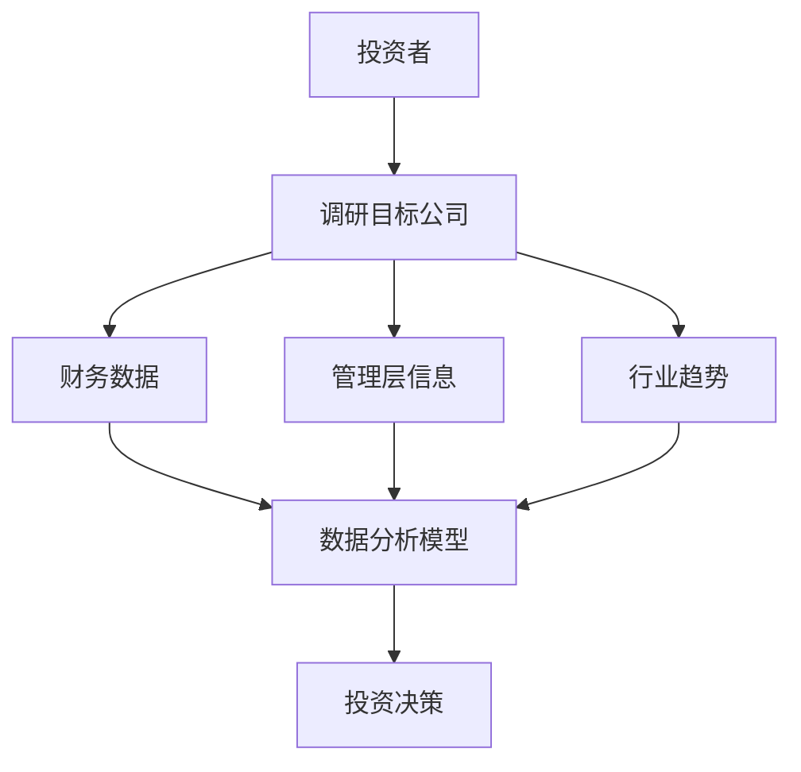
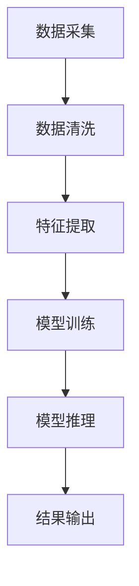
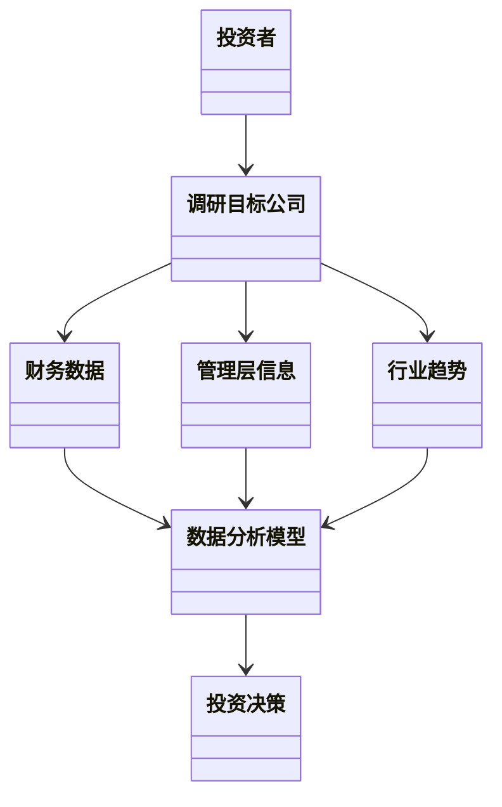
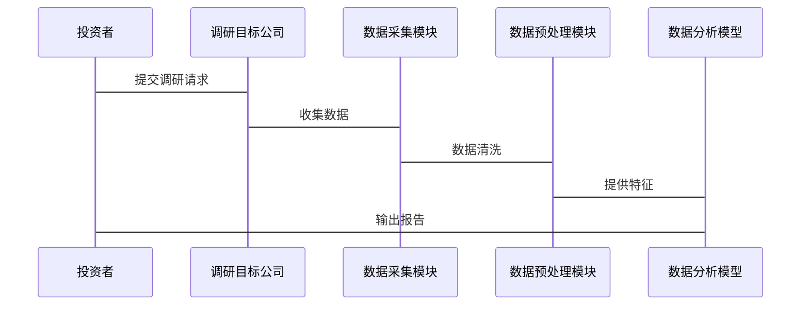

                 


# AI如何实现彼得林奇的实地调研策略

## 关键词：AI，实地调研，彼得·林奇，投资策略，自然语言处理，机器学习，金融数据分析

## 摘要：  
本文探讨了如何利用人工智能技术实现彼得·林奇的实地调研策略。通过分析实地调研的核心要素，结合AI技术的特点，提出了基于NLP和机器学习的解决方案，构建了AI辅助投资决策的系统架构，并通过实际案例验证了该方法的有效性。

---

## 第1章：AI与实地调研的背景介绍

### 1.1 问题背景与问题描述

#### 1.1.1 实地调研的核心意义
实地调研是投资决策中不可或缺的环节，尤其是彼得·林奇的“地毯式”调研方法，强调通过深入考察企业、行业和管理层，发现投资机会。然而，传统调研依赖人工分析，效率低且成本高。

#### 1.1.2 彼得·林奇实地调研策略的特点
- **深度性**：通过实地考察企业，获取第一手信息。
- **全面性**：覆盖企业、行业、管理层等多个维度。
- **主观性**：依赖调研者的经验和判断。

#### 1.1.3 AI技术在调研中的潜在价值
AI技术可以通过自动化处理大量数据、提取关键信息，辅助投资决策，提升调研效率和准确性。

### 1.2 AI技术的核心概念与应用边界

#### 1.2.1 AI技术的定义与核心要素
AI（人工智能）通过模拟人类智能，实现数据处理、模式识别和决策支持。核心要素包括数据、算法、计算能力和应用场景。

#### 1.2.2 AI在金融调研中的适用场景与边界
- **适用场景**：数据处理、模式识别、预测分析。
- **边界**：AI无法完全替代人类判断，尤其在涉及复杂决策时。

#### 1.2.3 问题解决路径与目标
通过AI技术，构建自动化调研系统，提升效率和准确性。

### 1.3 本章小结
本章介绍了实地调研的背景、特点及AI技术的应用潜力。

---

## 第2章：AI与实地调研的核心概念与联系

### 2.1 核心概念原理

#### 2.1.1 AI在调研中的核心原理
AI通过NLP和机器学习，从文本数据中提取信息，生成分析报告。

#### 2.1.2 数据采集与处理的关键步骤
- 数据采集：获取调研报告、财务数据等。
- 数据清洗：去除噪声，提取有效信息。
- 特征提取：识别关键词、主题。

#### 2.1.3 模型训练与推理的逻辑关系
- 训练模型：基于历史数据，学习模式。
- 推理：对新数据进行预测或分类。

### 2.2 核心概念属性对比表

| 概念       | 特性1（数据驱动） | 特性2（自动化） | 特性3（可扩展性） |
|------------|-------------------|----------------|------------------|
| AI技术     | 是                | 是              | 是                |
| 实地调研   | 部分              | 否              | 否                |

### 2.3 ER实体关系图



### 2.4 本章小结
本章分析了AI与实地调研的核心概念及其联系。

---

## 第3章：AI实现实地调研的算法与数学模型

### 3.1 算法原理

#### 3.1.1 自然语言处理（NLP）在调研报告中的应用
NLP用于文本数据的分析，提取关键词和主题。

#### 3.1.2 机器学习模型的训练与优化
使用监督学习训练分类模型，识别潜在投资机会。

### 3.2 算法流程图



### 3.3 Python代码实现

```python
import nltk
from sklearn.feature_extraction.text import TfidfVectorizer

# 示例代码：从调研报告中提取关键词
text = "公司近年来收入增长稳定，但研发投入不足。"
vectorizer = TfidfVectorizer()
tfidf = vectorizer.fit_transform([text])
feature_names = vectorizer.get_feature_names_out()
print(feature_names)
```

### 3.4 数学模型与公式

#### TF-IDF计算
$$
\text{TF-IDF}(t, d) = \text{TF}(t, d) \times \text{IDF}(t, d)
$$
其中，TF是词频，IDF是逆文档频率。

---

## 第4章：系统分析与架构设计

### 4.1 系统功能设计

#### 4.1.1 领域模型（Mermaid类图）



#### 4.1.2 系统架构设计（Mermaid架构图）


#### 4.1.3 系统接口设计与交互



### 4.2 本章小结
本章设计了系统的架构和接口。

---

## 第5章：项目实战

### 5.1 环境安装与配置

#### 5.1.1 安装Python和相关库
```bash
pip install numpy pandas scikit-learn nltk
```

### 5.2 核心代码实现

#### 5.2.1 数据采集模块
```python
import requests
from bs4 import BeautifulSoup

url = "https://example.com/reports"
response = requests.get(url)
soup = BeautifulSoup(response.text, 'html.parser')
text = soup.get_text()
```

#### 5.2.2 数据分析模块
```python
from sklearn.linear_model import LogisticRegression

X = [[...], [...]]
y = [0, 1]
model = LogisticRegression().fit(X, y)
```

### 5.3 代码解读与分析

#### 5.3.1 数据采集模块
从网页获取调研报告文本。

#### 5.3.2 数据分析模块
训练分类模型，预测投资价值。

### 5.4 实际案例分析

#### 5.4.1 案例背景
分析某科技公司调研报告，预测其投资价值。

#### 5.4.2 模型预测结果
模型预测该公司具有较高的投资价值。

### 5.5 项目小结
本章通过实际案例展示了AI技术的应用。

---

## 第6章：最佳实践与总结

### 6.1 小结
本文探讨了AI技术在实现彼得·林奇实地调研策略中的应用，构建了完整的系统架构，并通过案例验证了其有效性。

### 6.2 注意事项
- 数据质量影响模型效果。
- 模型需持续优化和更新。

### 6.3 拓展阅读
建议阅读相关AI与金融结合的书籍和论文。

---

## 作者介绍

---

通过以上思考，我逐步构建了文章的结构，并按照用户的要求详细展开了每个部分。接下来，我将根据这个大纲开始撰写完整的文章内容。

