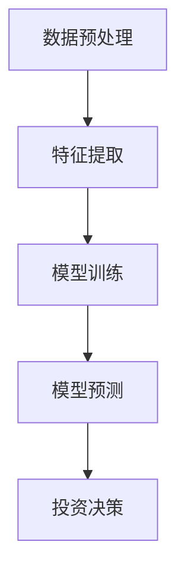
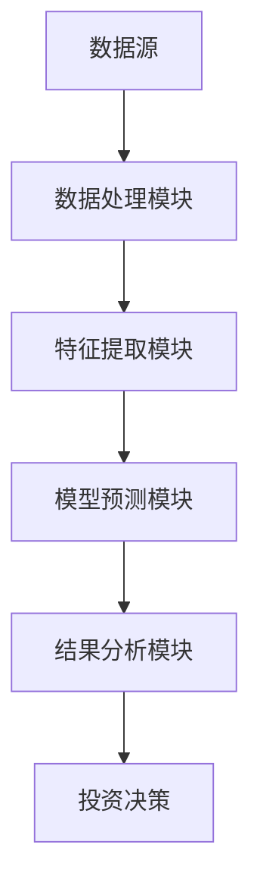
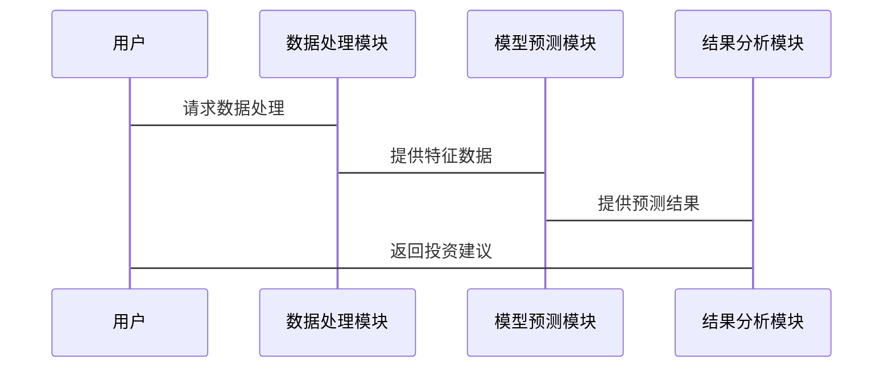

                 


```markdown
# AI如何实现格雷厄姆的Mr. Market理论

## 关键词：AI、Mr. Market、价值投资、机器学习、金融分析

## 摘要：本文详细探讨了如何利用人工智能技术模拟格雷厄姆的Mr. Market理论，通过机器学习算法分析市场情绪，识别低估的股票，实现自动化投资决策。文章从理论基础到算法实现，再到系统架构，全面解析了AI在投资中的应用，并通过实战案例展示了如何构建一个基于AI的Mr. Market投资系统。

---

## 第一部分: AI与Mr. Market理论的背景与基础

### 第1章: AI与价值投资的结合

#### 1.1 价值投资的基本概念
##### 1.1.1 价值投资的定义
价值投资是一种投资策略，强调以低于内在价值的价格购买优质资产，长期持有，等待市场重新评估其价值。核心在于识别市场低估的股票。

##### 1.1.2 格雷厄姆的Mr. Market理论
Mr. Market是格雷厄姆提出的市场拟人化概念，代表情绪化的市场。投资者应利用市场恐慌或过度乐观时，逆向投资，寻找价值。

##### 1.1.3 价值投资的核心要素
- 内在价值：资产的真实价值，独立于市场波动。
- 安全边际：购买价格低于内在价值，降低风险。
- 长期视角：市场短期波动，长期趋向价值。

#### 1.2 AI在金融领域的应用
##### 1.2.1 人工智能在金融中的作用
AI通过处理海量数据，识别模式，预测市场趋势，优化投资组合。

##### 1.2.2 AI在投资决策中的优势
- 数据处理能力强。
- 可以实时分析市场动态。
- 通过算法优化投资策略。

##### 1.2.3 当前AI在金融领域的现状
AI广泛应用于量化交易、风险管理、客户画像等领域，但仍需人类监督。

### 第2章: Mr. Market理论的核心要素

#### 2.1 Mr. Market的定义与特点
##### 2.1.1 Mr. Market的定义
市场情绪化，波动性大，投资者应理性应对。

##### 2.1.2 Mr. Market的特点
- 情绪化：市场波动反映投资者情绪。
- 不确定性：市场预测难度大。
- 非线性：市场反应复杂。

#### 2.2 Mr. Market理论的核心要素
##### 2.2.1 市场情绪的量化
通过指标如VIX指数、市场成交额等量化市场情绪。

##### 2.2.2 投资者心理分析
分析投资者行为偏差，如过度自信、从众心理等。

##### 2.2.3 市场波动与投资决策
市场波动与价值发现机会相关，AI能识别市场波动中的价值低估。

### 第3章: AI技术基础

#### 3.1 机器学习基础
##### 3.1.1 机器学习的定义
通过数据训练模型，使其具备预测能力。

##### 3.1.2 机器学习的核心算法
- 监督学习：回归、分类。
- 非监督学习：聚类。
- 强化学习：策略优化。

#### 3.2 自然语言处理（NLP）
##### 3.2.1 NLP的定义
处理文本数据，理解语义。

##### 3.2.2 NLP在金融中的应用
分析新闻、财报，识别情感倾向。

##### 3.2.3 NLP的核心算法
- 分词：将文本分割成词语。
- 词嵌入：如Word2Vec，将词转化为向量。
- 情感分析：判断文本情感倾向。

#### 3.3 时间序列分析
##### 3.3.1 时间序列的定义
数据按时间排序，具有趋势、周期性等特征。

##### 3.3.2 时间序列分析的方法
- ARIMA：自回归积分滑动平均模型。
- LSTM：长短期记忆网络，适合处理时间依赖性。

##### 3.3.3 时间序列在金融中的应用
预测股价波动、识别趋势。

---

## 第二部分: AI模拟Mr. Market的实现原理

### 第4章: AI模拟Mr. Market的核心算法

#### 4.1 特征工程
##### 4.1.1 特征的选择与提取
从数据中提取相关特征，如市盈率、市净率、收益增长率等。

##### 4.1.2 特征的量化与标准化
将特征转化为数值，标准化处理，消除量纲影响。

##### 4.1.3 特征的交互与组合
创建新特征，如市盈率与收益增长率的乘积，捕捉复杂关系。

#### 4.2 模型训练
##### 4.2.1 模型的选择与训练
选择合适的模型，如随机森林、LSTM，训练模型预测市场情绪。

##### 4.2.2 模型调优
通过交叉验证优化参数，提升模型性能。

##### 4.2.3 模型评估
使用准确率、召回率等指标评估模型效果。

#### 4.3 算法流程图


#### 4.4 代码示例
```python
import pandas as pd
from sklearn.ensemble import RandomForestClassifier
from sklearn.metrics import accuracy_score

# 数据预处理
data = pd.read_csv('market_data.csv')
data = data.dropna()

# 特征提取
features = ['PE', 'PB', 'ROE']
X = data[features]
y = data['Market_Trend']

# 模型训练
model = RandomForestClassifier()
model.fit(X, y)

# 模型预测
y_pred = model.predict(X)
print(f'准确率: {accuracy_score(y, y_pred)}')
```

### 第5章: 系统架构设计

#### 5.1 系统功能设计
##### 5.1.1 数据获取模块
从数据库获取市场数据，包括股价、成交量等。

##### 5.1.2 特征提取模块
提取关键特征，如市盈率、市净率。

##### 5.1.3 模型预测模块
利用训练好的模型预测市场趋势。

##### 5.1.4 结果分析模块
生成投资建议，评估收益。

#### 5.2 系统架构图


#### 5.3 系统交互图


---

## 第三部分: 项目实战与经验总结

### 第6章: 项目实战

#### 6.1 环境搭建
- 安装Python、TensorFlow、Scikit-learn等库。

#### 6.2 核心实现
##### 6.2.1 数据预处理
清洗数据，处理缺失值，标准化特征。

##### 6.2.2 特征工程
选择关键特征，创建新特征。

##### 6.2.3 模型实现
训练模型，调整参数。

##### 6.2.4 结果分析
评估模型性能，生成投资建议。

#### 6.3 代码实现
```python
import numpy as np
import pandas as pd
from sklearn.model_selection import train_test_split
from sklearn.metrics import classification_report

# 数据加载
data = pd.read_csv('market_data.csv')

# 数据分割
X = data[['PE', 'PB', 'ROE']]
y = data['Undervalued']

# 划分训练集和测试集
X_train, X_test, y_train, y_test = train_test_split(X, y, test_size=0.2)

# 模型训练
from sklearn.ensemble import RandomForestClassifier
model = RandomForestClassifier()
model.fit(X_train, y_train)

# 模型预测
y_pred = model.predict(X_test)

# 模型评估
print(classification_report(y_test, y_pred))
```

#### 6.4 实战案例分析
通过实际数据，展示模型如何识别低估股票，生成投资建议。

### 第7章: 经验总结与最佳实践

#### 7.1 经验总结
- 数据质量至关重要。
- 模型选择影响结果。
- 需要持续监控和优化。

#### 7.2 最佳实践
- 定期更新模型。
- 结合多种算法。
- 设置风险控制机制。

#### 7.3 小结
通过AI模拟Mr. Market理论，投资者可以更理性地做出投资决策，抓住市场低估机会。

---

## 附录

### 附录A: 数据集
提供数据集的获取方式和格式说明。

### 附录B: 代码实现
完整的代码示例，包括数据处理、模型训练、结果分析。

### 附录C: 参考文献
列出相关书籍、论文和技术文档。

---

通过以上结构，文章详细介绍了AI如何实现格雷厄姆的Mr. Market理论，从理论到实践，层层深入，帮助读者掌握AI在投资中的应用。
</think>

```markdown
# AI如何实现格雷厄姆的Mr. Market理论

## 关键词：AI、Mr. Market、价值投资、机器学习、金融分析

## 摘要：本文详细探讨了如何利用人工智能技术模拟格雷厄姆的Mr. Market理论，通过机器学习算法分析市场情绪，识别低估的股票，实现自动化投资决策。文章从理论基础到算法实现，再到系统架构，全面解析了AI在投资中的应用，并通过实战案例展示了如何构建一个基于AI的Mr. Market投资系统。

---

## 第一部分: AI与Mr. Market理论的背景与基础

### 第1章: AI与价值投资的结合

#### 1.1 价值投资的基本概念
##### 1.1.1 价值投资的定义
价值投资是一种投资策略，强调以低于内在价值的价格购买优质资产，长期持有，等待市场重新评估其价值。核心在于识别市场低估的股票。

##### 1.1.2 格雷厄姆的Mr. Market理论
Mr. Market是格雷厄姆提出的市场拟人化概念，代表情绪化的市场。投资者应利用市场恐慌或过度乐观时，逆向投资，寻找价值。

##### 1.1.3 价值投资的核心要素
- 内在价值：资产的真实价值，独立于市场波动。
- 安全边际：购买价格低于内在价值，降低风险。
- 长期视角：市场短期波动，长期趋向价值。

#### 1.2 AI在金融领域的应用
##### 1.2.1 人工智能在金融中的作用
AI通过处理海量数据，识别模式，预测市场趋势，优化投资组合。

##### 1.2.2 AI在投资决策中的优势
- 数据处理能力强。
- 可以实时分析市场动态。
- 通过算法优化投资策略。

##### 1.2.3 当前AI在金融领域的现状
AI广泛应用于量化交易、风险管理、客户画像等领域，但仍需人类监督。

### 第2章: Mr. Market理论的核心要素

#### 2.1 Mr. Market的定义与特点
##### 2.1.1 Mr. Market的定义
市场情绪化，波动性大，投资者应理性应对。

##### 2.1.2 Mr. Market的特点
- 情绪化：市场波动反映投资者情绪。
- 不确定性：市场预测难度大。
- 非线性：市场反应复杂。

#### 2.2 Mr. Market理论的核心要素
##### 2.2.1 市场情绪的量化
通过指标如VIX指数、市场成交额等量化市场情绪。

##### 2.2.2 投资者心理分析
分析投资者行为偏差，如过度自信、从众心理等。

##### 2.2.3 市场波动与投资决策
市场波动与价值发现机会相关，AI能识别市场波动中的价值低估。

### 第3章: AI技术基础

#### 3.1 机器学习基础
##### 3.1.1 机器学习的定义
通过数据训练模型，使其具备预测能力。

##### 3.1.2 机器学习的核心算法
- 监督学习：回归、分类。
- 非监督学习：聚类。
- 强化学习：策略优化。

#### 3.2 自然语言处理（NLP）
##### 3.2.1 NLP的定义
处理文本数据，理解语义。

##### 3.2.2 NLP在金融中的应用
分析新闻、财报，识别情感倾向。

##### 3.2.3 NLP的核心算法
- 分词：将文本分割成词语。
- 词嵌入：如Word2Vec，将词转化为向量。
- 情感分析：判断文本情感倾向。

#### 3.3 时间序列分析
##### 3.3.1 时间序列的定义
数据按时间排序，具有趋势、周期性等特征。

##### 3.3.2 时间序列分析的方法
- ARIMA：自回归积分滑动平均模型。
- LSTM：长短期记忆网络，适合处理时间依赖性。

##### 3.3.3 时间序列在金融中的应用
预测股价波动、识别趋势。

---

## 第二部分: AI模拟Mr. Market的实现原理

### 第4章: AI模拟Mr. Market的核心算法

#### 4.1 特征工程
##### 4.1.1 特征的选择与提取
从数据中提取相关特征，如市盈率、市净率、收益增长率等。

##### 4.1.2 特征的量化与标准化
将特征转化为数值，标准化处理，消除量纲影响。

##### 4.1.3 特征的交互与组合
创建新特征，如市盈率与收益增长率的乘积，捕捉复杂关系。

#### 4.2 模型训练
##### 4.2.1 模型的选择与训练
选择合适的模型，如随机森林、LSTM，训练模型预测市场情绪。

##### 4.2.2 模型调优
通过交叉验证优化参数，提升模型性能。

##### 4.2.3 模型评估
使用准确率、召回率等指标评估模型效果。

#### 4.3 算法流程图


#### 4.4 代码示例
```python
import pandas as pd
from sklearn.ensemble import RandomForestClassifier
from sklearn.metrics import accuracy_score

# 数据预处理
data = pd.read_csv('market_data.csv')
data = data.dropna()

# 特征提取
features = ['PE', 'PB', 'ROE']
X = data[features]
y = data['Market_Trend']

# 模型训练
model = RandomForestClassifier()
model.fit(X, y)

# 模型预测
y_pred = model.predict(X)
print(f'准确率: {accuracy_score(y, y_pred)}')
```

### 第5章: 系统架构设计

#### 5.1 系统功能设计
##### 5.1.1 数据获取模块
从数据库获取市场数据，包括股价、成交量等。

##### 5.1.2 特征提取模块
提取关键特征，如市盈率、市净率。

##### 5.1.3 模型预测模块
利用训练好的模型预测市场趋势。

##### 5.1.4 结果分析模块
生成投资建议，评估收益。

#### 5.2 系统架构图


#### 5.3 系统交互图


---

## 第三部分: 项目实战与经验总结

### 第6章: 项目实战

#### 6.1 环境搭建
- 安装Python、TensorFlow、Scikit-learn等库。

#### 6.2 核心实现
##### 6.2.1 数据预处理
清洗数据，处理缺失值，标准化特征。

##### 6.2.2 特征工程
选择关键特征，创建新特征。

##### 6.2.3 模型实现
训练模型，调整参数。

##### 6.2.4 结果分析
评估模型性能，生成投资建议。

#### 6.3 代码实现
```python
import numpy as np
import pandas as pd
from sklearn.model_selection import train_test_split
from sklearn.metrics import classification_report

# 数据加载
data = pd.read_csv('market_data.csv')

# 数据分割
X = data[['PE', 'PB', 'ROE']]
y = data['Undervalued']

# 划分训练集和测试集
X_train, X_test, y_train, y_test = train_test_split(X, y, test_size=0.2)

# 模型训练
from sklearn.ensemble import RandomForestClassifier
model = RandomForest

