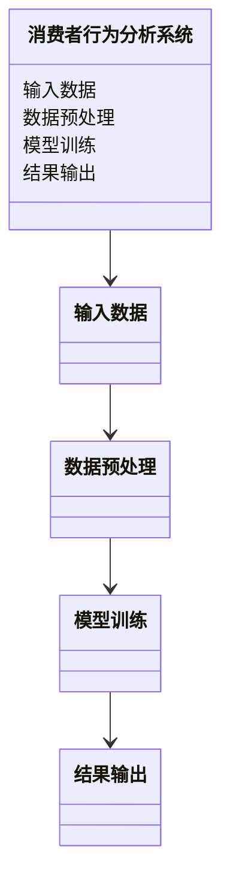
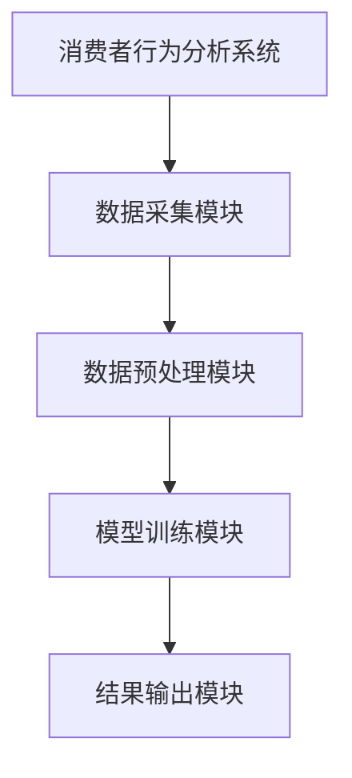
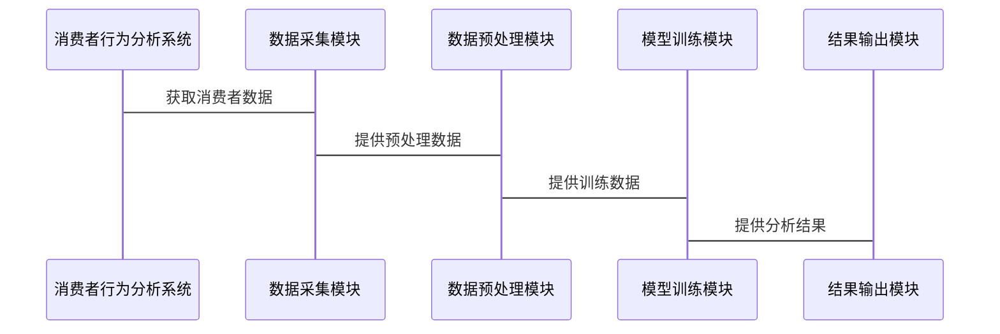

                 


# AI如何实现费雪的消费者行为研究

> 关键词：AI技术，消费者行为研究，费雪理论，机器学习，深度学习，NLP技术

> 摘要：本文探讨了如何利用AI技术实现费雪的消费者行为研究，详细分析了AI技术在消费者行为研究中的应用背景、核心概念、算法原理、系统设计、项目实战及最佳实践。通过结合费雪理论与现代AI技术，展示了如何利用机器学习、深度学习和自然语言处理等技术手段，提升消费者行为研究的效率和准确性。

---

# 第一部分: AI与消费者行为研究的背景与基础

## 第1章: AI与消费者行为研究的背景

### 1.1 费雪的消费者行为研究概述

#### 1.1.1 费雪的消费者行为理论
费雪的消费者行为研究以预期理论为核心，强调消费者对未来价格的预期如何影响当前的消费行为。这一理论为现代消费者行为研究奠定了基础。

#### 1.1.2 费雪理论的核心观点
费雪提出了消费者行为的预期效用理论，认为消费者会基于对未来的预期做出理性决策。这一理论在现代经济学和消费者行为研究中具有重要地位。

#### 1.1.3 费雪理论的现实意义
在现代商业环境中，费雪理论为我们理解消费者决策提供了重要的理论框架，尤其是在动态市场中消费者行为的预测和分析中具有重要应用价值。

---

### 1.2 AI技术的发展与应用

#### 1.2.1 AI技术的演进历程
从早期的专家系统到现代的深度学习，AI技术经历了巨大的发展，尤其是在数据处理和模式识别方面取得了显著进展。

#### 1.2.2 AI在社会科学领域的应用
AI技术在社会科学领域的应用日益广泛，特别是在消费者行为分析、市场预测和社会趋势研究中展现出强大的潜力。

#### 1.2.3 AI在消费者行为研究中的潜力
AI技术能够通过大数据分析和机器学习算法，帮助研究人员更准确地预测消费者行为，提升市场研究的效率和准确性。

---

### 1.3 费雪理论与AI的结合

#### 1.3.1 费雪理论与AI技术的契合点
费雪的预期效用理论与AI的预测能力具有天然契合点，AI可以通过历史数据分析和模型训练，帮助预测消费者的未来行为。

#### 1.3.2 AI如何赋能消费者行为研究
通过AI技术，研究人员可以更高效地分析消费者数据，识别潜在的消费趋势，并制定更精准的营销策略。

#### 1.3.3 费雪理论的现代应用价值
在AI技术的加持下，费雪理论得以在现代商业环境中焕发新的活力，为消费者行为研究提供了新的方法和思路。

---

## 第2章: 消费者行为研究的核心概念与AI的联系

### 2.1 消费者行为研究的核心概念

#### 2.1.1 消费者行为的定义与分类
消费者行为是指消费者在购买、使用和处置产品或服务的过程中表现出的各种行为。这些行为可以分为理性行为和感性行为两大类。

#### 2.1.2 消费者决策过程的模型
消费者决策过程模型包括问题识别、信息搜索、评估、购买决策和购后行为五个阶段。

#### 2.1.3 费雪理论中的关键变量
费雪理论强调了价格预期、效用和消费者偏好等关键变量对消费行为的影响。

---

### 2.2 AI技术的核心概念

#### 2.2.1 机器学习的基本原理
机器学习是通过数据训练模型，使其能够从数据中学习规律并做出预测。其核心包括特征提取、模型训练和预测输出。

#### 2.2.2 深度学习的特征与优势
深度学习通过多层神经网络结构，能够自动提取数据特征，具有强大的非线性建模能力。

#### 2.2.3 自然语言处理（NLP）技术的关键应用
NLP技术能够理解并处理人类语言，应用于文本分类、情感分析和语义理解等领域。

---

### 2.3 费雪理论与AI技术的联系

#### 2.3.1 数据驱动的消费者行为分析
AI技术通过大数据分析，能够帮助研究人员更全面地了解消费者行为的驱动因素。

#### 2.3.2 AI如何提升消费者行为研究的效率
通过机器学习算法，AI能够快速分析海量数据，识别潜在的消费趋势和模式。

#### 2.3.3 费雪理论的现代应用框架
结合AI技术，费雪理论的应用框架得以扩展，能够更好地适应现代复杂市场环境。

---

## 第3章: AI实现消费者行为研究的算法原理

### 3.1 机器学习算法的核心原理

#### 3.1.1 监督学习与无监督学习
- **监督学习**：基于标记数据进行训练，适用于分类和回归任务。
- **无监督学习**：在无标记数据上进行学习，适用于聚类和降维任务。

#### 3.1.2 分类与回归算法
- **分类算法**：如决策树、随机森林等，用于预测分类标签。
- **回归算法**：如线性回归、支持向量回归等，用于预测连续值。

#### 3.1.3 聚类分析与降维技术
- **聚类分析**：如K均值聚类，用于将数据分为不同的类别。
- **降维技术**：如主成分分析（PCA），用于降低数据维度。

---

### 3.2 深度学习算法的原理与应用

#### 3.2.1 神经网络的结构与训练
神经网络由输入层、隐藏层和输出层组成，通过反向传播算法进行训练。

#### 3.2.2 卷积神经网络（CNN）与循环神经网络（RNN）
- **CNN**：适用于图像处理，通过卷积操作提取特征。
- **RNN**：适用于序列数据，如时间序列分析。

#### 3.2.3 Transformer模型的原理与应用
Transformer模型通过自注意力机制，能够处理长序列数据，广泛应用于NLP任务。

---

### 3.3 自然语言处理（NLP）算法的应用

#### 3.3.1 词嵌入技术（如Word2Vec）
词嵌入技术通过将词语映射到低维空间，捕捉词语之间的语义关系。

#### 3.3.2 文本分类与情感分析
- **文本分类**：将文本划分为不同类别，如垃圾邮件分类。
- **情感分析**：判断文本情感倾向，如正面、负面或中性。

#### 3.3.3 基于NLP的消费者行为分析
通过分析消费者评论和社交媒体数据，NLP技术能够帮助识别消费者偏好和情感倾向。

---

## 第4章: 消费者行为研究的系统分析与架构设计

### 4.1 系统分析与需求定义

#### 4.1.1 问题场景的描述
在现代商业环境中，企业需要通过分析消费者行为数据，制定精准的营销策略。

#### 4.1.2 项目目标
通过AI技术，帮助企业预测消费者行为，优化营销策略。

#### 4.1.3 系统边界与外延
系统边界包括数据输入、模型训练和结果输出，外延则包括数据源和用户界面。

---

### 4.2 系统功能设计

#### 4.2.1 领域模型设计
领域模型图展示了系统的功能模块及其之间的关系。



---

### 4.3 系统架构设计



---

### 4.4 系统接口设计



---

## 第5章: 项目实战

### 5.1 环境安装

#### 5.1.1 安装Python环境
安装Python 3.8及以上版本，并安装Jupyter Notebook用于代码开发。

#### 5.1.2 安装必要的库
安装scikit-learn、TensorFlow、Keras和NLTK等库。

```bash
pip install scikit-learn tensorflow keras nltk
```

---

### 5.2 系统核心实现源代码

#### 5.2.1 数据预处理代码

```python
import pandas as pd
from sklearn.preprocessing import StandardScaler

# 读取数据
data = pd.read_csv('consumer_behavior.csv')

# 删除缺失值
data = data.dropna()

# 标准化处理
scaler = StandardScaler()
data_scaled = scaler.fit_transform(data)
```

---

#### 5.2.2 模型训练代码

```python
from sklearn.ensemble import RandomForestClassifier
from sklearn.metrics import accuracy_score

# 初始化模型
model = RandomForestClassifier(n_estimators=100, random_state=42)

# 训练模型
model.fit(data_scaled, labels)

# 预测结果
predictions = model.predict(test_data_scaled)
print("准确率:", accuracy_score(test_labels, predictions))
```

---

### 5.3 代码应用解读与分析

通过上述代码，我们可以实现消费者行为数据的预处理和模型训练，最终输出预测结果。模型的准确率可以通过交叉验证进一步优化。

---

## 第6章: 最佳实践与小结

### 6.1 最佳实践

#### 6.1.1 数据质量的重要性
确保数据的准确性和完整性是模型训练的前提条件。

#### 6.1.2 模型调优技巧
通过网格搜索和交叉验证，可以找到最优的模型参数。

#### 6.1.3 数据隐私保护
在实际应用中，需要注意数据隐私保护，避免数据泄露。

---

### 6.2 小结

通过结合费雪理论与AI技术，我们可以更高效地进行消费者行为研究。机器学习和深度学习算法的应用，显著提升了消费者行为分析的准确性和效率。

---

### 6.3 注意事项

在实际应用中，需要注意模型的可解释性和鲁棒性，避免模型过拟合或欠拟合。

---

### 6.4 拓展阅读

推荐阅读《机器学习实战》和《深度学习》等相关书籍，进一步深入理解AI技术的应用。

---

# 结语

通过本文的详细讲解，我们了解了AI技术在费雪消费者行为研究中的应用背景、核心概念、算法原理、系统设计和项目实战。希望本文能够为读者在AI驱动的消费者行为研究领域提供有价值的参考和启示。

