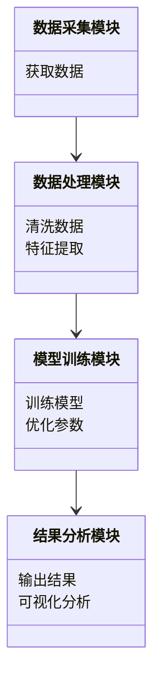
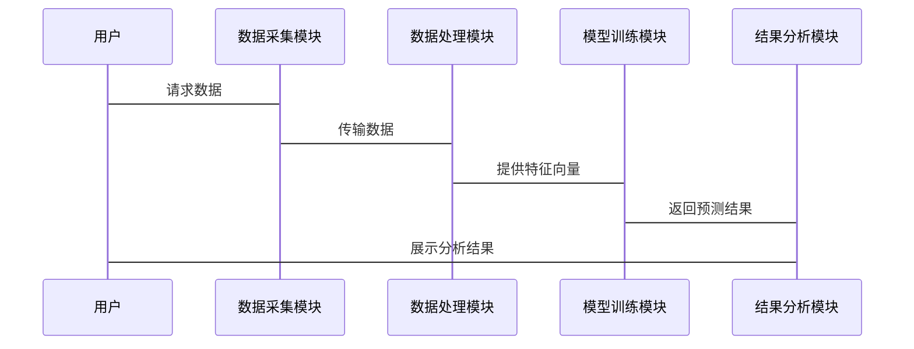

                 


# AI如何实现费雪的质化分析方法

---

## 关键词：AI，费雪质化分析，机器学习，投资分析，自然语言处理

---

## 摘要：本文探讨了如何利用人工智能技术实现费雪的质化分析方法，通过结合大数据处理、机器学习算法和自然语言处理，提出了一种高效的AI辅助投资分析模型，详细阐述了其核心概念、算法原理、系统架构及实际应用。

---

# 第一部分: 背景与概述

# 第1章: 费雪的质化分析方法与AI的结合

## 1.1 费雪的质化分析方法概述

### 1.1.1 费雪质化分析的定义

费雪的质化分析是一种基于公司基本面分析的投资方法，主要通过分析公司的财务报表、管理层素质、行业地位等因素，评估其内在价值和成长潜力。这种方法强调对公司的深入研究和长期价值判断，而非短期市场波动。

### 1.1.2 费雪质化分析的应用领域

费雪的质化分析广泛应用于股票投资、企业估值等领域，尤其适用于寻找具有持续竞争优势和良好管理的企业。

### 1.1.3 费雪质化分析的局限性

费雪质化分析依赖于对公司的深入研究，耗时且需要丰富的专业知识，且难以量化和系统化，容易受到主观判断的影响。

## 1.2 AI在投资分析中的应用现状

### 1.2.1 AI在金融领域的应用领域

AI在金融领域的应用包括股票预测、风险评估、市场情绪分析、交易策略优化等。AI通过处理大量数据，提供高效的分析工具和决策支持。

### 1.2.2 AI在质化分析中的优势

AI能够快速处理大量非结构化数据，如新闻、社交媒体、公司报告等，提取关键信息，帮助投资者做出更全面的判断。此外，AI还可以通过历史数据分析，发现人类难以察觉的模式和趋势。

### 1.2.3 当前AI在质化分析中的挑战

AI在质化分析中面临数据质量、模型解释性、实时性等挑战。如何将复杂的质化因素转化为可量化的指标，并保持模型的可解释性和稳定性，是当前研究的难点。

## 1.3 本章小结

费雪的质化分析方法是一种基于公司基本面的投资策略，而AI技术的引入为这一方法提供了新的可能性。通过结合AI的高效数据处理能力和质化分析的深度研究，可以实现更精准的投资决策。

---

# 第二部分: 核心概念与原理

# 第2章: AI实现费雪质化分析的核心概念

## 2.1 费雪质化分析的AI实现原理

### 2.1.1 数据特征提取

AI通过自然语言处理（NLP）和统计方法，从公司财报、新闻、行业报告中提取关键特征，如财务指标（ROE、毛利率）、管理层变动、行业趋势等。

### 2.1.2 模型选择与训练

选择适合的机器学习模型，如随机森林、支持向量机（SVM）或深度学习模型（如LSTM），对提取的特征进行训练，预测公司的价值和风险。

### 2.1.3 结果解释与验证

通过模型的输出结果，评估公司的投资价值，验证模型的准确性和稳定性，并根据实际表现调整模型参数。

## 2.2 费雪质化分析与AI的结合模型

### 2.2.1 数据特征的构建与选择

将公司基本面数据、市场数据、行业趋势等多维度数据进行整合，构建特征向量，选择对目标变量（如股票收益）影响较大的特征。

### 2.2.2 AI模型的输入与输出

模型的输入是经过预处理的特征向量，输出是对公司的投资价值评分或预测的股票价格变化。

### 2.2.3 模型的可解释性与验证

通过特征重要性分析、模型解释技术（如SHAP值）来解释AI模型的决策过程，并通过回测验证模型的有效性。

## 2.3 费雪质化分析的AI实现流程

### 2.3.1 数据收集与预处理

从多个数据源收集公司基本面数据、市场数据、新闻数据等，进行清洗、标准化和特征工程。

### 2.3.2 模型训练与优化

选择合适的算法，训练模型，并通过交叉验证、超参数调优优化模型性能。

### 2.3.3 结果分析与反馈

评估模型的预测结果，分析误差来源，调整数据特征或模型结构，持续优化。

---

# 第三部分: 算法原理与实现

# 第3章: 费雪质化分析的AI实现算法

## 3.1 特征提取算法

### 3.1.1 文本特征提取

使用NLP技术从公司财报、新闻中提取关键词、情感倾向等文本特征。

### 3.1.2 数值特征提取

从财务报表中提取关键指标，如ROE、净利润增长率等。

### 3.1.3 综合特征提取方法

结合文本和数值特征，构建多维度的特征向量。

## 3.2 分类与回归算法

### 3.2.1 随机森林算法

随机森林是一种基于决策树的集成算法，具有较强的特征重要性分析能力，适合处理多分类问题。

### 3.2.2 支持向量机算法

SVM适用于小样本、高维数据的分类问题，通过构造最大-margin分类器实现高精度的分类。

### 3.2.3 神经网络算法

使用深度学习模型，如LSTM，处理时间序列数据，捕捉复杂的变化趋势。

## 3.3 算法实现流程

### 3.3.1 数据预处理

- 数据清洗：处理缺失值、异常值。
- 特征工程：选择和构建特征。
- 数据标准化：归一化处理。

### 3.3.2 模型训练与优化

- 选择模型：根据数据类型和任务选择合适的算法。
- 超参数调优：使用网格搜索或随机搜索优化模型参数。
- 交叉验证：评估模型的泛化能力。

### 3.3.3 模型评估与反馈

- 性能评估：使用准确率、召回率、F1分数等指标评估模型。
- 结果分析：分析模型预测与实际结果的差异，优化特征或模型结构。

---

# 第四部分: 系统分析与架构设计

# 第4章: 费雪质化分析AI系统的架构设计

## 4.1 系统功能模块设计

### 4.1.1 数据采集模块

- 数据源：公司财报、新闻、行业报告。
- 数据获取方式：API接口、爬虫技术。

### 4.1.2 数据处理模块

- 数据清洗：处理缺失值、异常值。
- 特征工程：提取文本和数值特征。

### 4.1.3 模型训练模块

- 数据分割：训练集、验证集、测试集。
- 模型训练：选择算法，训练模型。

### 4.1.4 结果分析模块

- 结果输出：预测结果、模型评估指标。
- 可视化：图表展示预测结果和模型表现。

## 4.2 系统架构设计

### 4.2.1 系统架构图


### 4.2.2 实体关系图



## 4.3 系统接口设计

- API接口：提供数据接口和模型接口，方便其他系统调用。
- 数据格式：JSON格式，便于数据传输和处理。

## 4.4 系统交互流程



---

# 第五部分: 项目实战

# 第5章: 费雪质化分析AI系统的实现

## 5.1 环境安装与配置

- Python版本：Python 3.8+
- 安装依赖：pandas、numpy、scikit-learn、tensorflow、beautifulsoup4、requests。

## 5.2 系统核心实现

### 5.2.1 数据采集模块

```python
import requests
from bs4 import BeautifulSoup

def get_company_news(company_name):
    url = f"https://example.com/company_news/{company_name}"
    response = requests.get(url)
    soup = BeautifulSoup(response.text, 'html.parser')
    news_list = soup.find_all('div', class_='news-item')
    news = [n.text for n in news_list]
    return news
```

### 5.2.2 数据处理模块

```python
import pandas as pd
import numpy as np

def preprocess_data(data):
    # 删除缺失值
    data = data.dropna()
    # 标准化处理
    from sklearn.preprocessing import StandardScaler
    scaler = StandardScaler()
    scaled_features = scaler.fit_transform(data)
    return scaled_features
```

### 5.2.3 模型训练模块

```python
from sklearn.ensemble import RandomForestClassifier
from sklearn.metrics import accuracy_score

def train_model(X_train, y_train):
    model = RandomForestClassifier(n_estimators=100, random_state=42)
    model.fit(X_train, y_train)
    return model
```

### 5.2.4 结果分析模块

```python
def analyze_results(y_true, y_pred):
    print(f"Accuracy: {accuracy_score(y_true, y_pred)}")
    from sklearn.metrics import confusion_matrix
    cm = confusion_matrix(y_true, y_pred)
    print(cm)
```

## 5.3 代码实现与解读

### 5.3.1 数据采集模块

从指定的新闻网站获取公司的新闻数据，提取关键词和情感倾向。

### 5.3.2 数据处理模块

对数据进行清洗和标准化处理，构建特征向量。

### 5.3.3 模型训练模块

使用随机森林模型进行训练，调整超参数以优化模型性能。

### 5.3.4 结果分析模块

评估模型的准确率，分析混淆矩阵，找出误分类的案例。

## 5.4 实际案例分析

以某公司为例，展示数据采集、处理、建模和分析的全过程，并解释模型预测结果。

## 5.5 项目小结

总结项目实现的关键点，如数据处理的难点、模型选择的经验和结果分析的启示。

---

# 第六部分: 最佳实践与小结

# 第6章: 最佳实践与总结

## 6.1 最佳实践

### 6.1.1 数据处理

- 确保数据的多样性和代表性。
- 处理文本数据时，使用TF-IDF或Word2Vec进行特征提取。

### 6.1.2 模型选择

- 根据数据类型和任务选择合适的算法。
- 使用集成学习方法提升模型的稳定性和准确性。

### 6.1.3 模型优化

- 通过交叉验证选择最优参数。
- 使用早停法防止过拟合。

## 6.2 小结

AI技术为费雪的质化分析提供了新的可能性，通过数据驱动的方法，可以更高效、准确地评估公司的投资价值。然而，模型的可解释性和数据质量仍然是需要重点关注的问题。

## 6.3 注意事项

- 数据隐私和合规性问题。
- 模型的实时性和可扩展性。
- 结果的解释性和透明性。

## 6.4 拓展阅读

推荐相关的书籍和论文，如《Python机器学习实战》、《自然语言处理入门》等，帮助读者深入学习AI与投资分析的结合。

---

# 结语

AI技术的引入为费雪的质化分析方法注入了新的活力，通过结合大数据和机器学习算法，可以更高效地分析公司基本面，评估投资价值。然而，AI的应用也面临诸多挑战，需要持续研究和优化，以实现更精准、可靠的分析结果。

