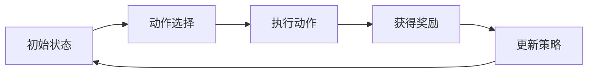
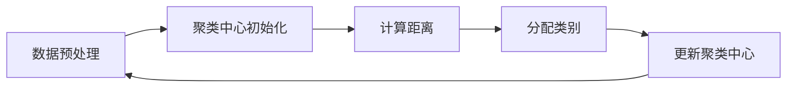
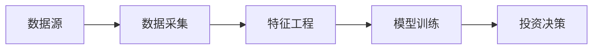

                 


# AI如何实现费雪的长期持股策略

**关键词**：AI, 费雪策略, 长期持股, 投资策略, 机器学习, 股票预测

**摘要**：  
本文深入探讨了如何利用人工智能技术优化和实现费雪的长期持股投资策略。通过结合费雪的投资理念和AI的分析能力，提出了一套基于机器学习的选股模型，旨在提高投资决策的科学性和长期稳定性。文章详细分析了AI在投资策略中的核心概念、算法原理、系统架构，并通过具体案例展示了AI如何优化费雪策略的实现过程。

---

# 第1章 费雪投资策略与AI的结合

## 1.1 费雪投资策略的背景  
### 1.1.1 费雪的投资理念  
- **核心思想**：选择具有持续增长潜力的公司，长期持有，获得复利收益。  
- **关键因素**：公司基本面分析、管理层质量、行业地位等。  

### 1.1.2 费雪策略的优势  
- **长期稳定**：通过长期持有优质资产，降低短期波动风险。  
- **选股逻辑**：注重公司成长性和估值合理性。  

## 1.2 AI在投资策略中的角色  
### 1.2.1 AI的核心优势  
- **数据处理能力**：AI能够快速分析海量数据，发现隐藏的模式。  
- **预测能力**：通过机器学习模型预测股票价格走势和市场趋势。  

### 1.2.2 AI如何优化费雪策略  
- **数据驱动的选股逻辑**：利用AI筛选符合费雪标准的公司。  
- **动态调整**：通过AI实时监控市场变化，优化持股组合。  

## 1.3 费雪策略与AI结合的意义  
- **提升选股效率**：AI帮助快速筛选符合费雪标准的股票。  
- **增强决策科学性**：通过数据驱动的方法优化投资决策。  

---

# 第2章 AI在投资策略中的核心概念

## 2.1 数据驱动的投资决策  
### 2.1.1 数据来源  
- **财务数据**：收入、利润、资产负债表等。  
- **市场数据**：股价、成交量、行业指数等。  
- **新闻数据**：公司公告、行业趋势等。  

### 2.1.2 数据预处理  
- **清洗**：去除缺失值、异常值。  
- **特征提取**：提取关键财务指标和市场指标。  

## 2.2 机器学习算法的核心原理  
### 2.2.1 监督学习  
- **回归模型**：预测股票价格。  
- **分类模型**：判断股票涨跌。  

### 2.2.2 强化学习  
- **策略网络**：通过试错优化投资组合。  
- **状态定义**：当前投资组合的收益和风险。  

## 2.3 费雪策略的AI实现框架  
### 2.3.1 输入：公司基本面数据  
### 2.3.2 处理：特征工程与模型训练  
### 2.3.3 输出：投资建议  

---

# 第3章 AI实现费雪策略的算法原理

## 3.1 强化学习算法在投资中的应用  
### 3.1.1 算法流程图  



### 3.1.2 动作选择与策略网络  
- **动作选择**：基于当前状态选择买入、卖出或持有。  
- **策略网络**：神经网络模型，输出概率分布。  

## 3.2 时间序列分析算法  
### 3.2.1 LSTM网络的结构  


### 3.2.2 时间序列预测模型  
- **输入**：历史股价数据。  
- **输出**：未来股价预测。  

## 3.3 聚类分析在选股中的应用  
### 3.3.1 K-means算法的步骤  



### 3.3.2 股票分类模型  
- **输入**：公司基本面特征。  
- **输出**：股票类别（如成长股、价值股）。  

---

# 第4章 系统架构与投资决策框架

## 4.1 系统功能模块划分  
- **数据采集模块**：获取股票数据。  
- **特征工程模块**：提取关键特征。  
- **模型训练模块**：训练机器学习模型。  
- **投资决策模块**：生成投资建议。  

## 4.2 系统架构设计  



### 4.2.1 数据流与信息流设计  
- 数据流：从数据源到模型训练。  
- 信息流：从模型输出到投资决策。  

---

# 第5章 项目实战：AI驱动的费雪策略实现

## 5.1 环境安装  
- **Python环境**：安装Anaconda。  
- **库的安装**：Pandas、Scikit-learn、Keras、TensorFlow。  

## 5.2 核心代码实现  
### 5.2.1 数据预处理  

```python
import pandas as pd

# 读取数据
data = pd.read_csv('stock_data.csv')

# 删除缺失值
data.dropna(inplace=True)

# 提取特征
features = data[[' revenue', 'net_income', 'pe_ratio']]
```

### 5.2.2 模型训练  

```python
from sklearn.cluster import KMeans

# 初始化模型
model = KMeans(n_clusters=3)

# 训练模型
model.fit(features)

# 获取聚类结果
clusters = model.predict(features)
```

## 5.3 案例分析  
- **输入数据**：某公司的财务数据。  
- **模型输出**：股票分类结果。  

## 5.4 代码解读与分析  
- **数据预处理**：清洗数据，提取特征。  
- **模型训练**：使用K-means算法进行聚类。  
- **结果分析**：解释聚类结果的含义。  

---

# 第6章 总结与展望

## 6.1 本章总结  
- AI能够显著提升费雪策略的实现效果。  
- 数据驱动的方法使投资决策更加科学和高效。  

## 6.2 未来展望  
- 结合更多的数据源，优化选股逻辑。  
- 研究更先进的机器学习算法，提升预测精度。  

---

# 附录

## 附录A 工具与库  
- **数据处理**：Pandas、NumPy。  
- **机器学习**：Scikit-learn、TensorFlow。  
- **可视化**：Matplotlib、Seaborn。  

## 附录B 核心代码示例  
```python
import numpy as np
import pandas as pd
from sklearn.model_selection import train_test_split
from sklearn.metrics import accuracy_score
from tensorflow.keras import layers, models

# 加载数据
data = pd.read_csv('stock_data.csv')

# 分割数据
X_train, X_test, y_train, y_test = train_test_split(data[['revenue', 'net_income']], data['target'])

# 构建模型
model = models.Sequential()
model.add(layers.Dense(64, activation='relu', input_dim=2))
model.add(layers.Dense(1, activation='sigmoid'))

# 编译模型
model.compile(optimizer='adam', loss='binary_crossentropy', metrics=['accuracy'])

# 训练模型
model.fit(X_train, y_train, epochs=100, batch_size=32)

# 评估模型
y_pred = model.predict(X_test)
print(accuracy_score(y_test, y_pred.round()))
```

---

通过以上目录结构，文章系统地介绍了AI如何实现费雪的长期持股策略，从理论到实践，层层深入，为读者提供了全面的技术指导和实践参考。

