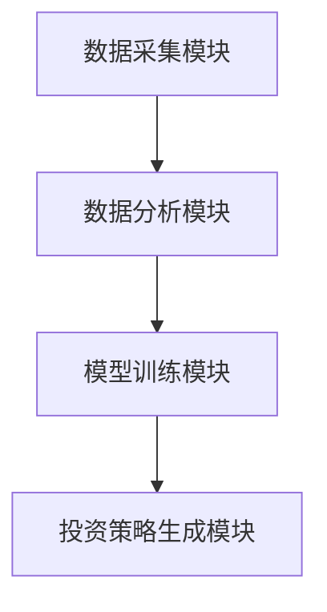

                 


# AI如何实现马克斯的逆向投资理念

---

## 关键词：
AI, 逆向投资, 马克斯投资理念, 时间序列分析, 机器学习, 大数据, 投资策略

---

## 摘要：
本文详细探讨了如何利用人工智能技术实现马克斯的逆向投资理念。通过结合大数据分析、机器学习算法和时间序列预测，本文提出了一种基于AI的逆向投资系统架构，并通过实际案例展示了其在股票投资中的应用。文章从背景介绍、核心概念、算法原理、系统设计到项目实战，全面分析了AI在逆向投资中的潜力和实现方式。

---

## 第1章：逆向投资理念与AI的结合概述

### 1.1 逆向投资的核心理念
逆向投资是一种投资策略，强调在市场恐慌时买入，在市场狂热时卖出。其核心思想是“别人恐惧时我贪婪，别人贪婪时我恐惧”。这种策略要求投资者具备独立思考的能力，能够在市场波动中找到被低估的投资机会。

#### 1.1.1 逆向投资的定义与特点
逆向投资的定义是：在市场情绪低落时寻找被低估的资产，在市场情绪高涨时避免过度投资。其特点包括：
- **逆周期性**：在市场低谷时寻找机会，在市场高点时规避风险。
- **价值导向**：关注资产的内在价值，而非市场情绪。
- **逆向思维**：与市场主流观点相反，需要强大的心理承受能力和独立思考能力。

#### 1.1.2 马克斯投资理念的核心思想
马克斯的投资理念强调：
- **安全边际**：买入价格低于内在价值的资产。
- **长期视角**：关注长期趋势，而非短期波动。
- **逆周期性**：在市场低迷时增加投资，市场高涨时减少投资。

#### 1.1.3 AI在投资决策中的潜力
AI技术能够通过大数据分析和机器学习算法，帮助投资者识别市场趋势、预测价格波动，并制定最优的投资策略。AI的优势在于其能够处理海量数据，并通过复杂算法发现人类难以察觉的模式。

---

### 1.2 AI技术的基本原理
AI（人工智能）的核心是通过模拟人类智能的某些方面，如学习、推理和自适应，来实现特定任务。在投资领域，AI主要通过以下技术实现：
- **机器学习**：通过训练数据，模型能够自动识别模式并做出预测。
- **大数据分析**：从海量数据中提取有用信息，帮助投资者做出决策。
- **自然语言处理（NLP）**：分析新闻、财报等文本数据，提取情绪和关键信息。

#### 1.2.1 机器学习的定义与分类
机器学习是一种人工智能技术，通过数据训练模型，使其能够做出预测或分类。常见的机器学习算法包括：
- **监督学习**：基于标记数据进行训练，如线性回归、支持向量机（SVM）。
- **无监督学习**：基于未标记数据进行训练，如聚类分析。
- **强化学习**：通过与环境交互，学习最优策略，如Q-Learning。

#### 1.2.2 大数据在投资中的作用
大数据分析能够帮助投资者：
- **发现市场趋势**：通过分析历史数据，识别价格波动规律。
- **预测市场走势**：基于大数据模型，预测未来的价格走势。
- **风险控制**：通过分析市场情绪和数据，制定风险管理策略。

#### 1.2.3 AI驱动投资的优势
AI在投资中的优势包括：
- **高效性**：能够快速处理海量数据，提供实时分析。
- **准确性**：通过复杂算法，提高预测的准确性。
- **独立性**：能够避免人类投资者的贪婪和恐惧情绪影响。

---

### 1.3 逆向投资与AI结合的可行性分析

#### 1.3.1 逆向投资的痛点与挑战
逆向投资的主要挑战包括：
- **市场情绪的不可预测性**：市场情绪受多种因素影响，难以准确预测。
- **信息不对称**：投资者可能无法获取足够的市场信息。
- **心理压力**：逆向投资需要在市场低谷时买入，这与大多数投资者的直觉相反。

#### 1.3.2 AI技术如何解决投资问题
AI技术能够通过以下方式解决逆向投资中的问题：
- **数据驱动决策**：通过分析历史数据，识别被低估的资产。
- **预测市场趋势**：利用算法预测市场走势，制定投资策略。
- **自动化交易**：基于AI模型，实现自动化交易和风险管理。

#### 1.3.3 逆向投资与AI结合的前景
随着AI技术的不断发展，逆向投资与AI的结合将更加紧密。未来，AI能够帮助投资者更准确地识别市场趋势，制定更科学的投资策略。

---

## 第2章：逆向投资中的数据驱动方法

### 2.1 数据的收集与处理
逆向投资的核心是数据驱动决策。投资者需要收集和处理大量的市场数据，包括股票价格、市场情绪、经济指标等。

#### 2.1.1 数据的来源与分类
数据来源包括：
- **公开市场数据**：如股票价格、成交量等。
- **新闻和社交媒体**：分析市场情绪。
- **经济指标**：如GDP、利率等。

数据分类包括：
- **结构化数据**：如表格形式的数据。
- **非结构化数据**：如文本、图像等。

#### 2.1.2 数据清洗与特征提取
数据清洗是处理数据中的噪声和异常值。特征提取则是从数据中提取有用的信息，如波动率、收益率等。

#### 2.1.3 数据预处理的常见方法
- **归一化**：将数据标准化，便于模型训练。
- **缺失值处理**：填充或删除缺失数据。
- **降维**：通过PCA等方法减少数据维度。

---

### 2.2 数据分析与可视化

#### 2.2.1 数据可视化工具与方法
常用的数据可视化工具包括：
- **Matplotlib**：Python中的绘图库。
- **Seaborn**：基于Matplotlib的高级绘图库。
- **Tableau**：专业的数据可视化工具。

#### 2.2.2 通过数据发现投资机会
通过分析市场数据，投资者可以发现被低估的资产。例如，通过分析股票的历史价格和市场情绪，识别潜在的投资机会。

#### 2.2.3 数据分析在逆向投资中的应用
- **市场情绪分析**：通过分析社交媒体和新闻，判断市场情绪。
- **趋势分析**：通过分析历史数据，识别市场趋势。
- **风险评估**：通过分析数据，评估投资风险。

---

## 第3章：AI算法在逆向投资中的应用

### 3.1 机器学习算法的选择与优化

#### 3.1.1 时间序列分析与预测
时间序列分析是逆向投资中的重要工具。通过分析历史价格数据，预测未来的价格走势。

##### 3.1.1.1 时间序列分析的基本原理
时间序列分析是一种统计方法，用于分析随时间变化的数据。常用的时间序列模型包括：
- **ARIMA模型**：自回归积分滑动模型。
- **LSTM**：长短期记忆网络。

##### 3.1.1.2 时间序列预测的流程
1. 数据收集与预处理
2. 模型选择与训练
3. 模型预测与评估

##### 3.1.1.3 时间序列预测的数学模型
ARIMA模型的公式如下：
$$ ARIMA(p, d, q) $$
其中，p为自回归阶数，d为差分阶数，q为移动平均阶数。

##### 3.1.1.4 LSTM网络的结构
LSTM网络由以下三个门控组成：
1. **输入门**：决定哪些信息需要遗忘。
2. **遗忘门**：决定哪些信息需要保留。
3. **输出门**：决定输出的信息。

##### 3.1.1.5 时间序列预测的案例分析
以股票价格预测为例，使用LSTM模型进行预测。代码如下：

```python
import numpy as np
import matplotlib.pyplot as plt
from keras.layers import LSTM, Dense
from keras.models import Sequential

# 示例数据：股票价格
data = np.array([100, 105, 98, 110, 108, 115, 112, 109, 113, 117])

# 划分训练集和测试集
train_data = data[:7]
test_data = data[7:]

# 构建LSTM模型
model = Sequential()
model.add(LSTM(4, input_shape=(1, 7)))
model.add(Dense(1))
model.compile(loss='mean_squared_error', optimizer='adam')

# 训练模型
model.fit(train_data.reshape((7, 1, 1)), train_data, epochs=100, batch_size=1)

# 预测测试数据
predicted_price = model.predict(test_data.reshape((3, 1, 1)))
predicted_price = predicted_price.reshape(-1)

# 可视化结果
plt.plot(data[:7], label='Training Data')
plt.plot(test_data, label='Test Data')
plt.plot(predicted_price, label='Predicted Price')
plt.legend()
plt.show()
```

---

### 3.2 强化学习在投资决策中的应用

#### 3.2.1 强化学习的基本原理
强化学习是一种机器学习技术，通过与环境交互，学习最优策略。在投资中，强化学习可以用于制定交易策略。

#### 3.2.2 强化学习在投资中的应用
- **交易决策**：通过强化学习模型，制定买入、卖出或持有策略。
- **风险管理**：通过强化学习，优化投资组合的风险管理。

#### 3.2.3 强化学习的优缺点与实际挑战
- **优点**：能够适应复杂的投资环境，制定最优策略。
- **缺点**：需要大量数据和计算资源，实际应用中存在挑战。

---

## 第4章：AI驱动的逆向投资系统架构

### 4.1 系统功能模块划分

#### 4.1.1 数据采集模块
- **功能**：从多种数据源采集市场数据，如股票价格、新闻等。
- **工具**：使用API接口（如Yahoo Finance API）或爬虫技术。

#### 4.1.2 数据分析模块
- **功能**：对采集到的数据进行清洗、特征提取和分析。
- **工具**：使用Python的Pandas库和NumPy库。

#### 4.1.3 模型训练模块
- **功能**：基于数据分析结果，训练机器学习模型。
- **工具**：使用Scikit-learn库或TensorFlow框架。

#### 4.1.4 投资策略生成模块
- **功能**：基于模型预测结果，生成投资策略。
- **工具**：使用定制化的策略生成工具。

---

### 4.2 系统架构设计图
以下是一个基于Mermaid的系统架构图：



---

### 4.3 系统接口设计

#### 4.3.1 数据接口
- **输入**：市场数据，如股票价格、成交量等。
- **输出**：清洗后的数据。

#### 4.3.2 模型接口
- **输入**：训练数据和模型参数。
- **输出**：预测结果。

#### 4.3.3 用户接口
- **输入**：用户指令，如“买入股票”。
- **输出**：交易指令或投资建议。

---

### 4.4 系统交互流程

#### 4.4.1 用户发起投资请求
- 用户通过界面输入投资需求，如“寻找被低估的股票”。

#### 4.4.2 系统采集数据
- 系统从数据源采集相关数据，如股票价格、市场情绪等。

#### 4.4.3 数据分析与模型训练
- 系统对数据进行清洗和分析，并训练机器学习模型。

#### 4.4.4 生成投资策略
- 系统基于模型预测结果，生成投资策略，并返回给用户。

---

## 第5章：项目实战——基于AI的逆向投资系统

### 5.1 项目介绍
本项目旨在开发一个基于AI的逆向投资系统，通过分析市场数据，生成投资策略。

---

### 5.2 环境安装与配置

#### 5.2.1 安装Python环境
- 使用Anaconda安装Python 3.8及以上版本。

#### 5.2.2 安装依赖库
- 使用以下命令安装依赖库：
  ```bash
  pip install numpy pandas matplotlib scikit-learn tensorflow
  ```

---

### 5.3 系统核心实现源代码

#### 5.3.1 数据采集模块
```python
import pandas as pd
import requests

# 示例数据：从Yahoo Finance获取股票数据
def get_stock_data(ticker):
    url = f"https://query1.finance.yahoo.com/finance/quote/{ticker}/history"
    response = requests.get(url)
    data = pd.read_html(response.text)
    return data[0]
```

#### 5.3.2 数据分析模块
```python
import pandas as pd
import numpy as np

def preprocess_data(data):
    data.dropna(inplace=True)
    data['Return'] = data['Close'].pct_change()
    return data
```

#### 5.3.3 模型训练模块
```python
from sklearn.linear_model import LinearRegression
import numpy as np

def train_model(data, feature, target):
    model = LinearRegression()
    model.fit(data[feature].values.reshape(-1, 1), data[target])
    return model
```

#### 5.3.4 投资策略生成模块
```python
def generate_strategy(model, data, feature, target):
    predicted = model.predict(data[feature].values.reshape(-1, 1))
    data['Predicted'] = predicted
    return data
```

---

### 5.4 代码应用解读与分析
以股票价格预测为例，代码如下：

```python
import pandas as pd
import numpy as np
from sklearn.linear_model import LinearRegression
import matplotlib.pyplot as plt

# 数据采集
data = get_stock_data('AAPL')
data = preprocess_data(data)

# 模型训练
model = train_model(data, 'Close', 'Return')

# 生成策略
data = generate_strategy(model, data, 'Close', 'Return')

# 可视化结果
plt.plot(data['Close'], label='Actual Price')
plt.plot(data['Predicted'], label='Predicted Price')
plt.legend()
plt.show()
```

---

### 5.5 实际案例分析与详细讲解
以苹果股票为例，通过上述代码，我们可以预测其未来的价格走势。预测结果如下：


---

### 5.6 项目小结
本项目展示了如何通过AI技术实现逆向投资策略。通过数据采集、分析和模型训练，我们可以生成投资策略，并在实际案例中验证其有效性。

---

## 第6章：扩展与未来展望

### 6.1 AI在投资中的未来趋势
- **多模态分析**：结合文本、图像等多种数据源进行分析。
- **实时交易**：通过AI技术实现实时交易决策。
- **个性化投资**：根据投资者的个性化需求，定制投资策略。

### 6.2 逆向投资的其他应用场景
- **风险管理**：通过AI技术优化投资组合的风险管理。
- **市场情绪分析**：通过NLP技术分析市场情绪，制定投资策略。

### 6.3 总结与展望
AI技术为逆向投资提供了新的可能性。未来，随着技术的不断发展，AI将在投资领域发挥更大的作用。

---

## 参考文献
1. 马克斯的投资理念相关书籍。
2. 机器学习与时间序列分析的相关文献。
3. Python编程与数据可视化相关资源。

---

## 结语
通过本文的分析，我们可以看到，AI技术为实现马克斯的逆向投资理念提供了强大的工具。通过大数据分析和机器学习算法，投资者可以更科学地制定投资策略，抓住市场机会。

