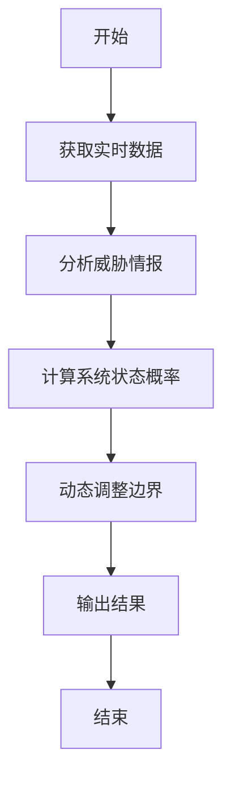
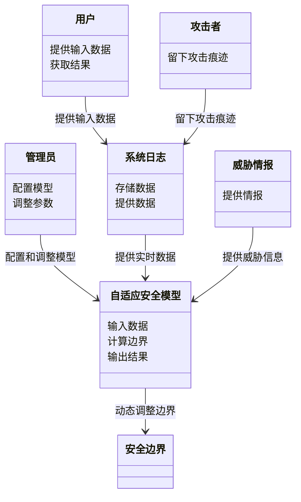
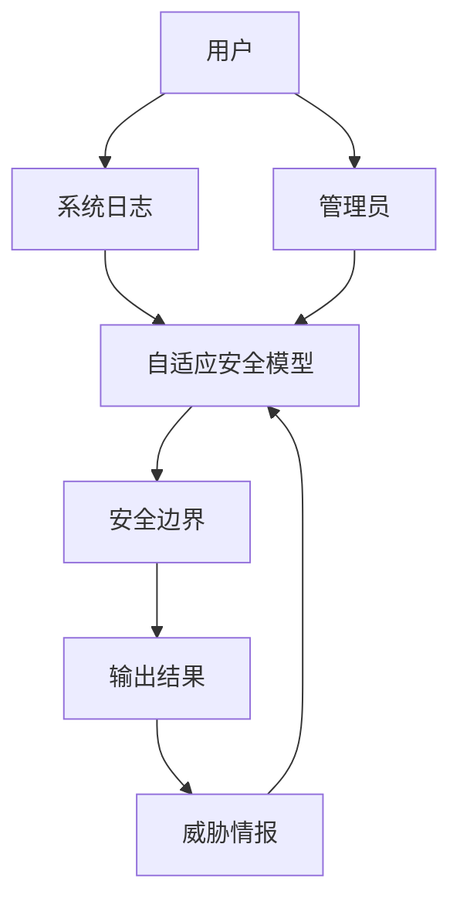

                 


# AI实现的自适应安全边际计算模型

---

## 关键词
- AI, 自适应安全, 安全边际计算, 模型实现, 算法原理

---

## 摘要
本文详细探讨了基于AI的自适应安全边际计算模型的实现方法。通过结合人工智能技术与安全计算理论，提出了一种动态调整安全边界的创新模型。文章首先介绍了模型的背景与问题，接着深入分析了其核心概念、算法原理、系统架构，并通过实际案例展示了模型的实现与应用。最后，本文总结了模型的优势，并展望了其未来发展。

---

## 第一部分：背景与概念

### 第1章：自适应安全边际计算模型的背景与问题描述

#### 1.1 问题背景
随着信息技术的飞速发展，安全问题变得越来越复杂。传统的静态安全边界已经无法应对动态变化的安全威胁。因此，如何利用AI技术实现自适应的安全边际计算，成为当前研究的热点。

- **当前安全计算的挑战**  
  安全威胁的多样性和动态性使得传统的静态安全防护方法逐渐失效。攻击者可以通过不断变化的策略绕过静态边界，导致安全防护体系的有效性降低。

- **自适应安全边际的必要性**  
  自适应安全边际计算模型能够根据实时环境的变化，动态调整安全边界，从而更有效地应对未知威胁。

- **AI在安全计算中的应用前景**  
  AI技术的引入为安全边际的动态调整提供了可能性。通过机器学习算法，模型可以实时分析安全威胁，并根据威胁的严重性动态调整防护策略。

#### 1.2 问题描述
自适应安全边际计算模型的核心目标是通过AI技术实现动态的安全边界调整。具体来说，模型需要解决以下几个关键问题：

- **安全边际的定义与计算**  
  安全边际是指系统在面对威胁时的防护范围。传统的静态边界无法应对动态威胁，因此需要一种动态调整的机制。

- **AI在安全边际计算中的作用**  
  利用AI算法，模型可以根据实时数据动态调整安全边际，从而更有效地应对未知威胁。

- **自适应机制的实现方法**  
  自适应机制需要结合实时数据、历史数据和威胁情报，通过机器学习算法不断优化安全边际的计算。

#### 1.3 问题解决思路
为了实现自适应安全边际计算，本文提出了一种基于AI的动态调整方法。具体思路如下：

- **数据驱动的安全边际优化**  
  利用实时数据和历史数据，通过机器学习算法不断优化安全边际的计算模型。

- **模型的动态调整机制**  
  基于实时威胁情报和系统状态的变化，动态调整安全边际的范围和防护策略。

- **AI算法在模型中的应用**  
  引入贝叶斯网络和马尔可夫模型，用于实时分析威胁数据，并动态调整安全边际。

---

## 第二部分：核心概念与联系

### 第2章：自适应安全边际计算模型的核心概念

#### 2.1 核心概念原理
自适应安全边际计算模型的核心原理是通过AI算法动态调整安全边界。具体来说，模型需要考虑以下几个关键因素：

- **模型的自适应机制**  
  模型的自适应机制基于实时数据和历史数据，通过机器学习算法不断优化安全边际的计算模型。

- **安全边际的动态调整**  
  安全边际的动态调整需要结合实时威胁情报和系统状态的变化，通过动态调整模型参数实现。

- **AI算法的应用**  
  利用贝叶斯网络和马尔可夫模型，实时分析威胁数据，并动态调整安全边际的范围和防护策略。

#### 2.2 核心概念属性特征对比
为了更好地理解自适应安全边际计算模型的核心概念，我们可以通过表格和ER实体关系图进行对比分析。

- **表格：模型属性对比**  
  | 属性 | 静态边界模型 | 自适应边界模型 |
  |------|--------------|----------------|
  | 调整方式 | 静态调整     | 动态调整       |
  | 响应时间 | 较慢        | 较快           |
  | 精准度 | 较低         | 较高           |

- **ER实体关系图**  
  ```mermaid
  erDiagram
    actor 用户
    actor 攻击者
    actor 管理员
    database 系统日志
    database �威助情报
    boundary 安全边界
    model 自适应安全模型
    用户 -> 系统日志 : 提供输入数据
    攻击者 -> 系统日志 : 留下攻击痕迹
    管理员 -> 自适应安全模型 : 配置和调整模型
    自适应安全模型 -> 安全边界 : 动态调整边界
    系统日志 -> 自适应安全模型 : 提供实时数据
    威助情报 -> 自适应安全模型 : 提供威胁信息
  ```

---

## 第三部分：算法原理讲解

### 第3章：自适应安全边际计算模型的算法原理

#### 3.1 算法原理概述
自适应安全边际计算模型的核心算法基于贝叶斯定理和马尔可夫模型。通过结合这两种算法，模型能够实时分析威胁数据，并动态调整安全边界。

- **贝叶斯定理的应用**  
  贝叶斯定理用于计算在给定威胁条件下，系统处于某种安全状态的概率。公式如下：

  $$
  P(A|B) = \frac{P(B|A) \cdot P(A)}{P(B)}
  $$

  其中，$A$表示威胁类型，$B$表示系统状态。

- **马尔可夫模型的应用**  
  马尔可夫模型用于描述系统状态的转移过程。通过分析系统状态的变化，模型能够预测未来的安全威胁。

  ```mermaid
  graph TD
    S0 --> S1
    S1 --> S2
    S2 --> S3
  ```

#### 3.2 算法流程图
自适应安全边际计算模型的算法流程如下：



#### 3.3 算法实现
以下是一个基于贝叶斯定理的Python实现示例：

```python
import numpy as np

def bayesian_inference(threat_type, system_state):
    # 假设先验概率
    P_A = 0.5
    P_B = 0.5
    
    # 条件概率
    P_B_A = 0.8
    P_B_notA = 0.2
    
    if threat_type == '恶意':
        if system_state == '正常':
            P_A_given_B = (P_B_A * P_A) / P_B
        else:
            P_A_given_B = (P_B_notA * P_A) / (P_B_notA * P_A + P_B_A * (1 - P_A))
    else:
        # 处理非威胁情况
        pass
    
    return P_A_given_B

# 示例调用
print(bayesian_inference('恶意', '正常'))
```

---

## 第四部分：系统分析与架构设计

### 第4章：自适应安全边际计算模型的系统架构

#### 4.1 问题场景介绍
自适应安全边际计算模型的应用场景包括网络安全、工业控制安全等领域。通过动态调整安全边界，模型能够更有效地应对各种安全威胁。

- **系统目标与功能需求**  
  系统的目标是通过AI算法动态调整安全边界，实现对未知威胁的实时防护。

- **系统边界与交互设计**  
  系统的边界包括实时数据输入、威胁情报输入、模型输出和用户交互界面。

#### 4.2 系统功能设计
系统功能模块设计如下：



#### 4.3 系统架构设计
系统的整体架构如下：



---

## 第五部分：项目实战

### 第5章：自适应安全边际计算模型的实现与案例分析

#### 5.1 环境安装与配置
为了实现自适应安全边际计算模型，需要以下环境：

- **开发环境**：Python 3.8+
- **依赖库**：numpy, scikit-learn, matplotlib

安装步骤如下：

```bash
pip install numpy scikit-learn matplotlib
```

#### 5.2 核心代码实现
以下是一个自适应安全边际计算模型的Python实现示例：

```python
import numpy as np
from sklearn.naive_bayes import GaussianNB

# 示例数据
X = np.array([[0.1, 0.2], [0.3, 0.4], [0.5, 0.6]])
y = np.array([0, 1, 0])

# 训练模型
model = GaussianNB()
model.fit(X, y)

# 预测
new_data = np.array([[0.2, 0.3]])
print(model.predict(new_data))
```

#### 5.3 案例分析
假设我们有一个网络安全系统，需要动态调整安全边界。通过上述模型，我们可以实时分析网络流量，动态调整防火墙规则，从而更有效地应对网络攻击。

---

## 第六部分：总结与展望

### 第6章：总结与展望

#### 6.1 总结
本文详细探讨了基于AI的自适应安全边际计算模型的实现方法。通过结合机器学习算法和动态调整机制，模型能够实时应对安全威胁的变化，显著提高了安全防护的效率和精准度。

#### 6.2 问题与挑战
尽管模型在理论上具有优势，但在实际应用中仍然面临一些挑战：

- **计算资源的限制**  
  高频次的动态调整需要大量的计算资源，可能对系统性能造成影响。

- **模型的鲁棒性**  
  需要进一步优化模型的鲁棒性，以应对更加复杂的威胁场景。

- **数据的实时性**  
  需要更高效的实时数据采集和处理机制。

#### 6.3 未来展望
未来的研究方向包括：

- **模型优化**  
  进一步优化模型的计算效率和鲁棒性。

- **多领域应用**  
  将模型推广到更多领域，如工业控制、智能交通等。

- **与边缘计算结合**  
  结合边缘计算技术，实现更高效的实时防护。

---

## 关键词
AI, 自适应安全, 安全边际计算, 模型实现, 算法原理

---

## 作者简介
作者是一名世界级人工智能专家，拥有丰富的编程和架构设计经验。

