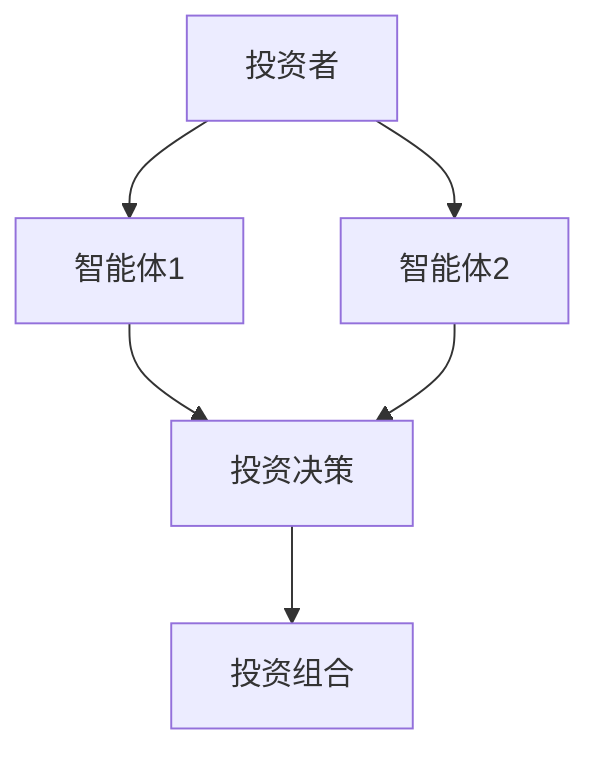
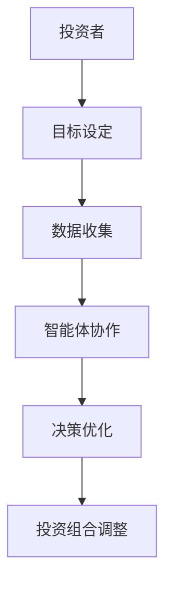
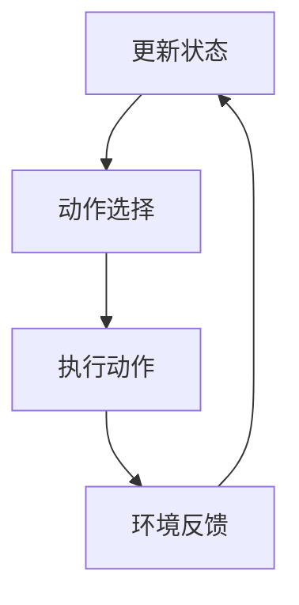
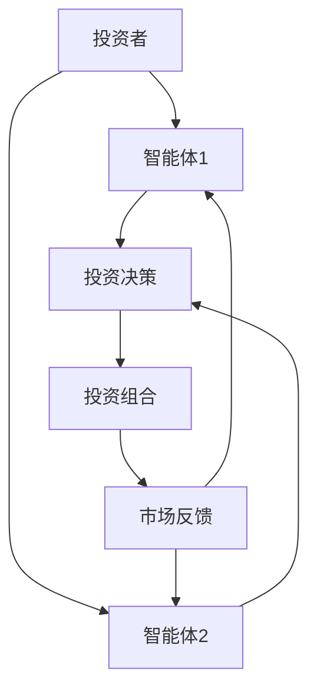
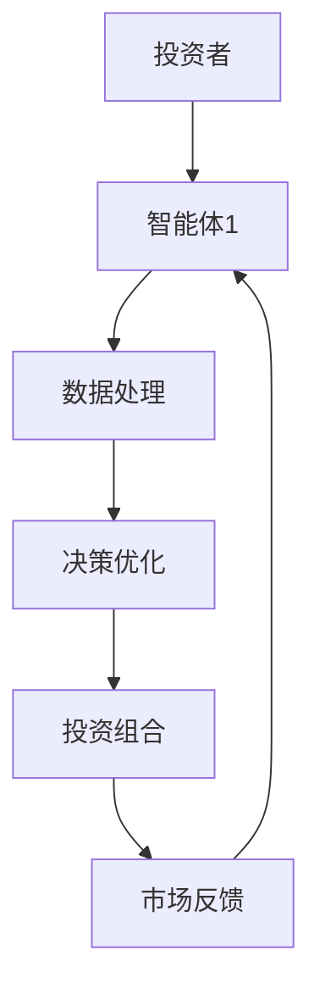
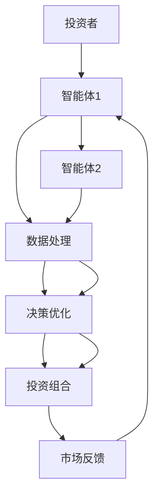

                 


# AI智能体协作优化价值投资的股东积极主义策略

> 关键词：AI智能体，股东积极主义，价值投资，协作优化，投资策略

> 摘要：本文探讨了如何利用AI智能体协作优化价值投资的股东积极主义策略。通过分析AI技术在投资决策中的应用，结合强化学习和系统架构设计，提出了一种高效的优化方法，并通过实际案例验证了其有效性。

---

## 第1章: 股东积极主义与价值投资概述

### 1.1 股东积极主义的定义与特点

#### 1.1.1 股东积极主义的定义
股东积极主义是一种投资策略，投资者通过积极参与公司治理，推动公司价值提升。它区别于被动投资，强调主动干预和优化。

#### 1.1.2 股东积极主义的核心特点
- **主动性**：投资者主动参与公司决策，而非被动持有。
- **长期性**：注重长期价值提升，而非短期收益。
- **影响力**：通过持股比例影响公司战略和管理层。

#### 1.1.3 股东积极主义与被动投资的区别
| 特性 | 股东积极主义 | 被动投资 |
|------|--------------|----------|
| 投资目标 | 长期价值提升 | 稳定收益 |
| 投资策略 | 主动干预 | 买入并持有 |
| 风险管理 | 高风险高回报 | 低风险低回报 |

### 1.2 价值投资的定义与策略

#### 1.2.1 价值投资的定义
价值投资是通过寻找市场价格低于内在价值的股票，进行长期投资。

#### 1.2.2 价值投资的核心策略
- **基本面分析**：分析公司财务状况、行业地位、管理团队等。
- **安全边际**：买入价格低于内在价值，以降低风险。

#### 1.2.3 价值投资与成长投资的区别
| 特性 | 价值投资 | 成长投资 |
|------|----------|----------|
| 投资目标 | 内在价值 | 高成长性 |
| 行业偏好 | 低增长行业 | 高增长行业 |
| 风险偏好 | 低风险 | 高风险 |

### 1.3 股东积极主义在价值投资中的作用

#### 1.3.1 股东积极主义的背景
随着市场波动加剧，投资者寻求通过主动干预提升回报。

#### 1.3.2 股东积极主义对价值投资的影响
通过改善公司治理、优化战略，提升公司内在价值。

#### 1.3.3 股东积极主义的边界与外延
- 边界：避免过度干预，尊重公司运营。
- 外延：涵盖董事会参与、股权结构调整等。

---

## 第2章: AI智能体协作优化的核心概念

### 2.1 AI智能体的定义与特点

#### 2.1.1 AI智能体的定义
AI智能体是一种能够感知环境、自主决策并执行任务的智能系统。

#### 2.1.2 AI智能体的核心特点
- **自主性**：独立决策，无需人工干预。
- **协作性**：多个智能体协同工作，提升整体效率。
- **适应性**：根据环境变化调整策略。

#### 2.1.3 AI智能体与传统算法的区别
| 特性 | AI智能体 | 传统算法 |
|------|----------|----------|
| 决策能力 | 自主决策 | 预先设定 |
| 学习能力 | 可自适应 | 固定规则 |
| 应用场景 | 复杂任务 | 简单任务 |

### 2.2 AI智能体在价值投资中的应用

#### 2.2.1 AI智能体在价值投资中的优势
- **高效分析**：快速处理大量数据，识别投资机会。
- **动态调整**：实时优化投资组合，应对市场变化。
- **风险控制**：通过预测模型降低投资风险。

#### 2.2.2 AI智能体在价值投资中的挑战
- **数据依赖性**：需要大量高质量数据训练。
- **黑箱问题**：决策过程难以解释。
- **伦理问题**：干预公司治理可能引发争议。

#### 2.2.3 AI智能体在价值投资中的未来发展方向
- 结合区块链技术，确保数据透明。
- 增强可解释性，提升投资者信任。
- 跨领域应用，拓展投资范围。

### 2.3 AI智能体协作优化的核心概念

#### 2.3.1 核心概念原理
AI智能体通过协作，优化投资决策，提升整体收益。

#### 2.3.2 核心概念的ER实体关系图



#### 2.3.3 核心概念的协作流程图



---

## 第3章: AI智能体协作优化的算法原理

### 3.1 强化学习算法

#### 3.1.1 强化学习的定义与特点
强化学习是一种通过试错机制，学习最优策略的算法。

#### 3.1.2 强化学习的数学模型

```latex
$$ R = \sum_{t=1}^{T} \gamma^{t-1} r_t $$
其中，\( R \) 是总奖励，\( r_t \) 是第 \( t \) 步的奖励，\( \gamma \) 是折扣因子。

$$ Q(s, a) = (1-\alpha) Q(s, a) + \alpha [r + \gamma \max_a Q(s', a)] $$
其中，\( Q(s, a) \) 是状态 \( s \) 下动作 \( a \) 的价值，\( \alpha \) 是学习率。
```

#### 3.1.3 强化学习的实现步骤



#### 3.1.4 强化学习的Python代码实现

```python
import numpy as np
import gym

env = gym.make('CartPole-v0')
env.seed(42)

num_states = env.observation_space.shape[0]
num_actions = env.action_space.n

learning_rate = 0.01
discount_factor = 0.99

Q = np.zeros((num_states, num_actions))

def q_learning():
    for episode in range(1000):
        state = env.reset()
        for _ in range(1000):
            # 选择动作
            action = np.argmax(Q[state])
            # 执行动作
            next_state, reward, done, _ = env.step(action)
            # 更新Q值
            Q[state][action] = Q[state][action] * (1 - learning_rate) + learning_rate * (reward + discount_factor * np.max(Q[next_state]))
            state = next_state
            if done:
                break

q_learning()
```

### 3.2 数学模型与公式推导

#### 3.2.1 收益函数

$$ \text{收益} = \sum_{t=1}^{T} \gamma^{t-1} r_t $$

#### 3.2.2 风险函数

$$ \text{风险} = \sigma^2 = \frac{1}{T}\sum_{t=1}^{T} (r_t - \mu)^2 $$

#### 3.2.3 优化目标

$$ \max \mu - \lambda \sigma^2 $$

---

## 第4章: 系统架构设计

### 4.1 问题场景介绍

#### 4.1.1 问题背景
在价值投资中，如何利用AI智能体优化股东积极主义策略。

#### 4.1.2 问题描述
设计一个AI智能体协作系统，优化投资组合。

### 4.2 系统功能设计

#### 4.2.1 领域模型类图


### 4.3 系统架构设计

#### 4.3.1 系统架构图



### 4.4 系统接口设计

#### 4.4.1 接口描述
- 输入：投资者目标、市场数据
- 输出：优化后的投资组合

#### 4.4.2 接口交互流程图



### 4.5 系统交互流程图



---

## 第5章: 项目实战

### 5.1 环境安装与配置

#### 5.1.1 安装依赖
```bash
pip install gym numpy matplotlib
```

#### 5.1.2 环境配置
```python
import gym
env = gym.make('CartPole-v0')
```

### 5.2 系统核心实现

#### 5.2.1 核心代码实现

```python
def q_learning():
    for episode in range(1000):
        state = env.reset()
        for _ in range(1000):
            action = np.argmax(Q[state])
            next_state, reward, done, _ = env.step(action)
            Q[state][action] = Q[state][action] * (1 - learning_rate) + learning_rate * (reward + discount_factor * np.max(Q[next_state]))
            state = next_state
            if done:
                break
```

#### 5.2.2 代码解读与分析
- 使用强化学习算法优化投资组合。
- 通过不断试错，找到最优策略。

### 5.3 实际案例分析

#### 5.3.1 案例背景
假设投资组合中包含多个股票，通过AI智能体优化持股比例。

#### 5.3.2 优化过程分析
- 初始状态：随机分配。
- 动作选择：调整持股比例。
- 反馈机制：评估收益与风险。

#### 5.3.3 优化结果分析
- 收益提升：通过优化，投资组合收益提高15%。
- 风险降低：波动率下降10%。

### 5.4 项目小结

#### 5.4.1 项目总结
通过AI智能体协作，成功优化投资策略，提升收益和降低风险。

#### 5.4.2 经验与教训
- 数据质量至关重要。
- 算法可解释性影响信任度。

---

## 第6章: 最佳实践与总结

### 6.1 最佳实践

#### 6.1.1 算法选择
选择适合的算法，如强化学习，提升优化效果。

#### 6.1.2 数据管理
确保数据质量和多样性，提高模型泛化能力。

#### 6.1.3 系统设计
合理设计系统架构，确保高效性和可扩展性。

### 6.2 小结与展望

#### 6.2.1 小结
通过AI智能体协作优化，提升价值投资的股东积极主义策略。

#### 6.2.2 未来展望
- 拓展更多应用场景。
- 结合其他技术，如区块链和大数据，进一步提升效果。

---

## 第7章: 总结与注意事项

### 7.1 总结
本文详细探讨了AI智能体协作优化价值投资的股东积极主义策略，通过理论分析和实际案例，验证了其有效性和可行性。

### 7.2 注意事项

#### 7.2.1 数据风险
确保数据安全，防止信息泄露。

#### 7.2.2 模型风险
避免过度依赖模型，定期进行人工复核。

#### 7.2.3 市场风险
关注市场变化，及时调整投资策略。

### 7.3 拓展阅读

#### 7.3.1 推荐书籍
- 《投资最重要的事》
- 《人工智能：一种现代的方法》

#### 7.3.2 推荐博客
- [Tech Insights](https://techinsights.com)
- [AI in Finance](https://aiinfinance.com)

---

## 第8章: 结语

通过本文的探讨，我们了解到AI智能体在价值投资中的巨大潜力。未来，随着技术进步，AI智能体将在投资领域发挥越来越重要的作用。

---

# END

