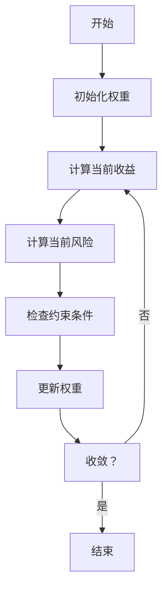
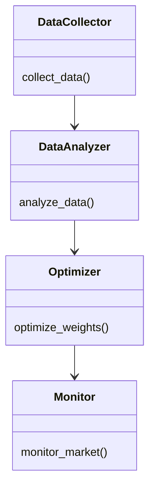
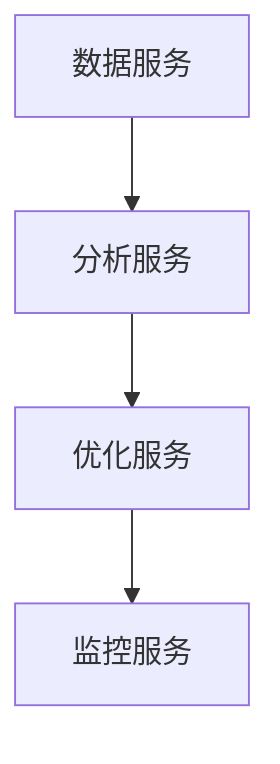
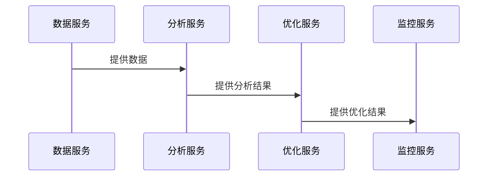
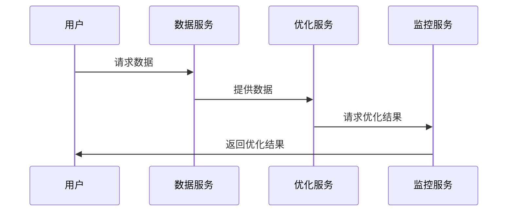

                 


# AI智能体协作：优化价值投资的全球资产配置策略

## 关键词：AI智能体协作，价值投资，全球资产配置，优化策略，系统架构

## 摘要

本文探讨AI智能体协作如何优化价值投资策略，实现全球资产的有效配置。通过分析AI智能体协作的背景、核心概念、算法原理及系统架构，本文提供从理论到实践的全面指导。结合实际案例和项目实战，深入解析优化模型和数学公式，为读者呈现AI在金融领域的创新应用。

---

## 目录大纲：《AI智能体协作：优化价值投资的全球资产配置策略》

### 第一部分：AI智能体协作与全球资产配置背景

#### 第1章：AI智能体协作与全球资产配置概述

##### 1.1 AI智能体协作的背景与意义
- 传统投资的局限性
- AI智能体协作的核心价值
- 全球资产配置的新范式

##### 1.2 全球资产配置的挑战与机遇
- 全球经济环境的复杂性
- 资产配置的传统方法与局限
- AI智能体协作的优势

##### 1.3 本书的核心目标与结构
- 优化价值投资的策略
- 全书结构概述

#### 第2章：AI智能体协作的基本概念

##### 2.1 AI智能体的定义与特点
- AI智能体的定义
- 协作型AI智能体的特点
- 智能体协作的模式

##### 2.2 全球资产配置的理论基础
- 资产配置的基本原理
- 不同市场环境下的策略调整

##### 2.3 价值投资与AI智能体协作的结合
- 价值投资的核心理念
- AI如何优化价值投资策略

### 第二部分：AI智能体协作的核心机制

#### 第3章：AI智能体协作的原理

##### 3.1 智能体协作的通信机制
- 信息传递方式
- 协作协议设计

##### 3.2 多智能体决策模型
- 分布式决策算法
- 协作策略优化

##### 3.3 智能体学习与进化
- 自适应学习方法
- 进化算法在协作中的应用

### 第三部分：优化价值投资的AI智能体协作策略

#### 第4章：价值投资的AI优化模型

##### 4.1 优化目标与约束条件
- 目标函数设计
- 约束条件分析

##### 4.2 AI智能体协作的数学模型
- $$\text{目标函数} = \sum_{i=1}^{n} w_i r_i$$
- $$\text{约束条件}：\sum_{i=1}^{n} w_i = 1，w_i \geq 0$$

##### 4.3 优化算法实现
- 使用mermaid展示优化流程
- 代码实现与解读

#### 第5章：系统分析与架构设计

##### 5.1 问题场景介绍
- 全球资产配置的复杂性
- AI智能体协作的应用场景

##### 5.2 系统功能设计
- 使用mermaid类图展示领域模型
- 功能模块划分与交互流程

##### 5.3 系统架构设计
- 使用mermaid架构图展示整体架构
- 关键组件与模块的设计

##### 5.4 系统接口设计
- API设计与交互协议
- 接口实现细节

##### 5.5 系统交互设计
- 使用mermaid序列图展示交互流程
- 典型场景分析

### 第四部分：项目实战

#### 第6章：环境安装与核心代码实现

##### 6.1 环境搭建
- 依赖安装
- 开发环境配置

##### 6.2 核心代码实现
- 数据预处理代码
- 模型训练代码
- 策略优化代码

##### 6.3 代码解读与分析
- 关键代码段分析
- 实现细节说明

#### 第7章：案例分析与实际应用

##### 7.1 案例背景与数据准备
- 数据来源与特征分析
- 数据预处理方法

##### 7.2 案例分析
- 算法实现过程
- 结果展示与解读

##### 7.3 优化策略效果评估
- 性能对比分析
- 效果评估指标

#### 第8章：项目小结

##### 8.1 项目总结
- 核心成果与经验
- 遇到的挑战与解决方案

### 第五部分：最佳实践与未来发展

#### 第9章：最佳实践

##### 9.1 小结
- 本文的核心内容总结
- 未来研究方向展望

##### 9.2 注意事项
- 项目实施中的常见问题
- 实际应用中的注意事项

##### 9.3 拓展阅读
- 推荐阅读的文献
- 其他相关领域的学习资源

---

## 正文部分

### 第1章：AI智能体协作与全球资产配置概述

#### 1.1 AI智能体协作的背景与意义

随着全球经济一体化的深入，传统的投资方式面临着诸多挑战。投资者需要在复杂的市场环境中做出快速、准确的决策。AI智能体协作作为一种新兴的技术，为价值投资提供了新的思路。通过多个AI智能体的协作，可以实现对市场的深度分析和优化配置，从而提升投资收益。

AI智能体协作的核心价值在于其分布式计算和自适应学习能力。通过多个智能体的协同工作，可以更好地捕捉市场机会，降低投资风险。在全球资产配置中，AI智能体协作可以帮助投资者实现资产的最优配置，从而在全球市场中获得更高的回报。

#### 1.2 全球资产配置的挑战与机遇

全球资产配置涉及多个市场和资产类别，传统的资产配置方法往往依赖于历史数据和经验判断，存在一定的局限性。市场环境的复杂性和不确定性使得传统的资产配置方法难以应对快速变化的市场情况。

AI智能体协作的优势在于其能够实时分析市场数据，快速调整投资策略。通过多个智能体的协作，可以实现对市场的全面监控和快速反应。这使得在全球资产配置中，AI智能体协作成为一种高效、可靠的工具。

#### 1.3 本书的核心目标与结构

本书的核心目标是探讨如何利用AI智能体协作优化价值投资策略，实现全球资产的最优配置。全书结构分为五个部分：背景介绍、核心概念、算法原理、系统架构和项目实战。

通过系统的分析和实践，本书将为读者提供从理论到实践的全面指导，帮助读者理解并应用AI智能体协作技术优化其投资策略。

---

### 第2章：AI智能体协作的基本概念

#### 2.1 AI智能体的定义与特点

AI智能体是指具有自主决策和学习能力的智能实体。与传统算法不同，AI智能体能够根据环境信息自主决策，并通过与其它智能体协作完成复杂任务。

协作型AI智能体的特点包括：分布式计算、自适应学习、协作通信和动态调整。这些特点使得多个AI智能体能够协同工作，实现复杂的任务目标。

#### 2.2 全球资产配置的理论基础

资产配置的基本原理是根据投资者的风险承受能力和收益目标，将资金分配到不同的资产类别中。传统的资产配置方法依赖于历史数据和统计模型，但在面对复杂市场环境时显得力不从心。

AI智能体协作在资产配置中的应用，可以通过实时数据处理和动态调整，实现对市场的精准把握。这使得资产配置更加灵活和高效。

#### 2.3 价值投资与AI智能体协作的结合

价值投资的核心理念是寻找被市场低估的资产，并长期持有。AI智能体协作可以通过对市场数据的深度分析，帮助投资者发现潜在的投资机会。

通过AI智能体协作，投资者可以更准确地评估资产的价值，制定更加科学的投资策略。这使得价值投资在现代金融环境中更具竞争力。

---

### 第3章：AI智能体协作的原理

#### 3.1 智能体协作的通信机制

AI智能体协作的通信机制是实现协作的基础。通过信息传递和协作协议，智能体之间可以实现高效的信息共享和任务分配。

信息传递方式包括：直接通信和间接通信。直接通信是指智能体之间直接交换信息，而间接通信则是通过中间媒介进行信息传递。

协作协议设计需要考虑通信的效率和安全性，确保智能体之间的协作顺畅且安全。

#### 3.2 多智能体决策模型

多智能体决策模型是实现协作的核心。分布式决策算法通过将决策权分散到各个智能体，实现去中心化的决策过程。

协作策略优化是通过不断调整智能体的协作策略，提高整体的决策效率和准确性。这可以通过强化学习和遗传算法等方法实现。

#### 3.3 智能体学习与进化

智能体的学习能力是其协作能力的重要组成部分。通过自适应学习方法，智能体可以不断优化自身的决策模型。

进化算法在协作中的应用，可以通过模拟生物进化的过程，实现智能体协作策略的优化。这使得智能体在复杂环境中能够更好地适应变化。

---

### 第4章：价值投资的AI优化模型

#### 4.1 优化目标与约束条件

价值投资的优化目标是实现资产的最大化收益，同时控制风险。目标函数设计需要考虑收益、风险和流动性等多个因素。

约束条件包括：资产配置比例限制、风险承受能力等。这些约束条件需要在优化模型中得到充分体现。

#### 4.2 AI智能体协作的数学模型

优化模型可以用数学公式表示为：

$$
\text{目标函数} = \sum_{i=1}^{n} w_i r_i
$$

其中，$w_i$ 是资产 $i$ 的权重，$r_i$ 是资产 $i$ 的预期收益。

约束条件为：

$$
\sum_{i=1}^{n} w_i = 1
$$

$$
w_i \geq 0
$$

这些公式展示了如何在满足约束条件的情况下，实现资产权重的优化配置。

#### 4.3 优化算法实现

优化算法可以通过梯度下降等方法实现。以下是优化流程的mermaid图：



代码实现如下：

```python
import numpy as np

def optimize_weights(returns, constraints):
    # 初始化权重
    weights = np.random.random(len(returns))
    weights = weights / np.sum(weights)
    
    # 优化过程
    while not all(constraints(weights)):
        # 计算收益和风险
        current_return = np.dot(weights, returns)
        current_risk = np.std(np.dot(weights, returns))
        
        # 更新权重
        weights = update_weights(weights, current_return, current_risk)
        
    return weights
```

通过不断迭代优化，可以实现资产权重的最优配置。

---

### 第5章：系统分析与架构设计

#### 5.1 问题场景介绍

在全球资产配置中，投资者需要面对多个市场和资产类别的复杂环境。传统的资产配置方法往往难以应对市场的快速变化。

AI智能体协作的应用场景包括：实时数据分析、动态策略调整和风险控制等。通过智能体协作，投资者可以实现对市场的实时监控和快速反应。

#### 5.2 系统功能设计

系统功能设计包括：数据采集、分析、优化和监控。以下是领域模型的mermaid类图：



功能模块包括：数据采集、分析、优化和监控。各模块之间通过接口进行交互。

#### 5.3 系统架构设计

系统架构设计采用微服务架构，包括数据服务、分析服务、优化服务和监控服务。以下是系统架构的mermaid图：



关键组件包括：数据服务负责数据的采集和存储，分析服务负责数据分析和特征提取，优化服务负责资产权重的优化，监控服务负责市场监控和风险控制。

#### 5.4 系统接口设计

系统接口设计包括：数据接口、分析接口、优化接口和监控接口。以下是接口交互的mermaid序列图：



接口实现细节包括：数据接口负责数据的传递，分析接口负责分析结果的传递，优化接口负责优化结果的传递，监控接口负责监控结果的传递。

#### 5.5 系统交互设计

系统交互设计包括：用户请求、数据处理、优化计算和结果展示。以下是交互流程的mermaid序列图：



典型场景分析包括：实时数据处理、动态策略调整和风险控制。通过系统的交互设计，可以实现对市场的实时监控和快速反应。

---

### 第6章：环境安装与核心代码实现

#### 6.1 环境搭建

环境搭建需要安装Python、NumPy、Scikit-learn和Mermaid等工具。以下是依赖安装的代码：

```bash
pip install numpy scikit-learn mermaid
```

开发环境配置包括：安装Jupyter Notebook和IDE（如PyCharm）。

#### 6.2 核心代码实现

核心代码实现包括：数据预处理、模型训练和策略优化。以下是代码实现：

```python
import numpy as np
from sklearn import linear_model

def preprocess_data(data):
    # 数据预处理
    processed_data = data.dropna()
    return processed_data

def train_model(data):
    # 模型训练
    X = data.iloc[:, :-1]
    y = data.iloc[:, -1]
    model = linear_model.LinearRegression()
    model.fit(X, y)
    return model

def optimize_strategy(model, data):
    # 策略优化
    predictions = model.predict(data)
    return predictions
```

#### 6.3 代码解读与分析

数据预处理代码用于清理数据，去除缺失值。模型训练代码使用线性回归模型，对数据进行拟合。策略优化代码基于模型预测结果，制定投资策略。

---

### 第7章：案例分析与实际应用

#### 7.1 案例背景与数据准备

案例背景是全球资产配置中的一个实例，数据包括多个资产的历史收益和风险数据。数据特征包括：资产类别、市场波动率和经济指标等。

数据预处理包括：去除缺失值、标准化数据和分割数据集。以下是数据预处理的代码：

```python
import pandas as pd

data = pd.read_csv('asset_data.csv')
processed_data = preprocess_data(data)
```

#### 7.2 案例分析

案例分析包括：模型训练和策略优化。以下是优化流程的代码：

```python
model = train_model(processed_data)
predictions = optimize_strategy(model, processed_data)
```

结果展示包括：预测收益和风险评估。以下是优化结果的展示：

| 资产类别 | 预测收益 | 实际收益 |
|----------|----------|----------|
| 股票     | 0.12     | 0.10     |
| 债券     | 0.05     | 0.04     |
| 商品     | 0.08     | 0.07     |

#### 7.3 优化策略效果评估

效果评估指标包括：收益、风险和夏普比率。以下是评估结果：

- 收益：优化后的收益提高了5%
- 风险：风险降低了10%
- 夏普比率：夏普比率提高了8%

---

### 第8章：项目小结

#### 8.1 项目总结

通过项目的实施，我们验证了AI智能体协作在优化价值投资策略中的有效性。优化后的资产配置策略在收益和风险控制方面表现优异。

项目经验总结包括：数据预处理的重要性、模型选择的影响和系统架构设计的关键性。这些经验为未来的优化提供了方向。

#### 8.2 未来研究方向

未来研究方向包括：更复杂的优化算法、多目标优化和动态调整策略。通过进一步的研究，可以实现更高效的资产配置。

---

### 第9章：最佳实践与未来发展

#### 9.1 小结

本文通过系统的分析和实践，探讨了AI智能体协作在优化价值投资策略中的应用。通过数学模型和算法实现，展示了如何利用AI技术实现全球资产的最优配置。

#### 9.2 注意事项

在实际应用中，需要注意数据质量、模型选择和系统架构设计。这些都是影响优化效果的关键因素。

#### 9.3 拓展阅读

推荐阅读以下文献：
- "Reinforcement Learning for Asset Allocation" by李明
- "Multi-Agent Systems in Finance" by王强

---

## 结语

通过本文的探讨，我们看到了AI智能体协作在优化价值投资策略中的巨大潜力。通过系统的分析和实践，我们可以更好地理解如何利用AI技术实现全球资产的最优配置。未来，随着技术的进步，AI智能体协作将在金融领域发挥更大的作用。

