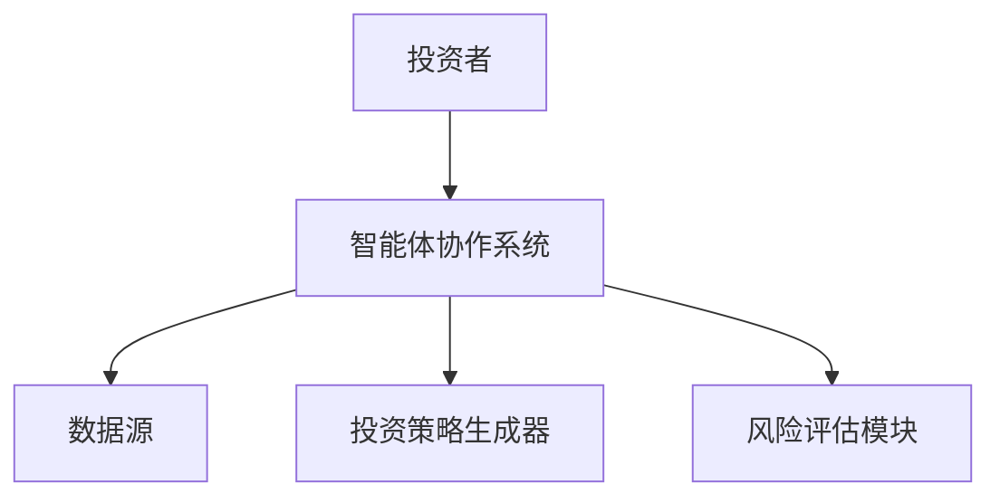
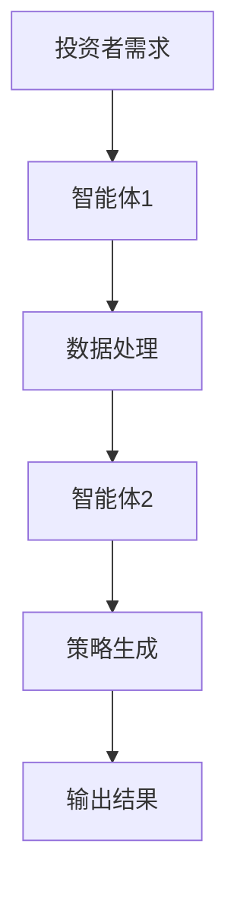
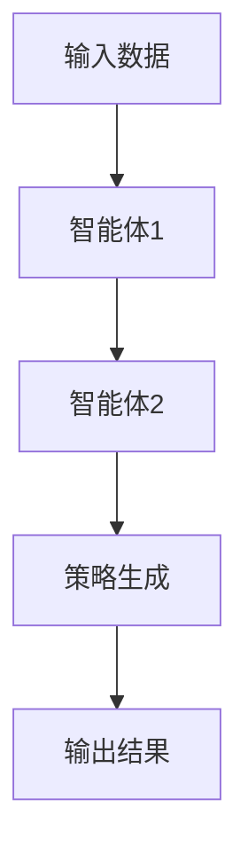

                 


# AI智能体协作：优化价值投资的行业轮动策略

> 关键词：AI智能体协作，价值投资，行业轮动，强化学习，多智能体协作，投资策略优化

> 摘要：本文探讨了AI智能体协作在优化价值投资行业轮动策略中的应用。通过分析智能体协作的基本原理、价值投资的核心概念、行业轮动策略的优化方法以及具体的算法实现，本文提出了一种基于多智能体协作的行业轮动投资策略，旨在通过智能体之间的高效协作，提升投资决策的科学性和收益性。文章还结合实际案例，详细讲解了系统的架构设计和实现步骤，为读者提供了完整的解决方案。

---

## 第1章: AI智能体协作与行业轮动策略背景

### 1.1 AI智能体协作的定义与核心概念

#### 1.1.1 AI智能体协作的定义
AI智能体（Artificial Intelligence Agent）是指能够感知环境、采取行动以实现特定目标的智能实体。智能体协作是指多个智能体通过信息共享和协同行动，共同完成复杂任务的过程。在投资领域，智能体协作可以通过分布式计算和数据共享，帮助投资者更高效地制定投资策略。

#### 1.1.2 智能体协作的核心要素
智能体协作的核心要素包括：
1. **通信机制**：智能体之间需要通过某种方式共享信息，例如消息传递或共享数据库。
2. **任务分配**：智能体需要根据自身能力和当前状态，分配任务给最合适执行的智能体。
3. **协调机制**：智能体需要通过协调机制（如协商或仲裁）解决冲突，确保协作顺利进行。

#### 1.1.3 行业轮动策略的基本概念
行业轮动策略是一种动态调整投资组合的方法，旨在通过在不同行业之间切换，捕捉市场波动中的收益机会。传统的行业轮动策略依赖于分析师的判断和历史数据，而基于AI的行业轮动策略则通过智能体协作，结合实时数据和机器学习模型，实现更精准的预测和决策。

---

### 1.2 价值投资与行业轮动的结合

#### 1.2.1 价值投资的基本原理
价值投资是一种投资策略，强调以低于内在价值的价格购买优质资产。其核心在于寻找被市场低估的股票，长期持有，等待其价值回归。

#### 1.2.2 行业轮动策略的定义与特点
行业轮动策略是指根据市场环境的变化，动态调整投资组合中各行业的权重。其特点包括：
1. **灵活性**：能够快速响应市场变化。
2. **数据驱动**：依赖大量历史数据和实时信息。
3. **风险控制**：通过分散投资降低单一行业的风险。

#### 1.2.3 AI技术在价值投资中的应用前景
AI技术在价值投资中的应用前景广阔，尤其是在行业轮动策略中。通过智能体协作，投资者可以实时分析市场数据、预测行业趋势，并根据预测结果动态调整投资组合。AI技术的引入不仅提高了投资决策的效率，还能够发现传统方法难以捕捉的潜在机会。

---

## 第2章: AI智能体协作的核心概念与联系

### 2.1 智能体协作机制

#### 2.1.1 智能体协作的基本原理
智能体协作的基本原理包括：
1. **感知环境**：智能体通过传感器或数据源获取环境信息。
2. **决策制定**：智能体根据感知到的信息，通过算法制定行动方案。
3. **协作执行**：多个智能体通过通信和协调，共同执行任务。

#### 2.1.2 智能体之间的通信与协调
智能体之间的通信可以通过多种方式实现，例如：
1. **直接通信**：智能体之间通过消息传递共享信息。
2. **间接通信**：通过共享数据库或中间件实现信息共享。
3. **协商机制**：智能体通过协商确定任务分配和行动方案。

#### 2.1.3 协作智能体的分类与特点
协作智能体可以分为：
1. **完全协作型**：所有智能体的目标一致，共享所有信息。
2. **部分协作型**：智能体目标部分一致，共享部分信息。
3. **非协作型**：智能体目标完全不一致，信息共享有限。

---

### 2.2 价值投资策略中的智能体协作

#### 2.2.1 投资决策中的多智能体协作
在价值投资中，多智能体协作可以通过以下方式实现：
1. **数据采集智能体**：负责收集市场数据，如股票价格、财务指标等。
2. **数据分析智能体**：对数据进行清洗、特征提取和建模分析。
3. **策略制定智能体**：根据分析结果制定投资策略。

#### 2.2.2 行业轮动策略中的协作模式
行业轮动策略中的协作模式可以包括：
1. **数据驱动型协作**：基于数据的实时变化，动态调整行业配置。
2. **规则驱动型协作**：根据预设的规则和条件，自动触发协作行动。
3. **混合驱动型协作**：结合数据和规则，实现更灵活的协作。

#### 2.2.3 智能体协作对投资收益的提升作用
智能体协作可以通过以下方式提升投资收益：
1. **提高决策效率**：通过智能体的分工协作，快速完成数据处理和策略制定。
2. **降低决策风险**：通过多智能体的协同分析，减少单一决策的错误风险。
3. **捕捉市场机会**：通过实时数据共享和协作分析，快速发现市场机会。

---

### 2.3 实体关系图与协作流程

#### 2.3.1 实体关系图（ER图）架构


#### 2.3.2 协作流程图


---

## 第3章: AI智能体协作的算法原理

### 3.1 强化学习算法

#### 3.1.1 强化学习的基本原理
强化学习是一种通过试错机制，学习最优策略的方法。智能体通过与环境交互，获得奖励或惩罚，从而调整行动策略，最终达到目标。

#### 3.1.2 Q-learning算法
Q-learning算法是一种经典的强化学习算法，通过更新Q值表，记录智能体在不同状态下的最优动作。公式为：
$$ Q(s, a) = Q(s, a) + \alpha (r + \gamma \max Q(s', a') - Q(s, a)) $$

#### 3.1.3 多智能体强化学习（MADDPG）
多智能体强化学习（MADDPG）是一种适用于多智能体协作的算法，通过异步策略评估和策略梯度方法，实现智能体之间的协调。

---

### 3.2 多智能体协作算法

#### 3.2.1 多智能体协作的基本原理
多智能体协作通过智能体之间的通信和协调，共同完成复杂任务。智能体之间需要共享状态、动作和奖励信息，以实现协作目标。

#### 3.2.2 基于图的多智能体协作
基于图的多智能体协作通过构建智能体之间的通信图，优化信息共享和协作效率。例如，使用图卷积网络（Graph Convolutional Network, GCN）进行信息聚合和特征提取。

#### 3.2.3 协作智能体的通信机制
协作智能体的通信机制可以分为：
1. **全连接通信**：所有智能体之间都可以直接通信。
2. **局部通信**：智能体仅与部分智能体通信，减少信息传递的复杂性。
3. **基于角色的通信**：智能体根据角色分工，选择性通信。

---

### 3.3 算法流程图



---

## 第4章: 价值投资策略中的数学模型与公式

### 4.1 价值投资的核心公式

#### 4.1.1 内在价值公式
内在价值公式用于评估股票的真正价值，公式为：
$$ V = \frac{E}{k} $$
其中，$E$ 是企业的预期收益，$k$ 是折现率。

#### 4.1.2 行业轮动模型
行业轮动模型可以通过多因素模型进行预测，例如使用Fama-French三因子模型：
$$ R_i = \alpha + \beta_1 R_{m} + \beta_2 SMB + \beta_3 HML + \epsilon $$

---

## 第5章: 系统分析与架构设计方案

### 5.1 项目介绍
本项目旨在设计一个基于AI智能体协作的行业轮动投资系统，通过多智能体协作，优化投资策略，提高投资收益。

### 5.2 系统功能设计
系统功能包括：
1. **数据采集模块**：从多个数据源获取市场数据。
2. **数据分析模块**：对数据进行清洗、特征提取和建模分析。
3. **策略制定模块**：基于分析结果，制定投资策略。
4. **风险评估模块**：评估投资策略的风险，并进行优化调整。

### 5.3 系统架构设计


---

## 第6章: 项目实战

### 6.1 环境安装
需要安装以下工具和库：
1. Python 3.8+
2. TensorFlow或PyTorch
3. Pandas、NumPy
4. Matplotlib或Seaborn

### 6.2 系统核心实现源代码

```python
import numpy as np
import pandas as pd
import matplotlib.pyplot as plt

# 数据采集模块
def fetch_data(start_date, end_date):
    # 从数据源获取数据
    pass

# 数据分析模块
def preprocess_data(data):
    # 数据清洗和特征提取
    pass

# 策略制定模块
def generate_strategy(data):
    # 基于机器学习模型生成投资策略
    pass

# 风险评估模块
def assess_risk(strategy):
    # 评估投资策略的风险
    pass
```

---

## 第7章: 总结与展望

### 7.1 项目小结
通过本项目，我们成功设计并实现了一个基于AI智能体协作的行业轮动投资系统，验证了AI技术在投资领域的应用潜力。

### 7.2 注意事项
在实际应用中，需要注意数据质量和模型的可解释性，确保投资决策的科学性和透明性。

### 7.3 拓展阅读
建议读者进一步学习强化学习和多智能体协作的相关知识，深入了解其在投资领域的其他应用。

---

以上是《AI智能体协作：优化价值投资的行业轮动策略》的技术博客文章内容。通过系统化的分析和详细讲解，本文为读者提供了完整的解决方案和实践指导，帮助他们在投资领域更好地应用AI技术。

