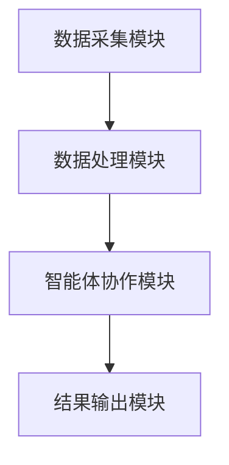
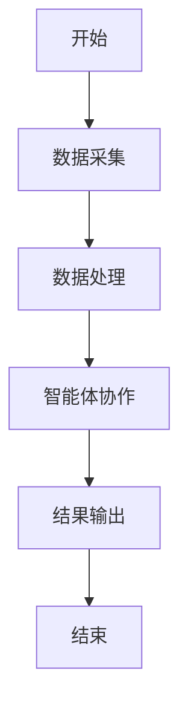

                 


# AI智能体协作：提升对公司未来竞争力的预测

## 关键词：AI智能体协作，企业竞争力预测，分布式计算，多智能体系统，共识机制

## 摘要：AI智能体协作通过智能体之间的分布式计算和协作机制，有效提升企业对市场趋势和竞争对手的预测能力，增强企业的竞争力。本文将从背景、原理、系统设计、实战案例等多方面详细阐述AI智能体协作的应用和价值。

---

## 第一部分：背景介绍

### 第1章：AI智能体协作的背景与现状

#### 1.1 AI智能体协作的定义与背景

**1.1.1 智能体的定义与特征**

智能体（Agent）是一种能够感知环境、自主决策并执行任务的实体。AI智能体具备以下特征：

- **自主性**：能够在没有外部干预的情况下独立运作。
- **反应性**：能够根据环境变化实时调整行为。
- **社会性**：能够与其他智能体或人类进行交互和协作。
- **学习能力**：能够通过数据和经验不断优化自身行为。

**1.1.2 AI智能体协作的背景与重要性**

随着人工智能技术的快速发展，AI智能体的应用场景不断扩大。在企业环境中，多个智能体需要协作完成复杂任务，例如供应链优化、市场预测和风险控制。AI智能体协作的重要性体现在以下方面：

- **提高效率**：通过分布式计算和任务分配，提升整体处理效率。
- **增强决策能力**：多个智能体协作能够提供更全面的信息和更精准的决策。
- **适应复杂环境**：智能体协作能够更好地应对动态变化的市场环境。

**1.1.3 当前AI智能体协作的应用现状**

目前，AI智能体协作已在多个领域得到应用，如：

- **金融领域**：用于股票交易、风险评估和客户画像构建。
- **制造业**：用于生产优化、供应链管理和设备维护。
- **物流领域**：用于路径规划、货物调度和仓储管理。

#### 1.2 企业竞争力预测的挑战与需求

**1.2.1 企业竞争力的核心要素**

企业竞争力的核心要素包括：

- **市场占有率**：企业在市场中的份额。
- **创新能力**：企业的技术创新和产品开发能力。
- **运营效率**：企业的生产效率和成本控制能力。
- **品牌影响力**：企业在市场中的品牌知名度和美誉度。

**1.2.2 竞争力预测的难点与痛点**

企业在预测竞争力时面临以下难点：

- **数据复杂性**：需要处理大量异构数据，包括市场数据、竞争对手数据和内部数据。
- **动态变化**：市场环境和竞争对手策略不断变化，增加了预测的难度。
- **预测准确性**：如何提高预测的准确性是企业面临的重大挑战。

**1.2.3 AI智能体协作在预测中的作用**

AI智能体协作能够通过以下方式提升企业竞争力预测能力：

- **数据整合与分析**：多个智能体协作整合不同来源的数据，提供更全面的分析结果。
- **实时反馈与调整**：智能体能够实时感知环境变化，快速调整预测模型。
- **分布式计算**：通过分布式计算，提高数据处理效率和预测速度。

---

## 第二部分：核心概念与联系

### 第2章：AI智能体协作的核心概念

#### 2.1 智能体协作的基本原理

**2.1.1 分布式智能与协作机制**

分布式智能是指多个智能体协同工作，共同完成任务。协作机制包括以下方面：

- **通信机制**：智能体之间通过特定协议进行信息交换。
- **任务分配**：根据智能体的能力和当前任务需求，动态分配任务。
- **协调机制**：确保智能体之间协作顺利，避免冲突。

**2.1.2 多智能体系统中的通信与协调**

在多智能体系统中，通信与协调是协作的关键。智能体通过以下方式实现通信：

- **消息传递**：智能体之间通过消息传递信息。
- **协议制定**：制定共同的协议，确保信息传递的规范性。
- **协调控制**：通过协调控制机制，确保多个智能体协作一致。

#### 2.2 智能体协作的关键要素

**2.2.1 智能体的属性与角色**

智能体的属性包括：

- **智能体类型**：分为反应式和认知式智能体。
- **智能体能力**：包括感知能力、决策能力和执行能力。
- **智能体角色**：在协作任务中担任不同的角色，如数据采集、分析和决策。

**2.2.2 协作目标与任务分解**

协作目标是指智能体协作需要达成的目标。任务分解是指将协作目标分解为多个子任务，每个子任务由不同的智能体负责。任务分解的原则包括：

- **粒度适当**：任务分解的粒度要适中，确保每个子任务能够独立完成。
- **职责明确**：每个子任务的职责要明确，避免职责重叠。
- **可执行性**：分解后的子任务要具有可执行性，能够被智能体理解和执行。

**2.2.3 信任与激励机制**

信任机制是指智能体之间建立信任关系，确保协作过程中的信息可靠。激励机制是指通过激励措施，激励智能体积极参与协作。

信任机制的实现方法包括：

- **信誉评估**：通过信誉评估，建立智能体的信任度。
- **验证机制**：通过验证机制，确保信息的准确性。

激励机制的实现方法包括：

- **奖励机制**：通过奖励机制，激励智能体积极参与协作。
- **惩罚机制**：通过惩罚机制，约束智能体的不良行为。

#### 2.3 智能体协作的ER实体关系图

以下是智能体协作的ER实体关系图：

```mermaid
er
  actor
  entity
  relation
  actor -|> relation
  entity -|> relation
  relation -|> actor
  relation -|> entity
```

---

## 第三部分：算法原理讲解

### 第3章：AI智能体协作的算法原理

#### 3.1 分布式计算与通信协议

**3.1.1 分布式计算的基本概念**

分布式计算是指在多个计算节点上进行计算的过程。分布式计算的特点包括：

- **资源分散**：计算资源分散在多个节点上。
- **任务分配**：任务被分配到不同的节点上执行。
- **结果汇总**：计算结果需要汇总到一个节点上。

**3.1.2 智能体间通信协议的设计**

通信协议是智能体之间进行信息交换的规则。通信协议的设计需要考虑以下方面：

- **协议格式**：信息的格式和结构。
- **通信频率**：智能体之间的通信频率。
- **错误处理**：如何处理通信中的错误。

**3.1.3 通信效率优化方法**

通信效率的优化方法包括：

- **压缩技术**：通过压缩技术减少数据传输量。
- **缓存机制**：通过缓存机制减少重复数据的传输。
- **负载均衡**：通过负载均衡技术，平衡数据传输的压力。

#### 3.2 多智能体共识机制

**3.2.1 共识算法的分类与选择**

共识算法是多智能体协作中的关键算法。常见的共识算法包括：

- **工作量证明（PoW）**：比特币使用的共识算法。
- **权益证明（PoS）**：以太坊使用的共识算法。
- **RAFT**：适用于分布式系统的一种共识算法。

**3.2.2 基于区块链的共识机制**

区块链是一种分布式账本技术，共识机制是区块链的核心机制。基于区块链的共识机制包括：

- **POW（工作量证明）**：通过计算找到特定的哈希值来达成共识。
- **POS（权益证明）**：通过持有代币的数量来决定节点的权重。
- **RAFT**：通过选举的方式确定领导节点，领导节点负责处理交易。

**3.2.3 共识算法的实现流程**

共识算法的实现流程包括：

1. **初始化阶段**：初始化区块链的参数和节点。
2. **交易生成阶段**：节点生成交易并广播到其他节点。
3. **共识达成阶段**：节点通过共识算法达成共识，确认交易的有效性。
4. **区块生成阶段**：将确认的交易打包成区块，区块被添加到区块链中。

#### 3.3 协作任务分配算法

**3.3.1 任务分配的数学模型**

任务分配的数学模型可以表示为：

$$
\text{最大化 } \sum_{i=1}^{n} w_i x_i \\
\text{约束条件 } x_i \in \{0,1\}, i=1,2,...,n
$$

其中，\( w_i \) 是任务 \( i \) 的权重，\( x_i \) 是任务 \( i \) 的分配变量。

**3.3.2 基于博弈论的任务分配策略**

博弈论是一种研究策略选择的数学理论。在任务分配中，可以利用博弈论中的纳什均衡概念，找到最优的任务分配策略。

**3.3.3 任务分配的优化方法**

任务分配的优化方法包括：

- **遗传算法**：通过模拟自然选择和遗传变异，优化任务分配。
- **粒子群优化算法**：通过粒子群的运动，寻找最优的任务分配。
- **模拟退火算法**：通过模拟退火过程，寻找最优的任务分配。

---

## 第四部分：系统分析与架构设计

### 第4章：AI智能体协作系统的架构设计

#### 4.1 系统功能设计

**4.1.1 功能模块划分**

AI智能体协作系统的功能模块包括：

- **数据采集模块**：负责采集外部数据。
- **数据处理模块**：负责处理和清洗数据。
- **智能体协作模块**：负责智能体之间的协作和任务分配。
- **结果输出模块**：负责输出协作结果。

**4.1.2 模块间的交互关系**

以下是模块间的交互关系图：



**4.1.3 功能流程图展示**

以下是功能流程图：



#### 4.2 系统架构设计

**4.2.1 分

---

## 第五部分：项目实战

### 第5章：AI智能体协作的项目实战

#### 5.1 环境安装与配置

**5.1.1 系统环境要求**

- **操作系统**：Linux/Windows/MacOS
- **Python版本**：3.6以上
- **依赖库**：numpy, pandas, scikit-learn, matplotlib

**5.1.2 安装依赖**

使用以下命令安装依赖：

```bash
pip install numpy pandas scikit-learn matplotlib
```

#### 5.2 核心代码实现

**5.2.1 智能体协作核心代码**

以下是智能体协作的核心代码：

```python
import numpy as np
import pandas as pd
from sklearn.metrics import accuracy_score

def distributed_computation(data, num_agents):
    # 分割数据
    data_segments = np.array_split(data, num_agents)
    results = []
    for segment in data_segments:
        # 分布式计算
        result = compute(segment)
        results.append(result)
    # 合并结果
    merged_result = merge(results)
    return merged_result

def compute(data_segment):
    # 示例计算函数
    return data_segment.mean()

def merge(results):
    # 示例合并函数
    return np.mean(results)

# 示例数据
data = pd.DataFrame({'feature': np.random.randn(100), 'label': np.random.randint(2, size=100)})
num_agents = 4

# 分布式计算
result = distributed_computation(data, num_agents)
print("计算结果:", result)
```

**5.2.2 智能体协作的代码解读**

- **分布式计算函数**：将数据分割成多个段落，分配给不同的智能体进行计算。
- **合并结果函数**：将所有智能体的计算结果合并，得到最终结果。
- **计算函数**：具体计算函数可以根据实际需求进行定制。

#### 5.3 项目实战案例分析

**5.3.1 预测市场趋势的项目**

以下是一个预测市场趋势的项目案例：

```python
import numpy as np
import pandas as pd
from sklearn.metrics import accuracy_score

def predict_market_trend(data, num_agents):
    # 分割数据
    data_segments = np.array_split(data, num_agents)
    results = []
    for segment in data_segments:
        # 分布式计算
        result = predict(segment)
        results.append(result)
    # 合并结果
    merged_result = merge(results)
    return merged_result

def predict(data_segment):
    # 示例预测函数
    return data_segment['price'].mean()

def merge(results):
    # 示例合并函数
    return np.mean(results)

# 示例数据
data = pd.DataFrame({'price': np.random.randn(100), 'volume': np.random.randint(100, size=100)})
num_agents = 4

# 预测市场趋势
result = predict_market_trend(data, num_agents)
print("预测结果:", result)
```

**5.3.2 代码实现与结果分析**

- **数据分割**：将数据分割成多个段落，分配给不同的智能体进行预测。
- **智能体预测**：每个智能体对分配的数据段进行预测。
- **结果合并**：将所有智能体的预测结果合并，得到最终的市场趋势预测。

#### 5.4 项目小结

通过上述项目实战，可以验证AI智能体协作在市场趋势预测中的有效性。通过分布式计算和智能体协作，能够提高预测的效率和准确性，为企业提供更有力的支持。

---

## 第六部分：最佳实践与小结

### 第6章：最佳实践与注意事项

#### 6.1 最佳实践

- **明确目标**：在实施AI智能体协作之前，明确协作的目标和需求。
- **选择合适的算法**：根据具体需求选择合适的共识算法和任务分配算法。
- **优化通信效率**：通过压缩技术和缓存机制，优化智能体之间的通信效率。
- **建立信任机制**：通过信誉评估和验证机制，建立智能体之间的信任关系。

#### 6.2 小结

AI智能体协作是一种新兴的技术，能够通过智能体之间的协作，提升企业的竞争力预测能力。通过分布式计算和多智能体协作，能够提高预测的效率和准确性，为企业提供更有力的支持。

#### 6.3 注意事项

- **数据隐私**：在协作过程中，需要确保数据的隐私和安全。
- **智能体行为规范**：需要制定智能体的行为规范，确保协作顺利进行。
- **系统容错性**：需要设计容错机制，确保系统在部分智能体故障时仍能正常运行。

#### 6.4 拓展阅读

- **《分布式系统：原理与设计》**
- **《区块链：技术与应用》**
- **《多智能体系统：理论与应用》**

---

通过以上内容，我们可以看到AI智能体协作在企业竞争力预测中的巨大潜力。随着技术的不断发展，AI智能体协作将为企业提供更强大的支持，帮助企业更好地应对市场挑战，抓住发展机遇。

