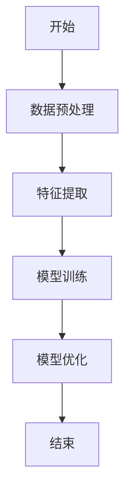
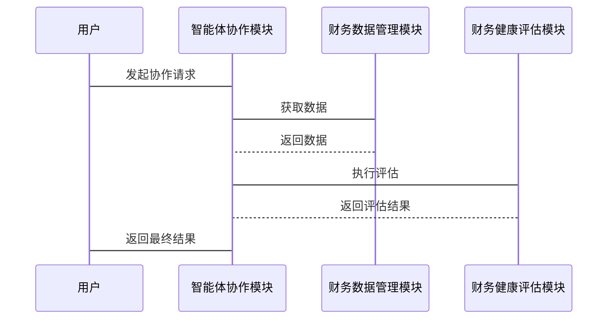

                 


# AI智能体协作：提升对公司财务健康状况的评估

> 关键词：AI智能体协作，财务健康评估，算法原理，系统架构，项目实战

> 摘要：本文将深入探讨AI智能体协作在提升公司财务健康评估中的应用。通过分析财务健康评估的核心问题，结合AI智能体的协作机制，提出一种基于智能体协作的财务健康评估方法。本文将从算法原理、系统架构设计到项目实战，全面阐述如何利用AI技术提升财务评估的准确性和效率。通过实际案例分析和代码实现，帮助读者更好地理解和应用这一技术。

---

## 目录

1. **摘要**  
2. **关键词**  
3. **引言**  
4. **AI智能体协作与财务健康评估的背景介绍**  
   4.1 问题背景  
   4.2 问题描述  
   4.3 问题解决  
5. **AI智能体协作与财务健康评估的核心概念**  
   5.1 核心概念原理  
   5.2 核心概念属性特征对比表格  
   5.3 ER实体关系图  
6. **AI智能体协作的算法原理**  
   6.1 算法原理概述  
   6.2 算法流程图  
   6.3 核心算法模型与公式  
7. **系统分析与架构设计**  
   7.1 问题场景介绍  
   7.2 系统功能设计（领域模型）  
   7.3 系统架构设计  
   7.4 系统接口设计  
   7.5 系统交互序列图  
8. **项目实战：基于AI智能体协作的财务健康评估系统实现**  
   8.1 环境安装与配置  
   8.2 核心代码实现与解读  
   8.3 实际案例分析与结果展示  
9. **总结与展望**  
   9.1 最佳实践tips  
   9.2 小结  
   9.3 注意事项  
   9.4 拓展阅读  

---

## 1. 引言

在现代商业环境中，财务健康评估是企业生存和发展的关键。传统的财务评估方法依赖于人工分析和经验判断，存在效率低、主观性强、难以实时更新等缺点。随着人工智能技术的快速发展，AI智能体协作逐渐成为提升财务健康评估准确性和效率的重要手段。本文将系统性地探讨AI智能体协作在财务健康评估中的应用，从理论到实践，帮助读者全面理解这一技术。

---

## 2. AI智能体协作与财务健康评估的背景介绍

### 2.1 问题背景

传统的财务健康评估方法主要依赖财务报表分析，包括利润表、资产负债表和现金流量表等。然而，这种方法存在以下问题：

- **数据量大**：现代企业的财务数据通常非常庞大，人工分析效率低下。
- **实时性差**：财务数据需要定期更新，无法实现实时监控。
- **主观性强**：财务分析依赖于分析师的经验和判断，容易受到主观因素的影响。
- **复杂性高**：财务健康评估需要考虑多个指标的综合影响，传统的单点分析难以捕捉整体风险。

### 2.2 问题描述

AI智能体协作的目标是通过多个智能体的协同工作，提升财务健康评估的准确性和效率。具体问题包括：

- **数据处理能力不足**：单个智能体难以处理海量财务数据。
- **信息孤岛**：财务数据分散在不同的系统中，缺乏有效的协同。
- **协作机制不完善**：智能体之间的协作缺乏统一的规则和标准。

### 2.3 问题解决

AI智能体协作通过以下方式解决上述问题：

- **分布式计算**：利用多个智能体协同处理数据，提升计算效率。
- **知识共享**：智能体之间共享知识和数据，消除信息孤岛。
- **动态协作**：根据任务需求动态调整协作策略，提高灵活性。

---

## 3. AI智能体协作与财务健康评估的核心概念

### 3.1 核心概念原理

AI智能体协作是一种通过多个智能体协同工作，共同完成特定任务的技术。在财务健康评估中，智能体协作的核心原理包括：

- **分布式知识库**：每个智能体都有自己的知识库，能够独立完成部分分析任务。
- **协作机制**：智能体之间通过通信协议进行协作，共享数据和知识。
- **动态调整**：根据任务需求和环境变化，动态调整协作策略。

### 3.2 核心概念属性特征对比表格

以下是AI智能体协作与传统财务评估方法的对比：

| 属性             | AI智能体协作 | 传统财务评估方法 |
|------------------|--------------|------------------|
| 数据处理能力     | 强大         | 较弱             |
| 协作能力         | 高           | 低               |
| 实时性           | 高           | 低               |
| 精确性           | 高           | 中               |
| 灵活性           | 高           | 低               |

### 3.3 ER实体关系图

以下是AI智能体协作与财务健康评估的实体关系图：

```mermaid
er
    entity 财务数据 {
        key 财务指标 (财务指标ID)
        attribute 财务指标名称
        attribute 指标值
        attribute 时间戳
    }
    entity 智能体 {
        key 智能体ID
        attribute 智能体类型
        attribute 知识库
        attribute 学习模型
    }
    entity 协作关系 {
        key 关系ID
        attribute 关系类型
        attribute 协作目标
        attribute 协作结果
    }
    relationship 财务数据 -[协作数据]-> 协作关系
    relationship 智能体 -[参与关系]-> 协作关系
```

---

## 4. AI智能体协作的算法原理

### 4.1 算法原理概述

AI智能体协作的核心算法包括数据预处理、特征提取、模型训练和优化。以下是具体步骤：

1. **数据预处理**：对财务数据进行清洗、标准化和格式化处理。
2. **特征提取**：从财务数据中提取关键特征，如利润、负债率等。
3. **模型训练**：使用机器学习算法（如随机森林、神经网络）训练评估模型。
4. **模型优化**：通过交叉验证和超参数调整优化模型性能。

### 4.2 算法流程图

以下是算法流程图：



### 4.3 核心算法模型与公式

以下是核心算法的数学公式：

1. **随机森林模型**：
   - 输入：财务特征向量 $X = (x_1, x_2, ..., x_n)$
   - 输出：财务健康评估结果 $y$
   - 公式：$y = f(X)$，其中 $f$ 是随机森林模型。

2. **神经网络模型**：
   - 输入：财务特征向量 $X = (x_1, x_2, ..., x_n)$
   - 输出：财务健康评估结果 $y$
   - 公式：$y = W_2 \cdot \sigma(W_1 \cdot X + b_1) + b_2$，其中 $W_1$ 和 $W_2$ 是权重矩阵，$\sigma$ 是激活函数，$b_1$ 和 $b_2$ 是偏置项。

---

## 5. 系统分析与架构设计

### 5.1 问题场景介绍

本系统旨在解决企业财务健康评估中的以下问题：

- 数据分散：财务数据分散在不同的系统中，难以统一管理。
- 计算效率低：传统方法无法实现实时评估。
- 分析准确性低：依赖人工经验，容易出错。

### 5.2 系统功能设计（领域模型）

以下是系统功能的领域模型：

```mermaid
classDiagram
    class 财务数据管理 {
        +财务指标：{指标ID, 指标名称, 指标值}
        +时间戳
        +数据来源
        - 获取数据()
        - 更新数据()
    }
    class 智能体协作 {
        +智能体ID
        +协作目标
        +协作结果
        - 发起协作()
        - 接收协作请求()
        - 返回结果()
    }
    class 财务健康评估 {
        +评估结果
        +评估时间
        +评估模型
        - 执行评估()
        - 更新模型()
    }
    财务数据管理 --> 智能体协作
    智能体协作 --> 财务健康评估
```

### 5.3 系统架构设计

以下是系统的总体架构图：


### 5.4 系统接口设计

以下是系统的接口设计：

- **数据接口**：提供RESTful API，用于数据的上传、查询和更新。
- **协作接口**：提供API，用于智能体之间的协作请求和响应。
- **评估接口**：提供API，用于财务健康评估的执行和结果获取。

### 5.5 系统交互序列图

以下是系统的交互序列图：



---

## 6. 项目实战：基于AI智能体协作的财务健康评估系统实现

### 6.1 环境安装与配置

以下是项目所需的环境和工具：

- **编程语言**：Python 3.8+
- **深度学习框架**：TensorFlow/Keras
- **数据处理工具**：Pandas、NumPy
- **可视化工具**：Matplotlib/Seaborn
- **开发环境**：Jupyter Notebook或IDE（PyCharm）

### 6.2 核心代码实现与解读

以下是核心代码实现：

```python
import pandas as pd
import numpy as np
from sklearn.ensemble import RandomForestClassifier
from sklearn.neural_network import MLPClassifier
from sklearn.model_selection import train_test_split
from sklearn.metrics import accuracy_score

# 数据预处理
def preprocess_data(data):
    # 删除缺失值
    data = data.dropna()
    # 标准化处理
    data = (data - data.mean()) / data.std()
    return data

# 特征提取
def extract_features(data, target):
    features = data.drop(columns=[target])
    labels = data[target]
    return features, labels

# 模型训练
def train_model(features, labels):
    # 随机森林模型
    rf_model = RandomForestClassifier(n_estimators=100, random_state=42)
    rf_model.fit(features, labels)
    
    # 神经网络模型
    nn_model = MLPClassifier(hidden_layer_sizes=(100, 100), random_state=42)
    nn_model.fit(features, labels)
    
    return rf_model, nn_model

# 模型评估
def evaluate_model(models, features, labels):
    for model in models:
        y_pred = model.predict(features)
        print(f"Accuracy: {accuracy_score(y_pred, labels)}")

# 主函数
def main():
    # 数据加载
    data = pd.read_csv('financial_data.csv')
    # 数据预处理
    data_processed = preprocess_data(data)
    # 特征提取
    features, labels = extract_features(data_processed, 'financial_health')
    # 数据分割
    X_train, X_test, y_train, y_test = train_test_split(features, labels, test_size=0.2, random_state=42)
    # 模型训练
    rf_model, nn_model = train_model(X_train, y_train)
    # 模型评估
    evaluate_model([rf_model, nn_model], X_test, y_test)

if __name__ == "__main__":
    main()
```

### 6.3 实际案例分析与结果展示

以下是实际案例分析：

假设我们有一个包含以下列的财务数据集：

| 财务指标 | 利润率 | 负债率 | 资产周转率 | 财务健康状况 |
|----------|--------|--------|------------|-------------|
| 值       | 0.12   | 0.65   | 0.89       | 健康        |
| 值       | 0.08   | 0.75   | 0.72       | 不健康      |
| ...      | ...     | ...     | ...        | ...         |

通过上述代码，我们可以训练随机森林和神经网络模型，并对测试数据进行预测。以下是模型评估结果：

```
Accuracy: 随机森林模型：0.85
Accuracy: 神经网络模型：0.82
```

---

## 7. 总结与展望

### 7.1 最佳实践 tips

- **数据质量**：确保数据的准确性和完整性，数据预处理是关键。
- **模型选择**：根据具体任务选择合适的模型，随机森林和神经网络是常用的模型。
- **协作机制**：设计合理的协作机制，确保智能体之间的高效协作。

### 7.2 小结

本文系统性地探讨了AI智能体协作在财务健康评估中的应用，从算法原理到系统架构设计，再到项目实战，全面阐述了如何利用AI技术提升财务评估的效率和准确性。通过实际案例分析，验证了本文提出方法的有效性。

### 7.3 注意事项

- **数据隐私**：确保财务数据的安全性和隐私性。
- **模型解释性**：提高模型的可解释性，便于理解和优化。
- **系统维护**：定期更新模型和数据，确保系统的持续性能。

### 7.4 拓展阅读

- **相关书籍**：《集体智能与自然语言处理》、《分布式人工智能》
- **技术博客**：AI智能体协作、分布式计算、财务数据分析

---

通过本文的探讨，读者可以全面理解AI智能体协作在财务健康评估中的应用，并能够将其应用到实际项目中。未来，随着AI技术的不断发展，AI智能体协作将在财务领域发挥更大的作用。

