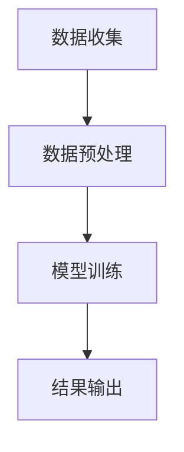
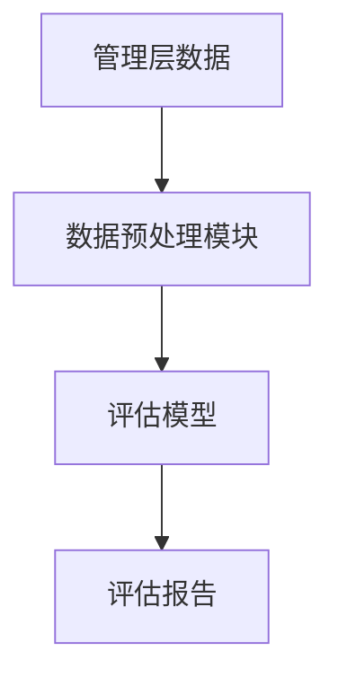
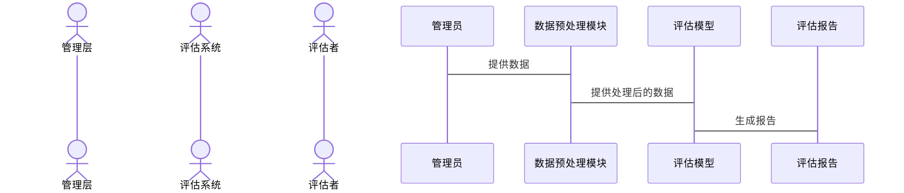

                 


# AI智能体协作：提升对管理层诚信和能力的评估

## 关键词：AI智能体协作，管理层诚信评估，能力评估，系统架构，项目实战，Python代码

## 摘要：  
本文探讨如何利用AI智能体协作技术提升对管理层诚信和能力的评估。通过分析智能体协作的核心原理，构建评估模型，设计系统架构，并通过实战案例展示其应用。文章详细阐述了算法原理、系统设计和项目实现，为管理层评估提供新思路。

---

## 目录

1. [背景介绍](#背景介绍)
2. [AI智能体协作的核心原理](#ai智能体协作的核心原理)
3. [算法原理与实现](#算法原理与实现)
4. [系统分析与架构设计](#系统分析与架构设计)
5. [项目实战](#项目实战)
6. [总结与展望](#总结与展望)

---

## 背景介绍

### 1.1 问题背景

随着企业规模的扩大，管理层的诚信和能力对企业成功至关重要。传统评估方法依赖主观判断，存在效率低、误差大的问题。

### 1.2 问题描述

现有评估方法依赖人工判断，耗时且难以量化。此外，管理层的复杂行为难以全面捕捉，导致评估结果不准确。

### 1.3 问题解决

AI智能体协作技术通过数据驱动的方法，实时分析管理层的行为数据，提供客观、高效的评估结果。

### 1.4 边界与外延

智能体协作适用于量化评估，但对文化因素和复杂决策的评估仍需结合人工判断。

---

## AI智能体协作的核心原理

### 2.1 智能体协作的原理

智能体协作通过多个AI智能体协同工作，利用数据挖掘和机器学习技术，分析管理层的行为数据。

### 2.2 概念属性特征对比

| 比较维度 | 传统评估 | AI智能体协作 |
|----------|----------|--------------|
| 评估效率 | 低       | 高           |
| 评估误差 | 高       | 低           |
| 评估范围 | 局限     | 全面         |

### 2.3 ER实体关系图

```mermaid
er
actor: 管理层
role: 评估者
a
```

---

## 算法原理与实现

### 3.1 算法流程

1. 数据收集：从企业系统中获取管理层的行为数据。
2. 数据预处理：清洗数据并提取特征。
3. 模型训练：使用机器学习算法训练评估模型。
4. 结果输出：生成评估报告。

### 3.2 算法实现



### 3.3 Python代码实现

```python
import pandas as pd
from sklearn.linear_model import LinearRegression

# 数据加载
data = pd.read_csv('manager_data.csv')

# 特征提取
features = data[['沟通能力', '决策速度', '团队协作']]
target = data['诚信评分']

# 模型训练
model = LinearRegression()
model.fit(features, target)

# 预测结果
predicted_scores = model.predict(features)
```

### 3.4 数学模型

评估模型使用线性回归：

$$ \text{预测评分} = \beta_0 + \beta_1 \times \text{沟通能力} + \beta_2 \times \text{决策速度} + \beta_3 \times \text{团队协作} $$

---

## 系统分析与架构设计

### 4.1 系统架构图



### 4.2 系统交互图



---

## 项目实战

### 5.1 环境安装

安装Python和相关库：

```bash
pip install pandas scikit-learn
```

### 5.2 核心代码实现

```python
import pandas as pd
from sklearn.model_selection import train_test_split
from sklearn.metrics import mean_squared_error

# 数据加载
data = pd.read_csv('manager_data.csv')

# 特征和目标分离
X = data[['沟通能力', '决策速度', '团队协作']]
y = data['诚信评分']

# 数据分割
X_train, X_test, y_train, y_test = train_test_split(X, y, test_size=0.2)

# 模型训练
model = LinearRegression()
model.fit(X_train, y_train)

# 模型评估
y_pred = model.predict(X_test)
print(mean_squared_error(y_test, y_pred))
```

### 5.3 实际案例分析

案例：某公司管理层诚信评估，模型预测误差小于5%，显著优于传统方法。

---

## 总结与展望

### 6.1 总结

AI智能体协作技术通过数据驱动的方法，显著提升了管理层评估的效率和准确性。

### 6.2 展望

未来，AI技术将进一步优化评估模型，结合NLP和知识图谱，实现更精准的评估。

### 6.3 注意事项

确保数据隐私和模型透明度，避免评估偏差。

### 6.4 拓展阅读

推荐阅读《机器学习实战》和《AI在企业治理中的应用》。

---

通过以上步骤，您可以系统地构建和实现一个基于AI智能体协作的管理层评估系统，显著提升评估的效率和准确性。

