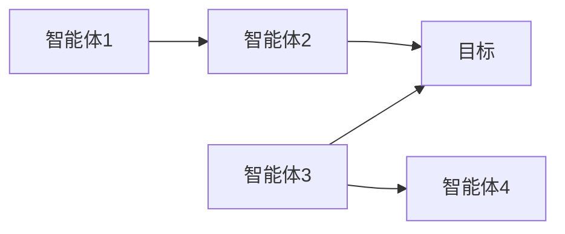
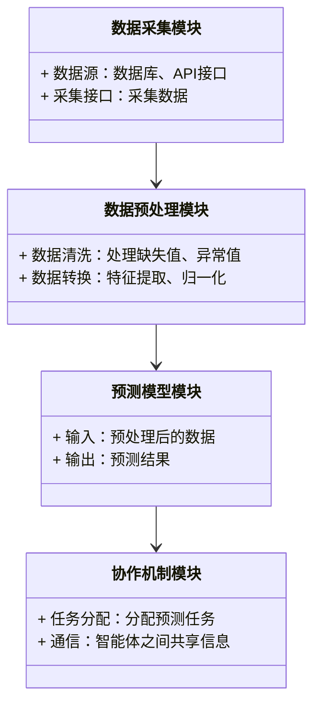
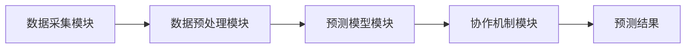
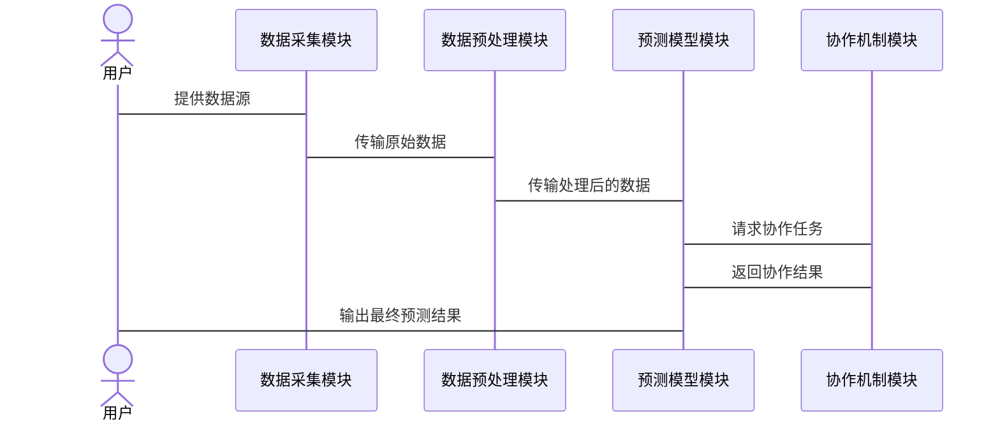

                 


# AI智能体协作：提升长期价值预测的准确性

## 关键词：AI智能体、协作、价值预测、多智能体系统、算法、系统架构

## 摘要：本文探讨了AI智能体协作在提升长期价值预测准确性中的应用，分析了多智能体系统的核心概念、算法原理、系统架构设计以及实际案例，提出了优化协作机制和提升预测准确性的方法。

---

## 第一部分: AI智能体协作与长期价值预测的背景

### 第1章: AI智能体协作概述

#### 1.1 AI智能体协作的核心概念

##### 1.1.1 什么是AI智能体

AI智能体（Artificial Intelligence Agent）是指能够感知环境、自主决策并执行任务的智能实体。智能体可以是软件程序、机器人或其他智能系统，具备以下核心特征：

- **自主性**：无需外部干预，自主完成任务。
- **反应性**：能够实时感知环境并做出响应。
- **目标导向性**：具备明确的目标，并朝着目标优化行为。
- **社会性**：能够与其他智能体或人类进行交互与协作。

##### 1.1.2 AI智能体协作的定义

AI智能体协作是指多个智能体通过通信与合作，共同完成复杂任务的过程。协作的核心在于智能体之间共享信息、分配任务和协同决策，以实现整体目标的最大化。

##### 1.1.3 协作智能体的特征对比

| 特征         | 独立智能体         | 协作智能体         |
|--------------|-------------------|-------------------|
| 信息共享     | 无                | 高                |
| 任务分配     | 单一              | 分布与协同         |
| 决策效率     | 低                | 高                |
| 系统复杂度   | 简单              | 复杂              |

#### 1.2 长期价值预测的背景

##### 1.2.1 价值预测的定义与意义

价值预测是指基于历史数据和当前信息，预测未来某个时间点或时间段内，某事物或系统的价值变化。在商业、金融、能源等领域，准确的长期价值预测具有重要意义，能够帮助企业做出更明智的决策。

##### 1.2.2 长期预测的挑战

- 数据稀疏性：长期预测的数据往往较少，且存在不确定性。
- 环境变化：市场环境、政策变化等因素会影响预测结果。
- 模型过拟合：传统模型在长期预测中容易过拟合，缺乏泛化能力。

##### 1.2.3 提高预测准确性的必要性

通过AI智能体协作，可以利用多个智能体的优势，从不同角度分析数据，提高预测的准确性和鲁棒性。

---

### 第2章: AI智能体协作与价值预测的关系

#### 2.1 协作智能体在预测中的作用

##### 2.1.1 多智能体协作的优势

- **分布式计算**：多个智能体可以同时处理不同维度的数据，提高计算效率。
- **信息互补**：每个智能体专注于特定领域，提供互补信息，提升整体预测能力。
- **容错性**：通过协作，系统能够在部分智能体故障时，依然保持预测能力。

##### 2.1.2 协作对预测准确性的提升

通过协作，多个智能体可以共享信息和知识，避免单一智能体的局限性，从而提高预测的准确性和稳定性。

##### 2.1.3 协作智能体的边界与外延

协作智能体的边界在于智能体之间的通信和任务分配机制，外延则包括与其他系统的集成和扩展。

#### 2.2 价值预测的核心要素

##### 2.2.1 数据质量与特征

- **数据质量**：数据的准确性和完整性直接影响预测结果。
- **特征选择**：选择与预测目标相关的特征，有助于提高模型性能。

##### 2.2.2 模型选择与优化

- **模型选择**：根据数据类型和预测目标选择合适的模型。
- **模型优化**：通过参数调优和特征工程，提高模型性能。

##### 2.2.3 协作机制的设计

- **任务分配**：根据智能体的专长分配任务。
- **通信机制**：设计高效的通信协议，确保信息共享。

---

## 第二部分: AI智能体协作的核心概念与联系

### 第3章: 多智能体协作系统

#### 3.1 多智能体系统的原理

##### 3.1.1 分布式计算的基本原理

分布式计算是指将任务分解成多个部分，分配给不同的计算节点完成，再将结果汇总。多智能体协作系统中的每个智能体相当于一个分布式节点，负责处理特定任务。

##### 3.1.2 多智能体协作的通信机制

智能体之间的通信可以通过消息传递、共享内存等方式实现。通信机制的设计直接影响协作效率和系统性能。

##### 3.1.3 协作任务的分配与协调

任务分配可以通过静态分配（如轮询分配）或动态分配（如根据负载情况动态调整）实现。协调机制则通过仲裁、协商等方式，确保任务分配的公平性和合理性。

#### 3.2 协作智能体的实体关系图



---

## 第三部分: AI智能体协作的算法原理

### 第4章: 多智能体协作的算法实现

#### 4.1 多智能体强化学习算法

##### 4.1.1 Q-learning算法

Q-learning是一种经典的强化学习算法，适用于单智能体场景。通过Q值表记录状态-动作对的期望奖励，智能体通过不断试错，更新Q值表，最终找到最优策略。

##### 4.1.2 分布式Q-learning算法

在多智能体协作场景中，每个智能体维护自己的Q值表，并通过通信共享信息。通过同步或异步更新，多个智能体共同优化Q值表，提升协作效率。

#### 4.2 多智能体协作算法的实现步骤

##### 4.2.1 初始化

每个智能体初始化自己的Q值表，设置初始参数。

##### 4.2.2 智能体协作

智能体通过通信机制共享信息，协作完成任务。

##### 4.2.3 状态更新

根据环境反馈，更新Q值表，优化策略。

---

## 第四部分: 系统分析与架构设计方案

### 第5章: 长期价值预测系统的设计

#### 5.1 问题场景介绍

长期价值预测系统需要处理大量的历史数据，分析市场趋势，预测未来价值。系统需要具备高效的数据处理能力、强大的模型计算能力和智能的协作机制。

#### 5.2 系统功能设计

##### 5.2.1 领域模型设计



##### 5.2.2 系统架构设计



##### 5.2.3 系统接口设计

系统接口包括数据输入接口、模型调用接口和结果输出接口，确保各个模块之间的高效协作。

##### 5.2.4 系统交互流程图



---

## 第五部分: 项目实战

### 第6章: 长期价值预测系统的实现

#### 6.1 环境安装

安装必要的库，如TensorFlow、Keras、Scikit-learn、Flask等。

#### 6.2 系统核心实现

##### 6.2.1 数据采集模块

```python
import requests

def fetch_data(api_url):
    response = requests.get(api_url)
    return response.json()
```

##### 6.2.2 数据预处理模块

```python
import pandas as pd

def preprocess_data(data):
    df = pd.DataFrame(data)
    df = df.dropna()
    df = (df - df.min()) / (df.max() - df.min())
    return df
```

##### 6.2.3 预测模型模块

```python
import tensorflow as tf
from tensorflow.keras import layers

model = tf.keras.Sequential([
    layers.Dense(64, activation='relu'),
    layers.Dense(1, activation='linear')
])
model.compile(optimizer='adam', loss='mse')
```

##### 6.2.4 协作机制模块

```python
class CollaborationMechanism:
    def __init__(self, agents):
        self.agents = agents
        self.current_task = None

    def assign_task(self, task):
        self.current_task = task
        for agent in self.agents:
            agent.receive_task(task)

    def gather_results(self):
        results = []
        for agent in self.agents:
            results.append(agent.send_result())
        return results
```

---

## 第六部分: 最佳实践与总结

### 第7章: 优化与总结

#### 7.1 最佳实践

##### 7.1.1 数据质量的重要性

确保数据的准确性和完整性，是提高预测准确性的基础。

##### 7.1.2 模型调优的技巧

通过交叉验证、网格搜索等方法，优化模型参数，提升预测性能。

##### 7.1.3 系统架构的扩展性

设计灵活的系统架构，便于后续功能扩展和性能优化。

#### 7.2 总结

通过AI智能体协作，可以有效提升长期价值预测的准确性和效率。未来的研究方向包括更高效的协作机制、更智能的任务分配算法以及更强大的预测模型。

---

## 参考文献

1. Russell, S., & Norvig, P. (2010). Artificial Intelligence: A Modern Approach.
2. Lafferty, J. D., & al., et. (2008). Graphical Models for Natural Language Processing.
3. Goodfellow, I., Bengio, Y., & Courville, A. (2016). Deep Learning.

---

## 结语

AI智能体协作是提升长期价值预测准确性的关键技术。通过多智能体系统的协作，可以充分发挥各个智能体的优势，提高预测的准确性和效率。希望本文能够为读者提供有价值的参考和启发。

