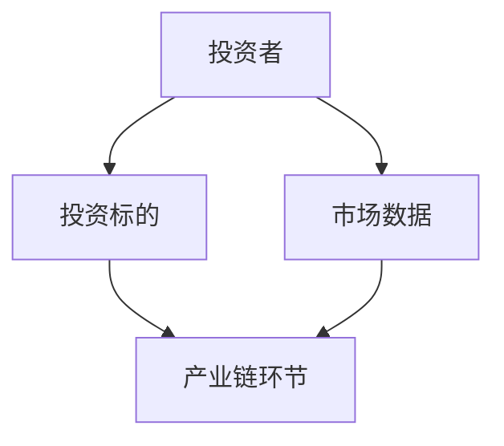
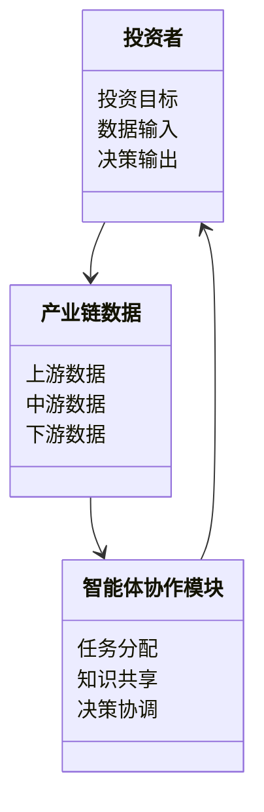
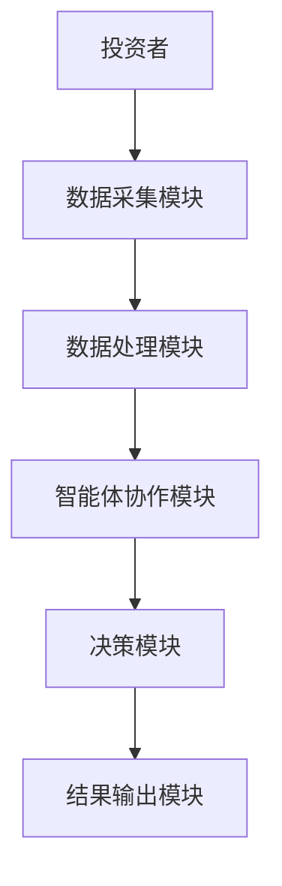
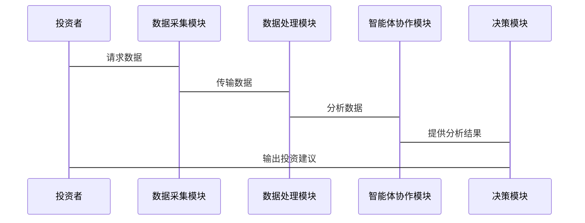

                 


# AI智能体协作：改进价值投资的产业链分析方法

> 关键词：AI智能体协作、价值投资、产业链分析、多智能体系统（MAS）、粒子群优化算法、系统架构设计

> 摘要：本文探讨如何通过AI智能体协作技术改进价值投资的产业链分析方法。文章首先介绍AI智能体协作的基本概念和其在金融领域的应用背景，接着分析其核心原理和算法实现，然后从系统架构角度详细阐述实现方案，最后通过实际案例展示其在价值投资中的应用效果和最佳实践。

---

## 第一章：AI智能体协作的背景与意义

### 1.1 问题背景

#### 1.1.1 传统价值投资的局限性
传统价值投资依赖于分析师的主观判断和经验，存在以下问题：
- 数据处理能力有限，难以分析海量数据。
- 分析耗时长，难以及时捕捉市场机会。
- 信息不对称，难以全面掌握产业链上下游动态。

#### 1.1.2 产业链分析的痛点
产业链分析复杂性高，涉及多个环节和变量，传统方法难以有效整合跨领域信息。

#### 1.1.3 AI智能体协作的提出
AI技术的引入为价值投资和产业链分析带来了新的可能性，尤其是多智能体协作（Multi-Agent System，MAS）技术。

### 1.2 问题描述

#### 1.2.1 价值投资中的信息不对称
市场信息分布不均，投资者难以全面掌握相关信息。

#### 1.2.2 产业链分析的复杂性
涉及多个环节和变量，传统方法难以有效整合。

#### 1.2.3 AI技术在金融领域的应用现状
AI技术在金融领域的应用逐渐增多，但多智能体协作的应用仍处于探索阶段。

### 1.3 问题解决

#### 1.3.1 AI智能体协作的核心思想
通过多个AI智能体协作完成复杂任务，提升数据分析和决策效率。

#### 1.3.2 产业链分析的改进方向
构建多智能体协作系统，实时整合产业链数据，优化投资决策。

#### 1.3.3 价值投资的智能化转型
利用AI智能体协作技术，提升投资决策的科学性和效率。

### 1.4 AI智能体协作的定义与特点

#### 1.4.1 AI智能体的定义
AI智能体是一种能够感知环境、自主决策并采取行动的实体。

#### 1.4.2 协作的核心机制
通过通信和协调完成任务分配和知识共享。

#### 1.4.3 与传统AI技术的区别
传统AI技术注重单点任务，而多智能体协作注重协同完成复杂任务。

---

## 第二章：AI智能体协作的核心原理

### 2.1 智能体协作的理论基础

#### 2.1.1 多智能体系统（MAS）概述
MAS由多个智能体组成，通过协作完成复杂任务。

#### 2.1.2 协作智能体的通信机制
智能体之间通过消息传递进行通信和协作。

#### 2.1.3 协作目标的达成方式
通过任务分配和知识共享实现协作目标。

### 2.2 智能体协作的关键技术

#### 2.2.1 任务分配与协同
基于角色分配和任务优先级的智能体协作机制。

#### 2.2.2 知识共享与整合
通过知识图谱和分布式计算整合多源数据。

#### 2.2.3 决策协调与优化
基于博弈论和优化算法的决策协调机制。

### 2.3 核心概念与联系

#### 2.3.1 概念属性对比
| 概念         | 特性               |
|--------------|--------------------|
| 单智能体      | 独立决策           |
| 多智能体      | 协作完成任务       |
| 通信机制      | 消息传递           |
| 协作目标      | 集中优化           |

#### 2.3.2 ER实体关系图



---

## 第三章：算法原理讲解

### 3.1 算法选择与改进

#### 3.1.1 粒子群优化算法（PSO）
粒子群优化算法是一种模拟鸟群觅食行为的优化算法，适用于多智能体协作中的任务分配问题。

#### 3.1.2 改进的PSO算法
为适应金融领域的动态环境，对PSO算法进行改进，引入自适应学习因子。

### 3.2 算法流程图

```mermaid
graph TD
    Start --> Initialize
    Initialize --> Evaluate Fitness
    Evaluate Fitness --> Update Personal Best
    Update Personal Best --> Update Global Best
    Global Best --> Check Convergence
    Check Convergence --> Yes ?--> End : No --> Continue
```

### 3.3 数学模型与公式

#### 3.3.1 粒子群优化算法
粒子位置更新公式：
$$
x_i^{t+1} = x_i^t + v_i^t
$$
速度更新公式：
$$
v_i^{t+1} = w v_i^t + c_1 r_1 (p_i - x_i^t) + c_2 r_2 (g - x_i^t)
$$

#### 3.3.2 改进算法
改进后的学习因子公式：
$$
c_1 = c_2 = 2.5
$$
自适应学习因子：
$$
w = 0.8 \text{ 至 } 1.2
$$

### 3.4 代码实现与解读

```python
import numpy as np

class Particle:
    def __init__(self, n_dim, bounds):
        self.n_dim = n_dim
        self.bounds = bounds
        self.x = np.array([np.random.uniform(b[0], b[1]) for b in bounds])
        self.v = np.zeros(n_dim)
        self.pbest = self.x.copy()
        self.pbest_fitness = np.inf

def evaluate(fitness_func, particles):
    for p in particles:
        p.fitness = fitness_func(p.x)
        if p.fitness < p.pbest_fitness:
            p.pbest_fitness = p.fitness
            p.pbest = p.x.copy()

def optimize(fitness_func, n_dim, bounds, max_iter=100, c1=2.5, c2=2.5, w=0.8):
    particles = [Particle(n_dim, bounds) for _ in range(10)]
    for _ in range(max_iter):
        evaluate(fitness_func, particles)
        for p in particles:
            r1 = np.random.rand()
            r2 = np.random.rand()
            p.v = w*p.v + c1*r1*(p.pbest - p.x) + c2*r2*(pbest_g - p.x)
    return particles[0].x
```

---

## 第四章：系统分析与架构设计方案

### 4.1 问题场景介绍

#### 4.1.1 产业链分析系统
构建一个基于AI智能体协作的产业链分析系统，用于支持价值投资决策。

### 4.2 系统功能设计

#### 4.2.1 领域模型


### 4.3 系统架构设计

#### 4.3.1 系统架构图


### 4.4 接口设计与交互

#### 4.4.1 序列图


---

## 第五章：项目实战

### 5.1 环境配置

#### 5.1.1 技术选型
使用Python、TensorFlow、Kafka搭建AI智能体协作系统。

### 5.2 核心代码实现

```python
import kafka
from kafka import KafkaProducer

def send_message(topic, message):
    producer = KafkaProducer(bootstrap_servers=['localhost:9092'])
    producer.send(topic, message.encode('utf-8'))
    producer.close()

send_message('investment_topic', 'New investment opportunity detected')
```

### 5.3 代码解读与分析

#### 5.3.1 代码功能
上述代码实现Kafka消息队列的使用，用于智能体协作模块之间的通信。

### 5.4 实际案例分析

#### 5.4.1 某行业产业链分析
通过AI智能体协作系统，分析某行业的产业链数据，生成投资建议。

### 5.5 项目小结

---

## 第六章：案例分析与最佳实践

### 6.1 实际应用案例

#### 6.1.1 某科技公司价值投资分析
通过AI智能体协作系统，分析某科技公司的产业链数据，提供投资建议。

### 6.2 最佳实践

#### 6.2.1 数据质量的重要性
确保数据的准确性和完整性。

#### 6.2.2 模型的可解释性
选择可解释性好的模型，便于分析和优化。

#### 6.2.3 系统的可扩展性
设计可扩展的系统架构，便于后续功能的扩展。

---

## 第七章：总结与展望

### 7.1 全文总结
本文探讨了AI智能体协作技术在价值投资中的应用，提出了改进产业链分析的方法，并通过案例验证了其有效性。

### 7.2 未来展望
未来可以进一步研究AI智能体协作在金融领域的其他应用，如风险管理、市场预测等。

---

## 参考文献
1. 粒子群优化算法相关文献
2. 多智能体系统相关文献
3. 金融数据分析相关文献

---

通过以上详细目录结构，您可以按照需要撰写具体的正文内容，确保每个章节和小节的内容丰富具体，符合专业技术博客的要求。

