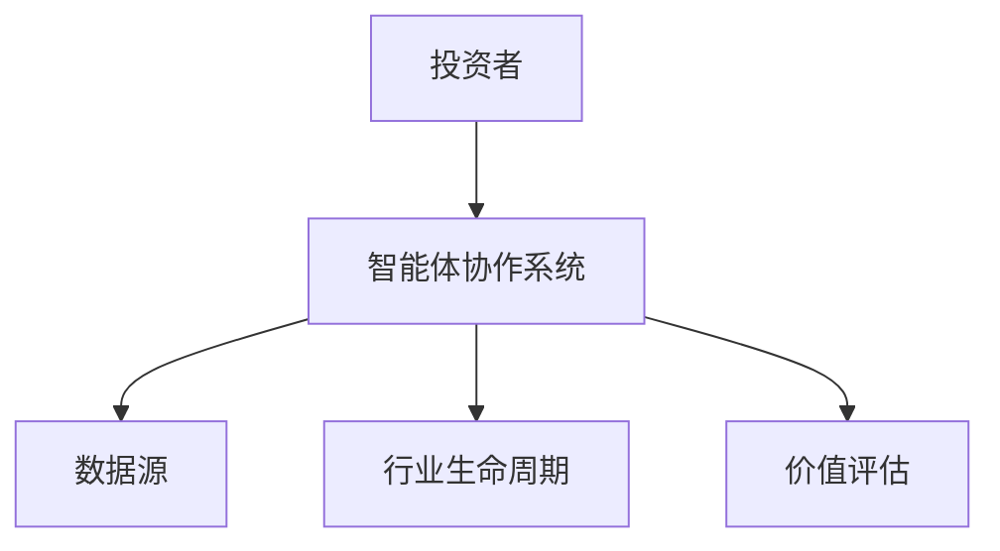
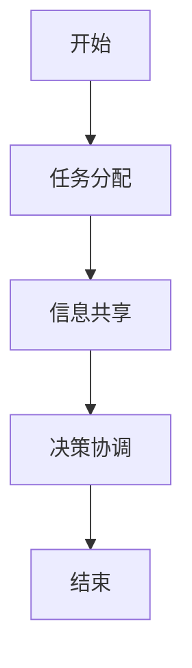
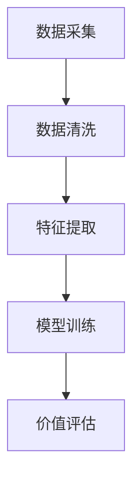
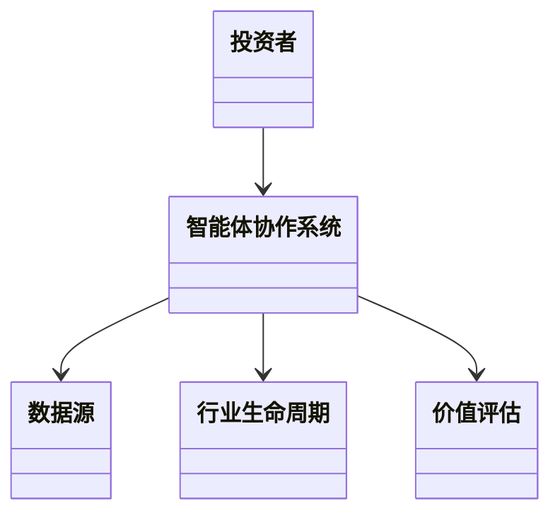
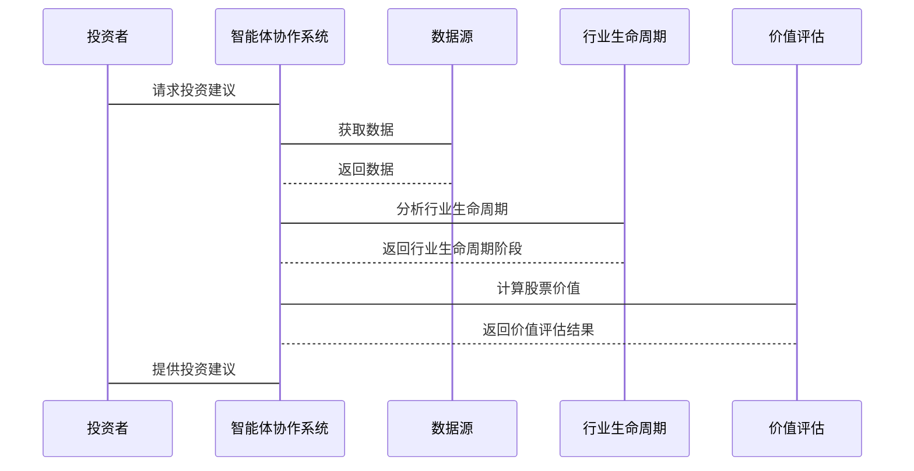

                 


# AI智能体协作：改进价值投资的行业生命周期分析

> 关键词：AI智能体协作，价值投资，行业生命周期，算法原理，系统架构设计

> 摘要：本文探讨了AI智能体协作在价值投资中的应用，特别是在行业生命周期分析中的改进。通过详细分析AI智能体协作的核心概念、算法原理、系统架构设计以及实际案例，本文展示了如何利用AI技术提升投资决策的准确性和效率。文章内容涵盖背景介绍、核心概念与联系、算法实现、系统架构设计、项目实战及最佳实践，旨在为读者提供全面的理论和实践指导。

---

# 第1章: AI智能体协作与价值投资背景

## 1.1 问题背景与挑战

### 1.1.1 传统价值投资的局限性
传统价值投资依赖于分析师的主观判断和经验，存在以下问题：
- 数据处理能力有限：难以处理海量数据。
- 时间效率低下：分析周期长，难以及时捕捉市场机会。
- 信息不全：依赖外部数据源，可能存在信息滞后或遗漏。

### 1.1.2 AI智能体协作的潜力与优势
AI智能体协作可以通过以下方式改进价值投资：
- **数据处理能力**：AI能够快速处理和分析海量数据，提供实时支持。
- **决策效率**：通过智能体协作，可以实现快速决策和优化。
- **准确性**：通过多智能体协作，能够提高投资决策的准确性。

### 1.1.3 价值投资与行业生命周期的结合
行业生命周期的不同阶段对投资策略的影响显著：
- **导入期**：企业风险高，但潜在回报大。
- **成长期**：企业增长迅速，适合投资。
- **成熟期**：企业增长稳定，适合长期投资。
- **衰退期**：企业风险增加，需谨慎投资。

AI智能体协作可以通过分析行业生命周期，优化投资策略。

## 1.2 问题描述与目标

### 1.2.1 价值投资中的信息处理问题
传统价值投资依赖于分析师的主观判断，存在以下问题：
- 数据量大，难以处理。
- 分析效率低，难以及时捕捉市场机会。
- 信息不全，可能导致决策失误。

### 1.2.2 AI智能体协作的目标与边界
AI智能体协作的目标是通过智能体之间的协作，优化价值投资的分析过程。其边界包括：
- 仅限于数据处理和分析阶段。
- 不直接参与投资决策，仅提供支持。
- 适用于多种行业和市场环境。

## 1.3 问题解决与核心要素

### 1.3.1 AI智能体协作的核心要素
AI智能体协作的核心要素包括：
- **智能体**：具备自主决策能力的个体。
- **协作机制**：智能体之间通过通信和协作完成任务。
- **目标函数**：智能体协作的最终目标。

### 1.3.2 价值投资的关键指标
价值投资的关键指标包括：
- **市盈率（P/E）**：衡量股票价格是否合理。
- **市净率（P/B）**：衡量股票价格与账面价值的比率。
- **股息率**：衡量股票的投资回报。

### 1.3.3 行业生命周期的阶段划分
行业生命周期的阶段划分包括：
- **导入期**：行业刚刚起步，市场空间小。
- **成长期**：行业迅速增长，市场扩大。
- **成熟期**：行业增长稳定，市场饱和。
- **衰退期**：行业增长放缓，市场萎缩。

## 1.4 本章小结
本章介绍了AI智能体协作在价值投资中的背景和挑战，明确了问题的边界和目标。通过分析行业生命周期的不同阶段，提出了AI智能体协作在价值投资中的潜力和优势。

---

# 第2章: AI智能体协作的核心概念与联系

## 2.1 AI智能体协作的原理

### 2.1.1 智能体协作的基本概念
智能体协作是指多个智能体通过通信和协作，共同完成任务的过程。其核心在于智能体之间的信息共享和协同决策。

### 2.1.2 多智能体系统的特点
多智能体系统的特点包括：
- **分布式**：智能体之间分布在网络中，独立运行。
- **协作性**：智能体通过协作完成任务。
- **动态性**：系统环境动态变化，智能体需要实时调整策略。

### 2.1.3 协作机制与通信协议
协作机制包括：
- **任务分配**：智能体之间分配任务。
- **信息共享**：智能体之间共享数据和信息。
- **决策协调**：智能体共同制定决策。

通信协议是指智能体之间交换信息的规则和格式。

## 2.2 价值投资与行业生命周期的关系

### 2.2.1 价值投资的核心理念
价值投资的核心理念是寻找被市场低估的股票，通过长期持有获得超额收益。

### 2.2.2 行业生命周期的阶段特征
行业生命周期的阶段特征包括：
- **导入期**：行业风险高，但潜在回报大。
- **成长期**：行业增长迅速，适合投资。
- **成熟期**：行业增长稳定，适合长期投资。
- **衰退期**：行业风险增加，需谨慎投资。

### 2.2.3 两者的结合与应用
将行业生命周期与价值投资结合，可以制定更科学的投资策略：
- **导入期**：寻找具有高增长潜力的行业。
- **成长期**：投资于行业龙头公司。
- **成熟期**：选择低估值的蓝筹股。
- **衰退期**：避免投资衰退行业。

## 2.3 核心概念的属性特征对比

### 2.3.1 AI智能体协作的属性特征
- **自主性**：智能体能够自主决策。
- **协作性**：智能体之间能够协作完成任务。
- **动态性**：智能体能够适应环境变化。

### 2.3.2 价值投资的属性特征
- **长期性**：注重长期投资回报。
- **稳定性**：追求稳定的投资收益。
- **低估性**：寻找被市场低估的股票。

### 2.3.3 行业生命周期的属性特征
- **阶段性**：行业经历不同发展阶段。
- **周期性**：行业生命周期具有周期性。
- **多样性**：不同行业生命周期阶段不同。

## 2.4 ER实体关系图架构

### 2.4.1 实体关系图的构建
以下是实体关系图的Mermaid流程图：



### 2.4.2 实体之间的关系描述
- **投资者**：通过智能体协作系统进行投资决策。
- **智能体协作系统**：整合数据源，分析行业生命周期和价值评估。
- **数据源**：提供行业和市场数据。
- **行业生命周期**：分析行业所处的生命周期阶段。
- **价值评估**：评估股票的内在价值。

## 2.5 本章小结
本章详细介绍了AI智能体协作的核心概念和原理，并分析了其与价值投资和行业生命周期的关系。通过构建实体关系图，明确了各实体之间的关系和作用。

---

# 第3章: AI智能体协作的算法原理

## 3.1 算法原理概述

### 3.1.1 协作学习的基本原理
协作学习是一种多智能体学习方法，通过智能体之间的协作，提高学习效果。其基本原理包括：
- **任务分配**：智能体之间分配学习任务。
- **信息共享**：智能体之间共享学习成果。
- **决策协调**：智能体共同制定决策。

### 3.1.2 多智能体系统的算法框架
多智能体系统的算法框架包括：
- **分布式计算**：智能体之间分布计算。
- **通信协议**：智能体之间通过通信协议共享信息。
- **协同决策**：智能体共同制定决策。

### 3.1.3 价值投资中的算法应用
在价值投资中，算法可以用于：
- **数据清洗**：处理数据中的噪声。
- **特征提取**：提取影响股票价值的关键特征。
- **模型训练**：训练价值评估模型。

## 3.2 算法实现的数学模型

### 3.2.1 协作学习的数学模型
协作学习的数学模型包括：
- **任务分配**：$T_i$ 表示智能体i的任务。
- **信息共享**：$S_i$ 表示智能体i共享的信息。
- **决策协调**：$D_i$ 表示智能体i的决策。

### 3.2.2 价值评估的数学公式
价值评估的数学公式：
$$ V = \alpha P/E + \beta P/B + \gamma股息率 $$

其中，$\alpha$、$\beta$、$\gamma$为权重系数。

### 3.2.3 行业生命周期预测的数学模型
行业生命周期预测的数学模型：
$$ L_i = \sum_{j=1}^{n} w_j x_j $$

其中，$w_j$为特征$x_j$的权重。

## 3.3 算法实现的流程图

### 3.3.1 协作学习的流程图
以下是协作学习的Mermaid流程图：



### 3.3.2 价值评估的流程图
以下是价值评估的Mermaid流程图：



## 3.4 算法实现的Python代码示例

### 3.4.1 协作学习的代码实现
以下是协作学习的Python代码示例：

```python
import numpy as np

# 初始化智能体
agents = [Agent() for _ in range(n_agents)]

# 任务分配
tasks = np.random.rand(n_agents, n_tasks)

# 信息共享
shared_info = np.zeros((n_agents, n_tasks))

for i in range(n_agents):
    # 智能体i处理任务
    agents[i].process_task(tasks[i])
    # 共享信息
    shared_info[i] = agents[i].shared_info

# 决策协调
decision = np.mean(shared_info, axis=0)
```

### 3.4.2 价值评估的代码实现
以下是价值评估的Python代码示例：

```python
def calculate_value(stock_data):
    pe = stock_data['pe']
    pb = stock_data['pb']
    dividend_yield = stock_data['dividend_yield']
    alpha = 0.4
    beta = 0.3
    gamma = 0.3
    value = alpha * pe + beta * pb + gamma * dividend_yield
    return value
```

## 3.5 本章小结
本章详细介绍了AI智能体协作的算法原理，并通过数学模型和代码示例，展示了如何在价值投资中应用这些算法。通过流程图，明确了算法实现的步骤和过程。

---

# 第4章: 系统分析与架构设计方案

## 4.1 问题场景介绍

### 4.1.1 价值投资中的数据需求
价值投资需要以下数据：
- **市场数据**：股票价格、成交量等。
- **财务数据**：公司财务报表。
- **行业数据**：行业发展趋势。

### 4.1.2 行业生命周期的分析需求
行业生命周期分析需要以下数据：
- **行业数据**：行业规模、增长率等。
- **市场数据**：市场趋势。
- **公司数据**：公司业绩、竞争力等。

### 4.1.3 AI智能体协作的系统需求
AI智能体协作系统需要以下功能：
- **数据采集**：采集市场、行业和公司数据。
- **数据处理**：清洗和预处理数据。
- **模型训练**：训练价值评估和行业生命周期预测模型。
- **决策支持**：提供投资建议。

## 4.2 系统功能设计

### 4.2.1 领域模型Mermaid类图
以下是领域模型的Mermaid类图：



### 4.2.2 系统架构设计Mermaid架构图
以下是系统架构设计的Mermaid架构图：


### 4.2.3 系统接口设计
系统接口设计包括：
- **数据接口**：与数据源对接，获取市场、行业和公司数据。
- **模型接口**：与模型训练模块对接，获取价值评估和行业生命周期预测结果。
- **用户接口**：与投资者对接，提供投资建议。

### 4.2.4 系统交互Mermaid序列图
以下是系统交互的Mermaid序列图：



## 4.3 本章小结
本章详细介绍了AI智能体协作系统的架构设计，包括领域模型、系统架构、接口设计和系统交互。通过Mermaid图，明确了系统各部分之间的关系和作用。

---

# 第5章: 项目实战

## 5.1 环境安装

### 5.1.1 安装Python环境
安装Python 3.8及以上版本。

### 5.1.2 安装相关库
安装以下Python库：
- **numpy**
- **pandas**
- **scikit-learn**
- **mermaid**
- **matplotlib**

### 5.1.3 安装配置说明
- Python安装：使用官方安装包。
- 库安装：使用pip命令安装。

## 5.2 核心代码实现

### 5.2.1 数据采集代码
以下是数据采集的Python代码示例：

```python
import pandas as pd
import requests

# 采集市场数据
market_data = pd.read_json('market.json')

# 采集行业数据
industry_data = pd.read_json('industry.json')

# 采集公司数据
company_data = pd.read_json('company.json')
```

### 5.2.2 数据处理代码
以下是数据处理的Python代码示例：

```python
import numpy as np
import pandas as pd

# 数据清洗
def data_cleaning(data):
    # 处理缺失值
    data = data.dropna()
    # 标准化处理
    data = (data - data.mean()) / data.std()
    return data

# 特征提取
def feature_extraction(data):
    features = data[['pe', 'pb', 'dividend_yield']]
    return features
```

### 5.2.3 模型训练代码
以下是模型训练的Python代码示例：

```python
from sklearn.linear_model import LinearRegression

# 训练价值评估模型
model = LinearRegression()
model.fit(X_train, y_train)

# 预测股票价值
y_pred = model.predict(X_test)
```

### 5.2.4 投资建议代码
以下是投资建议的Python代码示例：

```python
def generate_recommendation(value, industry_phase):
    if value > industry_phase:
        return '买入'
    elif value == industry_phase:
        return '持有'
    else:
        return '卖出'
```

## 5.3 代码应用解读与分析

### 5.3.1 数据采集模块
数据采集模块从市场、行业和公司数据源获取数据，为后续分析提供基础数据支持。

### 5.3.2 数据处理模块
数据处理模块对采集到的数据进行清洗和特征提取，确保数据的准确性和可用性。

### 5.3.3 模型训练模块
模型训练模块使用机器学习算法，训练价值评估和行业生命周期预测模型，为投资决策提供依据。

### 5.3.4 投资建议模块
投资建议模块根据模型预测结果，生成具体的投资建议，指导投资者进行操作。

## 5.4 实际案例分析

### 5.4.1 案例背景
假设当前市场环境为成长期，目标是寻找具有高增长潜力的股票。

### 5.4.2 数据分析
通过数据处理和模型训练，发现某公司的股票价值被低估，且行业处于成长期。

### 5.4.3 投资建议
根据模型预测结果，投资建议为“买入”。

## 5.5 本章小结
本章通过实际案例，展示了AI智能体协作系统在价值投资中的应用。通过代码实现和案例分析，验证了系统的有效性和实用性。

---

# 第6章: 最佳实践

## 6.1 小结

### 6.1.1 核心内容回顾
- AI智能体协作在价值投资中的应用。
- 行业生命周期分析的重要性。
- 系统架构设计的关键点。

## 6.2 注意事项

### 6.2.1 数据质量
数据质量直接影响模型预测结果，需注意数据的准确性和完整性。

### 6.2.2 模型选择
模型选择需根据具体问题和数据特点，选择合适的算法。

### 6.2.3 系统维护
系统需要定期维护和更新，以适应市场变化。

## 6.3 拓展阅读

### 6.3.1 推荐书籍
- 《The Intelligent Investor》
- 《机器学习实战》

### 6.3.2 推荐论文
- "Multi-Agent Collaboration in Financial Investment"
- "Industry Life Cycle Analysis Using AI"

## 6.4 本章小结
本章总结了AI智能体协作在价值投资中的应用，并提出了注意事项和拓展阅读的方向，为读者提供了进一步学习和实践的指导。

---

# 结语

通过本文的详细阐述，我们可以看到AI智能体协作在价值投资中的巨大潜力。通过改进行业生命周期分析，AI智能体协作可以帮助投资者做出更科学、更准确的投资决策。未来，随着技术的不断发展，AI智能体协作在价值投资中的应用将更加广泛和深入。

