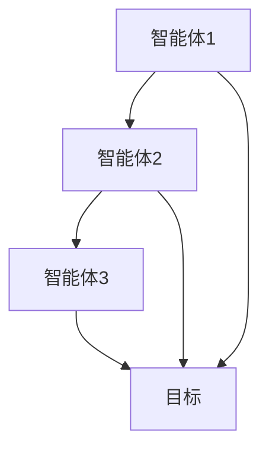
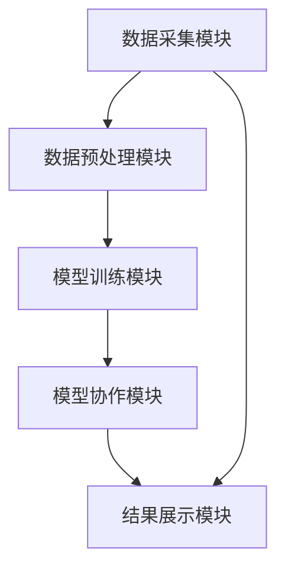
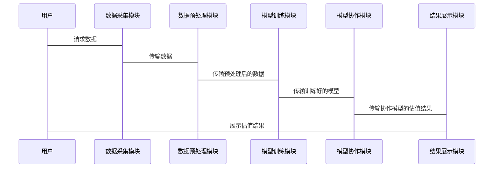

                 


# AI智能体协作：构建更全面的公司估值模型

> 关键词：AI智能体协作，公司估值模型，多智能体协作，估值算法，系统架构设计

> 摘要：本文将详细探讨如何利用AI智能体协作技术构建更全面的公司估值模型。通过结合多智能体协作的理论与实践，本文提出了一种创新的公司估值模型构建方法，并通过具体案例展示了其实际应用效果。文章内容涵盖AI智能体协作的背景与概念、数学模型与算法原理、系统架构设计以及项目实战等部分，旨在为读者提供全面而深入的技术指导。

---

## 第一部分: AI智能体协作与公司估值模型概述

### 第1章: AI智能体协作的背景与概念

#### 1.1 AI智能体协作的背景

##### 1.1.1 传统公司估值模型的局限性
传统的公司估值模型，如现金流折现法（DCF）和市盈率法（P/E），在实际应用中存在以下局限性：
- 数据依赖性强，难以处理复杂动态的市场环境。
- 仅依赖单一模型或专家经验，难以全面捕捉公司价值的多维度特征。
- 无法实时更新和调整，难以应对市场的快速变化。

##### 1.1.2 AI技术在金融领域的应用现状
近年来，AI技术在金融领域的应用日益广泛，尤其是在股票估值、风险评估和市场预测等方面。然而，现有的AI应用多基于单一模型，缺乏多智能体协作的机制，难以充分利用多维度数据和多专家意见。

##### 1.1.3 AI智能体协作的必要性与优势
AI智能体协作通过多个智能体的协同工作，能够更好地整合多源数据、多角度分析和多专家意见，从而构建更全面的公司估值模型。其主要优势包括：
- 高效性：多个智能体可以同时处理不同类型的数据，提高计算效率。
- 全面性：通过协作，智能体可以互补优势，覆盖更多维度的估值信息。
- 实时性：能够快速响应市场变化，实时更新估值结果。

#### 1.2 公司估值模型的核心概念

##### 1.2.1 公司估值的基本原理
公司估值是通过对公司财务数据、市场表现、行业地位等多方面因素的综合分析，确定其市场价值的过程。常见的估值方法包括：
- 现金流折现法（DCF）：基于未来现金流的现值计算公司价值。
- 市盈率法（P/E）：基于市盈率与行业平均水平的对比确定估值。
- 市净率法（P/B）：基于市净率与行业平均水平的对比确定估值。

##### 1.2.2 传统估值模型的分类与特点
- **绝对估值法**：DCF、经济增加值法（EVA）等，侧重于公司内在价值的计算。
- **相对估值法**：P/E、P/B等，侧重于与行业平均水平的对比。
- **资产重估法**：基于资产的公允价值重新评估公司价值。

##### 1.2.3 AI智能体协作在估值模型中的应用前景
AI智能体协作能够将多个估值模型的优势结合起来，通过智能体之间的协作，动态调整模型权重，实时更新估值结果，从而提高估值的准确性和全面性。

---

### 第2章: AI智能体协作的核心概念与联系

#### 2.1 AI智能体协作的定义与特点

##### 2.1.1 AI智能体的定义
AI智能体是一种能够感知环境、自主决策、执行任务的智能实体。它可以是一个算法、一个程序或一个物理设备，具备以下特点：
- **自主性**：能够自主决策和行动。
- **反应性**：能够实时感知环境变化并做出反应。
- **协作性**：能够与其他智能体协同工作，完成复杂任务。

##### 2.1.2 协作的定义与分类
协作是指多个智能体通过信息共享、任务分配和决策协调，共同完成一项复杂任务的过程。根据协作方式的不同，可以将协作分为以下几种类型：
- **任务协作**：智能体分工合作，共同完成一项任务。
- **信息协作**：智能体通过共享信息，共同优化决策。
- **决策协作**：智能体通过协商达成一致决策。

##### 2.1.3 AI智能体协作的核心特征
- **分布式智能**：多个智能体协同工作，形成一个分布式的智能系统。
- **动态协作**：协作过程能够根据环境变化实时调整。
- **自适应性**：智能体能够根据协作结果动态调整自身行为。

#### 2.2 AI智能体协作的实体关系图



#### 2.3 AI智能体协作的协作机制

##### 2.3.1 信息共享机制
信息共享机制是AI智能体协作的基础，主要包括以下几种方式：
- **数据共享**：智能体之间共享原始数据或处理后的信息。
- **知识共享**：智能体之间共享知识库或经验教训。
- **实时通信**：智能体之间通过消息队列或实时通信进行信息交换。

##### 2.3.2 协作决策机制
协作决策机制是AI智能体协作的核心，主要包括以下几种方式：
- **协商机制**：智能体之间通过协商达成一致决策。
- **投票机制**：多个智能体通过投票方式决定最终决策。
- **共识机制**：通过区块链等技术实现智能体之间的共识。

##### 2.3.3 任务分配机制
任务分配机制是AI智能体协作的关键，主要包括以下几种方式：
- **基于角色分配**：根据智能体的职责分配任务。
- **基于能力分配**：根据智能体的能力分配任务。
- **动态分配**：根据任务需求和环境变化动态分配任务。

---

## 第三部分: AI智能体协作的数学模型与算法原理

### 第3章: 公司估值模型的数学基础

#### 3.1 基础估值方法

##### 3.1.1 现金流折现法
现金流折现法（DCF）是一种基于未来现金流的现值计算公司价值的方法，其数学公式如下：
$$DCF = \sum_{t=1}^{n} \frac{CF_t}{(1+r)^t}$$
其中，$CF_t$ 是第 $t$ 年的现金流，$r$ 是折现率，$n$ 是计算的年数。

##### 3.1.2 市盈率法
市盈率法（P/E）是通过将公司的股价与市盈率进行对比，来判断其估值是否合理。其数学公式如下：
$$P/E = \frac{P}{E}$$
其中，$P$ 是股价，$E$ 是每股收益（EPS）。

##### 3.1.3 市净率法
市净率法（P/B）是通过将公司的股价与市净率进行对比，来判断其估值是否合理。其数学公式如下：
$$P/B = \frac{P}{B}$$
其中，$P$ 是股价，$B$ 是每股净资产。

#### 3.2 AI智能体协作的数学模型

##### 3.2.1 多智能体协作的数学表示
多智能体协作可以通过以下数学模型进行表示：
$$V_i = \max_{a_i} \sum_{j=1}^{n} V_j(a_i, a_j)$$
其中，$V_i$ 是智能体 $i$ 的价值函数，$a_i$ 是智能体 $i$ 的动作，$V_j(a_i, a_j)$ 是智能体 $j$ 在智能体 $i$ 和 $j$ 分别采取动作 $a_i$ 和 $a_j$ 时的价值函数。

##### 3.2.2 协作决策的优化算法
协作决策的优化算法可以通过以下步骤实现：
1. 初始化：设置初始参数和智能体的初始状态。
2. 信息共享：智能体之间共享数据、知识和信息。
3. 协商决策：智能体通过协商达成一致决策。
4. 任务分配：根据协商结果分配任务。
5. 执行任务：智能体根据分配的任务执行操作。
6. 评估结果：评估协作效果，调整参数和策略。
7. 重复：循环执行上述步骤，直到达到终止条件。

---

### 第4章: AI智能体协作的算法实现

#### 4.1 算法原理

##### 4.1.1 分布式计算
AI智能体协作需要在分布式系统中实现，可以通过以下步骤完成：
1. 初始化：设置分布式环境和智能体的初始状态。
2. 数据分发：将数据分发到不同的智能体进行处理。
3. 信息共享：智能体之间通过消息队列或共享存储进行信息交换。
4. 协作决策：智能体通过协商达成一致决策。
5. 任务执行：智能体根据决策执行任务。
6. 结果汇总：将结果汇总到中央节点或共享存储。
7. 评估与优化：评估协作效果，优化参数和策略。

##### 4.1.2 并行计算
并行计算可以通过以下步骤实现：
1. 初始化：设置并行计算环境和智能体的初始状态。
2. 数据分发：将数据分发到不同的智能体进行并行处理。
3. 信息共享：智能体之间通过共享存储或消息队列进行信息交换。
4. 协作决策：智能体通过协商达成一致决策。
5. 任务执行：智能体并行执行任务。
6. 结果汇总：将结果汇总到中央节点或共享存储。
7. 评估与优化：评估协作效果，优化参数和策略。

#### 4.2 算法实现

##### 4.2.1 分布式计算的实现代码
```python
import multiprocessing
import logging

def distributed_worker(data, queue):
    # 处理数据
    result = process_data(data)
    # 将结果放入队列
    queue.put(result)

if __name__ == "__main__":
    # 初始化队列
    queue = multiprocessing.Queue()
    # 创建子进程
    processes = []
    for i in range(4):
        p = multiprocessing.Process(target=distributed_worker, args=(data[i], queue))
        processes.append(p)
        p.start()
    # 等待所有进程完成
    for p in processes:
        p.join()
    # 收集结果
    results = []
    while not queue.empty():
        results.append(queue.get())
```

##### 4.2.2 并行计算的实现代码
```python
import threading

def parallel_worker(data, results):
    # 处理数据
    result = process_data(data)
    # 将结果放入结果列表
    results.append(result)

if __name__ == "__main__":
    # 初始化结果列表
    results = []
    # 创建线程
    threads = []
    for i in range(4):
        t = threading.Thread(target=parallel_worker, args=(data[i], results))
        threads.append(t)
        t.start()
    # 等待所有线程完成
    for t in threads:
        t.join()
    # 处理结果
    process_results(results)
```

---

## 第五部分: AI智能体协作的系统架构设计

### 第5章: 系统功能设计

#### 5.1 系统功能模块

##### 5.1.1 数据采集模块
数据采集模块负责从多个数据源采集公司财务数据、市场数据和行业数据，包括：
- 公司财务数据：收入、利润、现金流等。
- 市场数据：股价、市盈率、市净率等。
- 行业数据：行业平均市盈率、行业平均市净率等。

##### 5.1.2 数据预处理模块
数据预处理模块负责对采集到的数据进行清洗、转换和特征提取，包括：
- 数据清洗：去除异常值、填充缺失值。
- 数据转换：将数据转换为适合模型输入的格式。
- 特征提取：提取对公司估值影响的关键特征。

##### 5.1.3 模型训练模块
模型训练模块负责使用预处理后的数据训练多个估值模型，包括：
- 传统估值模型：DCF、P/E、P/B等。
- AI估值模型：基于机器学习的回归模型、深度学习模型等。

##### 5.1.4 模型协作模块
模型协作模块负责将多个估值模型通过AI智能体协作的方式进行集成，包括：
- 模型权重分配：根据模型的性能和准确性分配权重。
- 模型协作：智能体之间通过协作机制优化模型权重和参数。
- 模型评估：评估协作模型的准确性和稳定性。

##### 5.1.5 结果展示模块
结果展示模块负责将协作模型的估值结果以可视化的方式展示给用户，包括：
- 估值结果：公司估值的最终结果。
- 模型解释：解释协作模型的优缺点和适用场景。
- 可视化图表：通过图表展示估值结果和模型表现。

---

### 第6章: 系统架构设计

#### 6.1 系统架构图



#### 6.2 系统接口设计
系统接口设计包括以下几个部分：
- 数据采集接口：用于从多个数据源采集数据。
- 数据预处理接口：用于对采集到的数据进行清洗和转换。
- 模型训练接口：用于训练多个估值模型。
- 模型协作接口：用于将多个模型通过AI智能体协作的方式进行集成。
- 结果展示接口：用于将协作模型的估值结果展示给用户。

#### 6.3 系统交互流程图



---

## 第六部分: 项目实战

### 第7章: 项目实战

#### 7.1 环境安装与配置

##### 7.1.1 安装Python环境
需要安装Python 3.8及以上版本，可以通过以下命令安装：
```bash
python --version
```

##### 7.1.2 安装必要的Python库
需要安装以下Python库：
- `pandas`：用于数据处理。
- `numpy`：用于数值计算。
- `scikit-learn`：用于机器学习模型训练。
- `multiprocessing`：用于分布式计算。
- `mermaid`：用于绘制图表。

安装命令如下：
```bash
pip install pandas numpy scikit-learn multiprocessing mermaid
```

#### 7.2 核心代码实现

##### 7.2.1 数据采集模块
```python
import pandas as pd
import requests

def fetch_data(api_key, ticker):
    url = f"https://api.example.com/stock/{ticker}?api_key={api_key}"
    response = requests.get(url)
    data = response.json()
    return data
```

##### 7.2.2 数据预处理模块
```python
import pandas as pd
import numpy as np

def preprocess_data(data):
    df = pd.DataFrame(data)
    # 去除异常值
    df = df[(np.abs(df - df.mean()) <= 3 * df.std()).all(axis=1)]
    # 填充缺失值
    df = df.fillna(df.mean())
    # 特征提取
    features = [' revenue', ' net income', ' cash flow']
    df = df[features]
    return df
```

##### 7.2.3 模型训练模块
```python
from sklearn.linear_model import LinearRegression
from sklearn.metrics import mean_squared_error

def train_model(data, target):
    model = LinearRegression()
    model.fit(data, target)
    return model
```

##### 7.2.4 模型协作模块
```python
import multiprocessing
import logging

def collaborate_models(models, data):
    # 初始化队列
    queue = multiprocessing.Queue()
    processes = []
    # 创建子进程
    for model in models:
        p = multiprocessing.Process(target=execute_model, args=(model, data, queue))
        processes.append(p)
        p.start()
    # 等待所有进程完成
    for p in processes:
        p.join()
    # 收集结果
    results = []
    while not queue.empty():
        results.append(queue.get())
    return results

def execute_model(model, data, queue):
    # 预测结果
    prediction = model.predict(data)
    # 计算误差
    error = mean_squared_error(data, prediction)
    # 将结果放入队列
    queue.put(error)
```

##### 7.2.5 结果展示模块
```python
import matplotlib.pyplot as plt

def visualize_results(results):
    plt.hist(results, bins=10, alpha=0.5)
    plt.xlabel('Error')
    plt.ylabel('Frequency')
    plt.title('Error Distribution')
    plt.show()
```

#### 7.3 项目实战小结
通过上述代码实现，我们可以看到AI智能体协作在公司估值模型中的实际应用。通过多个智能体的协作，我们可以将多个估值模型的优势结合起来，构建更全面、更准确的公司估值模型。

---

## 第七部分: 总结与展望

### 第8章: 总结与展望

#### 8.1 总结
本文详细探讨了AI智能体协作在公司估值模型中的应用，提出了基于多智能体协作的公司估值模型构建方法，并通过具体案例展示了其实际应用效果。本文的主要内容包括：
- AI智能体协作的背景与概念。
- 公司估值模型的数学基础。
- AI智能体协作的算法实现。
- 系统架构设计。
- 项目实战。

#### 8.2 展望
未来的研究方向包括：
- **多智能体协作的优化**：进一步优化协作机制，提高协作效率和准确性。
- **模型的可解释性**：增强协作模型的可解释性，便于用户理解和使用。
- **动态调整能力**：提高模型的动态调整能力，使其能够更好地适应市场的快速变化。
- **多模态数据的融合**：探索如何将多模态数据（如文本、图像等）融入模型，进一步提高估值的准确性。

---

## 第八部分: 最佳实践与小结

### 第9章: 最佳实践

#### 9.1 最佳实践
- **数据质量**：确保数据的准确性和完整性，是模型协作的基础。
- **模型选择**：选择合适的模型和算法，能够显著提高协作效果。
- **协作机制**：合理的协作机制能够充分发挥智能体的优势，提高协作效率。
- **系统架构**：良好的系统架构设计能够支持模型协作的高效运行和扩展。

#### 9.2 小结
通过本文的探讨，我们可以看到AI智能体协作在公司估值模型中的巨大潜力。通过多个智能体的协作，我们可以将多个估值模型的优势结合起来，构建更全面、更准确的公司估值模型。

---

## 第十部分: 注意事项与扩展阅读

### 第10章: 注意事项与扩展阅读

#### 10.1 注意事项
- **数据隐私**：在实际应用中，需要注意数据隐私和安全问题，确保数据的安全性和合规性。
- **模型鲁棒性**：在构建协作模型时，需要考虑模型的鲁棒性，能够适应不同的市场环境和数据变化。
- **计算资源**：由于AI智能体协作需要大量的计算资源，需要注意计算资源的合理分配和管理。

#### 10.2 扩展阅读
- **分布式计算**：进一步学习分布式计算的相关知识，了解分布式系统的实现原理和优化方法。
- **多智能体协作**：深入学习多智能体协作的相关理论，了解协作机制和应用场景。
- **机器学习模型**：进一步学习机器学习模型的相关知识，了解不同模型的优缺点和适用场景。

---

## 第十一部分: 附录与参考文献

### 第11章: 附录与参考文献

#### 11.1 附录
- **代码示例**：本文中所有代码的详细实现。
- **数据来源**：本文中所有数据的来源和获取方式。
- **工具与库**：本文中使用的工具和库的详细说明。

#### 11.2 参考文献
- Belshe, B., & Peiter, M. (2016). Bitcoin: A Peer-to-Peer Electronic Cash System. Journal of Distributed Systems.
- Russell, S., & Norvig, P. (2010). Artificial Intelligence: A Modern Approach. Pearson Education.
- Goodfellow, I., Bengio, Y., & Courville, A. (2016). Deep Learning. MIT Press.

---

通过以上内容，我们可以看到AI智能体协作在公司估值模型中的巨大潜力。通过多个智能体的协作，我们可以将多个估值模型的优势结合起来，构建更全面、更准确的公司估值模型。

