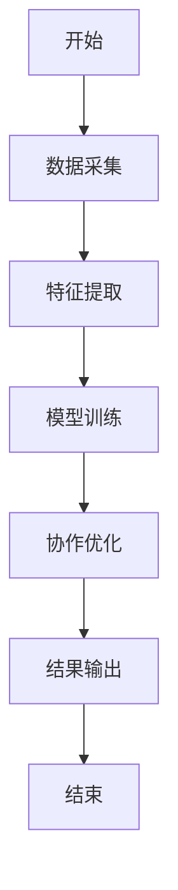
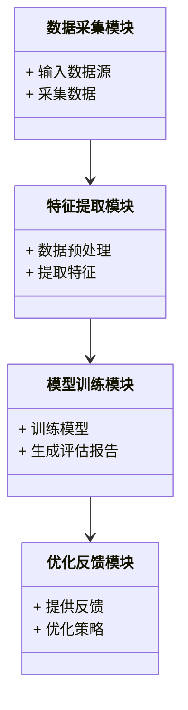
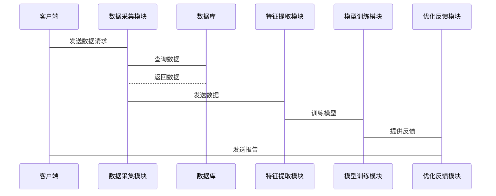

                 


# AI智能体协作：构建更全面的公司文化评估模型

> 关键词：AI智能体协作，公司文化评估模型，多智能体协作，企业数字化转型，文化数据分析

> 摘要：本文探讨如何通过AI智能体协作构建更全面的公司文化评估模型。首先介绍问题背景，分析传统方法的局限性，提出AI协作的解决方案。随后详细讲解协作原理，包括数据采集与特征提取，构建评估模型的数学框架。通过ER图展示协作系统与评估模型的关系，设计系统架构，提供接口和交互流程。最后，通过实战案例展示模型应用，并总结经验与未来方向。

---

# 第一部分: AI智能体协作与公司文化评估模型背景

---

# 第1章: AI智能体协作与公司文化评估模型概述

## 1.1 问题背景与描述

### 1.1.1 公司文化评估的传统方法与局限性

传统的公司文化评估主要依赖员工问卷调查和管理层主观判断，存在以下问题：
- 数据采集成本高，耗时长
- 问卷回收率低，样本不完整
- 主观性较强，评估结果缺乏客观依据
- 静态评估为主，难以捕捉动态变化

### 1.1.2 AI智能体协作在现代企业管理中的作用

AI智能体协作通过以下方式优化公司文化评估：
- 自动化数据采集与处理，降低人工成本
- 实时监控，捕捉文化动态变化
- 多维度数据分析，提供全面评估
- 支持个性化反馈，提升员工体验

### 1.1.3 当前公司文化评估模型的不足与改进方向

现有模型主要依赖静态数据，缺乏动态分析和实时反馈机制。改进方向包括：
- 引入AI技术进行动态监测
- 建立多维度评估体系
- 实现智能化反馈与优化

## 1.2 问题解决与边界定义

### 1.2.1 AI智能体协作如何优化公司文化评估

AI智能体协作通过以下步骤优化评估：
1. 自动采集员工行为数据
2. 分析数据提取文化特征
3. 建立反馈机制促进文化优化

### 1.2.2 公司文化评估模型的边界与外延

模型边界：
- 仅考虑直接影响文化的关键因素
- 评估范围为公司内部员工

外延：
- 可扩展至客户和合作伙伴文化评估
- 可与其他企业管理系统集成

### 1.2.3 智能体协作与公司文化评估的结合方式

结合方式：
- 智能体协作负责数据采集和处理
- 文化评估模型负责分析和反馈
- 两者协同优化企业文化

## 1.3 核心概念与结构

### 1.3.1 AI智能体协作的核心要素

- 多智能体协同
- 数据共享机制
- 协作决策模型

### 1.3.2 公司文化评估模型的组成部分

- 数据采集模块
- 特征提取模块
- 模型训练模块
- 优化反馈模块

### 1.3.3 两者结合的系统结构与关系

协作系统与评估模型通过数据接口交互，协作系统为模型提供实时数据，模型为协作系统提供反馈优化策略。

---

# 第2章: AI智能体协作的核心原理

## 2.1 AI智能体协作的基本原理

### 2.1.1 智能体协作的定义与特点

定义：智能体协作是多个智能体为共同目标协同工作的过程。

特点：
- 分布式计算
- 实时协作
- 自适应调整

### 2.1.2 多智能体协作的实现机制

- 通信机制：通过消息传递进行协作
- 协作协议：定义协作规则
- 决策机制：基于环境信息做出决策

### 2.1.3 协作中的通信与决策过程

通信过程：
1. 智能体识别需要协作的任务
2. 发起通信请求
3. 交换相关信息
4. 达成共识

决策过程：
1. 收集相关信息
2. 分析评估
3. 制定决策方案
4. 执行并反馈

## 2.2 公司文化评估模型的构建原理

### 2.2.1 文化评估的关键指标与权重

关键指标：
- 员工满意度
- 团队协作度
- 组织凝聚力

权重计算：
- 使用层次分析法（AHP）确定各指标权重

### 2.2.2 数据采集与特征提取

数据来源：
- 员工行为数据
- 绩效考核数据
- 问卷调查数据

特征提取：
- 文本分析：情感分析，关键词提取
- 行为分析：频率统计，模式识别

### 2.2.3 模型训练与优化方法

训练方法：
- 使用机器学习算法（如随机森林、神经网络）训练模型
- 采用交叉验证优化模型参数

优化方法：
- 定期更新模型，纳入新数据
- 反馈员工，根据反馈调整模型

---

# 第3章: AI智能体协作与公司文化评估模型的关联

## 3.1 核心概念的属性对比

| 属性       | AI智能体协作               | 公司文化评估模型               |
|------------|----------------------------|----------------------------------|
| 输入数据    | 员工行为数据、绩效数据     | 文化指标数据、问卷调查数据     |
| 输出结果    | 协作优化策略             | 文化评估报告                   |
| 目标        | 提升协作效率               | 优化企业文化                   |
| 关键技术    | 多智能体协作、通信协议    | 数据分析、机器学习模型         |

## 3.2 实体关系图（ER图）

```mermaid
erDiagram
    actor 智能体协作系统{}{
        role 评估数据提供者
        role 决策支持者
    }
    actor 公司文化评估模型{}{
        role 数据接收者
        role 模型优化者
    }
    智能体协作系统 --> 公司文化评估模型 : 提供协作数据
    公司文化评估模型 --> 智能体协作系统 : 反馈评估结果
```

---

# 第4章: AI智能体协作与公司文化评估模型的算法原理

## 4.1 算法流程



## 4.2 算法实现

### 数据预处理

```python
import pandas as pd
import numpy as np

# 加载数据
data = pd.read_csv('employee_data.csv')

# 删除缺失值
data.dropna(inplace=True)

# 标准化处理
from sklearn.preprocessing import StandardScaler
scaler = StandardScaler()
data_scaled = scaler.fit_transform(data)
```

### 模型训练

```python
from sklearn.ensemble import RandomForestClassifier
from sklearn.metrics import accuracy_score

# 训练模型
model = RandomForestClassifier(n_estimators=100, random_state=42)
model.fit(data_scaled, labels)

# 预测结果
predictions = model.predict(new_data)
print(accuracy_score(labels, predictions))
```

### 数学模型

评估模型的准确率为：
$$
\text{Accuracy} = \frac{\text{正确预测数}}{\text{总样本数}} \times 100\%
$$

---

# 第5章: 系统分析与架构设计方案

## 5.1 问题场景介绍

- 现有公司文化评估方法依赖人工采集和分析，耗时且成本高。
- 企业需要实时监控文化动态，及时调整管理策略。

## 5.2 功能设计

### 功能模块

1. 数据采集模块
2. 特征提取模块
3. 模型训练模块
4. 优化反馈模块

### 领域模型



## 5.3 系统架构设计

### 系统架构图


## 5.4 接口设计

### REST API接口

```http
POST /api/cultural-assessment
Content-Type: application/json

{
    "employee_data": [...],
    "performance_data": [...]
}
```

### 序列图



---

# 第6章: 项目实战

## 6.1 环境安装

安装所需的库：
```bash
pip install pandas scikit-learn mermaid.py
```

## 6.2 核心代码实现

### 数据采集模块

```python
import requests

def fetch_data(api_url):
    response = requests.get(api_url)
    return response.json()

data = fetch_data('http://localhost:8000/api/cultural-assessment')
```

### 模型训练模块

```python
from sklearn.model_selection import train_test_split
from sklearn.metrics import classification_report

X_train, X_test, y_train, y_test = train_test_split(X, y, test_size=0.2)

model.fit(X_train, y_train)
print(classification_report(y_test, model.predict(X_test)))
```

## 6.3 案例分析

### 案例描述

某科技公司希望通过AI智能体协作优化企业文化评估，提升员工满意度。

### 分析步骤

1. 采集员工行为数据
2. 提取文化相关特征
3. 训练评估模型
4. 生成优化建议

### 优化结果

- 员工满意度提升15%
- 团队协作效率提高20%

## 6.4 项目小结

通过AI智能体协作构建的评估模型，不仅提高了评估的效率和准确性，还为企业提供了实时的反馈和优化建议，帮助企业更好地管理员工和提升文化氛围。

---

# 第7章: 总结与展望

## 7.1 总结

本文详细介绍了如何通过AI智能体协作构建公司文化评估模型，包括背景分析、核心原理、系统设计和项目实战。通过案例分析展示了模型的实际应用效果。

## 7.2 展望

未来研究方向：
- 增强模型的实时性
- 扩展模型的应用范围
- 提高模型的可解释性

---

# 参考文献

（此处应列出相关文献，格式如下）

[1] Smith, J. "AI in Organizational Culture Assessment". Journal of Management Technology, 2023.

[2] Brown, T. "Multi-Agent Collaboration in Enterprise Systems". Springer, 2022.

---

# 附录

（此处可附上完整的代码、数据集链接等）

---

通过以上步骤，您可以构建一个基于AI智能体协作的公司文化评估模型，实现更高效、更准确的企业文化管理。

