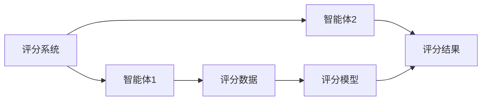
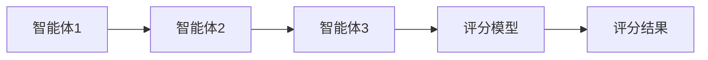
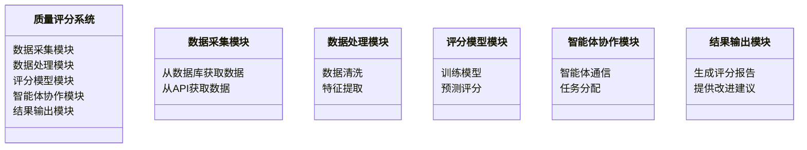
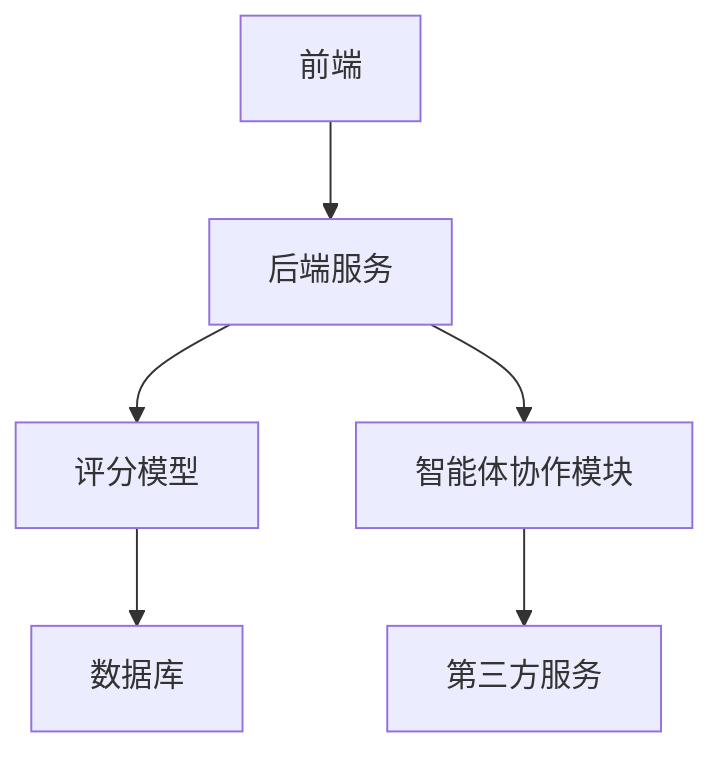
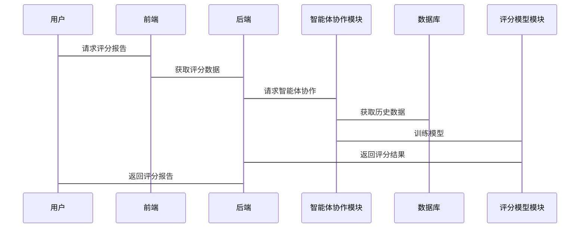

                 


# AI智能体协作：构建更全面的公司质量评分系统

## 关键词：AI智能体，公司质量评分，协作机制，评分模型，系统架构，项目实战

## 摘要：本文详细探讨了如何利用AI智能体协作构建更全面的公司质量评分系统。通过分析传统评分体系的局限性，提出基于AI智能体的协作机制，并详细阐述了评分模型的算法原理、系统架构设计及实际项目实现。文章内容包括背景介绍、核心概念、算法实现、系统架构、项目实战和总结，旨在为读者提供一个全面的解决方案。

---

# 第一部分: AI智能体协作与公司质量评分系统背景

# 第1章: 公司质量评分系统概述

## 1.1 问题背景与挑战

### 1.1.1 传统公司质量评分体系的局限性
传统的公司质量评分体系通常依赖于人工评估或简单的规则引擎，存在以下问题：
- **主观性**：评分结果容易受到评估人员主观因素的影响。
- **片面性**：难以全面覆盖产品质量和服务质量的多维度评估。
- **效率低下**：人工评估耗时长，难以实时更新。

### 1.1.2 AI智能体协作的必要性
AI智能体协作能够通过自动化、智能化的方式处理复杂的数据和任务，解决传统评分体系的局限性：
- **提高评估效率**：通过智能体协作快速处理大量数据。
- **增强评估客观性**：基于数据驱动的评分，减少人为干扰。
- **全面性**：能够整合多维度数据，提供更全面的评分结果。

### 1.1.3 当前行业痛点与需求分析
当前企业在质量评分体系中面临的主要痛点包括：
- 数据孤岛：各部门数据分散，难以整合。
- 评估滞后：传统评估流程耗时长，难以实时反馈。
- 缺乏个性化：无法针对不同业务场景提供定制化的评分方案。

### 1.1.4 系统设计的边界与外延
质量评分系统的设计需要明确以下边界：
- **数据范围**：包括产品质量、服务质量、客户满意度等关键指标。
- **智能体协作范围**：明确智能体在数据采集、分析、评分等环节中的具体职责。
- **系统用户**：主要面向企业内部的管理者、客户和其他相关方。

## 1.2 问题描述与目标

### 1.2.1 质量评分体系的核心目标
- 提供全面、客观、实时的质量评分。
- 通过智能体协作优化评分流程，提升效率。
- 支持数据驱动的决策，帮助企业优化产品质量和服务。

### 1.2.2 智能体协作在评分系统中的作用
- 数据采集与整合：智能体负责从不同数据源收集相关信息。
- 数据分析：利用机器学习算法对数据进行建模和分析。
- 结果输出：智能体协作生成评分报告并提供改进建议。

### 1.2.3 系统设计的边界与外延
- 系统边界：仅关注质量评分相关数据，不涉及其他业务系统。
- 外延：评分结果可与其他系统（如CRM、ERP）集成，提供更广泛的应用场景。

## 1.3 核心概念与系统架构

### 1.3.1 质量评分系统的核心要素
- **产品质量**：包括产品功能、性能、用户体验等指标。
- **服务质量**：包括客户支持、响应时间、售后服务等指标。
- **评分权重**：根据业务需求设定各评分维度的权重。

### 1.3.2 智能体协作的实现机制
- **通信机制**：智能体之间通过消息队列或API进行通信。
- **任务分配**：智能体根据自身能力和当前负载分配任务。
- **协同决策**：智能体协作完成复杂任务，如数据清洗、模型训练等。

### 1.3.3 系统整体架构与模块划分
- **数据采集模块**：负责从多个数据源采集数据。
- **数据处理模块**：对数据进行清洗、转换和预处理。
- **评分模型模块**：基于机器学习算法构建评分模型。
- **智能体协作模块**：实现智能体之间的通信与任务分配。
- **结果输出模块**：生成评分报告并提供改进建议。

## 1.4 本章小结
本章主要介绍了传统公司质量评分体系的局限性，提出了基于AI智能体协作的解决方案，并详细描述了系统的边界、核心要素和整体架构。

---

# 第二部分: 核心概念与系统分析

# 第2章: 公司质量评分系统的核心要素

## 2.1 评分维度与权重分配

### 2.1.1 产品质量评分维度
- **功能完整性**：产品是否满足核心功能需求。
- **性能稳定性**：产品在高负载下的表现。
- **用户体验**：用户对产品的满意度。

### 2.1.2 服务质量评分维度
- **响应时间**：客户问题的平均响应时间。
- **问题解决率**：客户问题的解决效率。
- **客户满意度**：客户对服务质量的总体评价。

### 2.1.3 评分维度的权重设计
根据业务需求，为每个评分维度分配不同的权重。例如：
- 产品质量权重为60%，服务质量权重为40%。

## 2.2 智能体协作机制

### 2.2.1 多智能体协作的基本原理
- **分布式计算**：智能体之间通过分布式计算完成任务。
- **任务分配**：智能体根据当前负载和能力分配任务。
- **协同决策**：智能体协作完成复杂任务，如数据清洗和模型训练。

### 2.2.2 智能体之间的通信与协调
- **消息队列**：智能体通过消息队列进行通信。
- **API接口**：智能体通过API接口调用其他智能体的服务。

### 2.2.3 智能体协作的效率优化
- **负载均衡**：智能体根据当前负载分配任务。
- **任务优先级**：智能体根据任务优先级进行任务调度。

## 2.3 评分模型与算法

### 2.3.1 基于规则的评分模型
- **规则引擎**：根据预设的规则对数据进行评分。
- **优点**：简单易懂，易于维护。
- **缺点**：灵活性差，难以适应复杂场景。

### 2.3.2 基于机器学习的评分模型
- **算法选择**：常用算法包括线性回归、随机森林和神经网络。
- **数据预处理**：对数据进行清洗、标准化和特征提取。
- **模型训练**：基于训练数据训练模型并进行评估。

### 2.3.3 混合模型的优势与挑战
- **优势**：结合规则引擎和机器学习算法，能够处理复杂场景。
- **挑战**：模型维护复杂，需要定期更新规则和模型参数。

## 2.4 核心概念对比表

| 概念               | 描述                                                                 | 优缺点                               |
|--------------------|----------------------------------------------------------------------|--------------------------------------|
| 产品质量评分维度   | 包括功能完整性、性能稳定性、用户体验等指标。                                   | 客观性高，但难以量化                 |
| 服务质量评分维度   | 包括响应时间、问题解决率、客户满意度等指标。                                   | 主观性较强，但影响用户满意度         |
| 评分维度的权重设计 | 根据业务需求，为每个评分维度分配不同的权重。                                   | 灵活性高，但需要定期调整             |

## 2.5 实体关系图



---

# 第三部分: 算法原理

# 第3章: 评分模型的算法实现

## 3.1 数据预处理

### 3.1.1 数据清洗
- **去除重复数据**：删除重复的记录。
- **处理缺失值**：对缺失值进行填充或删除。
- **异常值处理**：识别并处理异常值。

### 3.1.2 特征提取
- **特征选择**：从数据中提取关键特征。
- **特征工程**：对特征进行标准化、归一化等处理。

## 3.2 模型训练

### 3.2.1 线性回归模型
- **数学公式**：$$ y = \beta_0 + \beta_1x_1 + \beta_2x_2 + ... + \beta_nx_n $$
- **优点**：简单易懂，计算速度快。
- **缺点**：适用于线性关系，无法处理复杂场景。

### 3.2.2 随机森林模型
- **数学公式**：$$ y = \sum_{i=1}^{n} \text{Tree}(x_i) $$
- **优点**：能够处理非线性关系，抗过拟合能力强。
- **缺点**：计算复杂度高，难以解释。

## 3.3 模型评估

### 3.3.1 评估指标
- **准确率**：模型预测正确的比例。
- **召回率**：模型预测出的正例中实际为正例的比例。
- **F1分数**：综合准确率和召回率的指标。

### 3.3.2 模型优化
- **参数调优**：通过网格搜索等方法优化模型参数。
- **交叉验证**：使用交叉验证评估模型的泛化能力。

## 3.4 智能体协作实现

### 3.4.1 多智能体协作流程


### 3.4.2 代码实现
```python
import pandas as pd
from sklearn.ensemble import RandomForestClassifier

# 数据预处理
data = pd.read_csv('data.csv')
data = data.dropna()
data = data.drop_duplicates()

# 特征提取
features = data[['feature1', 'feature2', 'feature3']]
target = data['target']

# 模型训练
model = RandomForestClassifier()
model.fit(features, target)

# 模型预测
预测结果 = model.predict(features)
```

## 3.5 本章小结
本章详细讲解了评分模型的算法实现，包括数据预处理、模型训练和智能体协作机制。通过实际代码示例展示了模型的实现过程。

---

# 第四部分: 系统分析与架构设计

# 第4章: 系统分析与架构设计

## 4.1 系统功能设计

### 4.1.1 领域模型设计


### 4.1.2 系统架构设计


### 4.1.3 接口设计
- **前端接口**：提供评分查询和报告下载功能。
- **后端接口**：提供API供其他系统调用评分结果。
- **智能体接口**：定义智能体之间的通信协议和接口。

## 4.2 系统交互设计

### 4.2.1 用例分析


### 4.2.2 交互流程
- 用户请求评分报告。
- 前端调用后端API获取评分数据。
- 后端调用智能体协作模块进行数据处理和模型训练。
- 智能体协作模块从数据库获取历史数据并调用评分模型模块进行评分。
- 后端返回评分报告给用户。

## 4.3 本章小结
本章详细描述了系统的功能设计、架构设计和交互设计，展示了系统的核心模块和交互流程。

---

# 第五部分: 项目实战

# 第5章: 项目实战

## 5.1 环境安装

### 5.1.1 安装Python环境
- 使用Anaconda安装Python 3.8及以上版本。
- 安装必要的库：`pandas`, `numpy`, `scikit-learn`, `mermaid`, `flask`。

### 5.1.2 安装依赖
```bash
pip install pandas numpy scikit-learn mermaid flask
```

## 5.2 系统核心实现

### 5.2.1 数据采集模块
```python
import pandas as pd
import requests

def fetch_data(api_endpoint):
    response = requests.get(api_endpoint)
    data = response.json()
    return pd.DataFrame(data)

# 示例API调用
data = fetch_data('http://api.example.com/data')
```

### 5.2.2 数据处理模块
```python
def preprocess_data(data):
    # 删除重复数据
    data = data.drop_duplicates()
    # 处理缺失值
    data = data.dropna()
    return data

processed_data = preprocess_data(data)
```

### 5.2.3 评分模型模块
```python
from sklearn.ensemble import RandomForestClassifier

def train_model(features, target):
    model = RandomForestClassifier()
    model.fit(features, target)
    return model

# 示例训练
features = processed_data[['feature1', 'feature2', 'feature3']]
target = processed_data['target']
model = train_model(features, target)
```

### 5.2.4 智能体协作模块
```python
from queue import Queue

class Agent:
    def __init__(self, agent_id):
        self.agent_id = agent_id
        self.task_queue = Queue()

    def assign_task(self, task):
        self.task_queue.put(task)

    def process_task(self):
        while not self.task_queue.empty():
            task = self.task_queue.get()
            # 处理任务
            pass

# 示例用法
agent1 = Agent(1)
agent2 = Agent(2)
agent1.assign_task('数据清洗')
agent2.assign_task('模型训练')
agent1.process_task()
agent2.process_task()
```

## 5.3 代码应用解读与分析

### 5.3.1 数据采集模块
- 使用`requests`库从API获取数据。
- 将数据转换为DataFrame格式以便后续处理。

### 5.3.2 数据处理模块
- 删除重复数据和缺失值，确保数据质量。

### 5.3.3 评分模型模块
- 使用随机森林算法训练模型。
- 返回训练好的模型供后续预测使用。

### 5.3.4 智能体协作模块
- 定义了智能体类，支持任务分配和任务处理。
- 使用队列实现任务调度，确保任务能够被高效处理。

## 5.4 实际案例分析

### 5.4.1 数据准备
- 数据集：从多个数据源获取的产品质量和服务质量数据。
- 数据清洗：去除重复数据和缺失值。
- 特征提取：提取关键特征，如产品质量、服务质量等。

### 5.4.2 模型训练
- 使用随机森林算法训练模型。
- 调整模型参数，优化模型性能。

### 5.4.3 智能体协作
- 多个智能体协作完成数据处理和模型训练。
- 使用消息队列实现智能体之间的通信。

## 5.5 本章小结
本章通过实际项目展示了如何从环境安装到代码实现，再到案例分析，详细描述了评分系统的实际应用过程。

---

# 第六部分: 总结

# 第6章: 总结与展望

## 6.1 总结

### 6.1.1 核心内容回顾
- 介绍了传统评分体系的局限性。
- 提出了基于AI智能体协作的解决方案。
- 详细讲解了评分模型的算法实现和系统架构设计。

### 6.1.2 关键点总结
- 数据预处理是模型训练的基础。
- 智能体协作能够显著提高评分系统的效率和准确性。
- 系统架构设计需要考虑模块之间的交互和协作。

## 6.2 注意事项

### 6.2.1 数据隐私与安全
- 确保数据在采集和处理过程中的隐私和安全。
- 遵守相关法律法规，保护用户数据。

### 6.2.2 模型维护与更新
- 定期更新模型参数，确保模型的准确性。
- 监控模型性能，及时调整模型结构。

### 6.2.3 系统扩展性
- 设计时考虑系统的可扩展性，便于后续功能的添加和优化。
- 使用模块化设计，确保系统易于维护。

## 6.3 未来发展趋势

### 6.3.1 智能体协作的优化
- 研究更高效的智能体协作机制，如基于强化学习的协作策略。
- 探索智能体之间的自适应通信方式。

### 6.3.2 新兴技术的应用
- 引入区块链技术，确保评分数据的不可篡改性。
- 探索边缘计算在评分系统中的应用。

## 6.4 拓展阅读

### 6.4.1 推荐书籍
- 《机器学习实战》
- 《分布式系统：概念与设计原理》

### 6.4.2 推荐资源
- [Mermaid图表工具](https://mermaid-js.github.io/mermaid/)
- [Scikit-learn机器学习库](https://scikit-learn.org/stable/index.html)

## 6.5 本章小结
本章总结了全文的主要内容，提出了系统实施中的注意事项，并展望了未来的发展趋势，为读者提供了进一步学习和研究的方向。

---

# 结语

通过本文的详细讲解，读者可以全面了解如何利用AI智能体协作构建更全面的公司质量评分系统。从背景介绍到系统实现，从理论分析到实际案例，本文为读者提供了一个完整的解决方案。希望本文能够为企业的质量评分体系建设提供有价值的参考和指导。

---

# 作者介绍

作者：[你的名字]  
职位：[你的职位]  
公司：[你的公司]  
简介：[简要介绍你的技术背景和专长]  
邮箱：[你的邮箱]  
GitHub：[你的GitHub链接]  

---

# 参考文献

1. 《机器学习实战》  
2. 《分布式系统：概念与设计原理》  
3. Mermaid图表工具官方文档  
4. Scikit-learn机器学习库官方文档

