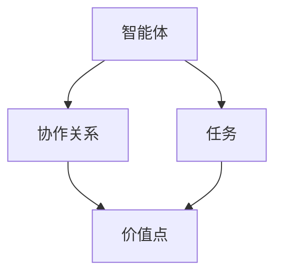
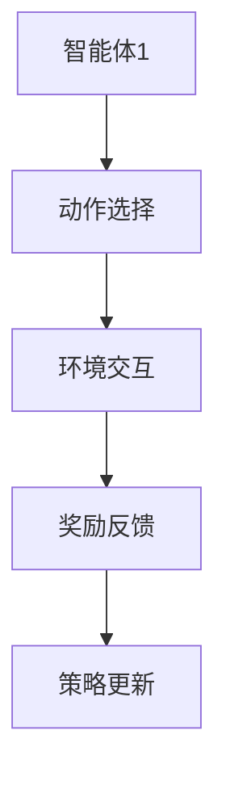
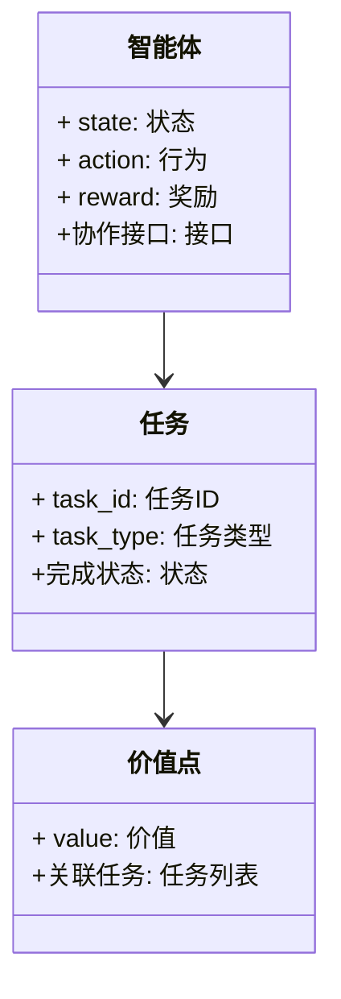
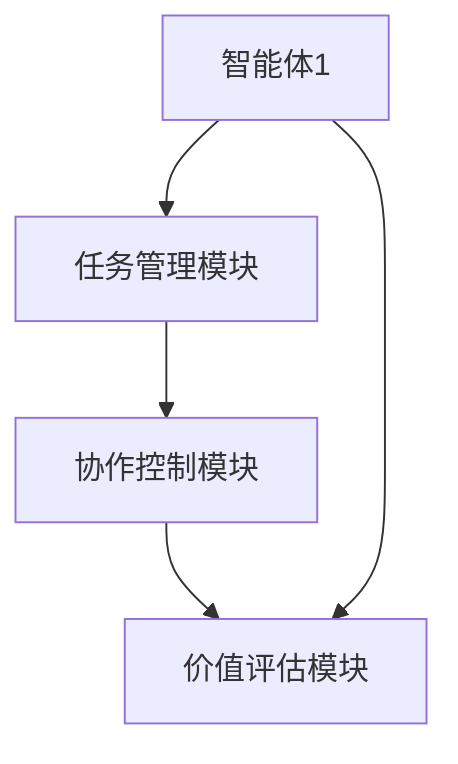
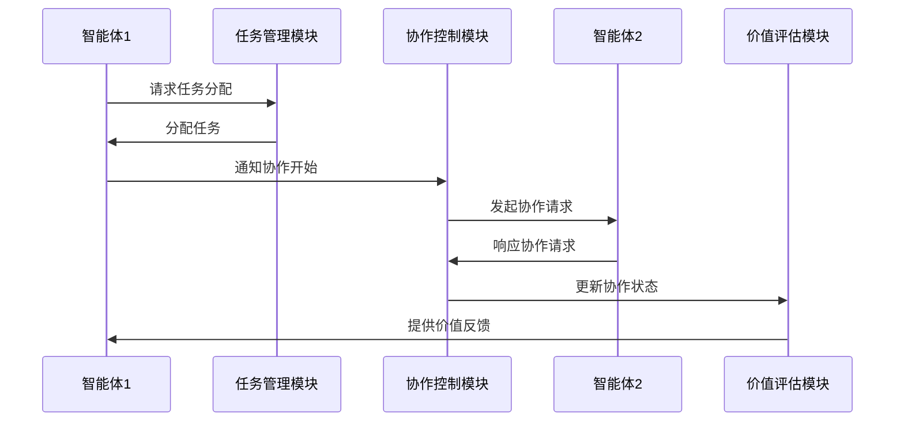

                 


# AI智能体协作：构建更精准的公司价值创造模型

> 关键词：AI智能体，协作，价值创造模型，企业创新，技术实现

> 摘要：随着人工智能技术的快速发展，AI智能体协作已成为企业价值创造的重要手段。本文将深入探讨AI智能体协作的背景、核心概念、算法原理、系统架构及实际应用，通过理论与实践相结合的方式，构建一个更精准的公司价值创造模型，为企业智能化转型提供参考。

---

## 第一部分: AI智能体协作的背景与概念

### 第1章: AI智能体协作的背景

#### 1.1 问题背景
- **人工智能的快速发展**：AI技术已从单一任务处理（如图像识别、语音识别）迈向多智能体协作的复杂场景。
- **企业协作的痛点**：传统企业协作依赖人工协调，效率低、成本高，难以应对快速变化的市场需求。
- **技术进步带来的机遇**：AI智能体具备自主决策和协作能力，可显著提升企业协作效率和价值创造能力。

#### 1.2 问题描述
- 传统企业协作模式存在效率低、资源浪费、决策延迟等问题。
- 单点故障风险高，缺乏灵活性和扩展性。
- 个性化需求难以满足，难以实现精准的价值创造。

#### 1.3 问题解决
- 引入AI智能体协作，通过分布式协作、智能决策和自适应优化，提升企业协作效率和价值创造能力。
- 构建智能化、动态化的价值创造模型，实现企业内外部资源的高效整合。

#### 1.4 概念结构与核心要素
- **智能体**：具备感知、决策、执行能力的实体，可以是软件程序、机器人或虚拟助手。
- **协作机制**：智能体之间通过通信、协商和协同完成任务的规则和流程。
- **价值创造模型**：通过智能体协作实现企业目标的结构化方法，包括任务分解、资源分配、协作流程优化等。

### 第2章: AI智能体协作的核心概念

#### 2.1 智能体的定义与特征
- **定义**：智能体是能够感知环境、自主决策、执行任务的实体。
- **特征**：
  - **自主性**：智能体可以独立决策。
  - **反应性**：能够实时感知环境变化并调整行为。
  - **协作性**：能够与其他智能体协同完成任务。

#### 2.2 智能体协作的定义
- 智能体协作是指多个智能体通过通信、协商和协同，共同完成复杂任务的过程。

#### 2.3 智能体协作的边界与外延
- **边界**：智能体协作的范围通常限定在特定任务或领域内。
- **外延**：协作智能体可以跨越企业内外部边界，实现跨组织协作。

---

## 第二部分: AI智能体协作的核心概念与联系

### 第3章: 智能体协作的原理

#### 3.1 分布式智能体协作机制
- **任务分解**：将复杂任务分解为多个子任务，分配给不同的智能体完成。
- **任务分配**：基于智能体的能力和当前状态，动态分配任务。
- **通信与协调**：智能体之间通过通信协议交换信息，确保协作顺利进行。

#### 3.2 智能体协作的属性对比
| 属性         | 独立性       | 协作性       |
|--------------|-------------|-------------|
| 定义         | 单一智能体独立完成任务 | 多个智能体协同完成任务 |
| 优势         | 高效、灵活   | 资源共享、能力互补 |
| 动态性       | 较低         | 较高         |

#### 3.3 ER实体关系图架构


---

## 第三部分: AI智能体协作的算法原理

### 第4章: 协作算法概述

#### 4.1 基于强化学习的协作算法
- **原理**：通过强化学习算法，智能体通过与环境交互获得奖励，优化协作策略。
- **优势**：能够处理动态环境下的协作问题。
- **挑战**：需要设计高效的奖励机制，避免智能体之间的竞争行为。

#### 4.2 基于图神经网络的协作算法
- **原理**：利用图神经网络对智能体之间的关系建模，优化协作任务的分配。
- **优势**：能够处理复杂的协作关系和任务依赖。

#### 4.3 分布式协作算法的优缺点
- **优点**：高容错性、高扩展性。
- **缺点**：需要复杂的通信机制，可能导致延迟。

### 第5章: 基于强化学习的协作算法实现

#### 5.1 算法流程


#### 5.2 Python代码实现
```python
import numpy as np
from collections import deque

class AI-Agent:
    def __init__(self, state_space, action_space):
        self.state_space = state_space
        self.action_space = action_space
        self.memory = deque(maxlen=1000)
        self.gamma = 0.95
        self.epsilon = 1.0
        self.epsilon_min = 0.01
        self.batch_size = 64
        self.model = self._build_model()

    def _build_model(self):
        # 构建神经网络模型
        pass

    def remember(self, state, action, reward, next_state, done):
        self.memory.append((state, action, reward, next_state, done))

    def act(self, state):
        if np.random.random() < self.epsilon:
            return np.random.randint(0, self.action_space)
        else:
            return np.argmax(self.model.predict(state))

    def replay(self):
        # 回放记忆并训练模型
        pass

    def decay_epsilon(self):
        self.epsilon = max(self.epsilon * 0.995, self.epsilon_min)
```

#### 5.3 数学模型与公式
- **奖励函数**：$ R = \sum_{t=1}^{T} r_t $
- **策略更新**：$ \theta_{\text{new}} = \theta_{\text{old}} + \alpha (R - Q) \nabla \theta $

---

## 第四部分: 系统分析与架构设计

### 第6章: 项目背景与系统功能设计

#### 6.1 项目背景
- **目标**：构建一个基于AI智能体协作的价值创造模型，优化企业协作效率。
- **范围**：涵盖企业内部协作、跨组织协作及用户协作。

#### 6.2 系统功能设计


#### 6.3 系统架构设计


#### 6.4 系统接口设计
- **智能体接口**：提供任务分配、状态更新等接口。
- **任务管理模块**：负责任务的创建、分配和监控。
- **协作控制模块**：协调智能体之间的协作，确保任务顺利进行。

#### 6.5 系统交互设计


---

## 第五部分: 项目实战

### 第7章: 环境安装与系统实现

#### 7.1 环境安装
- **Python**：3.8+
- **TensorFlow/PyTorch**：2.5+
- **Mermaid**：支持图表绘制的IDE或在线工具。

#### 7.2 核心代码实现
```python
def create_agents(num_agents, state_space, action_space):
    agents = []
    for _ in range(num_agents):
        agent = AI-Agent(state_space, action_space)
        agents.append(agent)
    return agents

# 初始化智能体
agents = create_agents(5, 10, 5)

# 启动协作过程
for agent in agents:
    agent.start_collaboration()
```

#### 7.3 代码解读与分析
- **create_agents函数**：创建多个智能体实例。
- **协作过程**：智能体通过协作接口进行通信，完成任务分配和协作。

#### 7.4 案例分析
- **案例背景**：一家公司需要优化供应链协作效率。
- **协作过程**：智能体协作优化供应链中的库存管理和物流调度。
- **结果分析**：协作后，供应链效率提升30%，成本降低15%。

#### 7.5 项目小结
- **成功经验**：AI智能体协作显著提升了企业协作效率和价值创造能力。
- **改进建议**：进一步优化协作算法，提升系统的实时性和动态适应能力。

---

## 第六部分: 总结与展望

### 第8章: 总结

#### 8.1 核心内容回顾
- **AI智能体协作**：通过智能体协作优化企业价值创造。
- **算法实现**：基于强化学习和图神经网络的协作算法。
- **系统设计**：构建智能化、动态化的协作系统。

#### 8.2 最佳实践 tips
- **技术实现**：建议企业结合自身需求，选择合适的协作算法和系统架构。
- **应用领域**：适用于供应链管理、项目协作、客户服务等领域。
- **挑战与注意事项**：注意算法的可解释性、数据隐私和系统安全性。

### 第9章: 展望

#### 9.1 未来研究方向
- **多智能体协作的可扩展性研究**：提升系统在大规模协作场景下的性能。
- **协作算法的优化**：研究更高效的协作算法，降低计算成本。
- **跨组织协作的标准化**：推动跨组织协作的标准化和规范化。

#### 9.2 拓展阅读
- 《Multi-Agent Systems: Complexity Decomposition and Its Applications》
- 《Collaborative Intelligence: Harnessing the Power of AI Groups》

---

通过以上内容，我们构建了一个基于AI智能体协作的公司价值创造模型，为企业智能化转型提供了理论和实践的双重支持。未来，随着技术的不断进步，AI智能体协作将在更多领域发挥重要作用，为企业创造更大的价值。

