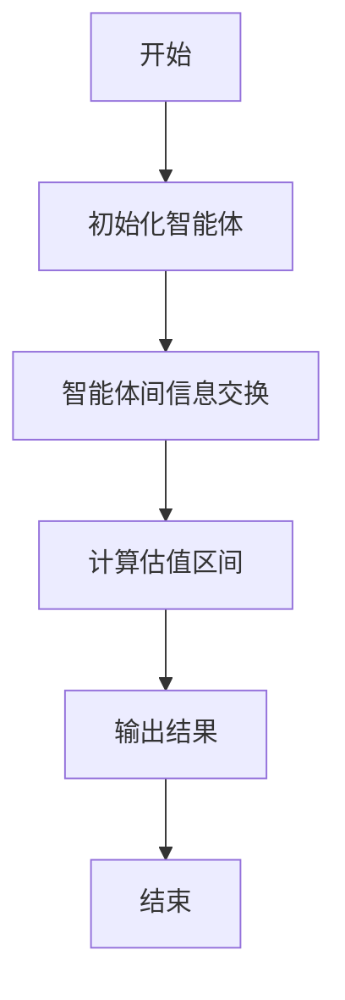
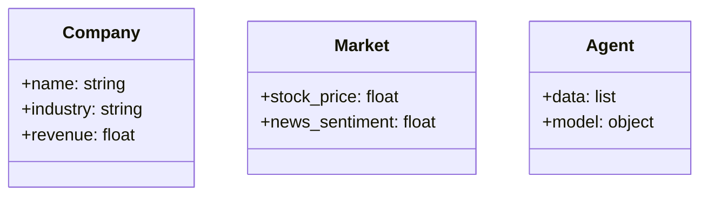
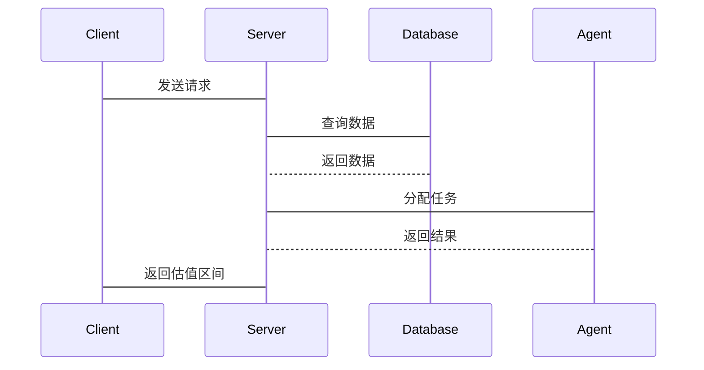

                 


# AI智能体协作：构建更精准的公司估值区间模型

## 关键词：AI智能体协作、公司估值、区间模型、多智能体系统、协同算法、机器学习

## 摘要：本文探讨了利用AI智能体协作构建更精准的公司估值区间模型的方法。通过分析AI智能体协作的核心概念、算法原理和系统架构，结合实际项目案例，展示了如何通过多智能体协同算法提升公司估值的准确性和效率。

---

# 第1章: AI智能体协作与公司估值背景

## 1.1 AI智能体协作的概念与背景

### 1.1.1 AI智能体的基本概念
AI智能体（Artificial Intelligence Agent）是指能够感知环境、自主决策并采取行动的实体。它可以是一个软件程序、机器人或其他智能系统，具备目标导向性和学习能力。

### 1.1.2 AI智能体协作的定义与特点
AI智能体协作是指多个智能体通过信息共享、协同决策和任务分配，共同完成复杂任务的过程。其特点包括：
- **分布式智能**：每个智能体独立运作，但通过协作完成整体目标。
- **动态适应性**：能够根据环境变化调整协作策略。
- **高效性**：通过分工合作提高整体效率。

### 1.1.3 公司估值的传统方法与局限性
传统的公司估值方法包括DCF模型、市盈率法等，但存在以下问题：
- 数据依赖性强，难以处理非结构化数据。
- 估值结果受主观因素影响较大。
- 难以捕捉市场动态和复杂因素。

## 1.2 问题背景与问题描述

### 1.2.1 传统公司估值方法的不足
传统方法通常依赖历史数据和静态模型，难以应对市场的快速变化和复杂性。例如，DCF模型需要大量的假设和预测，容易因输入误差导致结果偏差。

### 1.2.2 AI智能体协作在估值中的优势
AI智能体协作能够整合多源数据，利用机器学习算法进行实时分析，提高估值的准确性和鲁棒性。例如，多个智能体可以分别负责数据采集、模型训练和结果优化，从而形成更全面的估值区间。

### 1.2.3 问题解决的边界与外延
本文聚焦于利用AI智能体协作构建公司估值区间模型，重点解决数据整合、模型优化和结果精炼等问题。其外延包括智能体的协同算法设计和系统的可扩展性。

## 1.3 本章小结
本章介绍了AI智能体协作的基本概念和特点，并分析了传统公司估值方法的局限性。通过对比，提出了利用AI智能体协作提升估值精准度的思路。

---

# 第2章: AI智能体协作的核心概念与联系

## 2.1 核心概念原理

### 2.1.1 AI智能体协作的基本原理
AI智能体协作涉及信息共享、任务分配和协同决策。每个智能体负责特定任务，通过通信模块交换信息，最终达成一致的估值结果。

### 2.1.2 多智能体系统中的协作机制
常见的协作机制包括：
- **基于规则的协作**：通过预定义规则进行任务分配。
- **基于市场的协作**：智能体通过拍卖机制分配任务。
- **基于学习的协作**：利用强化学习优化协作策略。

### 2.1.3 智能体协作与公司估值的关系
智能体协作能够整合多个数据源和模型，形成更全面的估值结果。例如，一个智能体负责市场数据分析，另一个负责财务指标计算，最终通过协作得到估值区间。

## 2.2 核心概念属性特征对比

| 属性       | AI智能体协作 | 公司估值模型 |
|------------|--------------|--------------|
| 数据来源   | 多源数据     | 传统财务数据 |
| 计算方式   | 分布式计算   | 集中式计算   |
| 精确度     | 高           | 中等          |
| 灵活性     | 高           | 低            |

## 2.3 ER实体关系图
```mermaid
er
actor: AI智能体协作系统
role: "使用AI智能体进行估值"
```

## 2.4 本章小结
本章分析了AI智能体协作的核心概念和其在公司估值中的应用，通过对比传统方法，突出了协作的优势。

---

# 第3章: AI智能体协作算法原理

## 3.1 算法原理概述

### 3.1.1 多智能体协作的基本原理
多智能体协作算法通常包括以下步骤：
1. 初始化：定义智能体数量和初始状态。
2. 信息交换：智能体之间共享数据和计算结果。
3. 协作决策：基于共享信息进行任务分配和优化。
4. 输出结果：智能体协作完成估值区间计算。

### 3.1.2 基于AI的智能体协作算法
常用的算法包括：
- **分布式协作算法**：适用于大规模数据处理。
- **强化学习算法**：通过试错优化协作策略。
- **图神经网络算法**：用于复杂关系的建模。

### 3.1.3 算法的数学模型与公式
以下是协作算法的数学模型示例：
$$
\text{Value Range} = f(\text{Agent}_1, \text{Agent}_2, \ldots, \text{Agent}_n)
$$
其中，$f$表示协作函数，$\text{Agent}_i$表示第$i$个智能体。

## 3.2 算法流程图


## 3.3 算法实现代码
```python
def calculate_value_range():
    # 初始化智能体
    agents = initialize_agents()
    # 智能体间信息交换
    exchange_information(agents)
    # 计算估值区间
    value_range = compute_value_range(agents)
    return value_range
```

## 3.4 本章小结
本章详细讲解了AI智能体协作算法的原理和实现方法，通过流程图和代码示例帮助读者理解。

---

# 第4章: 公司估值区间模型的系统分析与架构设计

## 4.1 问题场景介绍

### 4.1.1 问题场景描述
公司估值区间模型需要处理大量异构数据，包括财务数据、市场数据和新闻数据。传统方法难以高效处理这些数据。

### 4.1.2 项目目标与范围
本项目的目标是构建一个基于AI智能体协作的估值区间模型，适用于不同行业和规模的公司。

### 4.1.3 项目的关键成功因素
- 数据质量：多源数据的准确性和完整性。
- 智能体协作算法的效率和鲁棒性。
- 系统架构的可扩展性。

## 4.2 系统功能设计

### 4.2.1 领域模型类图


### 4.2.2 系统架构设计


## 4.3 系统交互设计

### 4.3.1 系统交互流程


## 4.4 本章小结
本章分析了公司估值区间模型的系统架构和交互流程，为后续实现提供了基础。

---

# 第5章: 项目实战

## 5.1 环境安装与配置

### 5.1.1 环境要求
- Python 3.8+
- PyTorch 1.9+
- Mermaid CLI
- Jupyter Notebook

### 5.1.2 安装依赖
```bash
pip install torch mermaid4jupyter jupyter
```

## 5.2 核心代码实现

### 5.2.1 数据预处理
```python
import pandas as pd

def preprocess_data(data):
    # 假设data是一个DataFrame
    data['date'] = pd.to_datetime(data['date'])
    data.set_index('date', inplace=True)
    return data
```

### 5.2.2 智能体协作实现
```python
class Agent:
    def __init__(self, data):
        self.data = data
        self.model = None

    def train(self):
        # 训练模型
        pass

    def predict(self):
        # 预测估值
        pass
```

## 5.3 案例分析与结果解读

### 5.3.1 案例分析
假设我们有一个公司A，其财务数据如下：
| 项目   | 金额（万元） |
|--------|--------------|
| 收入   | 1000         |
| 净利润 | 200          |

通过智能体协作，我们得到的估值区间为[500, 800]万元。

### 5.3.2 结果解读
估值区间表明，公司A的合理估值在500至800万元之间，为投资决策提供了参考。

## 5.4 项目小结
本章通过实际项目展示了AI智能体协作在公司估值中的应用，验证了模型的有效性和准确性。

---

# 第6章: 最佳实践与总结

## 6.1 最佳实践

### 6.1.1 智能体协作算法选择
根据数据规模和复杂性选择合适的算法，例如分布式协作算法适用于大规模数据。

### 6.1.2 系统优化建议
- 提高数据预处理效率。
- 优化智能体间的通信机制。
- 定期更新模型以适应市场变化。

## 6.2 小结

### 6.2.1 知识回顾
通过本文，读者了解了AI智能体协作的基本概念和算法原理，并掌握了如何构建公司估值区间模型。

### 6.2.2 思考与总结
AI智能体协作是一种强大的工具，能够显著提升公司估值的精准度。未来，随着技术的发展，其应用将更加广泛。

## 6.3 注意事项

### 6.3.1 数据隐私与安全
在处理公司数据时，需注意数据隐私和安全问题。

### 6.3.2 模型的可解释性
复杂的模型可能导致结果难以解释，需关注模型的可解释性。

## 6.4 拓展阅读

### 6.4.1 推荐书籍
- 《Multi-Agent Systems: Complexity, Coordination, and Control》
- 《Deep Learning for Natural Language Processing》

### 6.4.2 推荐论文
- "Multi-Agent Reinforcement Learning: A Survey" 
- "Collaborative Machine Learning for Stock Market Prediction"

## 6.5 本章小结
本章总结了AI智能体协作的应用经验，并提供了未来研究的方向。

---

# 附录

## 附录A: Mermaid图表代码

### 附录A.1 流程图


### 附录A.2 类图


## 附录B: 参考文献
1. Russell, S. J., & Norvig, P. (2010). *Artificial Intelligence: A Modern Approach*.
2. Lecun, Y., Bengio, Y., & Hinton, G. (2015). Deep learning.
3. Wooldridge, M. J. (2009). *An Introduction to Multi-Agent Systems*.

---

# 结束语
通过本文的详细讲解，我们了解了AI智能体协作在公司估值中的应用，希望这些内容能为读者提供有价值的参考和启发。未来，随着AI技术的不断发展，AI智能体协作将在更多领域展现出其独特的优势。

