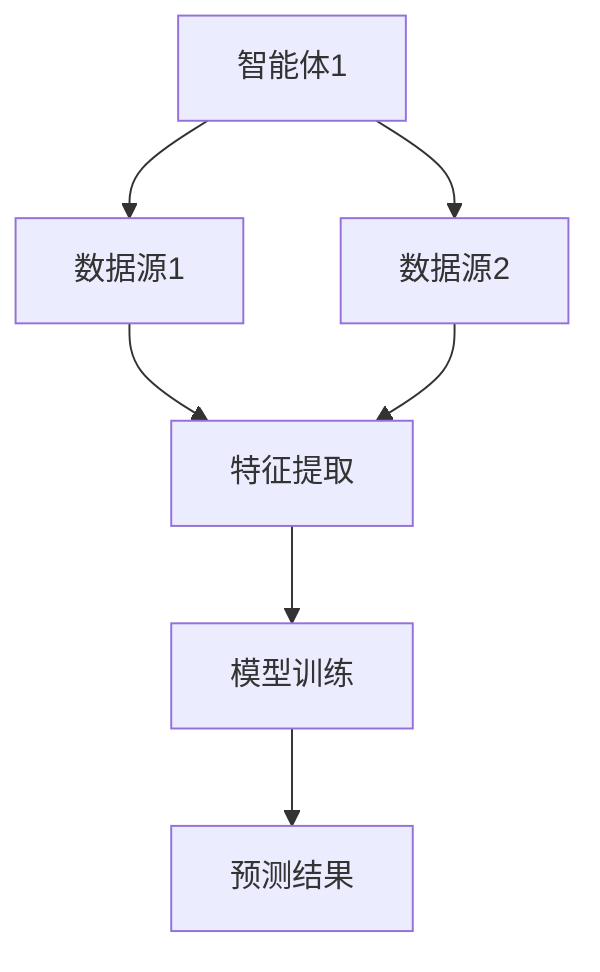
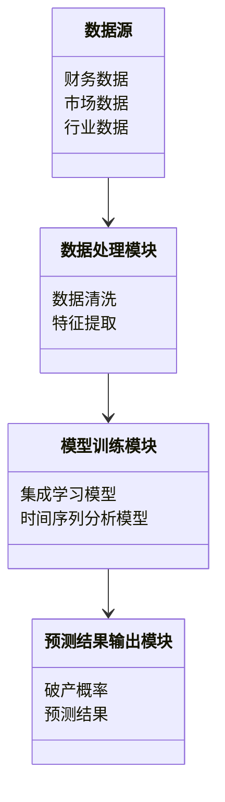
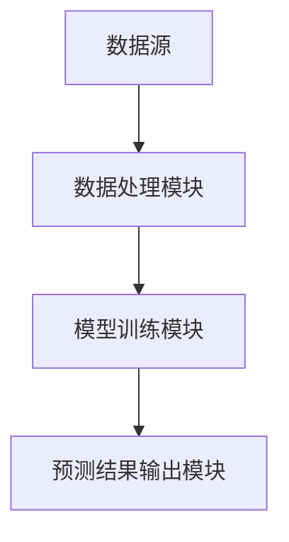
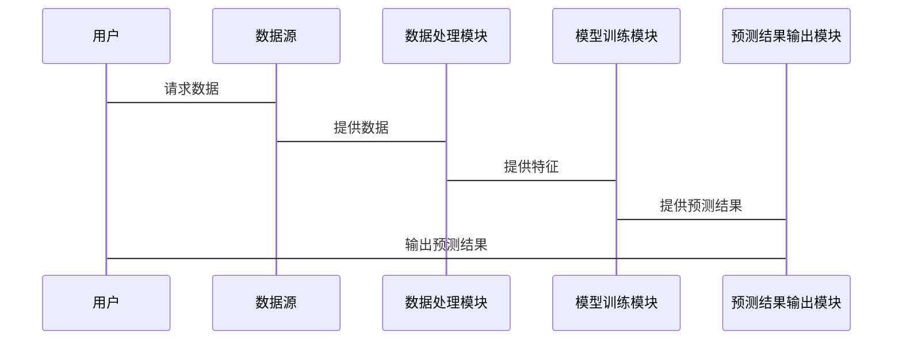

                 


# AI智能体协作：构建更精准的公司破产预测模型

> 关键词：AI智能体协作、公司破产预测模型、多智能体系统、机器学习、企业风险管理

> 摘要：本文将探讨如何利用AI智能体协作技术构建更精准的公司破产预测模型。通过分析AI智能体协作的核心原理、算法实现、系统架构设计以及实际项目案例，本文将深入阐述如何通过多智能体协作提升破产预测的准确性和实时性，为企业风险管理提供更有力的支持。

---

# 第一部分: 背景介绍

## 第1章: 背景介绍

### 1.1 问题背景

#### 1.1.1 企业风险管理的重要性
企业风险管理是企业管理的核心内容之一，尤其是在全球经济不确定性增加的背景下，企业面临的风险也日益复杂。公司破产预测作为企业风险管理的重要组成部分，能够帮助企业提前识别潜在风险，制定有效的应对策略。

#### 1.1.2 破产预测的传统方法与局限性
传统的破产预测方法主要依赖于财务指标分析和专家经验判断。然而，这些方法存在以下局限性：
- 数据维度有限：传统方法通常只考虑财务数据，忽略了市场、行业和企业内部运营等多方面的信息。
- 预测精度不足：由于缺乏对复杂市场环境和企业动态的实时分析，传统模型的预测精度较低。
- 实时性不足：传统方法通常需要定期更新数据，难以满足实时预测的需求。

#### 1.1.3 AI技术在企业风险管理中的应用前景
随着人工智能技术的快速发展，AI在企业风险管理中的应用前景广阔。通过AI技术，可以实现对多维度数据的实时分析和动态预测，从而提高破产预测的准确性和实时性。

---

### 1.2 问题描述

#### 1.2.1 破产预测的核心问题
破产预测的核心问题是通过分析企业的多维度数据，预测其是否可能在未来一定时间内发生破产。这需要对企业的财务状况、市场环境、行业趋势和内部运营等多个因素进行综合分析。

#### 1.2.2 AI智能体协作在破产预测中的作用
AI智能体协作是指多个智能体通过协同工作，共同完成复杂任务的一种技术。在破产预测中，多个智能体可以分别负责数据采集、特征提取、模型训练和结果预测等任务，从而提高预测的准确性和效率。

#### 1.2.3 破产预测模型的构建目标
构建破产预测模型的目标是通过AI智能体协作技术，实现对企业多维度数据的实时分析，提高预测的准确性和实时性，为企业风险管理提供更有力的支持。

---

### 1.3 问题解决

#### 1.3.1 AI智能体协作的核心优势
AI智能体协作的核心优势在于：
- **数据处理能力**：多个智能体可以同时处理不同类型和来源的数据，提高数据处理效率。
- **模型协同优化**：通过多个智能体的协同工作，可以优化模型的参数和结构，提高预测精度。
- **实时性**：通过多智能体的协作，可以实现对数据的实时分析和预测，满足企业风险管理的实时需求。

#### 1.3.2 多智能体协作在破产预测中的具体应用
在破产预测中，多智能体协作可以应用于以下方面：
- 数据采集：智能体负责从不同数据源采集企业的财务、市场和行业数据。
- 特征提取：智能体负责从采集的数据中提取有用的特征，用于模型训练。
- 模型训练：智能体负责对提取的特征进行建模和训练，优化模型参数。
- 结果预测：智能体负责对企业的未来状况进行预测，并输出预测结果。

#### 1.3.3 破产预测模型的构建流程
破产预测模型的构建流程包括以下步骤：
1. 数据采集：从多个数据源采集企业的财务、市场和行业数据。
2. 数据预处理：对采集的数据进行清洗和标准化处理。
3. 特征提取：从数据中提取有用的特征，用于模型训练。
4. 模型训练：利用机器学习算法对提取的特征进行建模和训练。
5. 模型优化：通过多智能体协作优化模型的参数和结构。
6. 结果预测：利用优化后的模型对企业的未来状况进行预测。

---

### 1.4 边界与外延

#### 1.4.1 破产预测模型的适用范围
破产预测模型主要适用于以下场景：
- 中小企业的破产预测。
- 行业周期性波动较大的企业的破产预测。
- 数据充分且多维度的企业破产预测。

#### 1.4.2 AI智能体协作的边界条件
在AI智能体协作中，需要考虑以下边界条件：
- 数据隐私和安全：确保数据在传输和处理过程中的安全性和隐私性。
- 智能体之间的通信效率：确保智能体之间的通信效率，避免因通信延迟影响预测的实时性。
- 模型的可解释性：确保模型的预测结果具有可解释性，便于企业理解和应用。

#### 1.4.3 模型的局限性与改进方向
破产预测模型的局限性包括：
- 数据依赖性：模型的预测结果依赖于数据的质量和数量。
- 模型的可解释性：复杂的模型可能难以解释其预测结果。
- 实时性限制：由于数据采集和处理的时间延迟，模型的实时性可能受到限制。

改进方向包括：
- 提高数据采集的实时性和全面性。
- 优化模型的可解释性，使其更易于理解和应用。
- 提高模型的实时性，减少数据处理的时间延迟。

---

### 1.5 概念结构与核心要素

#### 1.5.1 破产预测模型的基本构成
破产预测模型的基本构成包括：
- 数据源：企业的财务、市场和行业数据。
- 数据处理模块：数据清洗、标准化和特征提取。
- 模型训练模块：利用机器学习算法对特征进行建模和训练。
- 预测结果输出模块：输出企业的破产概率和预测结果。

#### 1.5.2 AI智能体协作的关键要素
AI智能体协作的关键要素包括：
- 智能体：负责数据采集、特征提取、模型训练和结果预测。
- 通信机制：智能体之间的通信方式和协议。
- 协作任务分配：智能体之间的任务分配和协同工作。
- 模型优化：通过智能体协作优化模型的参数和结构。

#### 1.5.3 模型的输入、输出与中间过程
- 输入：企业的财务、市场和行业数据。
- 输出：企业的破产概率和预测结果。
- 中间过程：数据预处理、特征提取、模型训练和优化。

---

## 第2章: 核心概念与联系

### 2.1 AI智能体协作的核心原理

#### 2.1.1 多智能体协作的基本概念
多智能体协作是指多个智能体通过协同工作，共同完成复杂任务的一种技术。在破产预测中，多个智能体可以分别负责数据采集、特征提取、模型训练和结果预测等任务。

#### 2.1.2 智能体协作的通信机制
智能体协作的通信机制包括：
- **消息传递**：智能体之间通过消息传递共享数据和信息。
- **状态同步**：智能体之间定期同步状态，确保模型的一致性。
- **任务分配**：智能体之间通过任务分配协议分配任务和资源。

---

#### 2.1.3 概念属性特征对比表格
以下是AI智能体协作和传统单智能体方法在破产预测中的属性特征对比：

| 属性 | AI智能体协作 | 传统单智能体方法 |
|------|--------------|------------------|
| 数据处理能力 | 高 | 低 |
| 模型优化能力 | 高 | 中 |
| 实时性 | 高 | 低 |
| 可扩展性 | 高 | 中 |
| 可解释性 | 中 | 高 |

---

#### 2.1.4 实体关系图

以下是AI智能体协作在破产预测中的实体关系图：



---

### 2.2 智能体协作的核心原理

#### 2.2.1 数据采集与预处理
数据采集与预处理是智能体协作的第一步，智能体从多个数据源采集企业的财务、市场和行业数据，并进行清洗和标准化处理。

#### 2.2.2 特征提取与模型训练
特征提取是从数据中提取有用的特征，模型训练是利用机器学习算法对特征进行建模和训练。

#### 2.2.3 模型优化与预测
通过多智能体协作优化模型的参数和结构，提高预测的准确性和实时性。

---

### 2.3 智能体协作的数学模型与公式

#### 2.3.1 集成学习模型
集成学习模型是通过多个弱分类器的集成来提高模型的准确性和鲁棒性。常用的集成学习模型包括随机森林和梯度提升树。

##### 2.3.1.1 随机森林
随机森林是一种基于决策树的集成学习算法，其数学模型如下：

$$
\text{随机森林} = \{\text{决策树}_i\}_{i=1}^n
$$

##### 2.3.1.2 梯度提升树
梯度提升树是一种基于树的集成学习算法，其数学模型如下：

$$
\text{梯度提升树} = \sum_{i=1}^n \text{树}_i
$$

---

#### 2.3.2 时间序列分析模型
时间序列分析模型是通过分析历史数据的时间序列来预测未来的趋势。常用的模型包括ARIMA和LSTM。

##### 2.3.2.1 ARIMA模型
ARIMA模型是一种用于时间序列预测的线性模型，其数学模型如下：

$$
\text{ARIMA}(p, d, q) = \frac{\phi(z^p)}{\theta(z^q)}
$$

##### 2.3.2.2 LSTM模型
LSTM模型是一种基于循环神经网络的时间序列预测模型，其数学模型如下：

$$
\text{LSTM}(t) = \text{遗忘门}(t) \cdot \text{状态}(t-1) + \text{输入门}(t) \cdot \text{输入}(t)
$$

---

## 第3章: 算法原理讲解

### 3.1 集成学习算法

#### 3.1.1 随机森林
随机森林是一种基于决策树的集成学习算法，其核心原理是通过随机采样和特征随机选择来提高模型的准确性和鲁棒性。

#### 3.1.2 梯度提升树
梯度提升树是一种基于树的集成学习算法，其核心原理是通过逐步优化损失函数来构建多个决策树模型。

---

### 3.2 时间序列分析

#### 3.2.1 ARIMA模型
ARIMA模型是一种用于时间序列预测的线性模型，其核心原理是通过自回归和移动平均来预测未来的趋势。

#### 3.2.2 LSTM模型
LSTM模型是一种基于循环神经网络的时间序列预测模型，其核心原理是通过记忆单元和门控机制来捕捉时间序列的长程依赖关系。

---

### 3.3 特征选择与模型优化

#### 3.3.1 特征选择
特征选择是通过选择对模型预测有重要影响的特征来提高模型的准确性和效率。

#### 3.3.2 模型优化
模型优化是通过调整模型的参数和结构来提高模型的预测精度和效率。

---

## 第4章: 系统分析与架构设计方案

### 4.1 问题场景介绍

#### 4.1.1 企业风险管理的场景
企业风险管理的场景包括：
- 企业的财务状况分析。
- 行业趋势分析。
- 市场环境分析。

#### 4.1.2 破产预测的场景
破产预测的场景包括：
- 中小企业的破产预测。
- 行业周期性波动较大的企业的破产预测。

---

### 4.2 项目介绍

#### 4.2.1 项目目标
项目目标是通过AI智能体协作技术构建更精准的公司破产预测模型。

#### 4.2.2 项目范围
项目范围包括：
- 数据采集与预处理。
- 特征提取与模型训练。
- 模型优化与预测。

---

### 4.3 系统功能设计

#### 4.3.1 领域模型
以下是领域的类图：



---

#### 4.3.2 系统架构设计

以下是系统的架构图：



---

### 4.4 系统接口设计

#### 4.4.1 数据接口
数据接口包括：
- 数据输入接口。
- 数据输出接口。

#### 4.4.2 模型接口
模型接口包括：
- 模型训练接口。
- 模型预测接口。

---

### 4.5 系统交互流程

以下是系统的交互流程图：



---

## 第5章: 项目实战

### 5.1 环境安装

#### 5.1.1 安装Python
安装Python的版本要求是3.6以上。

#### 5.1.2 安装依赖库
安装以下依赖库：
- scikit-learn
- pandas
- numpy
- matplotlib
- keras
- tensorflow

---

### 5.2 系统核心实现源代码

#### 5.2.1 数据预处理代码

```python
import pandas as pd
import numpy as np

# 数据加载
data = pd.read_csv('company_data.csv')

# 数据清洗
data.dropna(inplace=True)

# 特征提取
features = data[['revenue', 'profit', 'cash', 'debt']]
label = data['bankruptcy']
```

#### 5.2.2 模型训练代码

```python
from sklearn.ensemble import RandomForestClassifier
from sklearn.metrics import accuracy_score

# 模型训练
model = RandomForestClassifier(n_estimators=100, max_depth=2, random_state=0)
model.fit(features, label)

# 模型预测
预测结果 = model.predict(features)
```

---

### 5.3 代码应用解读与分析

#### 5.3.1 数据预处理代码解读
数据预处理代码包括数据加载、数据清洗和特征提取。数据加载是从CSV文件中读取数据，数据清洗是删除缺失值，特征提取是从数据中提取有用的特征。

#### 5.3.2 模型训练代码解读
模型训练代码包括模型选择、参数设置和模型训练。模型选择是随机森林分类器，参数设置包括树的数量和深度，模型训练是利用训练数据训练模型。

---

### 5.4 实际案例分析

#### 5.4.1 数据来源
数据来源包括企业的财务数据、市场数据和行业数据。

#### 5.4.2 模型训练
模型训练包括特征提取、模型选择和模型训练。

#### 5.4.3 模型预测
模型预测是利用训练好的模型对企业的未来状况进行预测。

---

## 第6章: 最佳实践、小结、注意事项和拓展阅读

### 6.1 最佳实践

#### 6.1.1 数据质量管理
数据质量管理是提高模型预测精度的关键，需要确保数据的准确性和完整性。

#### 6.1.2 模型优化
模型优化是提高模型预测精度和效率的重要手段，需要通过参数调整和结构优化来实现。

#### 6.1.3 模型监控
模型监控是确保模型预测结果的准确性和实时性的重要手段，需要定期监控模型的性能和数据变化。

---

### 6.2 小结

本文详细阐述了AI智能体协作在公司破产预测中的应用，包括背景介绍、核心概念、算法原理、系统设计和项目实战等内容。通过多智能体协作，可以实现对企业多维度数据的实时分析和动态预测，提高破产预测的准确性和实时性。

---

### 6.3 注意事项

1. **数据隐私和安全**：在数据采集和处理过程中，需要注意数据的隐私和安全，避免数据泄露和滥用。
2. **模型的可解释性**：模型的预测结果需要具有可解释性，便于企业理解和应用。
3. **模型的实时性**：由于数据采集和处理的时间延迟，模型的实时性可能受到限制。

---

### 6.4 拓展阅读

1. **集成学习**：集成学习是通过多个弱分类器的集成来提高模型的准确性和鲁棒性。
2. **时间序列分析**：时间序列分析是通过分析历史数据的时间序列来预测未来的趋势。
3. **深度学习**：深度学习是通过神经网络模型来实现对复杂数据的分析和预测。

---

通过本文的学习和实践，读者可以深入了解AI智能体协作在公司破产预测中的应用，掌握构建更精准的公司破产预测模型的方法和技巧，为企业风险管理提供更有力的支持。

