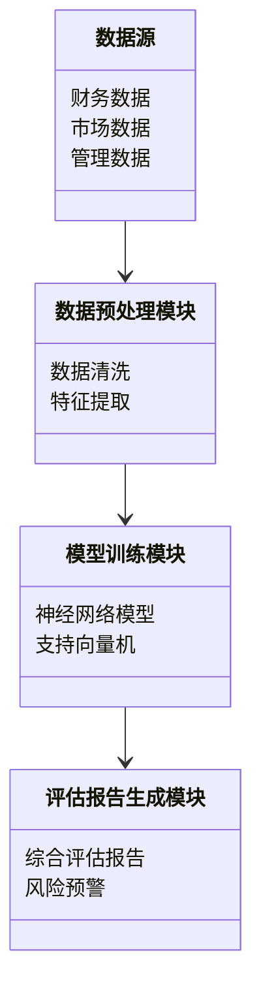
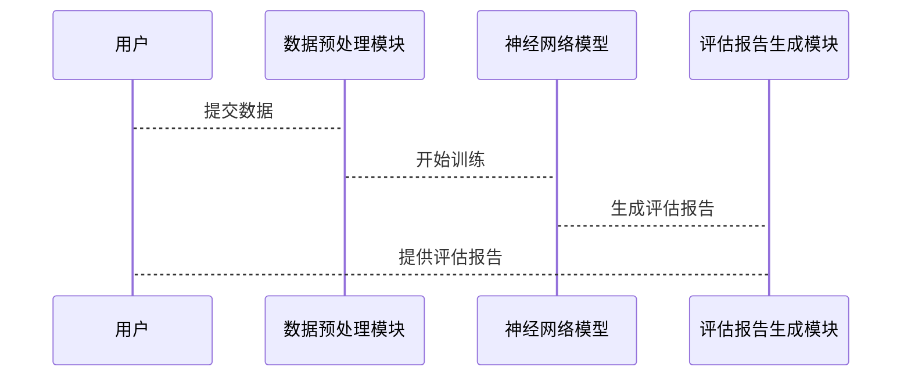

                 


# AI智能体在公司治理评估中的应用

## 关键词
AI智能体, 公司治理评估, 数据分析, 人工智能, 评估算法

## 摘要
随着人工智能技术的飞速发展，AI智能体在公司治理评估中的应用越来越广泛。本文从AI智能体的基本概念出发，详细探讨了其在公司治理评估中的核心概念、算法原理、数学模型、系统架构设计以及项目实战。通过丰富的案例分析和详细的代码实现，本文展示了AI智能体在公司治理评估中的实际应用价值，并总结了最佳实践和未来发展方向。

---

## 第一部分: AI智能体与公司治理评估的背景

## 第1章: AI智能体与公司治理评估概述

### 1.1 AI智能体的定义与特点

#### 1.1.1 AI智能体的基本概念
AI智能体（Artificial Intelligence Agent）是指能够感知环境、自主决策并采取行动的智能系统。它通过数据驱动的方式，能够实现从简单到复杂的任务。

#### 1.1.2 AI智能体的核心特点
- **自主性**：AI智能体能够在没有人工干预的情况下自主运行。
- **反应性**：能够实时感知环境变化并做出相应的反应。
- **学习能力**：通过机器学习算法不断优化自身的决策能力。
- **多模态数据处理**：能够同时处理结构化数据和非结构化数据。

#### 1.1.3 AI智能体与传统评估方法的区别
传统评估方法依赖于人工分析和经验判断，而AI智能体能够通过大数据分析和机器学习算法实现更精准和高效的评估。

### 1.2 公司治理评估的定义与背景

#### 1.2.1 公司治理的基本概念
公司治理是指通过合理的制度安排，确保公司战略目标的实现和利益相关者的权益得到保护。

#### 1.2.2 公司治理评估的必要性
公司治理评估是衡量公司治理水平的重要手段，能够帮助企业发现管理中的问题并优化治理结构。

#### 1.2.3 AI技术在公司治理评估中的应用前景
AI智能体能够通过数据分析和智能决策，显著提高公司治理评估的效率和准确性。

---

## 第2章: AI智能体在公司治理评估中的核心概念

### 2.1 AI智能体的核心原理

#### 2.1.1 数据驱动的决策机制
AI智能体通过收集和分析大量数据，生成决策建议。

#### 2.1.2 自动学习与优化能力
AI智能体能够通过机器学习算法不断优化自身的决策模型。

#### 2.1.3 多维度数据分析能力
AI智能体能够同时处理财务数据、市场数据、管理数据等多种数据源。

### 2.2 公司治理评估的关键指标

#### 2.2.1 财务表现评估
包括净利润率、ROE（净资产收益率）等指标。

#### 2.2.2 治理结构优化
包括董事会结构、高管团队稳定性等指标。

#### 2.2.3 风险管理能力
包括风险管理流程、风险预警机制等指标。

### 2.3 AI智能体与公司治理评估的结合点

#### 2.3.1 数据整合与分析
AI智能体能够整合多个数据源，生成全面的评估报告。

#### 2.3.2 智能预测与决策支持
AI智能体能够预测公司治理中的潜在风险，并提供优化建议。

#### 2.3.3 实时监控与反馈机制
AI智能体能够实时监控公司治理的动态，并及时反馈变化。

---

## 第三部分: AI智能体在公司治理评估中的算法原理

## 第3章: AI智能体的算法基础

### 3.1 数据预处理与特征提取

#### 3.1.1 数据清洗与标准化
- 数据清洗：去除重复数据、处理缺失值。
- 数据标准化：将数据归一化，便于模型训练。

#### 3.1.2 特征选择与降维
- 特征选择：通过统计方法或模型选择重要特征。
- 降维技术：使用PCA（主成分分析）降低数据维度。

#### 3.1.3 数据增强技术
- 数据增强：通过增加数据样本数量提高模型鲁棒性。

### 3.2 模型训练与优化

#### 3.2.1 神经网络模型
- 深度神经网络（DNN）：用于复杂模式识别。
- 循环神经网络（RNN）：用于处理序列数据。

#### 3.2.2 支持向量机
- SVM（支持向量机）：用于分类和回归任务。

#### 3.2.3 集成学习方法
- 集成学习：通过组合多个模型的结果提高准确性。

### 3.3 模型评估与调优

#### 3.3.1 评估指标选择
- 准确率、召回率、F1分数：用于分类任务评估。
- �均方误差（MSE）、R²分数：用于回归任务评估。

#### 3.3.2 超参数优化
- 使用网格搜索或随机搜索优化模型参数。

#### 3.3.3 模型鲁棒性测试
- 交叉验证：通过多次训练测试模型的稳定性。

---

## 第4章: AI智能体的数学模型与公式

### 4.1 数据预处理公式

#### 4.1.1 数据标准化公式
$$
x_{\text{normalized}} = \frac{x - \mu}{\sigma}
$$
其中，$\mu$ 是均值，$\sigma$ 是标准差。

#### 4.1.2 数据归一化公式
$$
x_{\text{normalized}} = \frac{x - \min(x)}{\max(x) - \min(x)}
$$

### 4.2 模型训练公式

#### 4.2.1 线性回归模型
$$
y = \beta_0 + \beta_1 x + \epsilon
$$

#### 4.2.2 逻辑回归模型
$$
P(y=1|x) = \frac{1}{1 + e^{- (\beta_0 + \beta_1 x)}}
$$

#### 4.2.3 神经网络模型
$$
y = \sigma(Wx + b)
$$
其中，$\sigma$ 是激活函数，$W$ 是权重矩阵，$b$ 是偏置项。

---

## 第五部分: 系统分析与架构设计方案

## 第5章: 系统架构设计

### 5.1 问题场景介绍
公司治理评估系统需要实时监控公司运营数据，并提供智能化的评估报告。

### 5.2 系统功能设计

#### 5.2.1 领域模型设计


### 5.3 系统架构设计

#### 5.3.1 系统架构图


### 5.4 系统接口设计

#### 5.4.1 接口设计
- 数据预处理模块接口：提供数据清洗和特征提取功能。
- 模型训练模块接口：提供神经网络和SVM模型训练功能。
- 评估报告生成模块接口：提供综合评估报告和风险预警功能。

### 5.5 系统交互设计

#### 5.5.1 交互流程


---

## 第六部分: 项目实战

## 第6章: 项目实战

### 6.1 环境安装

#### 6.1.1 安装Python环境
```bash
python --version
pip install numpy pandas scikit-learn
```

### 6.2 系统核心实现源代码

#### 6.2.1 数据预处理代码
```python
import pandas as pd
from sklearn.preprocessing import StandardScaler

# 数据清洗
data = pd.read_csv('input.csv')
data.dropna()
data = data.drop_duplicates()

# 数据标准化
scaler = StandardScaler()
data_normalized = scaler.fit_transform(data)
```

#### 6.2.2 模型训练代码
```python
from sklearn.svm import SVC
from sklearn.metrics import accuracy_score

# 训练SVM模型
model = SVC()
model.fit(data_normalized, labels)
```

#### 6.2.3 评估报告生成代码
```python
import numpy as np
from sklearn.metrics import confusion_matrix

# 生成评估报告
y_pred = model.predict(data_normalized)
print("Accuracy:", accuracy_score(labels, y_pred))
print("Confusion Matrix:\n", confusion_matrix(labels, y_pred))
```

### 6.3 实际案例分析

#### 6.3.1 案例分析
假设我们有一个公司治理评估的数据集，包含财务数据、市场数据和管理数据。通过上述代码，我们可以实现数据预处理、模型训练和评估报告生成。

### 6.4 项目小结
通过本项目，我们展示了AI智能体在公司治理评估中的实际应用，证明了其在提高评估效率和准确性方面的巨大潜力。

---

## 第七部分: 最佳实践

## 第7章: 最佳实践

### 7.1 小结
AI智能体在公司治理评估中的应用前景广阔，能够显著提高评估的效率和准确性。

### 7.2 注意事项
- 数据隐私保护：在处理公司数据时，必须遵守相关法律法规。
- 模型泛化能力：在实际应用中，需要考虑模型的泛化能力和适应性。

### 7.3 拓展阅读
建议读者进一步学习机器学习和深度学习的相关知识，以及公司治理评估的理论和实践。

---

## 结语
通过本文的详细讲解，我们了解了AI智能体在公司治理评估中的应用价值和实现方法。未来，随着AI技术的不断发展，AI智能体在公司治理评估中的应用将会更加广泛和深入。

