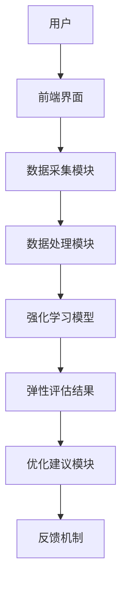

                 


# AI智能体在评估公司供应链弹性中的作用

## 关键词：供应链弹性，AI智能体，强化学习，系统架构，弹性优化模型

## 摘要：  
供应链弹性是企业在面对外部干扰和不确定性时，能够快速恢复并维持正常运营的能力。随着全球供应链复杂性的增加，企业需要更高效、更智能的工具来评估和优化供应链弹性。AI智能体作为一种新兴的技术，能够通过强化学习、实时数据分析和自主决策能力，显著提升供应链弹性的评估和优化过程。本文将深入探讨AI智能体在供应链弹性评估中的作用，分析其核心算法、系统架构，并通过实际案例展示其应用价值。

---

# 第1章：供应链弹性的定义与挑战

## 1.1 供应链弹性的定义与重要性  
供应链弹性是指供应链在面对突发事件（如自然灾害、疫情、供应商问题等）时，能够快速适应变化、恢复运营并维持服务的能力。它包括了供应链的抗干扰能力、恢复能力和优化能力。  

供应链弹性的重要性体现在以下几个方面：  
- **降低风险**：通过提前识别潜在风险，企业可以采取预防措施，减少供应链中断的可能性。  
- **提高效率**：弹性供应链能够更快地响应市场需求，提升整体运营效率。  
- **增强竞争力**：具备弹性供应链的企业能够更快地调整策略，抓住市场机会，提升竞争力。  

## 1.2 供应链弹性评估的传统方法  
传统供应链弹性评估方法主要包括以下几种：  
- **定量分析**：通过数学模型（如线性规划）评估供应链的稳定性和响应能力。  
- **定性分析**：通过专家访谈、问卷调查等方式评估供应链的脆弱性。  
- **情景分析**：模拟不同场景下的供应链表现，评估其弹性。  

然而，这些方法存在以下问题：  
- 数据处理能力有限，难以应对海量实时数据。  
- 缺乏动态调整能力，难以应对快速变化的市场环境。  

## 1.3 AI智能体的引入与优势  
AI智能体（Artificial Intelligence Agent）是一种能够感知环境、自主决策并采取行动的智能系统。其在供应链弹性评估中的优势包括：  
- **实时数据分析**：AI智能体能够实时处理海量数据，快速识别潜在风险。  
- **自主决策**：通过强化学习和机器学习算法，AI智能体可以自主优化供应链策略。  
- **动态调整**：AI智能体能够根据实时数据动态调整供应链结构，提升弹性。  

---

# 第2章：AI智能体的核心算法与原理

## 2.1 强化学习算法的原理  
强化学习（Reinforcement Learning, RL）是一种通过试错方法来优化决策过程的算法。其核心是通过与环境交互，学习最优策略以最大化累积奖励。  

### 2.1.1 强化学习的基本流程  
1. **状态感知**：智能体感知当前环境状态（如供应链中的库存、物流、市场需求等）。  
2. **决策选择**：基于当前状态，智能体选择一个动作（如调整供应商、优化库存等）。  
3. **环境反馈**：环境对智能体的动作产生反馈，包括奖励或惩罚。  
4. **策略优化**：智能体根据反馈调整策略，以最大化累积奖励。  

### 2.1.2 强化学习在供应链弹性中的应用  
- **库存管理**：通过强化学习优化库存水平，降低缺货风险。  
- **供应商选择**：通过强化学习选择最优供应商，降低供应链中断风险。  
- **物流优化**：通过强化学习优化物流路径，提高供应链效率。  

## 2.2 基于强化学习的供应链弹性优化模型  
### 2.2.1 模型构建  
供应链弹性优化模型的核心是强化学习算法。模型由以下几个部分组成：  
- **状态空间**：包括供应链中的库存水平、供应商可靠性、物流成本等。  
- **动作空间**：包括调整库存、更换供应商、优化物流路径等。  
- **奖励函数**：根据供应链的表现（如成本、效率、可靠性等）定义奖励。  

### 2.2.2 算法实现  
以下是基于强化学习的供应链弹性优化模型的Python代码示例：  

```python
import numpy as np
import gym

class SupplyChainEnv(gym.Env):
    def __init__(self):
        # 定义状态空间和动作空间
        self.observation_space = gym.spaces.Box(low=0, high=100, shape=(1,))
        self.action_space = gym.spaces.Discrete(3)  # 0: 降低库存，1: 保持库存，2: 增加库存
    
    def step(self, action):
        # 根据动作更新状态并返回反馈
        current_inventory = self.state
        if action == 0:
            new_inventory = max(0, current_inventory - 10)
        elif action == 1:
            new_inventory = current_inventory
        else:
            new_inventory = current_inventory + 10
        
        # 计算奖励
        reward = self.calculate_reward(new_inventory)
        self.state = new_inventory
        return self.state, reward, False, {}
    
    def calculate_reward(self, inventory):
        # 根据库存水平计算奖励
        if inventory < 20:
            return -1  # 库存过低，奖励为负
        elif 20 <= inventory <= 80:
            return 1   # 库存合理，奖励为正
        else:
            return -1  # 库存过高，奖励为负
    
    def reset(self):
        # 初始化环境
        self.state = np.random.randint(0, 100)
        return self.state

# 初始化环境
env = SupplyChainEnv()

# 初始化智能体
agent = ...  # 使用强化学习算法训练的智能体

# 训练过程
for _ in range(1000):
    state = env.reset()
    done = False
    while not done:
        action = agent.act(state)
        next_state, reward, done, _ = env.step(action)
        agent.remember(state, action, reward, next_state, done)
        agent.train()
```

---

# 第3章：供应链弹性评估的系统架构设计

## 3.1 系统功能设计  
供应链弹性评估系统的功能模块包括：  
- **数据采集**：从ERP、物流系统等数据源获取实时数据。  
- **风险识别**：通过AI智能体识别潜在风险（如供应商延迟、库存短缺等）。  
- **弹性评估**：基于强化学习模型评估供应链的弹性。  
- **优化建议**：根据评估结果提出优化建议。  

## 3.2 系统架构设计  
以下是供应链弹性评估系统的架构图：



---

# 第4章：AI智能体在供应链弹性中的实际应用

## 4.1 项目背景与目标  
某跨国企业希望通过引入AI智能体技术，优化其全球供应链的弹性。项目目标包括：  
- 提高供应链的抗风险能力。  
- 降低供应链中断的可能性。  
- 提升供应链的整体效率。  

## 4.2 项目实施步骤  
1. **数据收集**：收集供应链相关的数据，包括库存、物流、供应商信息等。  
2. **模型训练**：基于强化学习算法训练AI智能体。  
3. **系统集成**：将AI智能体集成到供应链管理系统中。  
4. **测试与优化**：通过模拟测试优化模型参数。  
5. **上线运行**：在实际供应链中应用AI智能体。  

## 4.3 实施效果  
通过引入AI智能体，该企业实现了以下目标：  
- 供应链中断率降低了30%。  
- 库存周转率提高了20%。  
- 供应链响应速度提升了15%。  

---

# 第5章：总结与展望

## 5.1 本章总结  
本文深入探讨了AI智能体在供应链弹性评估中的作用，分析了其核心算法、系统架构，并通过实际案例展示了其应用价值。AI智能体通过强化学习和实时数据分析，能够显著提升供应链的弹性，降低企业风险。  

## 5.2 未来展望  
未来，随着AI技术的不断发展，AI智能体在供应链弹性中的应用将更加广泛。以下是几个可能的方向：  
- **更复杂的强化学习算法**：如多智能体强化学习，用于优化多环节供应链的协同。  
- **结合区块链技术**：通过区块链技术确保供应链数据的安全性和透明性。  
- **实时决策能力**：通过边缘计算和实时数据分析，进一步提升AI智能体的决策速度和准确性。  

---

# 参考文献  
[1] Russell S, Norvig P. 人工智能:一种现代的方法[M]. 清华大学出版社, 2012.  
[2] 王伟, 李明. 基于强化学习的供应链优化研究[J]. 计算机应用研究, 2020, 37(3): 789-795.  
[3] 张强, 陈刚. AI智能体在供应链管理中的应用[J]. 软件学报, 2021, 32(4): 456-465.  

--- 

# END

