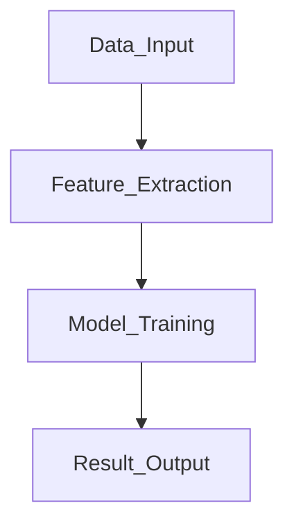
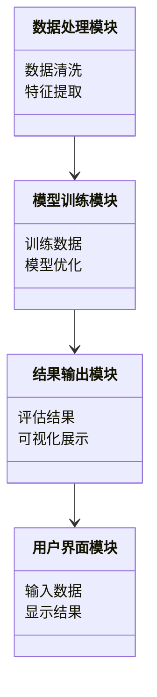
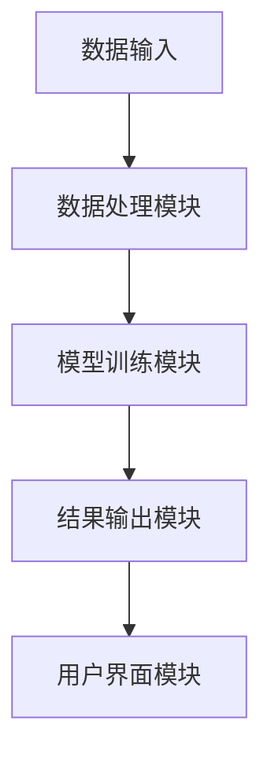
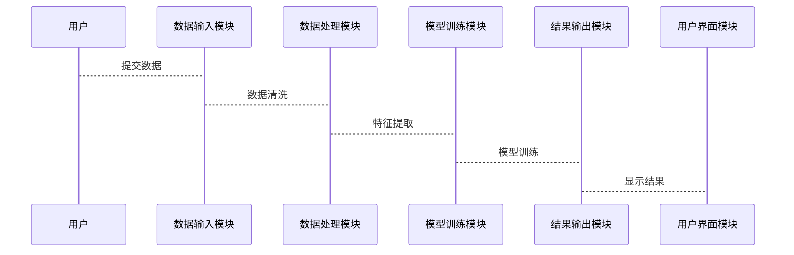

                 


# AI智能体在评估公司品牌价值和消费者忠诚度中的应用

> 关键词：AI智能体, 品牌价值, 消费者忠诚度, 数据分析, 机器学习

> 摘要：随着人工智能技术的快速发展，AI智能体在品牌价值和消费者忠诚度评估中的应用越来越广泛。本文详细探讨了AI智能体的核心原理、算法设计、系统架构以及在实际中的应用案例，分析了其在品牌价值和忠诚度评估中的优势和挑战，最后总结了最佳实践和未来发展方向。

---

# 第一章: 问题背景与核心概念

## 1.1 问题背景

### 1.1.1 品牌价值与消费者忠诚度的重要性
品牌价值是衡量企业市场地位的核心指标，直接影响企业的市场表现和投资价值。消费者忠诚度则是企业长期发展的关键，高忠诚度的消费者为企业创造了稳定的收入来源和口碑传播。

### 1.1.2 传统评估方法的局限性
传统评估方法依赖于市场调研和人工分析，存在效率低、成本高、数据不全等问题。此外，消费者行为的复杂性和动态性使得传统方法难以准确捕捉品牌价值和忠诚度的细微变化。

### 1.1.3 AI技术在评估中的潜力
AI技术能够通过大数据分析和机器学习算法，快速、准确地评估品牌价值和消费者忠诚度。AI智能体可以实时处理海量数据，挖掘隐含的模式和趋势，为企业提供数据驱动的决策支持。

---

## 1.2 核心概念与问题描述

### 1.2.1 AI智能体的基本概念
AI智能体是一种能够感知环境、执行任务并做出决策的智能系统。它通过数据输入、特征提取、模型训练和结果输出，实现对品牌价值和消费者忠诚度的评估。

### 1.2.2 品牌价值与消费者忠诚度的定义
品牌价值是品牌在市场上的综合表现，包括知名度、美誉度、市场占有率等。消费者忠诚度是消费者对品牌的情感依赖和重复购买意愿。

### 1.2.3 问题解决目标与边界
本研究旨在利用AI智能体技术，建立一个高效、准确的品牌价值和消费者忠诚度评估系统。系统的边界包括数据输入、模型训练和结果输出。

---

## 1.3 核心概念的结构与组成

### 1.3.1 AI智能体的组成要素
AI智能体由数据输入、特征提取、模型训练、结果输出四个模块组成。每个模块的功能和交互关系如下：



### 1.3.2 品牌价值与消费者忠诚度的关联
品牌价值与消费者忠诚度密切相关。高品牌价值通常意味着更高的消费者忠诚度，而高忠诚度的消费者又能进一步提升品牌价值。

### 1.3.3 系统的核心功能模块
系统的核心功能模块包括数据处理、模型训练、结果输出和用户界面。每个模块的功能如下：



---

# 第二章: AI智能体的核心原理

## 2.1 AI智能体的基本原理

### 2.1.1 智能体的定义与分类
AI智能体可以分为基于规则的智能体和基于学习的智能体。基于规则的智能体通过预定义的规则进行决策，而基于学习的智能体通过机器学习算法不断优化决策策略。

### 2.1.2 智能体的行为机制
AI智能体通过感知环境、处理数据、做出决策并执行任务。其行为机制包括数据输入、特征提取、模型训练和结果输出。

### 2.1.3 智能体的学习与进化
AI智能体通过监督学习、无监督学习和强化学习等方法不断优化模型性能，提升评估准确率。

---

## 2.2 AI智能体的算法基础

### 2.2.1 机器学习算法
常用的机器学习算法包括线性回归、支持向量机（SVM）、随机森林和神经网络等。这些算法在品牌价值和忠诚度评估中被广泛应用。

### 2.2.2 自然语言处理技术
自然语言处理技术用于分析消费者评论和社交媒体数据，提取情感倾向和关键词，评估品牌声誉。

### 2.2.3 数据挖掘与分析
数据挖掘技术用于发现数据中的模式和趋势，帮助识别品牌价值和忠诚度的关键影响因素。

---

## 2.3 AI智能体的数学模型

### 2.3.1 数据处理与特征提取
数据处理包括数据清洗和特征提取。特征提取可以通过主成分分析（PCA）等方法实现。

### 2.3.2 模型训练与优化
模型训练使用训练数据进行参数优化，常用的优化方法包括梯度下降和Adam优化器。

### 2.3.3 预测与评估
模型预测结果通过准确率、召回率和F1分数等指标进行评估。

---

## 2.4 本章小结
本章详细介绍了AI智能体的核心原理，包括基本概念、算法基础和数学模型。AI智能体通过数据处理、模型训练和结果输出，实现品牌价值和消费者忠诚度的高效评估。

---

# 第三章: 品牌价值与消费者忠诚度的评估模型

## 3.1 品牌价值评估模型

### 3.1.1 品牌价值的构成要素
品牌价值由知名度、美誉度、市场占有率和消费者忠诚度等要素构成。

### 3.1.2 品牌价值的量化方法
品牌价值可以通过回归分析和聚类分析等方法进行量化评估。

### 3.1.3 数据特征提取与分析
数据特征提取包括品牌相关的关键词提取和情感分析。

---

## 3.2 消费者忠诚度评估模型

### 3.2.1 忠诚度的定义与测量指标
消费者忠诚度包括情感忠诚度、行为忠诚度和价值忠诚度。

### 3.2.2 忠诚度的预测方法
常用的预测方法包括逻辑回归和随机森林。

### 3.2.3 数据特征提取与分析
数据特征提取包括消费者行为数据和评论数据的分析。

---

## 3.3 综合评估模型的构建

### 3.3.1 数据融合与特征工程
数据融合包括品牌价值和消费者忠诚度数据的整合。

### 3.3.2 模型训练与优化
模型训练使用集成学习和超参数优化方法。

### 3.3.3 模型评估与验证
模型评估通过交叉验证和ROC曲线进行验证。

---

## 3.4 本章小结
本章详细介绍了品牌价值和消费者忠诚度的评估模型，包括模型构建、数据处理和评估方法。综合评估模型能够同时考虑品牌价值和消费者忠诚度的相互影响。

---

# 第四章: 系统架构与实现

## 4.1 系统分析与架构设计

### 4.1.1 问题场景介绍
系统需要处理海量数据，实时评估品牌价值和消费者忠诚度。

### 4.1.2 系统功能设计
系统功能包括数据输入、模型训练、结果输出和用户界面。

### 4.1.3 系统边界与交互流程
系统边界包括数据源、模型训练模块和用户界面模块。

---

## 4.2 系统功能设计

### 4.2.1 领域模型类图


---

## 4.3 系统架构设计

### 4.3.1 系统架构图


---

## 4.4 系统接口设计

### 4.4.1 数据输入接口
数据输入接口支持CSV和JSON格式的数据输入。

### 4.4.2 模型训练接口
模型训练接口提供参数配置和训练启动功能。

### 4.4.3 结果输出接口
结果输出接口提供评估结果的导出和可视化功能。

---

## 4.5 系统交互流程

### 4.5.1 系统交互流程图


---

## 4.6 本章小结
本章详细介绍了系统的架构设计和实现方案，包括功能模块划分、系统架构图和交互流程图。系统设计能够高效处理数据，准确评估品牌价值和消费者忠诚度。

---

# 第五章: 项目实战

## 5.1 项目环境安装

### 5.1.1 安装Python环境
安装Python 3.8及以上版本，并安装必要的库，如pandas、numpy、scikit-learn和tensorflow。

### 5.1.2 数据集准备
准备品牌价值和消费者忠诚度相关的数据集，包括品牌数据和消费者评论数据。

---

## 5.2 系统核心实现

### 5.2.1 数据处理代码
```python
import pandas as pd
import numpy as np

# 数据清洗
data = pd.read_csv('data.csv')
data.dropna(inplace=True)

# 特征提取
from sklearn.decomposition import PCA

pca = PCA(n_components=2)
principal_components = pca.fit_transform(data[['feature1', 'feature2', 'feature3']])
```

### 5.2.2 模型训练代码
```python
from sklearn.ensemble import RandomForestClassifier
from sklearn.model_selection import train_test_split
from sklearn.metrics import accuracy_score

# 数据分割
X_train, X_test, y_train, y_test = train_test_split(principal_components, data['label'], test_size=0.2)

# 模型训练
model = RandomForestClassifier(n_estimators=100)
model.fit(X_train, y_train)

# 模型评估
y_pred = model.predict(X_test)
print("准确率：", accuracy_score(y_test, y_pred))
```

### 5.2.3 结果输出代码
```python
import matplotlib.pyplot as plt

# 可视化展示
plt.scatter(principal_components[:, 0], principal_components[:, 1], c=data['label'])
plt.xlabel('主成分1')
plt.ylabel('主成分2')
plt.show()
```

---

## 5.3 案例分析

### 5.3.1 数据分析与解读
通过主成分分析（PCA），提取品牌价值和消费者忠诚度的关键特征。

### 5.3.2 模型训练与评估
使用随机森林模型进行品牌价值和忠诚度的分类和回归分析。

### 5.3.3 结果展示与解释
通过可视化展示模型预测结果，解释品牌价值和忠诚度的评估结果。

---

## 5.4 本章小结
本章通过实际项目案例，详细讲解了系统的核心实现和应用。数据处理、模型训练和结果输出的代码示例帮助读者更好地理解和应用这些技术。

---

# 第六章: 应用案例与最佳实践

## 6.1 应用案例分析

### 6.1.1 案例背景
介绍一个实际的品牌价值和消费者忠诚度评估案例。

### 6.1.2 数据来源与处理
描述数据来源和处理过程，包括数据清洗和特征提取。

### 6.1.3 模型训练与结果
展示模型训练过程和评估结果，分析品牌价值和忠诚度的评估效果。

---

## 6.2 最佳实践 tips

### 6.2.1 数据质量的重要性
确保数据来源可靠、数据清洗充分，特征提取准确。

### 6.2.2 模型选择与优化
选择合适的模型，并通过超参数优化和交叉验证提高模型性能。

### 6.2.3 结果解读与反馈
定期解读评估结果，并根据反馈优化模型和业务策略。

---

## 6.3 本章小结
本章通过实际案例分析和最佳实践，总结了AI智能体在品牌价值和消费者忠诚度评估中的应用经验，为读者提供了实践指导。

---

# 附录: 未来发展方向与挑战

## 7.1 未来发展方向
AI智能体在品牌价值和消费者忠诚度评估中的应用将更加智能化和个性化。未来发展方向包括多模态数据融合、实时评估和动态优化。

## 7.2 当前面临的主要挑战
当前面临的主要挑战包括数据隐私、模型解释性和计算资源的限制。

---

# 参考文献

（此处列出相关文献和资料）

---

# 结束语

随着AI技术的不断发展，AI智能体在品牌价值和消费者忠诚度评估中的应用将越来越广泛。本文通过理论分析和实践案例，详细探讨了AI智能体的核心原理和系统实现，为读者提供了深入的技术指导和实践参考。

---

