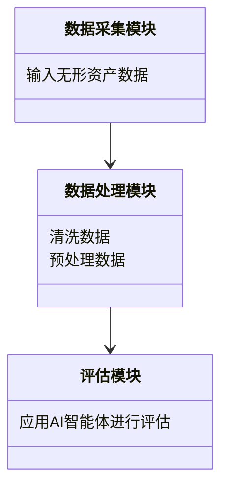
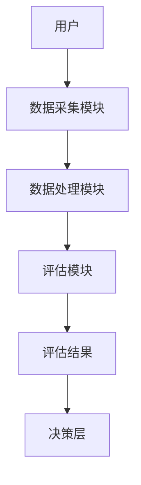
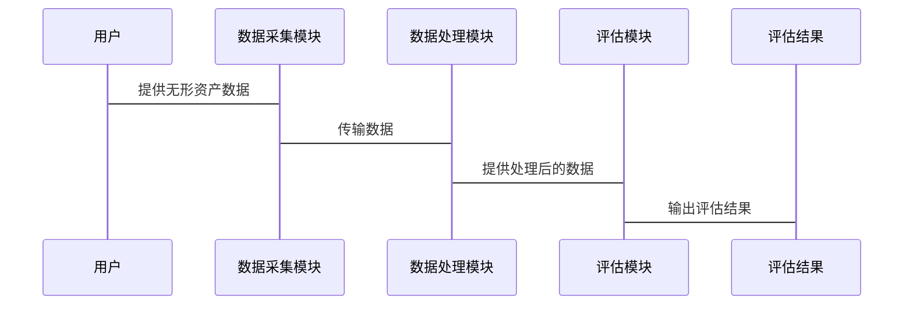

                 


# AI智能体在评估公司无形资产价值中的创新方法

> **关键词**：AI智能体，无形资产评估，创新方法，强化学习，系统架构，项目实战

> **摘要**：本文将详细介绍AI智能体在评估公司无形资产价值中的创新方法。通过分析传统无形资产评估方法的局限性，提出基于AI智能体的新方法，并结合实际案例，展示如何通过强化学习、系统架构设计和项目实战来实现高效、精准的无形资产评估。

---

## 第一部分：背景介绍与核心概念

### 第1章：背景介绍与核心概念

#### 1.1 无形资产评估的背景与挑战

- **1.1.1 无形资产的定义与分类**
  - 无形资产包括品牌、专利、商标、商誉等。
  - 传统评估方法的局限性：主观性强、数据依赖度高、难以量化。

- **1.1.2 传统无形资产评估方法的局限性**
  - 主观性问题：评估结果受评估人员经验影响。
  - 数据不足：难以获取足够的历史数据支持评估。
  - 评估周期长：传统方法需要大量人工分析。

- **1.1.3 AI智能体在无形资产评估中的优势**
  - 数据驱动：AI智能体可以处理大量数据，提供客观结果。
  - 高效性：AI智能体可以快速完成评估，缩短周期。
  - 精准性：通过机器学习算法，提高评估的准确性。

#### 1.2 AI智能体的基本原理

- **1.2.1 AI智能体的定义与特点**
  - AI智能体是一种能够感知环境、做出决策并执行操作的智能系统。
  - 特点：自主性、反应性、目标导向。

- **1.2.2 AI智能体的核心要素与功能模块**
  - 感知模块：从环境中获取数据。
  - 决策模块：基于数据做出评估决策。
  - 执行模块：根据决策执行操作。

- **1.2.3 AI智能体与传统评估方法的对比**
  - 传统方法依赖人工判断，AI智能体依赖数据和算法。
  - 传统方法效率低，AI智能体高效。

#### 1.3 问题背景与目标

- **1.3.1 无形资产评估中的主要问题**
  - 数据不足。
  - 方法主观性强。
  - 评估效率低。

- **1.3.2 AI智能体解决这些问题的思路**
  - 利用大数据和机器学习算法，提高评估的客观性和效率。

- **1.3.3 本研究的目标与意义**
  - 提出一种基于AI智能体的无形资产评估新方法。
  - 通过实际案例验证方法的有效性。

#### 1.4 本章小结

- 本章介绍了无形资产评估的背景与挑战，分析了传统方法的局限性，并提出了基于AI智能体的新方法。

---

## 第二部分：AI智能体的核心概念与联系

### 第2章：核心概念与联系

#### 2.1 AI智能体的原理与机制

- **2.1.1 AI智能体的感知与决策过程**
  - 感知环境：通过传感器或数据源获取信息。
  - 决策：基于感知的信息做出评估决策。

- **2.1.2 基于强化学习的智能体行为模型**
  - 强化学习：通过奖励机制优化智能体的行为。
  - Q-Learning算法：一种经典的强化学习算法。

- **2.1.3 智能体与环境的交互机制**
  - 智能体通过与环境交互，不断优化自身的评估策略。

#### 2.2 核心概念对比表

| **传统评估方法** | **AI智能体评估方法** |
|--------------------|-----------------------|
| 主观性强           | 客观性高             |
| 依赖人工判断       | 依赖数据和算法       |
| 评估效率低         | 评估效率高           |

#### 2.3 ER实体关系图

```mermaid
erd
    图表标题：AI智能体与无形资产评估的关系
    entity 无形资产
    entity 评估数据
    entity 评估结果
    无形资产 --> 评估数据
    评估数据 --> 评估结果
```

#### 2.4 本章小结

- 本章详细介绍了AI智能体的核心概念，分析了其与传统评估方法的差异，并通过ER实体关系图展示了AI智能体在无形资产评估中的作用。

---

## 第三部分：AI智能体的算法原理与数学模型

### 第3章：算法原理讲解

#### 3.1 强化学习算法在AI智能体中的应用

- **3.1.1 Q-Learning算法的原理与流程**
  - Q-Learning算法是一种基于值的强化学习算法。
  - 算法流程：
    1. 初始化Q表。
    2. 环境提供状态。
    3. 根据策略选择动作。
    4. 执行动作，获得奖励。
    5. 更新Q表。

- **3.1.2 Deep Q-Networks (DQN) 的实现**
  - DQN算法：将Q-Learning与深度神经网络结合。
  - 网络结构：输入层、隐藏层、输出层。

- **3.1.3 算法的优化与改进**
  - 探索与利用策略：平衡探索新策略和利用已知好策略。
  - 体验回放：通过存储历史经验优化学习过程。

#### 3.2 智能体评估模型的数学公式

- **3.2.1 评估模型的基本公式**
  $$ V(s) = \max_{a} [r + V(s') ] $$
  - 其中，\( V(s) \) 表示状态 \( s \) 的价值，\( r \) 是奖励，\( s' \) 是下一个状态。

- **3.2.2 基于强化学习的评估模型**
  $$ Q(s, a) = Q(s, a) + \alpha (r + \max_{a'} Q(s', a') - Q(s, a)) $$
  - 其中，\( \alpha \) 是学习率。

#### 3.3 本章小结

- 本章详细讲解了AI智能体的算法原理，特别是强化学习算法，并通过数学公式展示了评估模型的核心思想。

---

## 第四部分：系统分析与架构设计

### 第4章：系统分析与架构设计

#### 4.1 问题场景介绍

- 无形资产评估的场景：企业需要评估品牌、专利等无形资产的价值。
- 现有方法的局限性：传统方法效率低、主观性强。

#### 4.2 系统功能设计

- **4.2.1 功能模块**
  - 数据采集模块：采集无形资产相关数据。
  - 数据处理模块：清洗和预处理数据。
  - 评估模块：基于AI智能体进行评估。

- **4.2.2 领域模型（mermaid类图）**



#### 4.3 系统架构设计

- **4.3.1 系统架构（mermaid架构图）**



#### 4.4 系统接口设计

- 输入接口：接收无形资产相关数据。
- 输出接口：输出评估结果。

#### 4.5 系统交互（mermaid序列图）



#### 4.6 本章小结

- 本章详细分析了系统的功能模块、架构设计和接口设计，并通过mermaid图展示了系统的工作流程。

---

## 第五部分：项目实战

### 第5章：项目实战

#### 5.1 环境安装

- **安装Python与相关库**
  - 安装Python：`python --version`
  - 安装库：`pip install numpy pandas tensorflow`

#### 5.2 系统核心实现源代码

- **AI智能体评估模型的实现代码**

```python
import numpy as np
import tensorflow as tf

# 定义Q-Learning模型
class AIAssetEvaluator:
    def __init__(self, state_space, action_space):
        self.state_space = state_space
        self.action_space = action_space
        self.learning_rate = 0.01
        self.epsilon = 0.9
        self.model = self.build_model()

    def build_model(self):
        model = tf.keras.Sequential([
            tf.keras.layers.Dense(32, activation='relu', input_dim=self.state_space),
            tf.keras.layers.Dense(self.action_space, activation='linear')
        ])
        model.compile(optimizer=tf.keras.optimizers.Adam(lr=self.learning_rate), loss='mse')
        return model

    def get_action(self, state):
        if np.random.random() < self.epsilon:
            return np.random.randint(0, self.action_space)
        else:
            Q = self.model.predict(np.array([state]))
            return np.argmax(Q[0])

    def update_model(self, state, action, reward, next_state):
        Q = self.model.predict(np.array([state]))
        next_Q = self.model.predict(np.array([next_state]))
        target = Q[0][action] + reward + np.max(next_Q[0])
        Q[0][action] = target
        self.model.fit(np.array([state]), Q, epochs=1, verbose=0)
```

#### 5.3 代码应用解读与分析

- 代码实现了一个基于Q-Learning的AI智能体评估模型。
- 通过训练模型，智能体可以学习如何在不同的状态下选择最优的动作。

#### 5.4 实际案例分析与详细讲解

- 案例：评估一个公司的品牌价值。
- 数据输入：品牌历史销售数据、市场占有率、竞争对手数据。
- 模型训练：通过强化学习优化评估策略。
- 评估结果：输出品牌价值的估计值。

#### 5.5 项目小结

- 本章通过实际案例展示了AI智能体在无形资产评估中的应用，详细讲解了系统的核心代码和实现过程。

---

## 第六部分：最佳实践

### 第6章：最佳实践

#### 6.1 小结

- 本文提出了基于AI智能体的无形资产评估新方法，通过强化学习算法和系统架构设计，实现了高效、精准的评估。

#### 6.2 注意事项

- 数据质量：确保输入数据的准确性和完整性。
- 模型优化：根据实际需求调整模型参数。
- 持续学习：定期更新模型以适应市场变化。

#### 6.3 拓展阅读

- 推荐阅读《强化学习：算法与应用》。
- 参考GitHub上的相关AI项目。

---

## 第七部分：总结

### 7.1 总结

- 本文详细介绍了AI智能体在评估公司无形资产价值中的创新方法，通过理论分析和实际案例展示了其优势。
- 未来研究方向：探索更复杂的深度学习模型，如Transformer，进一步提高评估的准确性和效率。

---

**全文完**

