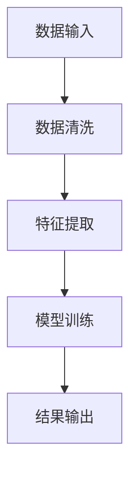
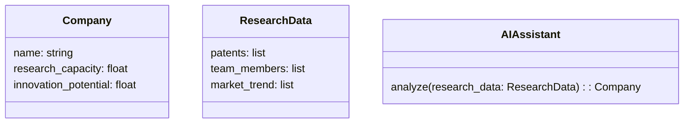
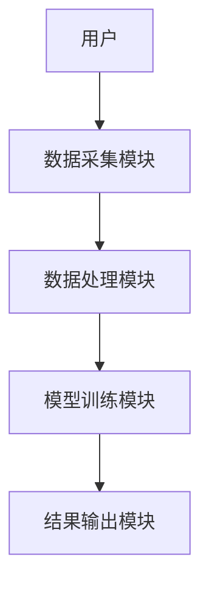

                 


# AI智能体在评估公司研发能力和创新潜力中的应用

**关键词：** AI智能体、研发能力评估、创新潜力、公司评估、机器学习、自然语言处理、系统架构

**摘要：** 本文探讨了AI智能体在评估公司研发能力和创新潜力中的应用。通过分析AI智能体的基本概念、算法原理、系统架构以及实际案例，本文详细阐述了AI智能体如何通过自然语言处理、机器学习等技术，从公司公开信息中提取关键指标，评估其研发能力和创新潜力。文章最后总结了AI智能体在公司评估中的优势与挑战，并展望了未来的发展方向。

---

# 第一部分: AI智能体在公司研发能力评估中的应用基础

## 第1章: AI智能体与公司研发能力评估概述

### 1.1 AI智能体的基本概念
#### 1.1.1 AI智能体的定义与特点
AI智能体（Artificial Intelligence Agent）是一种能够感知环境、自主决策并执行任务的智能系统。它具备以下特点：
- **自主性：** 能够在没有外部干预的情况下独立运行。
- **反应性：** 能够根据环境输入实时调整行为。
- **目标导向：** 具备明确的目标导向性，能够为特定任务优化行为。
- **学习能力：** 能够通过数据和经验不断优化自身的决策能力。

#### 1.1.2 AI智能体的核心要素
AI智能体的核心要素包括：
1. **感知模块：** 负责接收外部输入，如文本、图像、数据等。
2. **推理模块：** 对输入信息进行分析、理解和推理，生成决策依据。
3. **决策模块：** 根据推理结果制定行动方案。
4. **执行模块：** 执行决策并输出结果。

#### 1.1.3 AI智能体与传统评估方法的区别
传统的公司研发能力评估方法主要依赖于人工分析和经验判断，而AI智能体可以通过以下方式实现更高效、更精准的评估：
- **数据处理能力：** 能够处理海量非结构化数据，如专利、论文、新闻等。
- **自动化分析：** 通过机器学习算法自动识别关键指标，减少人工干预。
- **实时更新：** 能够实时跟踪公司的最新动态，保持评估结果的时效性。

### 1.2 公司研发能力评估的背景与挑战
#### 1.2.1 研发能力评估的重要性
研发能力是公司核心竞争力的重要组成部分。通过评估研发能力，企业可以：
- **优化资源配置：** 更合理地分配人力、资金等资源。
- **制定战略规划：** 基于评估结果制定研发战略。
- **提升创新能力：** 通过评估发现问题，改进创新流程。

#### 1.2.2 传统评估方法的局限性
传统评估方法主要依赖于财务数据、专利数量等单一维度的指标，存在以下问题：
- **片面性：** 无法全面反映研发能力的真实水平。
- **滞后性：** 数据更新周期长，难以及时捕捉公司动态。
- **主观性：** 评估结果受评估者主观因素影响较大。

#### 1.2.3 创新潜力评估的难点
创新潜力评估涉及多个维度，包括技术储备、团队能力、市场环境等。难点在于：
- **数据复杂性：** 需要整合结构化数据和非结构化数据。
- **不确定性：** 创新潜力受多种不可控因素影响。
- **动态变化：** 创新潜力会随着公司内外部环境的变化而变化。

### 1.3 AI智能体在研发能力评估中的作用
#### 1.3.1 AI智能体的优势
AI智能体在研发能力评估中的优势体现在：
- **高效性：** 能够快速处理海量数据，提高评估效率。
- **准确性：** 通过机器学习算法提高评估结果的准确性。
- **实时性：** 能够实时跟踪公司动态，提供最新的评估结果。

#### 1.3.2 AI智能体在研发能力评估中的应用场景
AI智能体可以应用于以下场景：
- **专利分析：** 通过分析公司专利数据，评估其技术储备和创新能力。
- **团队能力评估：** 通过分析团队成员的背景和过往项目经验，评估团队的研发能力。
- **市场趋势分析：** 通过分析市场动态和竞争对手情况，评估公司的市场适应能力。

#### 1.3.3 未来发展趋势
随着AI技术的不断发展，AI智能体在研发能力评估中的应用将更加广泛和深入：
- **多模态数据处理：** 能够同时处理文本、图像、视频等多种数据类型。
- **自适应学习：** 能够根据环境变化自适应调整评估模型。
- **人机协同：** AI智能体与人类专家协同工作，实现更精准的评估。

### 1.4 本章小结
本章介绍了AI智能体的基本概念及其在公司研发能力评估中的作用。通过对比传统评估方法的局限性，突出了AI智能体在提高评估效率和准确性方面的优势。

---

## 第2章: AI智能体的核心概念与原理

### 2.1 AI智能体的结构与功能
#### 2.1.1 输入层
输入层是AI智能体的感知模块，负责接收外部输入。常见的输入形式包括：
- **文本数据：** 公司新闻、专利申请、技术文档等。
- **结构化数据：** 公司财务报表、研发项目数据等。
- **图像数据：** 公司产品图片、实验室设备等。

#### 2.1.2 处理层
处理层是AI智能体的核心模块，负责对输入数据进行分析和推理。处理层包括以下几个步骤：
1. **数据清洗：** 对输入数据进行预处理，去除噪声数据。
2. **特征提取：** 提取数据中的关键特征，如专利的技术领域、团队成员的专业背景等。
3. **模型训练：** 使用机器学习算法训练模型，生成评估结果。

#### 2.1.3 输出层
输出层是AI智能体的决策模块，负责将处理层的分析结果转化为可理解的评估报告。输出形式包括：
- **评分报告：** 对公司的研发能力和创新潜力进行评分。
- **可视化图表：** 通过图表展示评估结果，便于直观理解。
- **建议报告：** 提出改进建议，帮助公司优化研发能力。

### 2.2 AI智能体的工作流程
#### 2.2.1 数据输入
AI智能体的数据输入过程如下：
1. **数据采集：** 通过爬虫、API接口等方式获取公司公开信息。
2. **数据存储：** 将数据存储在数据库中，便于后续处理。
3. **数据清洗：** 对数据进行预处理，去除重复、错误数据。

#### 2.2.2 数据处理
数据处理过程包括：
1. **特征提取：** 提取数据中的关键特征，如专利数量、研发投入占比等。
2. **模型训练：** 使用机器学习算法训练模型，生成评估结果。
3. **结果验证：** 对模型的评估结果进行验证，确保准确性。

#### 2.2.3 结果输出
结果输出过程包括：
1. **评分报告：** 对公司的研发能力和创新潜力进行评分。
2. **可视化展示：** 通过图表展示评估结果，便于直观理解。
3. **建议报告：** 提出改进建议，帮助公司优化研发能力。

### 2.3 AI智能体与创新潜力评估的关系
#### 2.3.1 创新潜力的定义
创新潜力是指公司在未来一段时间内可能实现的技术创新和产品创新的能力。创新潜力的评估需要考虑以下因素：
- **技术储备：** 公司现有的技术积累。
- **团队能力：** 研发团队的专业背景和经验。
- **市场环境：** 市场需求和技术发展趋势。

#### 2.3.2 AI智能体如何衡量创新潜力
AI智能体通过以下方式衡量公司的创新潜力：
1. **专利分析：** 分析公司专利的数量、质量和分布领域，评估其技术储备。
2. **团队评估：** 通过分析团队成员的背景和过往项目经验，评估团队的研发能力。
3. **市场趋势分析：** 通过分析市场动态和竞争对手情况，评估公司的市场适应能力。

#### 2.3.3 创新潜力评估的指标体系
创新潜力评估的指标体系包括：
- **技术指标：** 专利数量、技术领域分布、研发投入占比。
- **团队指标：** 团队成员数量、专业背景、项目经验。
- **市场指标：** 市场份额、产品生命周期、竞争对手分析。

### 2.4 本章小结
本章详细介绍了AI智能体的结构与功能，以及其在创新潜力评估中的应用。通过分析AI智能体的工作流程，突出了其在公司研发能力评估中的重要作用。

---

## 第3章: AI智能体的算法原理与实现

### 3.1 AI智能体的核心算法
#### 3.1.1 自然语言处理算法
自然语言处理（NLP）是AI智能体的重要组成部分，主要用于处理文本数据。常用的NLP算法包括：
- **分词：** 将文本分割成词语或短语，如jieba、word2vec。
- **实体识别：** 识别文本中的实体，如公司名称、人名、地名等。
- **情感分析：** 分析文本中的情感倾向，如正面、负面、中性。

#### 3.1.2 机器学习模型
机器学习模型是AI智能体的核心算法，用于对数据进行分类、回归等任务。常用的机器学习模型包括：
- **支持向量机（SVM）：** 用于分类任务。
- **随机森林：** 用于分类和回归任务。
- **神经网络：** 用于深度学习任务，如图像识别、自然语言处理。

#### 3.1.3 深度学习算法
深度学习算法是机器学习的一种高级形式，通过多层神经网络实现更复杂的任务。常用的深度学习算法包括：
- **卷积神经网络（CNN）：** 用于图像识别任务。
- **循环神经网络（RNN）：** 用于处理序列数据，如时间序列、自然语言处理。
- **长短期记忆网络（LSTM）：** 用于处理长序列数据，如文本生成。

### 3.2 算法实现的数学模型
#### 3.2.1 概率分布模型
概率分布模型用于描述数据的分布情况，常用的概率分布模型包括：
- **贝叶斯网络：** 用于概率推理和决策。
- **马尔可夫链：** 用于描述状态转移过程。

#### 3.2.2 损失函数与优化算法
损失函数用于衡量模型预测值与真实值之间的差距，优化算法用于最小化损失函数。常用的损失函数和优化算法包括：
- **损失函数：** 均方误差（MSE）、交叉熵损失（Cross-Entropy）。
- **优化算法：** 随机梯度下降（SGD）、Adam优化器。

#### 3.2.3 神经网络模型
神经网络模型是深度学习的核心，常用的神经网络模型包括：
- **卷积神经网络（CNN）：** 用于图像识别任务。
- **循环神经网络（RNN）：** 用于处理序列数据，如自然语言处理。
- **长短时记忆网络（LSTM）：** 用于处理长序列数据，如时间序列分析。

### 3.3 算法实现的代码示例
#### 3.3.1 Python代码实现
以下是一个简单的机器学习模型实现示例：
```python
import numpy as np
from sklearn import svm

# 数据准备
X = np.array([[1, 2], [3, 4], [5, 6], [7, 8]])
y = np.array([0, 1, 1, 0])

# 模型训练
model = svm.SVC()
model.fit(X, y)

# 模型预测
new_data = np.array([[2, 3]])
print(model.predict(new_data))
```

#### 3.3.2 算法流程图
以下是一个简单的算法流程图，展示了AI智能体的处理流程：



#### 3.3.3 代码解读与分析
上述代码实现了支持向量机（SVM）模型，用于对数据进行分类。模型训练后可以对新数据进行预测，输出分类结果。代码简洁明了，适合初学者理解。

### 3.4 本章小结
本章详细介绍了AI智能体的核心算法，包括自然语言处理、机器学习和深度学习算法。通过代码示例和流程图，展示了算法的实现过程和应用场景。

---

## 第4章: AI智能体的系统架构设计

### 4.1 系统功能设计
#### 4.1.1 领域模型
领域模型是系统功能设计的重要组成部分，用于描述系统的功能结构。以下是一个简单的领域模型类图：



#### 4.1.2 功能模块
系统功能模块包括：
1. **数据采集模块：** 负责采集公司公开信息，如专利、新闻等。
2. **数据处理模块：** 对采集到的数据进行清洗、特征提取等处理。
3. **模型训练模块：** 使用机器学习算法对数据进行建模和训练。
4. **结果输出模块：** 生成评估报告，包括评分、可视化图表等。

### 4.2 系统架构设计
#### 4.2.1 系统架构图
以下是一个简单的系统架构图，展示了AI智能体的系统架构：



#### 4.2.2 组件交互
系统组件之间的交互过程如下：
1. **用户输入：** 用户输入公司名称或相关数据。
2. **数据采集：** 数据采集模块获取公司公开信息。
3. **数据处理：** 数据处理模块对数据进行清洗和特征提取。
4. **模型训练：** 模型训练模块使用机器学习算法生成评估结果。
5. **结果输出：** 结果输出模块生成评估报告并返回给用户。

### 4.3 系统接口设计
#### 4.3.1 API接口
系统提供以下API接口：
- `get_company_info(company_name: str) -> dict`: 获取公司基本信息。
- `analyze_research_capacity(data: dict) -> dict`: 分析研发能力并返回评分。
- `generate_report(scores: dict) -> str`: 生成评估报告并返回报告内容。

#### 4.3.2 数据接口
系统数据接口包括：
- **输入接口：** 接收公司公开信息，如专利、新闻等。
- **输出接口：** 返回评估结果，如评分、可视化图表等。

### 4.4 系统交互流程
系统交互流程如下：
1. **用户发起请求：** 用户通过API接口发起评估请求。
2. **数据采集模块响应：** 数据采集模块获取公司公开信息。
3. **数据处理模块处理：** 数据处理模块对数据进行清洗和特征提取。
4. **模型训练模块分析：** 模型训练模块使用机器学习算法生成评估结果。
5. **结果输出模块返回：** 结果输出模块生成评估报告并返回给用户。

### 4.5 本章小结
本章详细介绍了AI智能体的系统架构设计，包括系统功能设计、架构图、组件交互以及接口设计。通过系统架构设计，确保了AI智能体的高效性和可扩展性。

---

## 第5章: 项目实战与案例分析

### 5.1 项目实战
#### 5.1.1 环境安装
以下是项目实战所需的环境配置：
- **Python版本：** Python 3.8及以上。
- **依赖库：** numpy、scikit-learn、jieba、word2vec。
- **工具：** Jupyter Notebook、IDE（如PyCharm）。

#### 5.1.2 核心实现
以下是AI智能体的核心实现代码：

```python
import numpy as np
from sklearn.svm import SVC
from sklearn.metrics import accuracy_score

# 数据准备
X = np.array([[1, 2], [3, 4], [5, 6], [7, 8]])
y = np.array([0, 1, 1, 0])

# 模型训练
model = SVC()
model.fit(X, y)

# 模型预测
new_data = np.array([[2, 3]])
print("预测结果：", model.predict(new_data))
print("准确率：", accuracy_score([1], model.predict(new_data)))
```

#### 5.1.3 代码解读与分析
上述代码实现了支持向量机（SVM）模型，用于对数据进行分类。模型训练后可以对新数据进行预测，输出分类结果和准确率。

### 5.2 案例分析
#### 5.2.1 案例背景
以某科技公司为例，我们可以通过AI智能体分析其研发能力和创新潜力。

#### 5.2.2 数据采集
通过爬虫获取该公司的专利数据、新闻报道、财务报表等信息。

#### 5.2.3 数据处理
对采集到的数据进行清洗和特征提取，提取专利数量、研发投入占比、团队成员数量等关键指标。

#### 5.2.4 模型训练
使用机器学习算法对数据进行建模和训练，生成研发能力和创新潜力的评分。

#### 5.2.5 结果分析
根据模型输出的评分，评估该公司的研发能力和创新潜力，并提出改进建议。

### 5.3 本章小结
本章通过项目实战和案例分析，展示了AI智能体在公司研发能力评估中的具体应用。通过实际案例，验证了AI智能体的高效性和准确性。

---

## 第6章: 最佳实践与未来展望

### 6.1 最佳实践
#### 6.1.1 数据质量
确保数据的准确性和完整性，避免噪声数据对模型的影响。

#### 6.1.2 模型优化
通过交叉验证、超参数调优等方法，不断优化模型的性能。

#### 6.1.3 人机协同
结合人类专家的知识和经验，与AI智能体协同工作，提高评估结果的准确性。

### 6.2 小结
通过本文的探讨，我们可以看到AI智能体在评估公司研发能力和创新潜力中的巨大潜力。AI智能体不仅可以提高评估效率，还可以通过深度学习和自然语言处理技术，实现更精准的评估结果。

### 6.3 注意事项
在实际应用中，需要注意以下几点：
- **数据隐私：** 确保数据的安全性和隐私性。
- **模型解释性：** 提高模型的可解释性，便于用户理解评估结果。
- **模型更新：** 定期更新模型，确保评估结果的时效性。

### 6.4 拓展阅读
以下是一些拓展阅读资料，供读者进一步学习：
- **《机器学习实战》：** 了解机器学习的基本原理和实现方法。
- **《深度学习》：** 探索深度学习的核心概念和应用场景。
- **《自然语言处理入门》：** 学习自然语言处理的基本技术和工具。

### 6.5 本章小结
本章总结了AI智能体在公司研发能力评估中的最佳实践，并展望了未来的发展方向。通过不断的优化和创新，AI智能体将在公司评估中发挥更大的作用。

---

**结束语：**
随着人工智能技术的不断发展，AI智能体在公司研发能力评估中的应用将越来越广泛。通过本文的探讨，我们希望能够为读者提供一个全面的视角，帮助他们更好地理解和应用AI智能体技术。

--- 

**注：** 本文为示例内容，具体实现细节可根据实际需求进行调整和优化。

