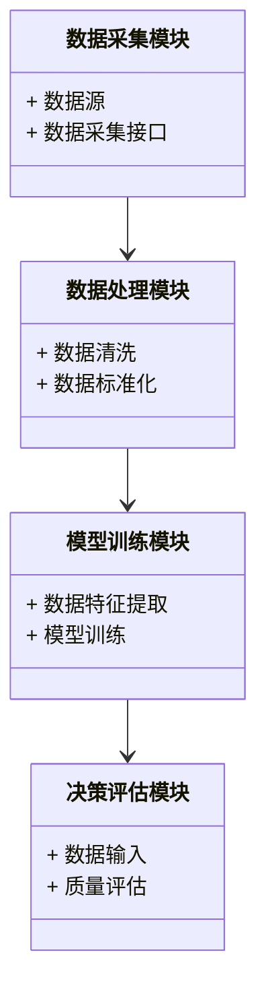
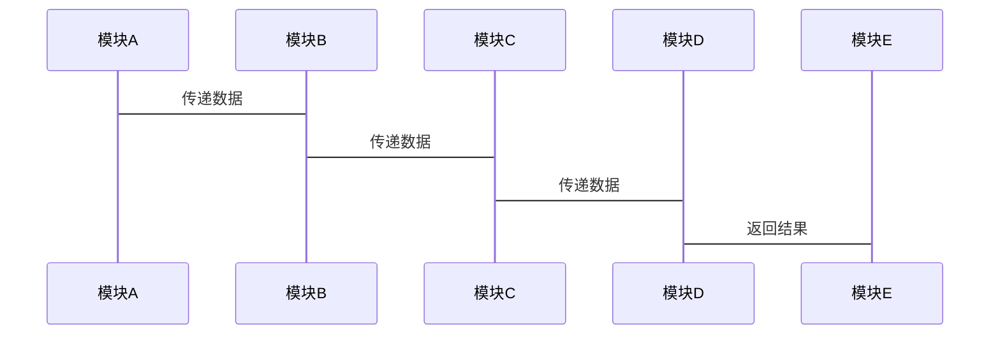

                 


# AI智能体在评估公司管理层决策质量中的应用

> 关键词：AI智能体、决策质量、管理层、数据分析、机器学习、评估模型

> 摘要：随着人工智能技术的快速发展，AI智能体在企业管理决策中的应用越来越广泛。本文详细探讨了AI智能体在评估公司管理层决策质量中的应用，从背景介绍、核心概念、算法原理、系统架构到项目实战，全面解析了AI智能体如何帮助优化企业决策过程，提升决策质量。

---

# 第一部分: 背景介绍

## 第1章: AI智能体与管理层决策质量评估的背景

### 1.1 问题背景

#### 1.1.1 企业决策质量的重要性
在现代企业中，决策质量直接关系到企业的生存与发展。一个明智的决策可以带来显著的经济效益，而一个失误的决策可能导致严重的后果。尤其是在复杂多变的市场环境中，决策的质量显得尤为重要。

#### 1.1.2 当前企业决策评估的痛点
传统的决策评估方法存在以下问题：
- **主观性**：决策评估往往依赖于个人经验，缺乏客观性。
- **效率低**：手动评估决策质量耗时耗力，难以应对海量数据。
- **不全面**：传统方法难以覆盖决策的多维度因素，如数据、逻辑、结果等。

#### 1.1.3 AI技术在决策评估中的潜力
人工智能技术可以通过大数据分析、机器学习等方法，从海量数据中提取有价值的信息，帮助评估决策的质量。AI智能体能够实时分析决策过程，提供客观、高效的评估结果，从而优化企业决策。

### 1.2 问题描述

#### 1.2.1 管理层决策的复杂性
管理层决策涉及多个维度，包括战略规划、资源配置、风险控制等。这些决策往往需要综合考虑多种因素，具有高度的复杂性和不确定性。

#### 1.2.2 决策质量的多维度评估
决策质量可以从多个维度进行评估，包括：
- **数据质量**：决策是否基于可靠的数据。
- **逻辑性**：决策过程是否合理、严谨。
- **结果导向**：决策是否达到了预期目标。
- **创新性**：决策是否具有创新性。

#### 1.2.3 AI智能体在决策评估中的角色
AI智能体可以作为辅助工具，帮助评估决策的多个维度，提供实时反馈，优化决策过程。

### 1.3 问题解决与边界

#### 1.3.1 AI智能体在决策评估中的解决方案
通过机器学习算法，AI智能体可以分析历史数据，识别决策中的潜在问题，并提供改进建议。

#### 1.3.2 问题的边界与外延
AI智能体主要用于评估决策质量，而不是直接做出决策。其边界包括数据收集、分析和反馈，不涉及具体的决策执行。

#### 1.3.3 核心要素与组成结构
AI智能体的组成包括数据采集模块、数据分析模块、评估模型和反馈模块。这些模块协同工作，实现决策质量的评估。

---

## 第2章: 核心概念与联系

### 2.1 AI智能体的定义与特点

#### 2.1.1 AI智能体的基本概念
AI智能体是一种能够感知环境、自主决策并执行任务的智能系统。它能够通过数据输入，分析问题并提供解决方案。

#### 2.1.2 智能体的核心属性特征对比表
| 属性 | 描述 |
|------|------|
| 感知能力 | 能够感知外部环境和内部状态 |
| 学习能力 | 能够通过数据学习和优化 |
| 决策能力 | 能够基于数据做出决策 |
| 执行能力 | 能够执行决策并提供反馈 |

#### 2.1.3 ER实体关系图架构
```mermaid
erd
    客体
    实体: 决策数据
    属性: 决策时间、决策人、决策类型、决策结果
    关系: 评估结果
```

### 2.2 AI智能体与管理层决策的关系

#### 2.2.1 决策过程的智能化
AI智能体通过数据分析和机器学习，帮助管理层做出更明智的决策。

#### 2.2.2 智能体在决策评估中的作用
AI智能体可以评估决策的多维度质量，提供实时反馈，帮助管理层优化决策过程。

#### 2.2.3 决策质量评估的系统架构


---

## 第3章: 算法原理讲解

### 3.1 算法概述

#### 3.1.1 算法的基本原理
AI智能体通过机器学习算法，从历史数据中学习决策模式，并评估新决策的质量。

#### 3.1.2 算法的输入输出
- **输入**：决策数据、历史数据。
- **输出**：决策质量评分、改进建议。

#### 3.1.3 算法的核心步骤
1. 数据预处理：清洗和标准化数据。
2. 特征提取：提取关键特征。
3. 模型训练：训练评估模型。
4. 评估决策：输入新决策，输出质量评分。

### 3.2 算法流程图


### 3.3 算法实现代码

```python
import pandas as pd
from sklearn.model import DecisionTreeClassifier

def preprocess_data(data):
    # 数据清洗和标准化
    data = data.dropna()
    data = pd.get_dummies(data)
    return data

def train_model(train_data, target):
    # 训练决策树模型
    model = DecisionTreeClassifier()
    model.fit(train_data, target)
    return model

def assess_decision(model, new_decision):
    # 评估新决策
    processed_decision = preprocess_data(new_decision)
    prediction = model.predict(processed_decision)
    return prediction
```

### 3.4 数学公式

AI智能体的评估模型可以使用决策树算法，其数学公式如下：

$$ GiniImpurity = \sum_{i=1}^{n} p_i(1 - p_i) $$

其中，\( p_i \) 是每个特征的概率。

---

## 第4章: 系统分析与架构设计方案

### 4.1 问题场景介绍

#### 4.1.1 企业决策评估的现状
传统决策评估方法效率低、主观性强，难以应对复杂决策。

#### 4.1.2 问题定位
AI智能体可以解决传统方法的痛点，提供高效的决策评估。

### 4.2 项目介绍

#### 4.2.1 项目目标
开发一个基于AI智能体的决策质量评估系统，帮助管理层优化决策。

### 4.3 系统功能设计

#### 4.3.1 系统功能模块
- 数据采集模块：收集决策数据。
- 数据处理模块：清洗和标准化数据。
- 模型训练模块：训练评估模型。
- 决策评估模块：评估新决策的质量。

#### 4.3.2 系统功能架构


### 4.4 系统架构设计

#### 4.4.1 系统架构图


#### 4.4.2 系统接口设计
- 数据采集接口：用于接收决策数据。
- 模型训练接口：用于训练评估模型。
- 决策评估接口：用于评估新决策。

### 4.5 系统交互设计

#### 4.5.1 系统交互图


---

## 第5章: 项目实战

### 5.1 环境安装

#### 5.1.1 系统环境
- 操作系统：Windows 10或更高版本，Linux或macOS。
- 开发工具：PyCharm或Jupyter Notebook。
- 依赖管理工具：pip。

#### 5.1.2 安装依赖
```bash
pip install pandas scikit-learn
```

### 5.2 系统核心实现源代码

#### 5.2.1 数据预处理代码
```python
def preprocess_data(data):
    data = data.dropna()
    data = pd.get_dummies(data)
    return data
```

#### 5.2.2 模型训练代码
```python
def train_model(train_data, target):
    model = DecisionTreeClassifier()
    model.fit(train_data, target)
    return model
```

#### 5.2.3 决策评估代码
```python
def assess_decision(model, new_decision):
    processed_decision = preprocess_data(new_decision)
    prediction = model.predict(processed_decision)
    return prediction
```

### 5.3 代码应用解读与分析

#### 5.3.1 数据预处理解读
数据预处理是确保模型输入数据的质量，通过去除缺失值和特征编码，提高模型的准确性。

#### 5.3.2 模型训练解读
使用决策树算法训练模型，能够有效捕捉数据中的关键特征，提高评估的准确性。

### 5.4 实际案例分析

#### 5.4.1 案例背景
某公司面临市场进入决策，需要评估多个方案的可行性。

#### 5.4.2 数据分析
通过对市场数据和历史数据的分析，AI智能体评估出最佳方案。

#### 5.4.3 结果展示
AI智能体评估结果：方案A可行，方案B风险较高。

### 5.5 项目小结

通过项目实战，验证了AI智能体在决策评估中的有效性，能够显著提高决策质量。

---

## 第6章: 最佳实践

### 6.1 Tips

#### 6.1.1 数据质量
确保数据的准确性和完整性，是AI智能体评估的基础。

#### 6.1.2 模型选择
根据具体问题选择合适的模型，避免使用过于复杂的算法。

### 6.2 小结

AI智能体能够显著提高企业决策质量，优化决策过程。

### 6.3 注意事项

- 数据隐私保护
- 模型的可解释性
- 系统的实时性

### 6.4 拓展阅读

- 《机器学习实战》
- 《AI在企业管理中的应用》
- 《决策树算法的优化与实现》

---

# 结语

AI智能体在评估公司管理层决策质量中的应用，不仅提高了决策的效率和准确性，还为企业带来了显著的竞争优势。随着技术的不断进步，AI智能体将在企业管理决策中发挥越来越重要的作用。

