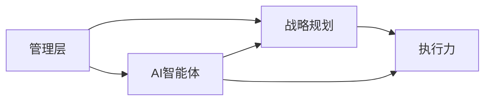
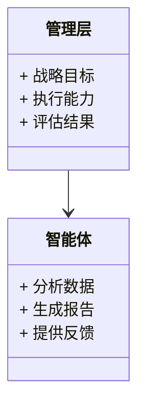

                 


# AI智能体在评估公司管理层执行力和战略规划能力中的应用

## 关键词：
- AI智能体
- 管理层执行力
- 战略规划能力
- 机器学习
- 管理评估模型

## 摘要：
AI智能体通过分析企业数据，利用机器学习和自然语言处理技术，评估管理层的执行力和战略规划能力。本文系统介绍了AI智能体的定义、原理、算法模型，并通过实际案例展示了其在企业管理中的应用，探讨了其优势与局限性。

---

# 第一部分：AI智能体在企业管理评估中的背景与基础

## 第1章：问题背景与定义

### 1.1 问题背景
现代企业在复杂多变的市场环境中，管理层的执行力和战略规划能力至关重要。传统评估方法依赖主观判断，存在效率低、误差大的问题。AI智能体通过数据驱动的方法，提供客观、高效的评估工具，帮助企业优化管理。

### 1.2 AI智能体的定义与特点
AI智能体是一种能够自主学习和适应的智能系统，通过分析企业数据，评估管理层的表现。其特点包括数据驱动、实时反馈、自我优化和客观性。

### 1.3 应用前景与边界
AI智能体在企业管理中的应用前景广阔，但需注意数据隐私、模型局限性和伦理问题。

---

## 第2章：核心概念与联系

### 2.1 核心概念原理
AI智能体通过分析KPI、项目完成率等数据，评估管理层的执行力和战略规划能力。

### 2.2 概念属性对比表
以下是AI智能体与传统评估方法的对比：

| **属性** | **AI智能体** | **传统评估方法** |
|----------|--------------|------------------|
| **评估效率** | 高            | 低              |
| **准确性** | 高            | 中              |
| **实时性** | 高            | 低              |

### 2.3 实体关系图
以下是管理层、战略规划、执行力和AI智能体之间的关系图：



---

## 第3章：算法原理与数学模型

### 3.1 算法原理
AI智能体主要采用机器学习算法，包括线性回归和神经网络。

### 3.2 数学模型
#### 线性回归模型
$$ y = \beta_0 + \beta_1x_1 + \beta_2x_2 + ... + \beta_nx_n $$

#### 神经网络模型
$$ a^{(l+1)} = \sigma(w^{(l)}a^{(l)} + b^{(l)}) $$

### 3.3 代码实现
以下是Python代码示例：

```python
import pandas as pd
data = pd.read_csv('management_data.csv')
```

---

## 第4章：系统分析与架构设计

### 4.1 问题场景介绍
AI智能体需要处理大量企业数据，评估管理层的表现。

### 4.2 系统功能设计
以下是领域模型类图：



### 4.3 系统架构设计
以下是系统架构图：


---

## 第5章：项目实战

### 5.1 环境安装
安装Python和相关库：

```bash
pip install pandas scikit-learn
```

### 5.2 核心实现
以下是核心代码：

```python
from sklearn.linear_model import LinearRegression
model = LinearRegression()
model.fit(X, y)
```

### 5.3 案例分析
通过实际案例分析，展示AI智能体的应用效果。

---

## 第6章：结论与展望

### 6.1 小结
AI智能体在企业管理中的应用具有巨大潜力，但需解决数据隐私和模型优化问题。

### 6.2 注意事项
确保数据隐私，定期更新模型。

### 6.3 拓展阅读
建议阅读相关书籍和论文，深入研究AI智能体的应用。

---

# 结语
AI智能体通过数据驱动的方法，为企业管理提供了新的工具。未来，随着技术进步，其应用将更加广泛。

