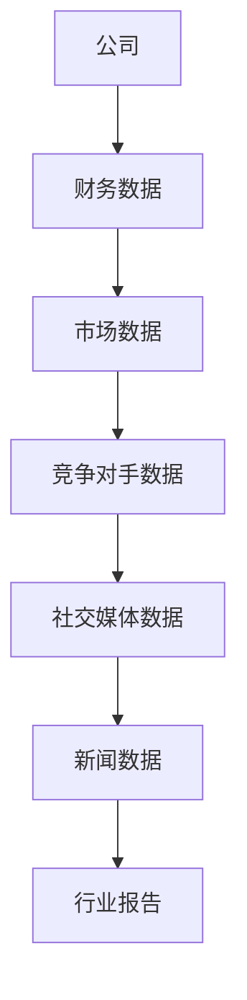
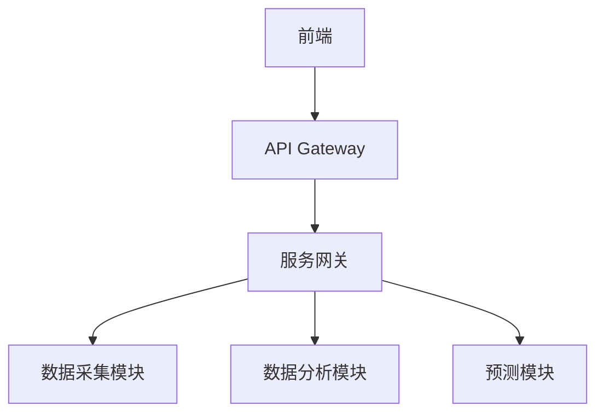

                 


# AI智能体在评估公司长期盈利能力和增长潜力中的应用

## 关键词：
AI智能体、公司评估、盈利能力、增长潜力、机器学习、财务分析

## 摘要：
本文详细探讨了AI智能体在评估公司长期盈利能力和增长潜力中的应用。通过分析AI智能体的核心概念、算法原理、系统架构及实际项目案例，展示了如何利用AI技术提升企业评估的准确性和效率。文章内容涵盖从理论到实践的各个方面，帮助读者全面理解并掌握AI智能体的应用方法。

---

# 第一部分: AI智能体在公司评估中的背景与基础

## 第1章: AI智能体与公司评估概述

### 1.1 AI智能体的基本概念

#### 1.1.1 AI智能体的定义与特点
- **定义**：AI智能体是一种能够感知环境、处理数据、做出决策并执行任务的智能系统。
- **特点**：数据驱动、自适应、实时分析、自我优化。

#### 1.1.2 AI智能体的核心功能与应用场景
- **核心功能**：数据采集与处理、模式识别、预测分析、决策支持。
- **应用场景**：财务分析、市场预测、风险评估、投资决策。

#### 1.1.3 AI智能体与传统财务分析的对比
- **数据处理能力**：AI智能体能够处理海量非结构化数据，而传统方法依赖于少量结构化数据。
- **分析深度**：AI智能体能够发现隐藏的模式，传统方法依赖于人工经验。
- **实时性**：AI智能体可以实时分析数据，传统方法通常需要定期更新。

### 1.2 公司长期盈利能力与增长潜力的评估方法

#### 1.2.1 财务指标分析法
- **常用指标**：净利润率、ROE、毛利率、负债率。
- **局限性**：仅依赖财务数据，忽视市场和竞争因素。

#### 1.2.2 市场分析法
- **分析维度**：市场规模、增长率、竞争格局。
- **工具**：SWOT分析、波特五力模型。

#### 1.2.3 竞争分析法
- **竞争对手分析**：市场份额、产品定位、竞争优势。
- **技术**：爬虫技术获取公开数据，NLP分析竞争对手的产品描述。

#### 1.2.4 综合评估模型
- **模型构建**：结合财务、市场、竞争等多维度数据，构建加权评估模型。
- **权重确定**：基于行业特点和公司战略，确定各维度的权重。

### 1.3 AI智能体在公司评估中的优势

#### 1.3.1 数据处理能力
- **数据源多样性**：能够处理财务数据、市场数据、新闻数据等多源数据。
- **数据清洗与预处理**：自动识别和填补数据缺失值，处理异常值。

#### 1.3.2 智能预测能力
- **机器学习算法**：利用回归、分类、聚类等算法预测公司未来的盈利能力。
- **时间序列分析**：使用ARIMA、LSTM等模型预测市场趋势。

#### 1.3.3 自适应优化能力
- **动态调整模型**：根据市场变化实时优化预测模型。
- **反馈机制**：根据实际结果调整预测参数，提高准确性。

---

## 第2章: AI智能体的核心概念与原理

### 2.1 AI智能体的构成要素

#### 2.1.1 数据源
- **内部数据**：财务报表、销售数据、成本数据。
- **外部数据**：市场报告、行业趋势、竞争对手信息。
- **实时数据**：股票价格、新闻 sentiment、社交媒体情绪。

#### 2.1.2 数据处理模块
- **数据清洗**：处理缺失值、异常值。
- **特征工程**：提取关键特征，如财务比率、市场指标。
- **数据标准化**：将数据标准化或归一化，适合不同算法。

#### 2.1.3 模型构建模块
- **监督学习模型**：用于分类和回归任务，如预测公司是否盈利。
- **无监督学习模型**：用于聚类和异常检测，识别潜在风险。
- **深度学习模型**：用于复杂模式识别，如自然语言处理。

#### 2.1.4 预测与优化模块
- **预测模型**：基于历史数据预测未来盈利能力。
- **优化算法**：使用遗传算法、模拟退火优化模型参数。
- **反馈机制**：根据实际结果调整模型，提高预测准确率。

### 2.2 AI智能体的数学模型与算法

#### 2.2.1 线性回归模型
- **公式**：$$y = \beta_0 + \beta_1x + \epsilon$$
- **应用场景**：预测公司收入与广告支出的关系。

#### 2.2.2 支持向量机
- **原理**：寻找最优超平面，最大化分类间隔。
- **优点**：适用于小数据集，泛化能力强。

#### 2.2.3 神经网络模型
- **结构**：输入层、隐藏层、输出层。
- **训练**：使用反向传播算法和梯度下降优化权重。

#### 2.2.4 集成学习算法
- **方法**：随机森林、梯度提升树。
- **优点**：通过集成多个模型提高准确性和稳定性。

### 2.3 AI智能体的实体关系图



---

## 第3章: AI智能体的算法实现与优化

### 3.1 算法实现

#### 3.1.1 线性回归的Python实现
```python
import numpy as np
from sklearn.linear_model import LinearRegression

# 示例数据
X = np.array([[1], [2], [3], [4], [5]])
y = np.array([2, 4, 5, 4, 6])

# 模型训练
model = LinearRegression()
model.fit(X, y)

# 预测
print(model.predict([[6]]))  # 输出：[[7.8]]
```

#### 3.1.2 支持向量机的优化
```python
from sklearn.svm import SVC
from sklearn.model_selection import GridSearchCV

# 示例数据
X = [[1, 2], [2, 3], [3, 4], [4, 5], [5, 6]]
y = [0, 0, 1, 1, 1]

# 参数调优
param_grid = {'C': [1, 10], 'kernel': ['linear', 'rbf']}
grid = GridSearchCV(SVC(), param_grid, cv=5)
grid.fit(X, y)

# 最佳参数
print(grid.best_params_)  # 输出：{'C': 1, 'kernel': 'linear'}
```

#### 3.1.3 神经网络的深度学习实现
```python
import keras
from keras.layers import Dense, Input
from keras.models import Model

# 输入层
input_layer = Input(shape=(input_dim,))
# 隐藏层
hidden_layer = Dense(64, activation='relu')(input_layer)
# 输出层
output_layer = Dense(1, activation='sigmoid')(hidden_layer)

# 模型定义
model = Model(inputs=input_layer, outputs=output_layer)
# 编译
model.compile(optimizer='adam', loss='binary_crossentropy', metrics=['accuracy'])
```

### 3.2 算法优化与调优

#### 3.2.1 参数调优
- **线性回归**：调整正则化参数。
- **支持向量机**：选择合适的核函数和惩罚系数。
- **神经网络**：调整学习率、批量大小、层数和节点数。

#### 3.2.2 模型评估
- **训练集和测试集的划分**：确保模型泛化能力。
- **交叉验证**：使用k折交叉验证评估模型性能。
- **性能指标**：准确率、召回率、F1值。

#### 3.2.3 模型部署
- **API接口**：将模型部署为REST API，供其他系统调用。
- **实时监控**：监控模型性能，及时发现异常。

---

## 第4章: AI智能体的系统架构与实现

### 4.1 系统架构设计

#### 4.1.1 系统功能模块

```mermaid
classDiagram
    class 数据采集模块 {
        + 数据源列表
        + 采集接口
        + 数据清洗功能
    }
    class 数据分析模块 {
        + 数据仓库
        + 分析算法
        + 可视化工具
    }
    class 预测模块 {
        + 预测模型
        + 参数设置
        + 结果输出
    }
    数据采集模块 --> 数据分析模块
    数据分析模块 --> 预测模块
```


#### 4.1.2 系统架构


### 4.2 系统实现细节

#### 4.2.1 数据采集模块
- **功能**：从数据库、API、文件等多种数据源采集数据。
- **技术**：使用Flask或FastAPI搭建数据采集接口。

#### 4.2.2 数据分析模块
- **功能**：对采集到的数据进行清洗、特征提取和建模。
- **技术**：使用Pandas进行数据处理，使用Scikit-learn进行建模。

#### 4.2.3 预测模块
- **功能**：基于训练好的模型进行预测，并输出结果。
- **技术**：使用Flask部署模型为REST API。

---

## 第5章: AI智能体的项目实战

### 5.1 项目背景与目标
- **背景**：某公司希望利用AI技术提升对其它公司的评估能力。
- **目标**：构建一个能够预测目标公司盈利能力的AI智能体。

### 5.2 项目实施步骤

#### 5.2.1 数据准备
- **数据来源**：收集目标公司的财务数据、市场数据和行业报告。
- **数据清洗**：处理缺失值、异常值，进行数据标准化。

#### 5.2.2 模型训练
- **选择算法**：根据数据特点选择合适的算法，如线性回归或随机森林。
- **训练模型**：使用训练数据训练模型，并验证模型性能。

#### 5.2.3 模型部署
- **API开发**：将模型部署为REST API，提供预测服务。
- **结果解读**：根据模型输出结果，生成评估报告。

### 5.3 项目成果与分析
- **成果**：构建了一个能够快速评估公司盈利能力的AI系统。
- **分析**：通过对比传统方法和AI方法，证明了AI方法的高效性和准确性。

---

## 第6章: AI智能体的最佳实践与未来展望

### 6.1 最佳实践

#### 6.1.1 数据预处理的重要性
- **数据清洗**：确保数据质量，避免错误分析。
- **特征选择**：选择相关性高的特征，提高模型性能。

#### 6.1.2 模型调优的技巧
- **参数调整**：合理调整模型参数，平衡准确性和计算效率。
- **交叉验证**：使用k折交叉验证，确保模型的泛化能力。

#### 6.1.3 模型监控与维护
- **实时监控**：监控模型性能，及时发现异常。
- **定期更新**：根据新数据更新模型，保持模型的准确性。

### 6.2 未来展望

#### 6.2.1 技术发展
- **深度学习的进一步应用**：探索更复杂的深度学习模型，如Transformer架构。
- **多模态数据融合**：结合文本、图像等多种数据源，提升分析能力。

#### 6.2.2 应用场景扩展
- **智能投资决策**：AI智能体可以帮助投资者做出更明智的投资决策。
- **风险管理**：实时监控市场变化，识别潜在风险，制定应对策略。

---

## 第7章: 总结与展望

### 7.1 总结
- **核心内容回顾**：从AI智能体的基本概念到算法实现，再到系统架构和项目实战，全面介绍了AI智能体在公司评估中的应用。
- **主要收获**：读者能够理解AI智能体的工作原理，并掌握实际应用的技巧。

### 7.2 展望
- **技术进步**：随着AI技术的不断发展，AI智能体在公司评估中的应用将更加广泛和深入。
- **未来发展**：更多创新算法和工具的出现，将推动AI智能体在这一领域的进一步发展。

---

通过本文的详细介绍，读者可以全面理解AI智能体在评估公司长期盈利能力和增长潜力中的应用，并能够将其应用于实际工作中，提升企业的评估效率和准确性。

