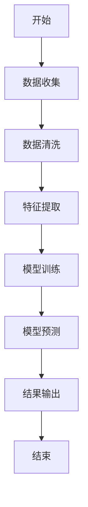
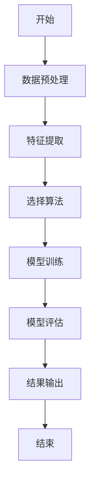
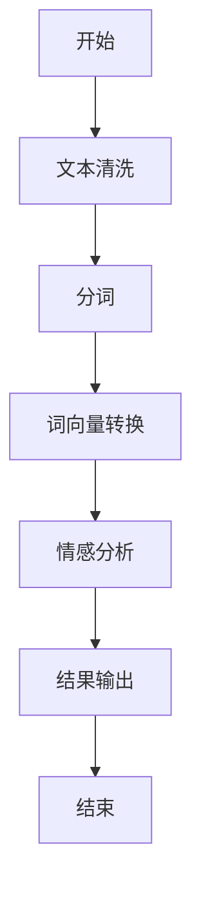
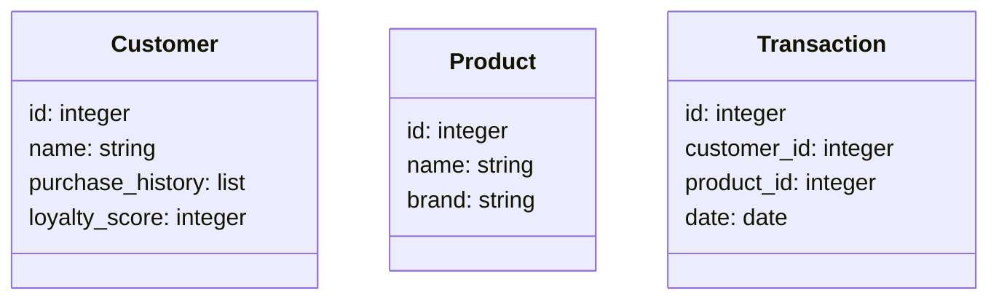
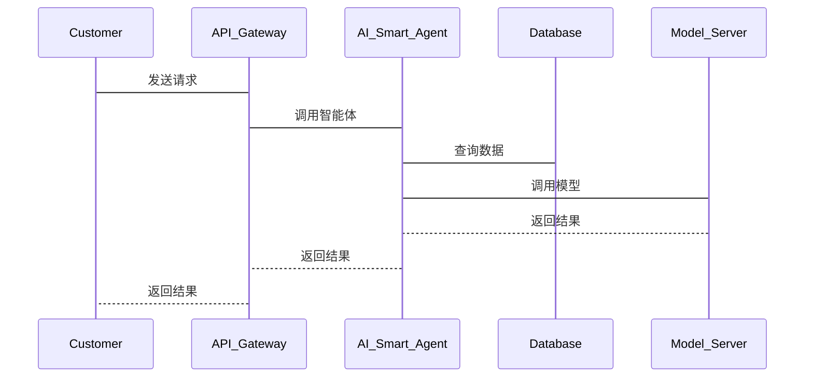

                 


# AI智能体在评估品牌忠诚度中的作用

## 关键词
AI智能体、品牌忠诚度、机器学习、自然语言处理、数据挖掘、系统架构

## 摘要
随着人工智能技术的迅速发展，AI智能体在品牌忠诚度评估中的应用越来越广泛。本文将详细探讨AI智能体如何通过数据挖掘、机器学习和自然语言处理等技术，实现对品牌忠诚度的精准评估。文章首先介绍品牌忠诚度的定义和传统评估方法的局限性，然后分析AI智能体的核心概念和工作原理。接着，详细讲解AI智能体的算法原理，包括机器学习模型和自然语言处理技术。随后，阐述系统的架构设计和接口设计，最后通过实际案例展示AI智能体在品牌忠诚度评估中的应用效果。

---

# 第一部分: AI智能体在品牌忠诚度评估中的背景与基础

## 第1章: 品牌忠诚度与AI智能体概述

### 1.1 问题背景与定义

#### 1.1.1 什么是品牌忠诚度
品牌忠诚度是指消费者对某个品牌产品的偏好程度和持续购买意愿。忠诚的消费者不仅会重复购买同一品牌的产品，还会推荐给朋友或在品牌面临危机时给予支持。

#### 1.1.2 品牌忠诚度的衡量标准
品牌忠诚度通常通过以下指标衡量：
- 重复购买率：消费者是否持续购买同一品牌产品。
- 推荐意愿：消费者是否会向他人推荐该品牌。
- 对价格敏感度：消费者是否愿意为品牌支付溢价。
- 对品牌的信任度：消费者是否信任该品牌。

#### 1.1.3 AI智能体的定义与特点
AI智能体（Artificial Intelligence Agent）是指能够感知环境、自主决策并执行任务的智能系统。其特点包括：
- 感知能力：通过传感器或数据输入获取信息。
- 决策能力：基于数据和模型做出决策。
- 执行能力：通过执行机构或算法实现目标。
- 学习能力：通过机器学习不断优化自身性能。

### 1.2 问题描述与解决方法

#### 1.2.1 品牌忠诚度评估的传统方法
传统品牌忠诚度评估方法主要包括：
- 调查问卷：通过问卷收集消费者反馈。
- 销售数据分析：通过销售数据推断忠诚度。
- 竞争分析：通过市场份额变化分析品牌忠诚度。

#### 1.2.2 传统方法的局限性
传统方法存在以下问题：
- 数据量有限：难以全面捕捉消费者行为。
- 数据滞后：销售数据通常滞后于消费者行为。
- 数据孤岛：不同渠道的数据难以整合。

#### 1.2.3 AI智能体在品牌忠诚度评估中的优势
AI智能体能够通过以下方式提升品牌忠诚度评估的准确性：
- 实时数据分析：快速处理消费者行为数据。
- 多源数据融合：整合线上线下的多源数据。
- 自动学习：通过机器学习模型不断优化评估精度。

### 1.3 AI智能体的核心要素与边界

#### 1.3.1 AI智能体的核心要素
AI智能体的核心要素包括：
- 数据源：包括消费者行为数据、社交媒体数据等。
- 数据处理：包括数据清洗、特征提取等。
- 模型训练：包括机器学习模型的训练和优化。
- 决策引擎：基于模型结果做出决策。

#### 1.3.2 品牌忠诚度评估的边界与外延
品牌忠诚度评估的边界包括：
- 数据范围：仅限于消费者行为数据。
- 评估目标：仅用于品牌忠诚度评估。
- 评估时间：仅限于特定时间段内。

#### 1.3.3 AI智能体与品牌忠诚度的关系
AI智能体通过数据处理和模型训练，帮助品牌企业更精准地评估消费者忠诚度。品牌忠诚度评估的结果反过来又可以指导AI智能体的决策优化。

## 第2章: AI智能体与品牌忠诚度评估的核心概念

### 2.1 核心概念原理

#### 2.1.1 数据驱动的品牌忠诚度评估
数据驱动的品牌忠诚度评估是指通过收集和分析消费者行为数据，来评估消费者的忠诚度。AI智能体能够实时处理和分析这些数据，提供更精准的评估结果。

#### 2.1.2 AI智能体的数据处理能力
AI智能体具有强大的数据处理能力，能够从多种数据源中提取特征，并通过机器学习模型进行分类和预测。

#### 2.1.3 品牌忠诚度的预测模型
品牌忠诚度的预测模型通常包括以下步骤：
- 数据预处理：清洗数据，提取特征。
- 模型训练：训练分类或回归模型。
- 模型评估：通过验证数据评估模型性能。
- 模型优化：调整参数，提升预测精度。

### 2.2 核心概念对比分析

#### 2.2.1 传统方法与AI智能体的对比
| 对比维度 | 传统方法 | AI智能体 |
|----------|-----------|----------|
| 数据来源 | 单一数据源 | 多源数据融合 |
| 数据处理 | 手动处理 | 自动处理 |
| 分析速度 | 滞后 | 实时分析 |
| 分析精度 | 低精度 | 高精度 |

#### 2.2.2 不同AI技术对品牌忠诚度评估的影响
- 机器学习：用于分类和预测。
- 自然语言处理：用于分析消费者评论。
- 数据挖掘：用于发现数据中的模式。

#### 2.2.3 品牌忠诚度评估的核心指标对比
| 指标 | 传统方法 | AI智能体 |
|------|-----------|----------|
| 评估速度 | 慢 | 快 |
| 评估精度 | 低 | 高 |
| 评估成本 | 高 | 低 |

### 2.3 实体关系图与流程图

#### 2.3.1 品牌忠诚度评估的ER实体关系图
```mermaid
er
  customer
    id: integer
    name: string
    purchase_history: string
    brand Loyalty Score: integer
  product
    id: integer
    name: string
    brand: string
  transaction
    id: integer
    customer_id: integer
    product_id: integer
    date: date
```

#### 2.3.2 AI智能体的工作流程图


---

# 第二部分: AI智能体的算法原理与数学模型

## 第3章: AI智能体的算法原理

### 3.1 算法原理概述

#### 3.1.1 机器学习算法在品牌忠诚度评估中的应用
机器学习算法可以用于品牌忠诚度的分类和预测。常用算法包括：
- 支持向量机（SVM）
- 随机森林（Random Forest）
- 神经网络（Neural Networks）

#### 3.1.2 自然语言处理技术的作用
自然语言处理（NLP）技术可以用于分析消费者评论，提取情感倾向，进而评估品牌忠诚度。常用技术包括：
- 词袋模型（Bag of Words）
- 词嵌入（Word Embedding）
- 情感分析（Sentiment Analysis）

#### 3.1.3 数据挖掘技术的应用
数据挖掘技术可以用于发现消费者行为中的模式和规律，帮助品牌企业更好地理解消费者忠诚度。

### 3.2 算法流程图

#### 3.2.1 品牌忠诚度评估的机器学习流程图


#### 3.2.2 自然语言处理的流程图


### 3.3 Python实现示例

#### 3.3.1 机器学习模型的代码实现
```python
import pandas as pd
from sklearn.model_selection import train_test_split
from sklearn.ensemble import RandomForestClassifier
from sklearn.metrics import accuracy_score

# 加载数据
data = pd.read_csv('loyalty_data.csv')
X = data.drop('loyalty_score', axis=1)
y = data['loyalty_score']

# 划分训练集和测试集
X_train, X_test, y_train, y_test = train_test_split(X, y, test_size=0.2, random_state=42)

# 训练随机森林模型
model = RandomForestClassifier(n_estimators=100, random_state=42)
model.fit(X_train, y_train)

# 预测结果
y_pred = model.predict(X_test)

# 计算准确率
accuracy = accuracy_score(y_test, y_pred)
print(f"模型准确率: {accuracy}")
```

#### 3.3.2 自然语言处理的代码实现
```python
from transformers import pipeline

# 加载情感分析模型
sentiment_analyzer = pipeline("sentiment-analysis")

# 分析评论
comment = "I love this product!"
result = sentiment_analyzer(comment)
print(f"情感倾向: {result[0]['label']}")
```

### 3.4 数学模型与公式

#### 3.4.1 机器学习模型的数学公式
随机森林模型的损失函数为：
$$L = -\frac{1}{n}\sum_{i=1}^{n} y_i \log(p_i) + (1 - y_i)\log(1 - p_i)$$

其中：
- $y_i$ 是真实标签
- $p_i$ 是模型预测的概率

#### 3.4.2 自然语言处理的数学公式
词嵌入模型（如Word2Vec）的训练目标是最小化以下损失函数：
$$L = \sum_{i=1}^{n} \log P(w_i | w_{i-1})$$

其中：
- $w_i$ 是当前词
- $w_{i-1}$ 是前一个词

---

## 第4章: 数学模型与公式

### 4.1 品牌忠诚度指数的计算公式
品牌忠诚度指数（Loyalty Index）可以通过以下公式计算：
$$L = \frac{\sum_{i=1}^{n} w_i \cdot s_i}{\sum_{i=1}^{n} w_i}$$

其中：
- $w_i$ 是第$i$个特征的权重
- $s_i$ 是第$i$个特征的评分

---

# 第三部分: 系统分析与架构设计方案

## 第5章: 系统分析与架构设计

### 5.1 问题场景介绍
假设我们正在为一家零售企业设计一个品牌忠诚度评估系统。该系统需要实时分析消费者的购买行为和评论，评估消费者的忠诚度，并提供个性化推荐。

### 5.2 系统功能设计

#### 5.2.1 领域模型


#### 5.2.2 系统架构


#### 5.2.3 系统接口设计
- API接口：用于接收客户请求和返回结果。
- 数据接口：用于与数据库交互。
- 模型接口：用于调用机器学习模型。

#### 5.2.4 交互流程图


---

## 第6章: 项目实战

### 6.1 环境安装

#### 6.1.1 安装Python和必要的库
```bash
pip install pandas scikit-learn transformers
```

### 6.2 核心代码实现

#### 6.2.1 机器学习模型实现
```python
import pandas as pd
from sklearn.ensemble import RandomForestClassifier
from sklearn.metrics import accuracy_score
from sklearn.model_selection import train_test_split

# 加载数据
data = pd.read_csv('loyalty_data.csv')
X = data.drop('loyalty_score', axis=1)
y = data['loyalty_score']

# 划分训练集和测试集
X_train, X_test, y_train, y_test = train_test_split(X, y, test_size=0.2, random_state=42)

# 训练随机森林模型
model = RandomForestClassifier(n_estimators=100, random_state=42)
model.fit(X_train, y_train)

# 预测结果
y_pred = model.predict(X_test)

# 计算准确率
accuracy = accuracy_score(y_test, y_pred)
print(f"模型准确率: {accuracy}")
```

#### 6.2.2 自然语言处理实现
```python
from transformers import pipeline

# 加载情感分析模型
sentiment_analyzer = pipeline("sentiment-analysis")

# 分析评论
comment = "I love this product!"
result = sentiment_analyzer(comment)
print(f"情感倾向: {result[0]['label']}")
```

### 6.3 案例分析与解读
假设我们有一家零售企业，希望通过AI智能体评估消费者对某品牌产品的忠诚度。我们首先收集消费者的购买记录、评论和评分数据，然后使用随机森林模型进行分类，预测消费者的忠诚度。最后，通过情感分析技术分析消费者的评论，进一步验证模型的准确性。

---

## 第7章: 总结与展望

### 7.1 总结
本文详细探讨了AI智能体在品牌忠诚度评估中的应用，从背景介绍到算法原理，再到系统设计和项目实战，全面展示了AI智能体的优势和实现方法。

### 7.2 展望
未来，随着AI技术的不断发展，AI智能体在品牌忠诚度评估中的应用将更加广泛。可能出现的新技术包括：
- 更先进的机器学习模型（如深度学习模型）
- 更智能的自然语言处理技术
- 更高效的数据处理方法

通过不断优化算法和系统架构，AI智能体将能够更精准地评估品牌忠诚度，为企业提供更有力的支持。

---

# 关键词
AI智能体、品牌忠诚度、机器学习、自然语言处理、数据挖掘、系统架构

# 摘要
本文探讨了AI智能体在品牌忠诚度评估中的作用，通过背景介绍、核心概念、算法原理、系统设计和项目实战，全面展示了AI智能体的优势和实现方法。

