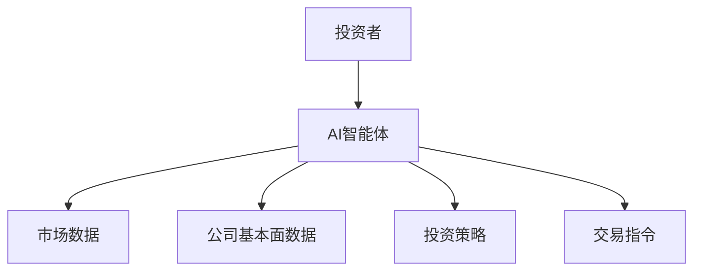

                 


# AI智能体在识别价值投资机会的最佳加仓时机中的作用

> 关键词：AI智能体，价值投资，最佳加仓时机，机器学习，强化学习，投资机会识别

> 摘要：本文探讨了AI智能体在价值投资机会识别中的作用，特别是如何利用AI技术优化最佳加仓时机的决策过程。文章从价值投资的基本概念和AI智能体的核心原理出发，结合数学模型和系统架构设计，详细分析了AI智能体在投资机会识别中的应用，并通过项目实战展示了其在最佳加仓时机中的实际效果。

---

# 第1章: 价值投资与AI智能体概述

## 1.1 价值投资的基本概念

### 1.1.1 价值投资的定义与核心理念
价值投资是一种投资策略，其核心理念是通过分析公司的基本面，寻找市场价格低于其内在价值的股票进行投资。其核心理念包括：
- **内在价值**：公司未来现金流的现值。
- **安全边际**：买入价格低于内在价值，以降低风险。
- **长期视角**：关注企业的长期盈利能力，而非短期波动。

### 1.1.2 价值投资的基本原则与策略
价值投资者通常遵循以下原则：
1. **低市盈率、低市净率**：寻找市场价格低于企业价值的股票。
2. **高股息率**：关注具有稳定股息收益的公司。
3. **管理层质量**：重视公司管理层的诚信与能力。
4. **行业地位**：关注行业龙头或具有竞争优势的企业。

### 1.1.3 价值投资与AI技术的结合
随着大数据和AI技术的发展，价值投资开始与AI技术结合，利用AI的分析能力优化投资决策。AI可以通过处理大量数据，发现传统方法难以察觉的投资机会。

---

## 1.2 AI智能体的基本概念

### 1.2.1 AI智能体的定义与特点
AI智能体是一种能够感知环境、执行目标的智能系统，具有以下特点：
- **自主性**：能够独立决策。
- **反应性**：能够实时感知环境并做出反应。
- **学习能力**：通过数据和经验不断优化决策。

### 1.2.2 AI智能体的核心技术与实现
AI智能体的核心技术包括：
1. **机器学习**：用于模式识别和预测。
2. **自然语言处理**：用于分析非结构化数据（如新闻、报告）。
3. **强化学习**：用于优化决策策略。

### 1.2.3 AI智能体在金融领域的应用
在金融领域，AI智能体主要应用于：
- **股票交易**：通过算法进行自动交易。
- **风险控制**：识别市场风险并制定应对策略。
- **投资组合优化**：根据市场变化调整投资组合。

---

## 1.3 价值投资机会识别的挑战与AI的优势

### 1.3.1 传统价值投资中的问题与局限
传统价值投资面临以下问题：
1. **数据量不足**：难以全面分析企业基本面。
2. **信息滞后**：市场变化迅速，传统分析方法难以及时反应。
3. **主观性**：投资决策受到主观判断的影响。

### 1.3.2 AI智能体在投资机会识别中的优势
AI智能体的优势在于：
1. **高效的数据处理能力**：能够快速分析大量数据。
2. **实时性**：能够实时跟踪市场变化并做出反应。
3. **客观性**：基于数据的决策减少人为情绪干扰。

### 1.3.3 AI智能体在最佳加仓时机中的作用
AI智能体可以通过以下方式优化加仓时机：
1. **市场预测**：利用算法预测市场趋势。
2. **风险控制**：识别市场波动并制定加仓策略。
3. **动态调整**：根据市场变化实时优化加仓计划。

---

## 1.4 本章小结

### 1.4.1 价值投资与AI智能体的结合
价值投资与AI智能体的结合，不仅提高了投资决策的效率，还能够发现更多潜在的投资机会。

### 1.4.2 AI智能体在投资机会识别中的潜力
AI智能体在投资机会识别中的潜力巨大，尤其是在最佳加仓时机的选择上，AI可以通过复杂的算法和模型，优化投资策略并降低风险。

---

# 第2章: AI智能体的核心概念与联系

## 2.1 AI智能体的核心概念

### 2.1.1 AI智能体的组成要素
AI智能体主要由以下要素组成：
1. **感知层**：通过传感器或数据接口获取环境信息。
2. **决策层**：基于感知信息进行分析和决策。
3. **执行层**：根据决策执行操作（如交易指令）。

### 2.1.2 AI智能体的决策机制
AI智能体的决策机制包括：
1. **数据输入**：获取市场数据、公司基本面数据等。
2. **特征提取**：从数据中提取有用的特征。
3. **模型预测**：利用模型预测市场走势或公司价值。
4. **决策输出**：根据预测结果生成交易指令。

### 2.1.3 AI智能体在金融领域的应用
在金融领域，AI智能体主要应用于：
- **股票交易**：通过算法进行自动交易。
- **风险管理**：识别市场风险并制定应对策略。
- **投资组合优化**：根据市场变化调整投资组合。

---

## 2.2 AI智能体与价值投资的核心联系

### 2.2.1 AI智能体在价值投资中的角色
AI智能体在价值投资中扮演以下角色：
1. **数据分析师**：通过大数据分析发现潜在的投资机会。
2. **决策支持者**：基于数据分析结果提供投资建议。
3. **风险控制者**：通过实时监控市场变化降低投资风险。

### 2.2.2 AI智能体对投资机会识别的影响
AI智能体对投资机会识别的影响包括：
1. **提高效率**：通过自动化分析缩短投资决策时间。
2. **降低风险**：通过实时监控和预测减少投资损失。
3. **优化策略**：通过动态调整投资策略提高投资收益。

### 2.2.3 AI智能体在最佳加仓时机中的作用
AI智能体在最佳加仓时机中的作用包括：
1. **市场预测**：利用算法预测市场趋势。
2. **风险控制**：识别市场波动并制定加仓策略。
3. **动态调整**：根据市场变化实时优化加仓计划。

---

## 2.3 AI智能体的实体关系图

### 2.3.1 实体关系图的构建
以下是AI智能体在价值投资中的实体关系图：



### 2.3.2 实体关系图的分析
- **投资者**：通过AI智能体获取投资建议。
- **AI智能体**：通过分析市场数据和公司基本面数据，制定投资策略并生成交易指令。
- **市场数据**：包括股票价格、成交量等。
- **公司基本面数据**：包括财务报表、管理层信息等。
- **投资策略**：包括买入、卖出、加仓等策略。
- **交易指令**：AI智能体生成的交易指令。

---

## 2.4 本章小结

### 2.4.1 价值投资与AI智能体的结合
价值投资与AI智能体的结合，不仅提高了投资决策的效率，还能够发现更多潜在的投资机会。

### 2.4.2 AI智能体在投资机会识别中的潜力
AI智能体在投资机会识别中的潜力巨大，尤其是在最佳加仓时机的选择上，AI可以通过复杂的算法和模型，优化投资策略并降低风险。

---

# 第3章: AI智能体的算法原理

## 3.1 AI智能体的核心算法

### 3.1.1 机器学习算法
机器学习算法是AI智能体的核心算法之一，主要包括：
1. **监督学习**：基于标记数据进行学习，如线性回归、支持向量机（SVM）。
2. **无监督学习**：基于未标记数据进行学习，如聚类分析、主成分分析（PCA）。
3. **强化学习**：通过试错学习，如Q-learning、深度强化学习（DQN）。

### 3.1.2 深度学习算法
深度学习算法是机器学习的一种，主要基于神经网络进行学习，如卷积神经网络（CNN）、循环神经网络（RNN）。

### 3.1.3 强化学习算法
强化学习算法是一种通过试错学习的方法，通过不断尝试不同的动作，找到最优策略。

---

## 3.2 AI智能体的决策流程

### 3.2.1 数据输入与特征提取
1. **数据输入**：获取市场数据、公司基本面数据等。
2. **特征提取**：从数据中提取有用的特征，如市盈率、市净率、ROE等。

### 3.2.2 模型训练与优化
1. **模型训练**：利用特征数据训练机器学习模型。
2. **模型优化**：通过调整模型参数优化预测准确性。

### 3.2.3 决策输出与反馈
1. **决策输出**：根据模型预测结果生成交易指令。
2. **反馈机制**：根据实际市场表现调整模型参数。

---

## 3.3 AI智能体的数学模型

### 3.3.1 时间序列分析模型
时间序列分析模型用于预测未来的市场走势，常用的模型包括：
1. **ARIMA模型**：自回归积分滑动平均模型。
2. **LSTM模型**：长短期记忆网络。

### 3.3.2 机器学习模型
机器学习模型用于分类和回归问题，常用的模型包括：
1. **线性回归**：用于预测连续型变量。
2. **支持向量机（SVM）**：用于分类和回归问题。
3. **随机森林**：基于决策树的集成学习方法。

### 3.3.3 强化学习模型
强化学习模型用于优化决策策略，常用的模型包括：
1. **Q-learning**：基于Q值的强化学习算法。
2. **深度强化学习（DQN）**：基于深度神经网络的强化学习算法。

---

## 3.4 AI智能体的数学公式

### 3.4.1 时间序列分析的公式
ARIMA模型的公式为：
$$
y_t = \phi y_{t-1} + \theta \epsilon_{t} + \epsilon_{t-1}
$$

### 3.4.2 机器学习模型的公式
线性回归模型的公式为：
$$
y = \beta_0 + \beta_1 x + \epsilon
$$

### 3.4.3 强化学习模型的公式
Q-learning算法的公式为：
$$
Q(s, a) = Q(s, a) + \alpha (r + \gamma \max Q(s', a') - Q(s, a))
$$

---

## 3.5 本章小结

### 3.5.1 AI智能体的核心算法
AI智能体的核心算法包括机器学习算法、深度学习算法和强化学习算法。

### 3.5.2 算法在投资机会识别中的应用
算法在投资机会识别中的应用包括时间序列分析、机器学习模型和强化学习模型。

---

# 第4章: AI智能体在最佳加仓时机中的应用

## 4.1 最佳加仓时机的识别

### 4.1.1 数据分析与特征提取
1. **数据分析**：分析市场数据和公司基本面数据。
2. **特征提取**：提取有用的特征，如市盈率、市净率、ROE等。

### 4.1.2 模型训练与优化
1. **模型训练**：利用特征数据训练机器学习模型。
2. **模型优化**：通过调整模型参数优化预测准确性。

### 4.1.3 决策输出与反馈
1. **决策输出**：根据模型预测结果生成加仓指令。
2. **反馈机制**：根据实际市场表现调整模型参数。

---

## 4.2 AI智能体在加仓时机中的优化策略

### 4.2.1 数据驱动的优化策略
通过分析历史数据，优化加仓时机。

### 4.2.2 模型驱动的优化策略
通过机器学习模型预测市场走势，优化加仓时机。

### 4.2.3 反馈驱动的优化策略
根据市场反馈实时调整加仓策略。

---

## 4.3 本章小结

### 4.3.1 AI智能体在最佳加仓时机中的作用
AI智能体通过数据分析、模型预测和实时反馈，优化加仓时机。

### 4.3.2 加仓时机优化的策略
加仓时机优化的策略包括数据驱动、模型驱动和反馈驱动。

---

# 第5章: 项目实战与案例分析

## 5.1 项目实战

### 5.1.1 环境安装与配置
1. **开发环境**：选择Python作为开发语言。
2. **开发工具**：安装Jupyter Notebook、PyCharm等工具。
3. **数据集**：获取股票数据，如历史价格、财务数据等。

### 5.1.2 核心代码实现
以下是AI智能体的核心代码实现：

```python
import numpy as np
import pandas as pd
from sklearn.model import LinearRegression
from sklearn.metrics import mean_squared_error

# 数据预处理
data = pd.read_csv('stock_data.csv')
features = data[['PE', 'PB', 'ROE']]
target = data['Price']

# 模型训练
model = LinearRegression()
model.fit(features, target)

# 模型预测
predicted_price = model.predict(features)
```

### 5.1.3 代码解读与分析
1. **数据预处理**：从数据集中提取特征和目标变量。
2. **模型训练**：使用线性回归模型训练数据。
3. **模型预测**：根据特征数据预测股票价格。

---

## 5.2 案例分析

### 5.2.1 案例背景
假设我们有一个股票数据集，包括市盈率（PE）、市净率（PB）和ROE等特征。

### 5.2.2 案例分析
通过线性回归模型预测股票价格，并根据预测结果制定加仓策略。

### 5.2.3 分析结果
根据模型预测结果，当预测价格高于当前价格时，生成加仓指令。

---

## 5.3 本章小结

### 5.3.1 项目实战的总结
通过项目实战，我们了解了AI智能体在最佳加仓时机中的应用。

### 5.3.2 案例分析的启示
案例分析表明，AI智能体可以通过数据分析和模型预测优化加仓时机。

---

# 第6章: 总结与展望

## 6.1 总结

### 6.1.1 价值投资与AI智能体的结合
价值投资与AI智能体的结合，不仅提高了投资决策的效率，还能够发现更多潜在的投资机会。

### 6.1.2 AI智能体在最佳加仓时机中的作用
AI智能体通过数据分析、模型预测和实时反馈，优化加仓时机。

---

## 6.2 未来展望

### 6.2.1 技术进步的潜力
随着技术的进步，AI智能体在投资中的应用将更加广泛。

### 6.2.2 投资策略的优化
AI智能体将通过更复杂的算法和模型，进一步优化投资策略。

### 6.2.3 未来的研究方向
未来的研究方向包括：
1. **多模态数据融合**：结合文本、图像等多种数据源。
2. **强化学习的应用**：通过强化学习优化投资策略。
3. **实时交易系统的开发**：开发基于AI的实时交易系统。

---

# 附录

## 附录A: 参考文献
1. 《价值投资入门》
2. 《机器学习实战》
3. 《深度学习》

## 附录B: 常见问题解答
1. **问题1**：AI智能体在投资中的优势是什么？
   - 答：AI智能体可以通过高效的数据处理能力和实时反馈机制，优化投资决策。
2. **问题2**：如何选择合适的AI算法？
   - 答：根据具体问题选择合适的算法，如时间序列分析、机器学习模型等。

---

# 结语

通过本文的探讨，我们了解了AI智能体在价值投资机会识别中的作用，特别是在最佳加仓时机中的应用。AI智能体通过数据分析、模型预测和实时反馈，优化投资策略，降低投资风险。未来，随着技术的进步，AI智能体在投资中的应用将更加广泛和深入。

