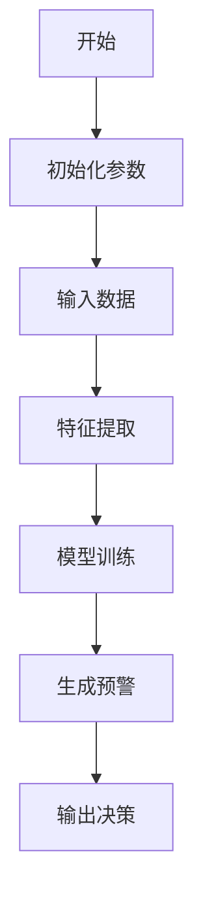
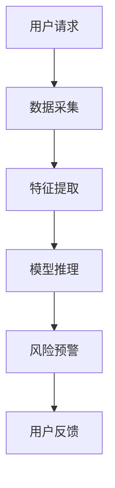
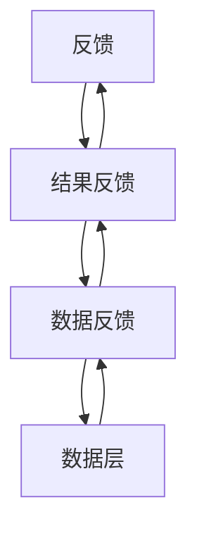

                 


# AI智能体在识别价值投资陷阱中的应用

> 关键词：AI智能体，价值投资，陷阱识别，金融数据分析，投资风险管理

> 摘要：本文深入探讨了AI智能体在识别价值投资陷阱中的应用，结合了金融数据分析和人工智能技术，详细分析了如何利用智能体技术优化投资决策过程。通过理论分析、算法设计和项目实践，展示了AI智能体在价值投资中的巨大潜力。

---

# 第1章: 价值投资与AI智能体的结合

## 1.1 价值投资的基本概念

### 1.1.1 价值投资的定义与核心理念
价值投资是一种以基本面分析为基础的投资策略，旨在通过识别市场低估的优质资产，长期持有以实现超额收益。其核心理念包括：
1. **安全边际**：买入价格低于内在价值。
2. **长期视角**：关注企业的长期盈利能力。
3. **逆向思维**：在市场恐慌时寻找机会。

### 1.1.2 价值投资的关键要素
| 关键要素 | 描述 |
|----------|------|
| 内在价值 | 企业未来现金流的现值 |
| 财务报表分析 | 收入、利润、资产负债表等 |
| 行业分析 | 行业地位、竞争格局等 |
| 管理团队 | 团队能力与战略 |

### 1.1.3 价值投资在现代金融中的地位
价值投资在过去几十年中取得了显著成功，但随着市场的复杂化和信息爆炸，传统方法逐渐暴露出效率低下和误判风险。

---

## 1.2 AI智能体的基本概念

### 1.2.1 AI智能体的定义与特点
AI智能体是一种能够感知环境、自主决策并采取行动的智能系统，具有以下特点：
1. **自主性**：无需外部干预。
2. **反应性**：实时感知并做出反应。
3. **学习能力**：通过数据优化决策。

### 1.2.2 智能体在金融领域的应用潜力
智能体能够处理海量数据、识别复杂模式，帮助投资者发现潜在机会和风险。

### 1.2.3 智能体与传统金融分析工具的对比
| 对比维度 | 智能体 | 传统工具 |
|----------|--------|----------|
| 数据处理能力 | 强大 | 有限 |
| 决策速度 | 实时 | 延后 |
| 可扩展性 | 高 | 低 |

---

## 1.3 价值投资陷阱的定义与分类

### 1.3.1 价值投资中的常见陷阱
陷阱是指那些看似符合价值投资标准，实则存在重大风险的企业或资产。

### 1.3.2 陷阱的分类与特征分析
| 分类 | 特征 |
|------|------|
| 财务造假 | 虚假的财务报表 |
| 竞争劣势 | 行业地位岌岌可危 |
| 管理层问题 | 内部腐败或战略失误 |

### 1.3.3 识别陷阱的重要性与挑战
识别陷阱能够帮助投资者避免重大损失，但需要结合多维度信息进行分析。

---

# 第2章: AI智能体在识别价值投资陷阱中的技术原理

## 2.1 AI智能体的核心原理

### 2.1.1 数据驱动的智能体设计
智能体通过处理历史数据和实时信息，识别潜在陷阱。

### 2.1.2 智能体的决策机制
1. **数据输入**：收集企业财务数据、行业趋势等。
2. **特征提取**：识别关键财务指标和市场信号。
3. **决策输出**：生成风险预警或投资建议。

---

## 2.2 价值投资陷阱识别的数学模型

### 2.2.1 数据特征提取与分析
| 特征 | 描述 |
|------|------|
| 市盈率 | 价格与收益比 |
| 市净率 | 价格与净资产比 |
| 财务杠杆 | 负债与资本结构 |

### 2.2.2 风险评估模型
$$ \text{风险评分} = \alpha \times \text{财务风险} + \beta \times \text{行业风险} $$

### 2.2.3 投资决策优化算法
1. **强化学习**：通过不断试错优化决策策略。
2. **监督学习**：基于历史数据训练分类模型。

---

## 2.3 AI智能体与价值投资陷阱识别的关联

### 2.3.1 数据流与智能体的交互
$$ \text{输入数据} \rightarrow \text{特征提取} \rightarrow \text{模型训练} \rightarrow \text{输出决策} $$

### 2.3.2 智能体在风险识别中的应用
1. **财务造假检测**：识别异常数据模式。
2. **竞争劣势预警**：分析市场份额变化。
3. **管理层问题识别**：监控高管行为。

---

## 2.4 算法流程图


---

# 第3章: AI智能体的算法实现与优化

## 3.1 基于深度学习的智能体算法

### 3.1.1 神经网络结构与训练方法
1. **输入层**：接收企业数据。
2. **隐藏层**：提取高级特征。
3. **输出层**：生成风险评分。

### 3.1.2 模型训练流程
1. **数据预处理**：清洗和归一化。
2. **模型训练**：使用反向传播优化权重。
3. **验证测试**：评估模型性能。

---

## 3.2 算法优化策略

### 3.2.1 超参数调整
| 参数 | 默认值 | 调整范围 |
|------|--------|----------|
| 学习率 | 0.01 | 0.001-0.1 |
| 隐藏层 | 2 | 1-4 |

### 3.2.2 模型部署
1. **接口设计**：提供API供其他系统调用。
2. **实时监控**：跟踪模型性能。

---

# 第4章: 系统设计与架构方案

## 4.1 系统功能设计

### 4.1.1 系统模块划分
1. **数据采集模块**：获取企业数据。
2. **特征提取模块**：提取关键指标。
3. **模型推理模块**：生成风险预警。

### 4.1.2 系统功能流程图


---

## 4.2 系统架构设计

### 4.2.1 分层架构
| 层 | 描述 |
|---|------|
| 数据层 | 存储原始数据 |
| 业务层 | 处理业务逻辑 |
| 表现层 | 提供用户界面 |

### 4.2.2 模块交互图


---

# 第5章: 项目实战与优化

## 5.1 环境配置

### 5.1.1 安装依赖
```bash
pip install numpy pandas scikit-learn
```

---

## 5.2 核心代码实现

### 5.2.1 数据预处理
```python
import pandas as pd
import numpy as np

# 读取数据
data = pd.read_csv('stocks.csv')

# 数据清洗
data = data.dropna()
data = (data - data.mean()) / data.std()  # 标准化
```

---

## 5.3 实际案例分析

### 5.3.1 案例分析
假设某企业财务数据异常，智能体通过模型识别出潜在的财务造假行为，及时发出预警。

---

## 5.4 系统优化

### 5.4.1 性能优化
1. **并行计算**：加速模型训练。
2. **缓存优化**：减少数据读取时间。

---

# 第6章: 总结与展望

## 6.1 总结
AI智能体在价值投资陷阱识别中的应用具有巨大潜力，能够显著提升投资效率和准确性。

## 6.2 展望
未来，随着AI技术的进步，智能体将在金融领域发挥更大的作用。

---

## 6.3 注意事项
1. 数据质量直接影响模型性能。
2. 模型需定期更新以适应市场变化。

---

## 6.4 拓展阅读
推荐阅读《机器学习实战》和《投资学原理》。

---

通过以上步骤，我们可以系统地构建一个基于AI智能体的识别价值投资陷阱的解决方案。希望这篇文章能够为投资者和AI技术爱好者提供有价值的参考。

