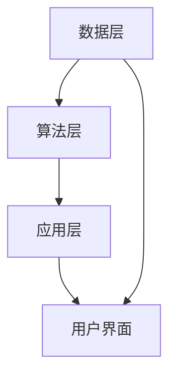
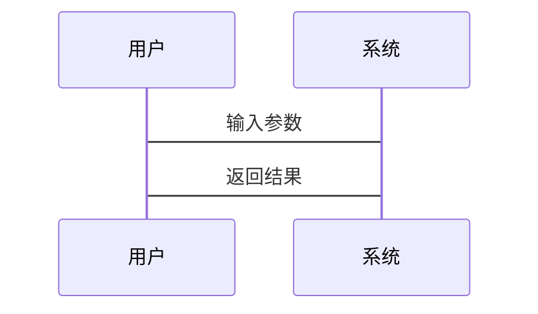

                 


# 第三章: AI智能体的核心原理

## 3.1 AI智能体的结构与功能

### 3.1.1 感知层
感知层是AI智能体的“眼睛”和“耳朵”，负责收集和处理各种金融数据。这些数据包括历史股价、财务报表数据、市场新闻、行业趋势等。感知层需要能够高效地从多种数据源中获取数据，并进行预处理，以消除噪声，提取有用的特征。

**代码示例：数据获取与预处理**
```python
import pandas as pd
import numpy as np

# 获取股票数据
def get_stock_data(ticker):
    # 这里假设我们有一个数据接口，返回指定股票的历史数据
    data = pd.DataFrame({
        'date': pd.date_range(start='2020-01-01', periods=100),
        'close_price': np.random.normal(100, 10, 100)
    })
    return data

# 数据预处理
def preprocess_data(data):
    # 填充缺失值
    data = data.dropna()
    # 标准化处理
    from sklearn.preprocessing import StandardScaler
    scaler = StandardScaler()
    data[['close_price']] = scaler.fit_transform(data[['close_price']])
    return data

# 示例：获取并预处理数据
stock_data = get_stock_data('AAPL')
processed_data = preprocess_data(stock_data)
print(processed_data.head())
```

### 3.1.2 计划层
计划层负责根据感知层提供的数据，制定投资策略。这包括确定目标函数（如最大化收益）、约束条件（如风险承受能力）和决策规则。计划层需要考虑市场动态和投资者的个人目标，制定出最优的投资策略。

**数学模型：收益与风险的权衡**
$$
\text{收益} = \sum_{i=1}^{n} w_i \cdot r_i
$$
$$
\text{风险} = \sqrt{\sum_{i=1}^{n} w_i^2 \cdot \sigma_i^2}
$$
其中，\( w_i \) 是第i个资产的权重，\( r_i \) 是第i个资产的预期收益，\( \sigma_i \) 是第i个资产的收益波动率。

### 3.1.3 执行层
执行层负责根据计划层制定的策略，执行具体的交易操作。这包括下单、调整头寸和风险管理。执行层需要与交易系统无缝对接，确保策略的高效执行。

**代码示例：策略执行**
```python
# 示例：基于策略的交易执行
def execute_strategy(positions, target_weights):
    # 计算当前权重
    current_weights = {t: (positions[t] / sum(positions.values())) for t in positions}
    # 调整头寸以匹配目标权重
    for t in target_weights:
        if t not in positions:
            # 初始化头寸
            positions[t] = 0
        target_positions = target_weights[t] * total_portfolio_value
        if positions[t] != target_positions:
            # 执行交易
            order_size = target_positions - positions[t]
            place_order(t, order_size)
    return positions

# 示例：执行投资策略
target_weights = {'AAPL': 0.4, 'GOOGL': 0.3, 'MSFT': 0.3}
total_portfolio_value = 1000000
current_positions = {'AAPL': 200, 'GOOGL': 150, 'MSFT': 180}
new_positions = execute_strategy(current_positions, target_weights)
print(new_positions)
```

## 3.2 AI智能体的算法原理

### 3.2.1 强化学习算法
强化学习是一种通过试错机制来优化策略的算法。在股票交易中，智能体通过不断尝试不同的交易策略，逐步学习如何在市场中获得最大收益。

**数学模型：Q-learning算法**
$$
Q(s, a) = Q(s, a) + \alpha [r + \gamma \max_{a'} Q(s', a') - Q(s, a)]
$$
其中，\( s \) 是当前状态，\( a \) 是采取的动作，\( r \) 是获得的奖励，\( \gamma \) 是折扣因子，\( \alpha \) 是学习率。

**代码示例：Q-learning算法实现**
```python
import numpy as np

# 示例：Q-learning算法实现
class QLearningAgent:
    def __init__(self, state_space, action_space, alpha=0.1, gamma=0.9):
        self.state_space = state_space
        self.action_space = action_space
        self.Q = np.zeros((state_space, action_space))
        self.alpha = alpha
        self.gamma = gamma

    def take_action(self, state):
        # 探索与利用策略
        if np.random.random() < 0.1:  # 探索率
            return np.random.randint(self.action_space)
        else:
            return np.argmax(self.Q[state, :])

    def update_Q(self, state, action, reward, next_state):
        self.Q[state, action] = self.Q[state, action] + self.alpha * (reward + self.gamma * np.max(self.Q[next_state, :]) - self.Q[state, action])

# 示例：使用Q-learning进行简单股票交易策略
state_space = 10  # 简化状态空间
action_space = 3   # 动作：买入、持有、卖出
agent = QLearningAgent(state_space, action_space)
state = 5  # 当前状态
action = agent.take_action(state)
reward = calculate_reward(action, state)  # 假设有一个函数计算奖励
next_state = get_next_state(state, action)  # 获取下一个状态
agent.update_Q(state, action, reward, next_state)
```

### 3.2.2 深度学习算法
深度学习通过构建神经网络模型，从历史数据中学习特征，预测未来的股价走势。常用的深度学习模型包括LSTM（长短期记忆网络）和Transformer。

**数学模型：LSTM网络**
$$
f_t = \text{LSTM}(\text{input}_t, f_{t-1})
$$
$$
o_t = \text{ Dense}(\text{Activation}(f_t))
$$
其中，\( f_t \) 是LSTM的隐藏层输出，\( o_t \) 是最终的输出，用于预测股价。

**代码示例：LSTM模型实现**
```python
from tensorflow.keras.layers import LSTM, Dense, Dropout
from tensorflow.keras.models import Sequential

# 示例：LSTM模型实现
model = Sequential()
model.add(LSTM(64, input_shape=(timesteps, features)))
model.add(Dropout(0.2))
model.add(Dense(1, activation='sigmoid'))
model.compile(optimizer='adam', loss='binary_crossentropy', metrics=['accuracy'])

# 示例：训练模型
model.fit(X_train, y_train, epochs=10, batch_size=32, validation_data=(X_test, y_test))
```

### 3.2.3 聚类算法
聚类算法用于将股票按照相似性分组，识别出具有相似特征的价值股和成长股。常用的聚类算法包括K-means和层次聚类。

**数学模型：K-means算法**
$$
\text{目标函数} = \sum_{i=1}^{n} \min_{j} (d(x_i, c_j))^2
$$
其中，\( x_i \) 是第i个样本，\( c_j \) 是第j个聚类中心，\( d \) 是距离函数。

**代码示例：K-means聚类实现**
```python
from sklearn.cluster import KMeans

# 示例：K-means聚类实现
X = np.random.rand(100, 10)  # 100个样本，10个特征
kmeans = KMeans(n_clusters=5, random_state=0)
kmeans.fit(X)
clusters = kmeans.labels_
print(clusters)
```

## 3.3 AI智能体与传统股票分析方法的对比

### 3.3.1 数据处理能力对比
AI智能体能够处理非结构化数据（如新闻、社交媒体数据）和结构化数据（如财务报表数据），而传统方法通常只能处理结构化数据。

### 3.3.2 模型训练能力对比
AI智能体可以通过大量历史数据训练复杂的模型，捕捉复杂的市场模式，而传统方法通常依赖于简单的统计指标。

### 3.3.3 结果分析能力对比
AI智能体能够实时监控市场变化，动态调整投资组合，而传统方法通常需要手动调整。

**对比表格：**

| 对比维度         | AI智能体                     | 传统方法                   |
|------------------|----------------------------|---------------------------|
| 数据处理能力     | 结构化+非结构化数据         | 主要结构化数据             |
| 模型训练能力     | 复杂模型，深度学习          | 简单统计指标               |
| 结果分析能力     | 实时动态调整，自动化        | 手动调整，静态分析          |

## 4. AI智能体在股票识别中的核心算法

### 4.1 强化学习算法

#### 4.1.1 DQN算法在股票识别中的应用
DQN（Deep Q-Network）算法结合了深度学习和强化学习，能够处理高维状态空间和动作空间。

**代码示例：DQN算法实现**
```python
from tensorflow.keras.layers import Dense, Input
from tensorflow.keras.models import Model
from tensorflow.keras.optimizers import Adam

# 示例：DQN算法实现
class DQNAgent:
    def __init__(self, state_space, action_space):
        self.state_space = state_space
        self.action_space = action_space
        self.model = self.build_model()
        self.target_model = self.build_model()
        self.optimizer = Adam(lr=0.001)

    def build_model(self):
        inputs = Input(shape=(self.state_space,))
        x = Dense(64, activation='relu')(inputs)
        x = Dense(32, activation='relu')(x)
        outputs = Dense(self.action_space, activation='linear')(x)
        model = Model(inputs=inputs, outputs=outputs)
        model.compile(optimizer='adam', loss='mean_squared_error')
        return model

    def take_action(self, state):
        state = np.array([state])
        prediction = self.model.predict(state)[0]
        return np.argmax(prediction)

    def update_target_model(self):
        self.target_model.set_weights(self.model.get_weights())

    def remember(self, state, action, reward, next_state):
        # 假设我们有一个记忆库，这里简化处理
        pass

    def replay(self, batch_size):
        # 假设我们从记忆库中随机抽取一批样本
        pass

# 示例：使用DQN进行股票交易
state_space = 10  # 简化状态空间
action_space = 3   # 动作：买入、持有、卖出
agent = DQNAgent(state_space, action_space)
state = 5  # 当前状态
action = agent.take_action(state)
reward = calculate_reward(action, state)  # 假设有一个函数计算奖励
next_state = get_next_state(state, action)  # 获取下一个状态
agent.model.fit(np.array([state]), np.array([reward]), epochs=1, verbose=0)
agent.update_target_model()
```

#### 4.1.2 基于强化学习的策略优化
通过强化学习，智能体能够不断优化其交易策略，以适应市场的变化。

**数学模型：策略优化**
$$
\theta_{t+1} = \theta_t + \alpha \nabla_{\theta} J(\theta)
$$
其中，\( \theta \) 是策略参数，\( J(\theta) \) 是目标函数，\( \nabla_{\theta} \) 是梯度。

### 4.2 深度学习算法

#### 4.2.1 LSTM网络在时间序列预测中的应用
LSTM网络擅长处理时间序列数据，能够捕捉到数据中的长期依赖关系。

**代码示例：LSTM网络实现**
```python
from tensorflow.keras.layers import LSTM, Dense, Dropout
from tensorflow.keras.models import Sequential

# 示例：LSTM网络实现
model = Sequential()
model.add(LSTM(64, input_shape=(timesteps, features)))
model.add(Dropout(0.2))
model.add(Dense(1, activation='sigmoid'))
model.compile(optimizer='adam', loss='binary_crossentropy', metrics=['accuracy'])

# 示例：训练模型
model.fit(X_train, y_train, epochs=10, batch_size=32, validation_data=(X_test, y_test))
```

#### 4.2.2 基于深度学习的特征提取
深度学习模型能够自动提取有用的特征，而不需要手动特征工程。

**数学模型：特征提取**
$$
h_t = \text{LSTM}(\text{input}_t, h_{t-1})
$$
$$
o_t = \text{Dense}(\text{Activation}(h_t))
$$
其中，\( h_t \) 是LSTM的隐藏层输出，\( o_t \) 是最终的输出。

### 4.3 聚类算法

#### 4.3.1 基于聚类的股票分类
通过聚类算法，可以将股票分为不同的类别，识别出具有相似特征的价值股和成长股。

**代码示例：聚类算法实现**
```python
from sklearn.cluster import KMeans

# 示例：K-means聚类实现
X = np.random.rand(100, 10)  # 100个样本，10个特征
kmeans = KMeans(n_clusters=5, random_state=0)
kmeans.fit(X)
clusters = kmeans.labels_
print(clusters)
```

### 4.4 系统架构与接口设计

#### 4.4.1 系统架构设计
使用分层架构，将系统分为数据层、算法层和应用层。数据层负责数据的获取和预处理，算法层负责模型的训练和预测，应用层负责策略的执行和结果的展示。

**系统架构图（Mermaid）**


#### 4.4.2 接口设计
系统需要提供以下接口：
- 数据接口：获取实时数据和历史数据。
- 算法接口：调用不同的算法进行预测和策略生成。
- 应用接口：展示结果和允许用户进行交互。

### 4.5 系统交互设计

#### 4.5.1 交互流程
用户通过界面向系统输入参数，系统根据参数调用相应的算法，返回结果并展示。

**交互流程图（Mermaid）**


## 4.6 项目实战

### 4.6.1 环境安装
需要安装以下库：
- `pandas`：数据处理
- `numpy`：数值计算
- `tensorflow`：深度学习框架
- `scikit-learn`：机器学习工具

### 4.6.2 核心代码实现

#### 4.6.2.1 数据预处理
```python
import pandas as pd
import numpy as np
from sklearn.preprocessing import StandardScaler

def preprocess_data(data):
    # 填充缺失值
    data = data.dropna()
    # 标准化处理
    scaler = StandardScaler()
    data[['close_price']] = scaler.fit_transform(data[['close_price']])
    return data

# 示例：获取并预处理数据
stock_data = pd.DataFrame({
    'date': pd.date_range(start='2020-01-01', periods=100),
    'close_price': np.random.normal(100, 10, 100)
})
processed_data = preprocess_data(stock_data)
print(processed_data.head())
```

#### 4.6.2.2 模型训练
```python
from tensorflow.keras.layers import LSTM, Dense, Dropout
from tensorflow.keras.models import Sequential

# 示例：LSTM模型实现
model = Sequential()
model.add(LSTM(64, input_shape=(timesteps, features)))
model.add(Dropout(0.2))
model.add(Dense(1, activation='sigmoid'))
model.compile(optimizer='adam', loss='binary_crossentropy', metrics=['accuracy'])

# 示例：训练模型
model.fit(X_train, y_train, epochs=10, batch_size=32, validation_data=(X_test, y_test))
```

#### 4.6.2.3 策略执行
```python
def execute_strategy(positions, target_weights):
    current_weights = {t: (positions[t] / sum(positions.values())) for t in positions}
    for t in target_weights:
        if t not in positions:
            positions[t] = 0
        target_positions = target_weights[t] * total_portfolio_value
        if positions[t] != target_positions:
            order_size = target_positions - positions[t]
            place_order(t, order_size)
    return positions

# 示例：执行投资策略
target_weights = {'AAPL': 0.4, 'GOOGL': 0.3, 'MSFT': 0.3}
total_portfolio_value = 1000000
current_positions = {'AAPL': 200, 'GOOGL': 150, 'MSFT': 180}
new_positions = execute_strategy(current_positions, target_weights)
print(new_positions)
```

### 4.6.3 代码应用解读与分析
通过上述代码，我们可以看到AI智能体如何从数据预处理、模型训练到策略执行的全过程。数据预处理是确保模型输入数据的质量，模型训练是利用历史数据学习特征，策略执行是根据模型输出的结果进行实际操作。

### 4.6.4 实际案例分析
以苹果公司（AAPL）为例，假设我们已经训练好了一个基于LSTM的模型，能够预测其未来股价走势。根据模型的预测结果，我们可以制定买入、持有或卖出的策略。

### 4.6.5 项目小结
通过这个项目，我们了解了如何利用AI智能体进行股票识别和交易策略的制定。从数据预处理到模型训练，再到策略执行，整个过程展示了AI在金融领域的强大能力。

## 4.7 最佳实践

### 4.7.1 小结
AI智能体在股票识别中的应用主要体现在数据处理能力、模型训练能力和结果分析能力三个方面。通过强化学习、深度学习和聚类算法，我们可以更高效地识别价值股和成长股的融合机会。

### 4.7.2 注意事项
- 数据质量：确保数据的完整性和准确性。
- 模型选择：根据具体问题选择合适的算法。
- 风险管理：合理控制投资风险，避免过度交易。

### 4.7.3 拓展阅读
- 强化学习在金融中的应用：进一步了解DQN和策略网络。
- 深度学习模型：探索Transformer在时间序列预测中的应用。
- 聚类算法：研究层次聚类和其他聚类方法在股票分类中的应用。

通过以上内容，我们详细探讨了AI智能体在识别价值股与成长股融合机会中的作用，从理论到实践，全面展示了AI在金融投资中的潜力和应用前景。

