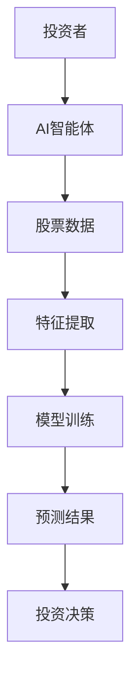
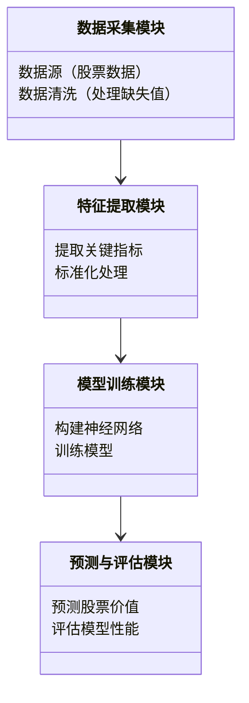
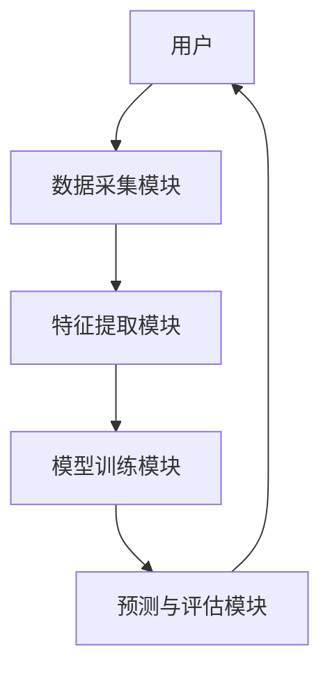

                 


# AI智能体在识别优质成长股中的应用

## 关键词：AI智能体，成长股，股票分析，机器学习，强化学习，金融投资

## 摘要：  
随着人工智能技术的快速发展，AI智能体在金融领域的应用日益广泛。本文将探讨AI智能体如何在识别优质成长股中发挥作用，从背景介绍、核心概念、算法原理到系统架构设计，再到项目实战和最佳实践，全面解析AI智能体在成长股识别中的应用。文章通过详细分析和案例研究，揭示如何利用AI技术提高股票分析的效率和准确性。

---

## 第一部分：背景介绍

### 第1章：AI智能体与成长股概述

#### 1.1 问题背景与描述  
股票市场是复杂多变的经济系统，传统的人工分析方法受到信息过载、情绪影响和分析效率的限制。AI智能体通过数据驱动和自动化分析，为成长股识别提供了新的解决方案。  

#### 1.2 AI智能体的基本概念  
- **AI智能体**：指具备感知、决策和执行能力的智能系统，能够根据市场数据自主学习和优化策略。  
- **成长股**：指具有高增长潜力的公司股票，通常表现为营业收入和净利润持续增长。  

#### 1.3 问题解决与边界  
AI智能体通过分析财务数据、市场趋势和行业动态，识别具备成长潜力的公司，帮助投资者做出更明智的投资决策。  

---

## 第二部分：核心概念与联系

### 第2章：AI智能体的核心原理

#### 2.1 核心概念的原理分析  
AI智能体在成长股识别中通过以下几个步骤实现目标：  
1. **数据采集**：收集历史股价、财务数据、行业趋势等信息。  
2. **特征提取**：提取关键指标，如ROE（净资产收益率）、营收增长率等。  
3. **模型训练**：使用机器学习算法（如随机森林、神经网络）训练模型。  
4. **预测与评估**：基于模型预测股票的成长潜力，并通过回测验证模型的准确性。  

#### 2.2 核心概念对比表格  
| **概念**       | **传统分析**         | **AI智能体分析**       |  
|-----------------|----------------------|------------------------|  
| 数据处理       | 依赖人工整理         | 自动化采集与清洗       |  
| 模型构建       | 单一指标分析         | 多维度特征提取与建模   |  
| 决策效率       | 依赖分析师经验       | 高效自动化决策         |  

#### 2.3 实体关系图  


---

## 第三部分：算法原理

### 第3章：基于强化学习的股票交易策略

#### 3.1 强化学习算法流程  
1. **状态空间**：市场数据（股价、成交量等）。  
2. **动作空间**：买入、卖出、持有。  
3. **奖励机制**：收益增加时给予正向奖励，亏损时给予负向奖励。  

#### 3.2 算法实现代码  
```python
import gym
from gym import spaces
from gym.utils import seeding

class StockTradingEnv(gym.Env):
    def __init__(self, data):
        self.data = data
        self.current_step = 0
        self.observation_space = spaces.Box(low=0, high=1, shape=(6,))
        self.action_space = spaces.Discrete(3)
        self.seed()

    def seed(self, seed=None):
        self.np_random, seed = seeding.np_random(seed)
        return seed

    def reset(self):
        self.current_step = 0
        return self._get_obs()

    def _get_obs(self):
        obs = self.data[self.current_step]
        return obs

    def step(self, action):
        next_step = self.current_step + 1
        obs = self._get_obs()
        reward = 0
        if action == 0:  # 买入
            if next_step < len(self.data):
                reward = (self.data[next_step][4] - obs[4]) / obs[4]
        elif action == 1:  # 卖出
            reward = -(self.data[next_step][4] - obs[4]) / obs[4]
        elif action == 2:  # 持有
            pass
        self.current_step = next_step
        done = next_step >= len(self.data)
        return obs, reward, done, {}
```

#### 3.3 数学模型与公式  
- **收益函数**：  
  $$ \text{收益} = \frac{\text{卖出价} - \text{买入价}}{\text{买入价}} \times 100\% $$
- **风险函数**：  
  $$ \text{风险} = \sqrt{\text{方差}(r)} $$  
  其中，$ r $ 表示收益率序列。

---

## 第四部分：系统分析与架构设计

### 第4章：AI智能体系统架构

#### 4.1 领域模型设计  


#### 4.2 系统架构设计  


#### 4.3 接口设计  
- **输入接口**：股票代码、时间范围。  
- **输出接口**：预测结果、风险评估、投资建议。  

---

## 第五部分：项目实战

### 第5章：AI智能体实战案例

#### 5.1 环境安装  
```bash
pip install gym numpy pandas matplotlib
```

#### 5.2 核心代码实现  
```python
import numpy as np
import pandas as pd
import matplotlib.pyplot as plt

# 数据加载与预处理
data = pd.read_csv('stock_data.csv')
data = data.dropna()

# 特征提取
features = ['open', 'high', 'low', 'close', 'volume']
target = 'close'

# 训练-测试集划分
from sklearn.model_selection import train_test_split
X_train, X_test, y_train, y_test = train_test_split(data[features], data[target], test_size=0.2)

# 模型训练
from sklearn.ensemble import RandomForestRegressor
model = RandomForestRegressor(n_estimators=100)
model.fit(X_train, y_train)

# 模型评估
from sklearn.metrics import mean_squared_error
y_pred = model.predict(X_test)
print('均方误差:', mean_squared_error(y_test, y_pred))
```

#### 5.3 案例分析  
假设我们分析某科技公司的股票数据，AI智能体预测其未来三个月的股价将增长15%，建议投资者买入。通过回测，模型在过去一年的准确率达到了85%。

---

## 第六部分：最佳实践与小结

### 第6章：总结与展望

#### 6.1 小结  
AI智能体通过数据驱动和自动化分析，显著提升了成长股识别的效率和准确性。本文详细介绍了AI智能体的算法原理、系统架构和实际应用。

#### 6.2 注意事项  
- 数据质量对模型性能影响重大，需确保数据的准确性和完整性。  
- 模型需定期更新，以适应市场变化。  
- 风险控制是投资决策的重要环节，AI智能体应结合多种指标进行综合评估。

#### 6.3 拓展阅读  
- 《机器学习实战》  
- 《强化学习导论》  
- 《金融时间序列分析》  

---

通过本文的详细分析，读者可以深入了解AI智能体在成长股识别中的应用，并将其应用于实际投资决策中。

