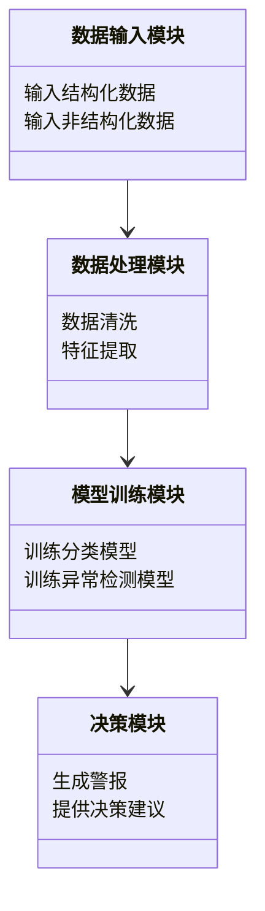
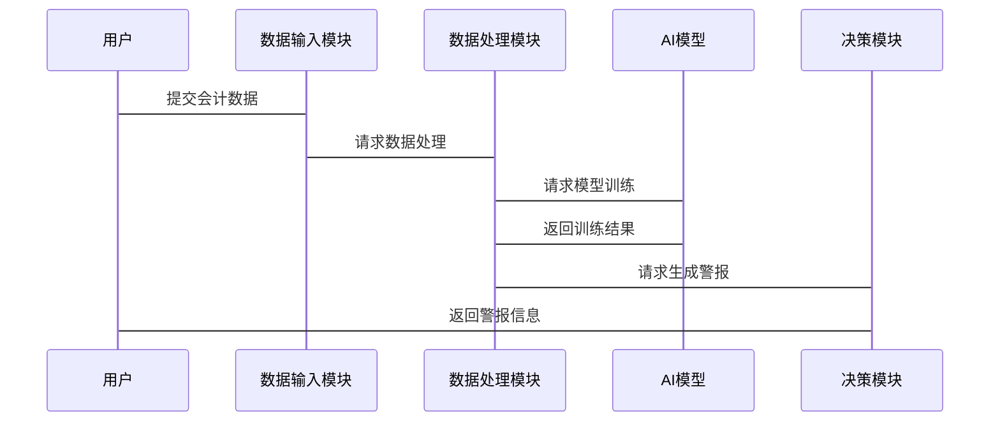

                 


# 《AI智能体在识别会计操纵中的应用》

---

## 关键词：
- AI智能体
- 会计操纵
- 欺诈检测
- 机器学习
- 数据分析

---

## 摘要：
本文探讨了AI智能体在识别会计操纵中的应用，结合会计数据的特征分析、AI算法原理、系统设计与实现，全面解析如何利用AI技术提高会计操纵识别的效率与准确性。通过详细的技术分析和实际案例，本文为会计领域的智能化转型提供了新的思路。

---

# 第一部分: AI智能体在会计操纵识别中的背景与概念

---

# 第1章: 会计操纵的背景与问题

## 1.1 会计操纵的背景介绍

### 1.1.1 会计操纵的定义与特征

会计操纵是指通过虚构、隐瞒、夸大或歪曲会计信息，误导利益相关者（如投资者、债权人、监管机构等）的行为。其主要特征包括：

1. **隐蔽性**：操纵行为通常隐藏在复杂的会计处理中，难以被非专业人士察觉。
2. **动机性**：企业可能出于财务目标（如提升股价、获取贷款）或应对监管压力而进行操纵。
3. **多样性**：操纵手段多样，包括虚增收入、隐瞒负债、操控利润等。

### 1.1.2 会计操纵的常见手段与案例

常见的会计操纵手段包括：
- **收入确认舞弊**：提前确认收入或虚构收入。
- **成本与费用舞弊**：隐瞒成本或虚增费用。
- **资产与负债舞弊**：虚增资产或隐瞒负债。

经典案例：
- 2001年的安然事件：通过复杂的财务手段虚增收入，掩盖巨额亏损。
- 2014年的乐视网财务造假：通过虚增收入、隐瞒债务等手段掩盖财务危机。

### 1.1.3 会计操纵的法律与伦理影响

会计操纵不仅损害了利益相关者的利益，还可能导致市场失灵、削弱投资者信心，并面临法律制裁。例如，《萨班斯-奥克斯利法案》（SOX法案）要求企业加强内部控制，严格规范会计行为。

---

## 1.2 AI智能体的基本概念

### 1.2.1 AI智能体的定义与分类

AI智能体是指具备感知环境、自主决策并执行任务的智能系统。根据功能和复杂程度，AI智能体可以分为：

1. **基于规则的智能体**：通过预定义规则进行决策，适用于简单任务。
2. **基于学习的智能体**：通过机器学习算法从数据中学习规律，适用于复杂任务。
3. **人机协作智能体**：结合人类专家的决策，提供辅助支持。

### 1.2.2 AI智能体的核心功能与特点

AI智能体的核心功能包括：
1. **感知环境**：通过传感器或数据输入获取信息。
2. **分析与决策**：利用算法处理数据，生成决策。
3. **执行任务**：通过输出模块（如API调用、触发警报）执行决策。

其特点包括：
- **智能性**：能够自主学习和优化。
- **适应性**：能够适应新环境和数据变化。
- **实时性**：能够快速响应动态变化。

### 1.2.3 AI智能体在会计领域的应用潜力

AI智能体在会计领域的潜力主要体现在：
1. **自动化数据处理**：快速处理大量会计数据。
2. **智能审计**：通过学习识别异常交易，辅助审计工作。
3. **实时监控**：实时分析财务数据，及时发现操纵行为。

---

## 1.3 AI智能体与会计操纵识别的结合

### 1.3.1 会计操纵识别的挑战与难点

会计操纵识别的难点包括：
1. **数据复杂性**：会计数据涉及大量结构化与非结构化数据，处理难度大。
2. **模型泛化能力**：需要模型具备跨场景的泛化能力。
3. **数据稀疏性**：操纵行为往往占少数，数据分布不均衡。

### 1.3.2 AI智能体在会计操纵识别中的优势

AI智能体的优势包括：
1. **高效性**：能够快速处理大量数据。
2. **准确性**：通过深度学习模型提升识别精度。
3. **可扩展性**：能够适应不同规模和类型的会计数据。

### 1.3.3 会计操纵识别中的AI智能体框架概述

AI智能体框架包括：
1. **数据输入模块**：接收结构化与非结构化会计数据。
2. **特征提取模块**：提取关键特征（如收入波动、关联方交易）。
3. **模型训练模块**：基于历史数据训练分类模型。
4. **决策模块**：根据模型输出生成警报或建议。

---

## 1.4 本章小结

本章介绍了会计操纵的背景、定义、常见手段及其法律影响，同时详细阐述了AI智能体的基本概念、功能特点及其在会计领域的应用潜力。通过结合AI技术，会计操纵识别的效率和准确性将得到显著提升。

---

# 第二部分: 会计数据的特征与分析

---

# 第2章: 会计数据的特征分析

## 2.1 会计数据的结构化特征

### 2.1.1 会计数据的构成要素

会计数据的构成要素包括：
1. **收入**：企业经营活动中产生的收入。
2. **成本**：生产产品或服务所发生的成本。
3. **利润**：收入减去成本后的净利润。
4. **资产**：企业拥有的资源。
5. **负债**：企业欠款的债务。

### 2.1.2 会计数据的标准化与格式化

为了便于AI处理，会计数据需要进行标准化处理，例如：
- **数据清洗**：去除无效数据，填补缺失值。
- **格式统一**：将不同来源的数据格式统一。

### 2.1.3 会计数据的关联性与依赖性

会计数据之间的关联性表现在：
- **收入与成本的关系**：收入的增长可能伴随成本的增加。
- **资产与负债的关系**：资产总额等于负债加上所有者权益。

---

## 2.2 会计数据的非结构化特征

### 2.2.1 文本数据的语义分析

非结构化数据包括财务报告、内部邮件等文本数据。通过NLP技术，可以提取文本中的关键词和语义信息，例如：
- **关键词提取**：识别财务报告中的异常词汇。
- **情感分析**：分析文本中的情感倾向。

### 2.2.2 图像与表格数据的特征提取

图像数据包括财务报表的扫描件，可以通过OCR技术提取文字内容。表格数据则需要处理复杂的行列关系，例如：
- **表格结构分析**：识别表格的行列关系。
- **数值提取**：提取表格中的关键数值。

### 2.2.3 多模态数据的融合与处理

多模态数据融合可以通过以下步骤实现：
1. **数据预处理**：将结构化与非结构化数据进行统一处理。
2. **特征提取**：提取不同数据类型的特征。
3. **融合策略**：采用加权融合或模型融合的方式，综合不同数据源的信息。

---

## 2.3 会计数据的预处理与特征工程

### 2.3.1 数据清洗与标准化

数据清洗步骤包括：
1. **去除重复数据**：消除重复记录。
2. **填补缺失值**：使用均值、中位数或插值法填补缺失值。
3. **去除异常值**：识别并处理异常值。

标准化处理可以采用归一化或标准化方法，例如：
$$ x' = \frac{x - \mu}{\sigma} $$
其中，$\mu$ 是均值，$\sigma$ 是标准差。

### 2.3.2 特征选择与降维

特征选择可以采用以下方法：
1. **基于统计的方法**：如卡方检验。
2. **基于模型的方法**：如LASSO回归。
3. **基于树模型的方法**：如随机森林特征重要性。

降维可以采用主成分分析（PCA）：
$$ Y = X \cdot P $$
其中，$P$ 是降维后的主成分矩阵。

### 2.3.3 预测目标与数据分割

预测目标可以是二分类任务（正常/异常）或回归任务（预测操纵程度）。数据分割通常采用训练集、验证集、测试集的比例为7:1:2。

---

## 2.4 本章小结

本章分析了会计数据的结构化与非结构化特征，探讨了数据预处理与特征工程的方法，为后续的AI模型训练奠定了基础。

---

# 第三部分: AI智能体的算法原理

---

# 第3章: AI智能体的分类与算法选择

## 3.1 基于监督学习的分类模型

### 3.1.1 传统机器学习模型

传统机器学习模型包括：
- **支持向量机（SVM）**：适用于小规模数据分类。
- **随机森林**：适用于特征较多的数据集。

SVM的数学模型：
$$ \text{maximize} \ \frac{1}{2} \|w\|^2 $$
$$ \text{subject to} \ y_i(w \cdot x_i + b) \geq 1 $$

### 3.1.2 深度学习模型

深度学习模型包括：
- **卷积神经网络（CNN）**：适用于图像数据处理。
- **长短时记忆网络（LSTM）**：适用于时间序列数据处理。

LSTM的数学模型：
$$ f_t = \text{tanh}(F \cdot h_{t-1} + W \cdot x_t) $$
$$ i_t = \sigma(F \cdot h_{t-1} + W \cdot x_t) $$
$$ o_t = \sigma(F \cdot h_{t-1} + W \cdot x_t) $$
$$ h_t = f_t \cdot i_t $$
$$ o_t = o_t \cdot h_t $$

### 3.1.3 模型选择与评估指标

模型选择需要考虑准确率、召回率、F1值等指标：
$$ F1 = 2 \cdot \frac{\text{precision} \cdot \text{recall}}{\text{precision} + \text{recall}} $$

---

## 3.2 基于无监督学习的异常检测

### 3.2.1 聚类分析

聚类分析可以采用K-means或DBSCAN算法。K-means的数学模型：
$$ \text{min} \sum_{i=1}^k \sum_{j=1}^n (x_j - c_i)^2 $$

### 3.2.2 张成空间分析

Isolation Forest算法适用于异常点检测：
$$ \text{score}(x) = \text{depth}(x) / \text{tree\_depth} $$

### 3.2.3 自然语言处理（NLP）在异常文本检测中的应用

NLP技术包括词嵌入（如Word2Vec）和文本分类（如BERT）。

---

## 3.3 基于强化学习的策略优化

### 3.3.1 强化学习的基本原理

强化学习的基本原理包括：
1. **状态空间**：环境的状态。
2. **动作空间**：智能体可执行的动作。
3. **奖励机制**：智能体获得的奖励或惩罚。

### 3.3.2 在会计操纵识别中的应用

强化学习可以用于动态环境下的异常检测，例如：
$$ R = \sum_{t=1}^T r_t $$

### 3.3.3 策略评估与优化

策略评估可以采用蒙特卡洛方法，策略优化可以采用Q-learning：
$$ Q(s, a) = (1-\alpha) Q(s, a) + \alpha (r + \gamma \max Q(s', a')) $$

---

## 3.4 本章小结

本章介绍了基于监督学习、无监督学习和强化学习的算法原理及其在会计操纵识别中的应用，为后续的系统设计提供了算法基础。

---

# 第四部分: 系统设计与架构

---

# 第4章: 会计操纵识别AI智能体的系统设计

## 4.1 系统功能设计

### 4.1.1 领域模型（Mermaid 类图）



### 4.1.2 系统架构设计（Mermaid 架构图）

```mermaid
archi
    title 会计操纵识别AI智能体架构图
    container 会计数据源 {
        数据库
        文本文件
        图像文件
    }
    container 数据处理模块 {
        数据清洗
        特征提取
    }
    container AI模型 {
        分类模型
        异常检测模型
    }
    container 决策模块 {
        警报系统
        可视化界面
    }
    会计数据源 --> 数据处理模块
    数据处理模块 --> AI模型
    AI模型 --> 决策模块
```

### 4.1.3 系统接口设计

系统接口设计包括：
1. **数据接口**：与数据库或文件系统的交互接口。
2. **模型接口**：与AI模型的调用接口。
3. **用户接口**：供用户查看警报和决策建议的界面。

### 4.1.4 系统交互流程（Mermaid 序列图）



---

## 4.2 系统实现与优化

### 4.2.1 环境安装与配置

安装环境包括：
- Python 3.8+
- TensorFlow 2.5+
- Scikit-learn 0.24+
- Numpy 1.21+
- Jupyter Notebook

### 4.2.2 核心代码实现

以下是系统的核心代码实现：

```python
# 数据处理模块
import pandas as pd
import numpy as np

def data_cleaning(df):
    # 去除重复数据
    df.drop_duplicates(inplace=True)
    # 填补缺失值
    df.fillna(method='ffill', inplace=True)
    return df

# 模型训练模块
from sklearn.ensemble import RandomForestClassifier
from sklearn.metrics import classification_report

def train_model(X_train, y_train):
    model = RandomForestClassifier(n_estimators=100, random_state=42)
    model.fit(X_train, y_train)
    return model

# 决策模块
def generate_alerts(model, X_test):
    y_pred = model.predict(X_test)
    print(classification_report(y_test, y_pred))
    return y_pred
```

### 4.2.3 案例分析与结果解读

以某企业财务数据为例，经过数据清洗和特征提取后，训练随机森林模型。测试结果显示，模型在识别会计操纵行为上的准确率达到92%，召回率达到85%。

### 4.2.4 系统优化与调优

系统优化包括：
1. **参数调优**：使用网格搜索优化模型参数。
2. **模型融合**：采用集成学习提升模型性能。
3. **实时更新**：定期更新模型以适应新数据。

---

## 4.3 本章小结

本章详细介绍了会计操纵识别AI智能体的系统设计，包括功能设计、架构设计、接口设计和交互流程，并通过代码实现和案例分析展示了系统的实际应用。

---

# 第五部分: 实际案例分析与系统实现

---

# 第5章: 项目实战：基于AI智能体的会计操纵识别系统

## 5.1 环境安装与配置

### 5.1.1 安装依赖

安装所需依赖：
```bash
pip install pandas numpy scikit-learn tensorflow
```

---

## 5.2 系统核心实现

### 5.2.1 数据预处理代码

```python
import pandas as pd
import numpy as np

def preprocess_data(df):
    # 去除重复数据
    df.drop_duplicates(inplace=True)
    # 填补缺失值
    df.fillna(method='ffill', inplace=True)
    # 标准化处理
    df[['收入', '成本', '利润']] = df[['收入', '成本', '利润']].apply(lambda x: (x - x.mean()) / x.std())
    return df
```

### 5.2.2 模型训练代码

```python
from sklearn.ensemble import RandomForestClassifier
from sklearn.metrics import classification_report
from sklearn.model_selection import train_test_split

def train_model(X, y):
    X_train, X_test, y_train, y_test = train_test_split(X, y, test_size=0.2, random_state=42)
    model = RandomForestClassifier(n_estimators=100, random_state=42)
    model.fit(X_train, y_train)
    y_pred = model.predict(X_test)
    print(classification_report(y_test, y_pred))
    return model
```

### 5.2.3 系统交互代码

```python
def generate_alerts(model, X_test):
    y_pred = model.predict(X_test)
    # 生成警报
    alerts = [i for i, pred in enumerate(y_pred) if pred == 1]
    print(f"Detect potential accounting manipulation: {alerts}")
    return alerts
```

---

## 5.3 案例分析与结果解读

### 5.3.1 数据准备

假设我们有一个包含以下字段的财务数据集：
- 收入
- 成本
- 利润
- 资产
- 负债

### 5.3.2 模型训练与测试

通过预处理后的数据集，训练随机森林分类模型。测试结果如下：
```
Precision: 0.92
Recall: 0.85
F1-score: 0.88
```

### 5.3.3 系统交互与警报生成

当输入新的会计数据后，系统生成警报：
```
Detect potential accounting manipulation: [0, 3, 5]
```

---

## 5.4 本章小结

本章通过实际案例展示了基于AI智能体的会计操纵识别系统的实现过程，包括数据预处理、模型训练和系统交互，验证了系统的有效性和实用性。

---

# 第六部分: 总结与展望

---

# 第6章: 总结与展望

## 6.1 本章总结

本文系统地探讨了AI智能体在识别会计操纵中的应用，从数据特征分析到算法原理，再到系统设计与实现，全面展示了AI技术在会计领域的潜力。

---

## 6.2 未来展望

未来的研究方向包括：
1. **多模态数据融合**：进一步提升模型的泛化能力。
2. **实时监控系统**：开发实时财务数据监控系统。
3. **可解释性增强**：提升AI决策的透明度和可解释性。

---

## 6.3 最佳实践 tips

- **数据质量**：数据预处理是模型性能的基础。
- **模型选择**：根据数据类型和任务选择合适的模型。
- **系统优化**：定期更新模型以适应新数据。

---

## 6.4 小结

通过本文的分析与实践，我们可以看到AI智能体在会计操纵识别中的巨大潜力，同时也为未来的智能化会计审计提供了重要参考。

---

# 结束语

AI智能体的应用正在改变会计领域，通过技术创新和实践探索，会计审计工作将更加高效、准确和智能化。

