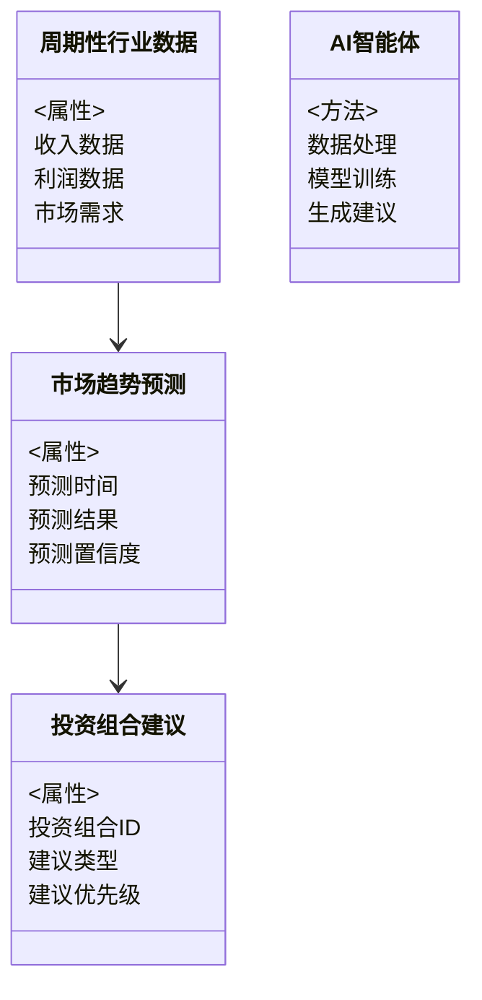

                 


# AI智能体在识别周期性行业投资机会中的应用

---

## 关键词
AI智能体，周期性行业，投资机会，机器学习，自然语言处理，时间序列分析

---

## 摘要
本文探讨了AI智能体在识别周期性行业投资机会中的应用。周期性行业受经济周期影响较大，AI智能体通过机器学习、自然语言处理和时间序列分析等技术，帮助投资者有效识别和预测投资机会。文章详细分析了AI智能体的核心原理、算法流程、系统架构，并通过实际案例展示了其在投资决策中的应用价值。

---

## 第一章：背景介绍

### 1.1 问题背景
周期性行业的特点是其收益与经济周期波动密切相关，如能源、材料和工业制造行业。经济波动导致这些行业的盈利能力和市场需求发生显著变化。传统的投资分析方法依赖于人工经验和市场直觉，存在主观性强、效率低、风险高等问题。

AI技术的快速发展为投资决策提供了新的工具。AI智能体能够通过大数据分析和自动化决策，帮助投资者在周期性行业中识别潜在的投资机会，优化投资组合。

### 1.2 问题描述
周期性行业的投资机会识别面临以下挑战：
1. 数据复杂性：周期性行业受多种因素影响，数据来源广泛且复杂。
2. 市场波动性：经济周期波动导致市场不确定性增加，传统方法难以捕捉短期变化。
3. 决策效率：人工分析耗时长，难以及时应对市场变化。

AI智能体通过自动化数据处理和预测模型，能够快速识别市场趋势，提高投资决策的效率和准确性。

### 1.3 问题解决
AI智能体在投资机会识别中的应用包括：
1. 数据采集与清洗：从多种数据源获取行业数据，进行预处理。
2. 市场趋势预测：利用机器学习模型预测行业周期性波动。
3. 投资组合优化：基于预测结果，优化投资组合配置。

### 1.4 边界与外延
AI智能体的应用范围主要集中在周期性行业的投资机会识别，目前还无法完全替代人工决策。与其他投资工具相比，AI智能体具有更高的数据处理能力和预测准确性，未来可能扩展至更多行业和应用场景。

---

## 第二章：核心概念与联系

### 2.1 核心概念原理
AI智能体由数据处理模块、预测模型和决策模块组成。数据处理模块负责收集和清洗数据，预测模型基于机器学习算法进行市场趋势预测，决策模块根据预测结果生成投资建议。

### 2.2 概念属性对比表格
| 概念       | 传统投资工具 | AI智能体         |
|------------|--------------|------------------|
| 数据处理   | 人工分析      | 自动化处理        |
| 决策速度   | 较慢         | 实时快速          |
| 适应性     | 较低         | 高               |

### 2.3 ER实体关系图
```mermaid
er
  entity 周期性行业数据 {
    key: 行业代码
    field: 收入数据, 利润数据, 市场需求
  }
  entity 市场趋势预测 {
    key: 预测时间
    field: 预测结果, 预测置信度
  }
  entity 投资组合建议 {
    key: 投资组合ID
    field: 建议类型, 建议优先级
  }
  周期性行业数据 --> 市场趋势预测
  市场趋势预测 --> 投资组合建议
```

---

## 第三章：算法原理讲解

### 3.1 算法流程
AI智能体的算法流程如下：
1. 数据采集：从股票市场、行业报告等数据源获取周期性行业数据。
2. 数据清洗：处理缺失值和异常值，确保数据质量。
3. 特征提取：提取行业收入、利润等关键特征。
4. 模型训练：使用时间序列模型（如ARIMA、LSTM）进行预测。
5. 投资决策：根据预测结果生成投资建议。

### 3.2 算法实现代码
```python
from sklearn.metrics import mean_squared_error
import numpy as np
import pandas as pd
from statsmodels.tsa.arima_model import ARIMA

# 示例数据加载
data = pd.read_csv('周期性行业数据.csv')

# 数据预处理
def prepare_data(data):
    # 删除缺失值
    data.dropna(inplace=True)
    # 标准化处理
    data = (data - data.mean()) / data.std()
    return data

# 训练ARIMA模型
def train_arima_model(data, order=(5, 1, 0)):
    model = ARIMA(data, order=order)
    model_fit = model.fit()
    return model_fit

# 模型预测
def predict_future(model_fit, data, steps=5):
    forecast = model_fit.forecast(steps)
    return forecast

# 主程序
def main():
    data_processed = prepare_data(data)
    model_fit = train_arima_model(data_processed)
    forecast = predict_future(model_fit, data_processed)
    print(forecast)

if __name__ == "__main__":
    main()
```

### 3.3 数学模型
ARIMA模型的数学公式为：
$$ARIMA(p, d, q) = \phi(B) (1 - B)^d X_t = \theta(B) \epsilon_t$$
其中，p为自回归阶数，d为差分阶数，q为移动平均阶数。

LSTM模型的结构包括输入门控、遗忘门控和输出门控，公式如下：
$$
i_t = \sigma(w_i x_t + u_i h_{t-1} + b_i) \\
f_t = \sigma(w_f x_t + u_f h_{t-1} + b_f) \\
o_t = \sigma(w_o x_t + u_o h_{t-1} + b_o) \\
h_t = i_t \cdot \tanh(w_c x_t + u_c h_{t-1} + b_c)
$$

---

## 第四章：系统分析与架构设计方案

### 4.1 问题场景介绍
本项目旨在开发一个AI智能体，帮助投资者识别周期性行业的投资机会。系统将从多个数据源获取行业数据，通过机器学习模型进行预测，并生成投资建议。

### 4.2 系统功能设计


### 4.3 系统架构设计


### 4.4 系统接口设计
系统接口包括数据接口、模型接口和用户接口。数据接口用于获取行业数据，模型接口用于调用预测模型，用户接口用于展示投资建议。

### 4.5 系统交互流程
```mermaid
sequenceDiagram
    用户请求预测
    --> 数据处理模块: 获取数据
    数据处理模块 --> 模型训练模块: 训练模型
    模型训练模块 --> 预测结果
    预测结果 --> 用户界面: 显示建议
```

---

## 第五章：项目实战

### 5.1 环境安装
安装必要的Python库：
```bash
pip install numpy pandas scikit-learn statsmodels
```

### 5.2 核心实现代码
```python
import pandas as pd
from statsmodels.tsa.arima_model import ARIMA
import matplotlib.pyplot as plt

# 数据加载与预处理
data = pd.read_csv('周期性行业数据.csv')
data = data['收入数据'].values

# ARIMA模型训练
model = ARIMA(data, order=(5, 1, 0))
model_fit = model.fit()

# 模型预测
forecast, conf_int = model_fit.forecast(10)
print(forecast)
plt.plot(data, label='实际数据')
plt.plot(forecast, label='预测数据')
plt.legend()
plt.show()
```

### 5.3 案例分析
以能源行业为例，AI智能体通过分析历史数据，预测行业收入将下降，建议投资者减少对该行业的投资。

### 5.4 项目小结
本项目展示了AI智能体在周期性行业投资中的应用潜力，通过实际案例验证了算法的有效性。

---

## 第六章：总结

### 6.1 最佳实践
- 数据质量是模型准确性的关键，需确保数据清洗和特征提取的准确性。
- 定期更新模型参数，以适应市场变化。
- 结合人工分析，避免完全依赖AI决策。

### 6.2 小结
本文详细探讨了AI智能体在周期性行业投资机会识别中的应用，通过理论分析和实践案例展示了其在投资决策中的价值。

### 6.3 注意事项
- AI智能体无法完全预测市场波动，需谨慎使用。
- 保持对市场的敏感性，及时调整投资策略。

### 6.4 拓展阅读
推荐阅读《机器学习在金融中的应用》和《自然语言处理在投资分析中的应用》。

---

通过以上内容，读者可以全面了解AI智能体在周期性行业投资中的应用，从理论到实践，掌握其实现方法和应用场景。

