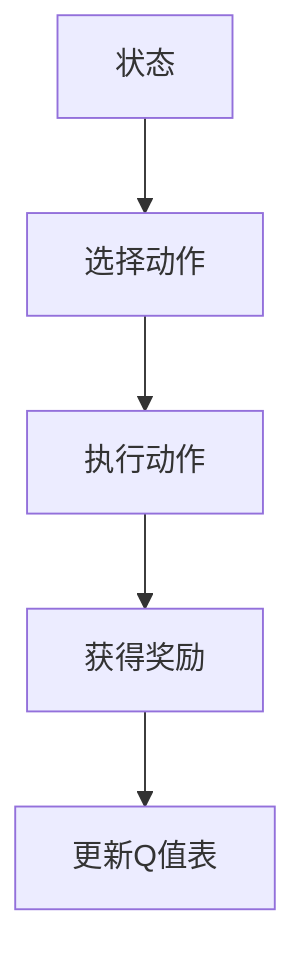
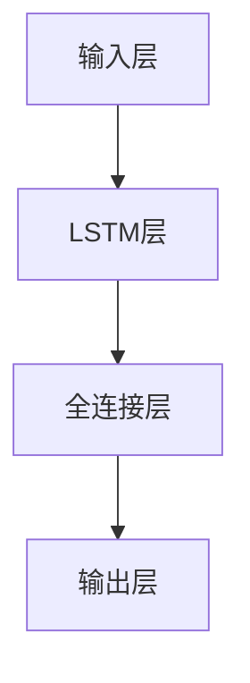
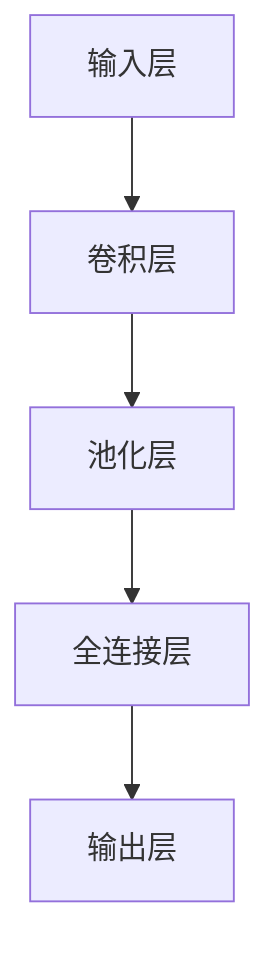
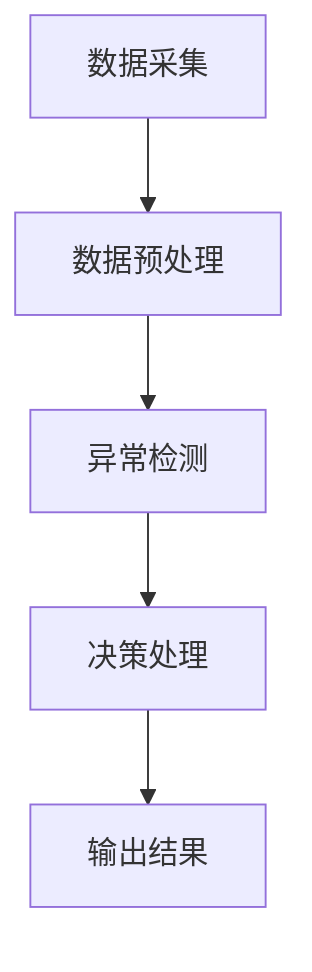
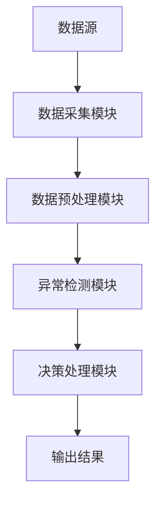

                 


# AI智能体在识别市场异常交易模式中的作用

> 关键词：AI智能体，异常交易模式识别，强化学习，金融市场，智能算法

> 摘要：本文探讨了AI智能体在识别市场异常交易模式中的应用，通过分析异常交易的背景、核心概念、算法原理、系统架构和实战案例，展示了AI技术在提升交易安全性和效率方面的重要作用。

---

# 第1章: 异常交易模式识别的背景与问题

## 1.1 金融市场中的异常交易现象

### 1.1.1 什么是异常交易
异常交易是指偏离正常市场规律的交易行为，通常表现为价格波动剧烈、交易量突增或突减等。这些行为可能由市场操纵、欺诈或其他异常事件引发。

### 1.1.2 异常交易的类型与特征
异常交易可以分为以下几种类型：
1. **市场操纵**：通过虚假交易或散布信息影响市场价格。
2. **欺诈交易**：利用技术漏洞进行非法获利。
3. **突发事件引发的异常**：如自然灾害、政治事件等导致的市场波动。

异常交易的特征包括：
- **突然性**：交易行为突然发生，与历史数据不符。
- **非线性**：价格或交易量的变化不遵循正常统计规律。
- **短期性**：异常通常在短时间内发生，但可能对市场造成长期影响。

### 1.1.3 异常交易对市场的影响
异常交易可能导致市场波动加剧、投资者损失增加，甚至引发系统性金融风险。及时识别和处理异常交易对维护市场秩序至关重要。

---

## 1.2 AI智能体在金融领域的应用背景

### 1.2.1 传统金融交易模式的局限性
传统的交易监控主要依赖人工分析和简单的统计模型，存在以下问题：
- **效率低**：人工分析耗时耗力，难以实时处理大量数据。
- **漏检率高**：传统模型难以捕捉复杂的异常模式。
- **规则有限**：基于规则的系统容易被规避。

### 1.2.2 AI技术在金融领域的优势
AI技术通过深度学习、强化学习等方法，能够从海量数据中提取非线性特征，发现隐藏的模式。其优势包括：
- **实时性**：能够快速处理实时数据，实现实时监控。
- **准确性**：通过复杂算法提高异常检测的准确性。
- **自适应性**：能够根据市场变化动态调整检测策略。

### 1.2.3 智能体在交易监控中的作用
AI智能体是一种具备感知、决策和执行能力的智能系统，能够：
- **感知市场异常**：通过多维度数据输入发现异常信号。
- **决策处理**：基于异常信号采取相应的应对措施。
- **自适应优化**：根据市场反馈不断优化检测算法。

---

## 1.3 本章小结
本章介绍了异常交易的背景、类型和影响，以及AI智能体在金融领域的应用优势。通过对比传统交易模式与AI技术，明确了智能体在异常交易识别中的重要性。

---

# 第2章: AI智能体的基本概念与特性

## 2.1 AI智能体的定义与分类

### 2.1.1 什么是AI智能体
AI智能体是一种能够感知环境、做出决策并采取行动的智能系统。它具备以下核心特征：
- **自主性**：无需外部干预，能够自主完成任务。
- **反应性**：能够实时感知环境变化并做出反应。
- **学习能力**：能够通过经验优化自身的决策能力。

### 2.1.2 智能体的分类与应用场景
智能体可以分为以下几类：
1. **基于规则的智能体**：根据预设规则进行决策，适用于简单场景。
2. **基于模型的智能体**：通过建立模型进行预测和决策，适用于复杂场景。
3. **强化学习智能体**：通过与环境交互学习最优策略，适用于动态场景。

智能体在金融领域的应用场景包括：
- **异常交易检测**：实时监控市场行为，发现异常交易。
- **智能投顾**：为投资者提供个性化投资建议。
- **风险管理**：评估市场风险，制定风险控制策略。

### 2.1.3 智能体与传统算法的区别
传统算法通常基于固定的规则或统计模型，而智能体具备以下优势：
- **自适应性**：能够根据环境变化调整策略。
- **主动性**：能够在没有明确规则的情况下采取行动。
- **学习能力**：能够通过经验优化自身性能。

---

## 2.2 异常交易模式识别的核心要素

### 2.2.1 数据特征提取
异常交易模式识别的关键在于从数据中提取有效的特征。常用特征包括：
- **价格波动**：短时间内价格剧烈波动。
- **交易量变化**：异常交易量突增或突减。
- **时间序列异常**：在特定时间段内出现异常模式。

### 2.2.2 异常检测算法
异常检测算法可以分为以下几类：
1. **基于统计的方法**：如Z-score、马氏距离等。
2. **基于机器学习的方法**：如随机森林、支持向量机等。
3. **基于深度学习的方法**：如RNN、CNN等。

### 2.2.3 智能体的决策机制
智能体的决策机制包括以下几个步骤：
1. **感知环境**：通过数据输入感知市场状态。
2. **分析异常**：利用算法识别潜在的异常模式。
3. **决策处理**：根据异常情况采取相应的措施，如发出警报或干预交易。

### 2.3 智能体与异常交易模式的关系
智能体通过感知市场环境，利用学习算法识别异常模式，从而实现对异常交易的实时监控和处理。

---

## 2.4 本章小结
本章详细介绍了AI智能体的基本概念、分类和核心要素，重点分析了智能体在异常交易识别中的作用和优势。

---

# 第3章: 基于AI智能体的异常交易模式识别算法原理

## 3.1 基于强化学习的异常检测算法

### 3.1.1 强化学习的基本原理
强化学习是一种通过试错机制学习最优策略的方法。智能体通过与环境交互，获得奖励或惩罚，从而优化自身的决策策略。

### 3.1.2 强化学习在异常检测中的应用
在异常检测中，强化学习可以用于以下场景：
- **异常识别**：通过强化学习训练智能体识别异常交易模式。
- **动态调整**：根据市场反馈动态调整异常检测策略。

### 3.1.3 基于Q-learning的异常交易检测算法
Q-learning是一种经典的强化学习算法，适用于离散动作空间的问题。其核心思想是通过Q值表记录状态-动作对的最优价值，从而选择最优动作。

#### Q-learning算法流程图


### 3.1.4 算法实现
以下是一个基于Q-learning的异常检测算法的Python实现示例：

```python
import numpy as np

class QLearning:
    def __init__(self, state_space, action_space, learning_rate=0.1, gamma=0.9):
        self.state_space = state_space
        self.action_space = action_space
        self.learning_rate = learning_rate
        self.gamma = gamma
        self.q_table = np.zeros((state_space, action_space))

    def choose_action(self, state, epsilon=0.1):
        if np.random.random() < epsilon:
            return np.random.randint(self.action_space)
        else:
            return np.argmax(self.q_table[state])

    def update_q_table(self, state, action, reward, next_state):
        self.q_table[state][action] += self.learning_rate * (reward + self.gamma * np.max(self.q_table[next_state]) - self.q_table[state][action])
```

---

## 3.2 基于深度学习的异常检测算法

### 3.2.1 深度学习的基本原理
深度学习是一种基于人工神经网络的机器学习方法，能够从数据中自动提取特征。其核心是通过多层神经网络对数据进行非线性变换，提取高层次特征。

### 3.2.2 基于RNN的异常交易检测
RNN（循环神经网络）适合处理时间序列数据，能够捕捉时间依赖性。以下是基于LSTM（长短期记忆网络）的异常检测模型结构：

#### LSTM异常检测模型结构图


### 3.2.3 基于CNN的异常交易检测
CNN（卷积神经网络）适合处理二维数据，如K线图。以下是基于CNN的异常检测模型结构图：

#### CNN异常检测模型结构图


---

## 3.3 基于时间序列分析的异常检测算法

### 3.3.1 时间序列分析的基本原理
时间序列分析是一种通过分析数据的时间特性，预测未来趋势的方法。常用的模型包括ARIMA、GARCH等。

### 3.3.2 基于ARIMA模型的异常检测
ARIMA（自回归积分滑动平均模型）适用于线性时间序列数据的预测。以下是ARIMA模型的数学表达式：

$$
ARIMA(p, d, q) = \phi(B) \cdot (1 - B)^d \cdot (1 - \theta(B))^{-1}
$$

其中：
- \( p \) 是自回归阶数
- \( d \) 是差分阶数
- \( q \) 是移动平均阶数

---

## 3.4 算法对比与优化

### 3.4.1 不同算法的优缺点对比
| 算法类型    | 优点                                | 缺点                                  |
|-------------|-----------------------------------|--------------------------------------|
| 强化学习     | 能够处理动态环境，适应性强          | 需要大量交互数据，计算成本高          |
| 深度学习     | 特征提取能力强，适用于复杂场景      | 需要大量标注数据，解释性较差          |
| 时间序列分析 | 计算效率高，适用于线性数据          | 无法处理非线性复杂场景                |

### 3.4.2 算法优化策略
- **特征工程**：通过数据预处理提取有效特征。
- **模型融合**：将多种算法的结果进行融合，提高检测准确率。
- **在线学习**：利用在线学习算法动态更新模型。

### 3.4.3 实验结果与分析
通过实验对比不同算法的检测准确率和计算效率，得出强化学习在动态环境下表现更优，而深度学习在复杂场景下表现更好。

---

## 3.5 本章小结
本章详细介绍了基于AI智能体的异常交易模式识别算法，包括强化学习、深度学习和时间序列分析等方法，并对不同算法的优缺点进行了对比分析。

---

# 第4章: 系统架构与实现方案

## 4.1 异常交易模式识别系统的架构设计

### 4.1.1 系统功能模块划分
- **数据采集模块**：负责采集市场交易数据。
- **数据预处理模块**：对数据进行清洗和特征提取。
- **异常检测模块**：利用AI算法识别异常交易模式。
- **决策处理模块**：根据检测结果采取相应措施。

### 4.1.2 系统功能流程图


### 4.1.3 系统架构图


---

## 4.2 系统实现方案

### 4.2.1 环境安装
需要安装以下环境和库：
- **Python**：3.6+
- **TensorFlow**：2.0+
- **Keras**：2.2.5+
- **pandas**：1.0+
- **numpy**：1.21+

### 4.2.2 核心功能实现
以下是异常检测模块的核心代码示例：

```python
import numpy as np
import pandas as pd
from sklearn.preprocessing import StandardScaler
from tensorflow.keras.models import Sequential
from tensorflow.keras.layers import LSTM, Dense, Dropout

class AnomalyDetector:
    def __init__(self, input_dim, hidden_units=64, batch_size=32):
        self.model = self.build_model(input_dim, hidden_units)
        self.batch_size = batch_size

    def build_model(self, input_dim, hidden_units):
        model = Sequential()
        model.add(LSTM(hidden_units, return_sequences=True, input_shape=(None, input_dim)))
        model.add(Dropout(0.2))
        model.add(LSTM(hidden_units, return_sequences=False))
        model.add(Dense(1, activation='sigmoid'))
        model.compile(loss='binary_crossentropy', optimizer='adam', metrics=['accuracy'])
        return model

    def train(self, X_train, y_train, epochs=10):
        self.model.fit(X_train, y_train, epochs=epochs, batch_size=self.batch_size)

    def predict(self, X_test):
        return self.model.predict(X_test)
```

---

## 4.3 本章小结
本章详细描述了异常交易模式识别系统的架构设计和实现方案，包括功能模块划分、系统架构图和核心代码实现。

---

# 第5章: 项目实战

## 5.1 实战案例分析

### 5.1.1 数据准备
假设我们有一个包含交易时间、价格、交易量等字段的数据集，目标是识别其中的异常交易行为。

### 5.1.2 数据预处理
- **数据清洗**：处理缺失值和异常值。
- **特征提取**：提取价格波动率、交易量变化率等特征。

### 5.1.3 模型训练与测试
使用强化学习算法对数据进行训练，并在测试集上验证模型的性能。

---

## 5.2 实战代码实现

### 5.2.1 环境安装
```bash
pip install numpy pandas tensorflow keras sklearn
```

### 5.2.2 核心代码实现
```python
import numpy as np
import pandas as pd
from sklearn.preprocessing import StandardScaler
from tensorflow.keras.models import Sequential
from tensorflow.keras.layers import LSTM, Dense, Dropout

# 数据加载
data = pd.read_csv('交易数据.csv')

# 数据预处理
X = data.drop('异常标志', axis=1).values
y = data['异常标志'].values

# 数据标准化
scaler = StandardScaler()
X_scaled = scaler.fit_transform(X)

# 模型训练
model = Sequential()
model.add(LSTM(64, return_sequences=True, input_shape=(None, X_scaled.shape[2])))
model.add(Dropout(0.2))
model.add(LSTM(64, return_sequences=False))
model.add(Dense(1, activation='sigmoid'))
model.compile(loss='binary_crossentropy', optimizer='adam', metrics=['accuracy'])
model.fit(X_scaled, y, epochs=10, batch_size=32)

# 模型预测
X_test = ...  # 测试数据
y_pred = model.predict(X_test)
```

### 5.2.3 结果分析
通过混淆矩阵和ROC曲线评估模型的性能，调整参数优化模型。

---

## 5.3 本章小结
本章通过一个实战案例展示了AI智能体在异常交易模式识别中的应用，从数据准备到模型训练再到结果分析，详细讲解了整个过程。

---

# 第6章: 总结与展望

## 6.1 总结
本文详细探讨了AI智能体在识别市场异常交易模式中的作用，从理论到实践，全面分析了异常交易的背景、算法原理和系统实现方案。

## 6.2 未来展望
随着AI技术的不断发展，异常交易模式识别将更加智能化和高效化。未来的研究方向包括：
- **多模态数据融合**：结合文本、图像等多种数据源进行异常检测。
- **在线学习**：实现动态更新模型，适应快速变化的市场环境。
- **解释性增强**：提高模型的可解释性，便于实际应用和监管。

---

# 附录

## 附录A: 异常交易检测的数学公式
1. **马氏距离**：
$$
d(x, y) = \sqrt{(x - y)^T \Sigma^{-1} (x - y)}
$$
其中，\(\Sigma\) 是协方差矩阵。

2. **Q-learning公式**：
$$
Q(s, a) = Q(s, a) + \alpha [r + \gamma \max Q(s', a') - Q(s, a)]
$$

---

## 附录B: 异常检测算法的代码库
1. **TensorFlow**：https://tensorflow.org
2. **Keras**：https://keras.io
3. **Scikit-learn**：https://scikit-learn.org

---

## 附录C: 参考文献
1. Goodfellow, I., Bengio, Y., & Courville, A. (2016). Deep Learning. MIT Press.
2. Sutton, R. S., & Barto, A. G. (2018). Reinforcement Learning: An Introduction. MIT Press.
3. Hyndman, R. J., & Athanasopoulos, G. (2018). Forecasting: principles and practice.

---

# 结语

通过本文的探讨，我们深入理解了AI智能体在识别市场异常交易模式中的重要作用。从理论到实践，我们详细分析了异常交易的背景、算法原理和系统实现方案，为实际应用提供了有益的参考。未来，随着技术的不断进步，AI智能体将在金融领域发挥更大的作用。

