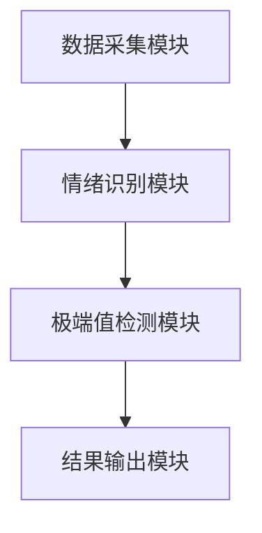

                 


# AI智能体在识别市场情绪极端值中的作用

> **关键词**：AI智能体、市场情绪、极端值、自然语言处理、时间序列分析、金融数据分析  
> **摘要**：本文探讨了AI智能体在识别市场情绪极端值中的应用，结合自然语言处理和时间序列分析，详细讲解了市场情绪的识别方法、AI智能体的算法原理、系统架构设计以及实际案例分析。

---

## 第一部分：市场情绪与AI智能体概述

### 第1章：市场情绪的基本概念

#### 1.1 市场情绪的定义与特征
市场情绪指的是投资者在金融市场中的整体情绪状态，通常通过市场参与者的言论、交易行为和媒体情绪来衡量。极端市场情绪指的是市场情绪的剧烈波动或极端偏离正常状态，可能预示着市场的转折点或危机。

- **市场情绪的定义**：市场情绪是投资者对市场的整体看法和态度，反映在交易行为、新闻报道和社交媒体上。
- **极端市场情绪的特征**：市场情绪强度极高或极低，市场参与者行为一致性高，可能导致市场崩盘或暴涨。

#### 1.2 AI智能体的基本概念
AI智能体是一种能够感知环境、做出决策并采取行动的智能系统，具备学习、推理和自适应能力。在市场情绪识别中，AI智能体可以实时分析大量数据，识别极端情绪。

- **AI智能体的核心特征**：自主性、反应性、目标导向、学习能力。
- **AI智能体的优势**：高效处理多源数据、实时反馈、自我优化。

#### 1.3 AI智能体在极端市场情绪识别中的作用
AI智能体能够通过分析文本、社交媒体和交易数据，快速识别市场情绪的极端值，帮助投资者做出及时决策。

- **优势**：提高识别效率、降低人为偏差、实时监控市场动态。
- **应用领域**：金融投资、风险管理、市场预测。

### 第2章：市场情绪识别的核心概念

#### 2.1 情感分类与强度分析
- **情感分类**：将文本分为积极、消极或中性情绪。
- **情感强度分析**：量化情绪的强度，识别极端情绪。

#### 2.2 极端市场情绪识别的关键指标
- **市场情绪强度**：衡量情绪的强弱程度。
- **情绪波动性**：情绪变化的速度和幅度。
- **情绪一致性**：市场参与者意见的一致性。

#### 2.3 AI智能体的核心要素
- **数据来源**：新闻、社交媒体、交易数据。
- **模型训练**：使用深度学习模型进行情绪分类。
- **系统实时性**：快速响应市场变化。

---

## 第二部分：情绪识别的理论基础

### 第3章：情绪识别的算法原理

#### 3.1 文本挖掘与自然语言处理
- **文本挖掘**：从非结构化数据中提取有用信息。
- **自然语言处理（NLP）**：处理和理解人类语言的技术，包括分词、情感分析等。

#### 3.2 时间序列分析与情绪预测
- **时间序列分析**：研究数据随时间的变化规律，用于预测市场情绪。

### 第4章：AI智能体的算法原理

#### 4.1 情感分类算法
- **支持向量机（SVM）**：用于分类任务。
- **随机森林**：基于决策树的集成学习方法。
- **深度学习模型**：如LSTM用于时间序列分析。

#### 4.2 系统架构设计
- **数据采集模块**：收集社交媒体、新闻数据。
- **情绪识别模块**：使用NLP技术分析文本情绪。
- **极端值检测模块**：基于时间序列分析识别极端情绪。

---

## 第三部分：系统架构与设计

### 第5章：系统架构设计

#### 5.1 系统功能设计
- **数据采集**：实时收集市场相关数据。
- **情绪分析**：对数据进行情感分类和强度分析。
- **极端值检测**：识别市场情绪的极端值。

#### 5.2 系统架构图


---

## 第四部分：项目实战

### 第6章：项目实战

#### 6.1 环境安装
- 安装Python、TensorFlow、Keras等工具。

#### 6.2 核心实现
```python
import numpy as np
from tensorflow.keras.models import Sequential
from tensorflow.keras.layers import LSTM, Dense, Dropout

# 情感分类模型
model = Sequential()
model.add(LSTM(64, input_shape=(timesteps, features)))
model.add(Dropout(0.5))
model.add(Dense(3, activation='softmax'))  # 3类情感分类
```

#### 6.3 实际案例分析
- 使用社交媒体数据训练模型，识别极端情绪，指导投资决策。

---

## 第五部分：结论与展望

### 第7章：结论与展望

#### 7.1 结论
AI智能体通过自然语言处理和时间序列分析，有效识别市场情绪的极端值，为投资者提供决策支持。

#### 7.2 展望
未来，AI智能体在市场情绪识别中的应用将更加广泛，结合更多数据源和算法优化，提升识别的准确性和实时性。

---

## 第六部分：最佳实践与注意事项

### 第8章：最佳实践

#### 8.1 数据质量的重要性
确保数据来源多样、准确，避免偏差。

#### 8.2 模型的可解释性
选择可解释的模型，便于分析和调整。

#### 8.3 系统的实时性与稳定性
确保系统能够实时响应市场变化，保持稳定性。

---

通过以上结构，文章详细讲解了AI智能体在识别市场情绪极端值中的作用，从理论到实践，为读者提供了全面的指导。

