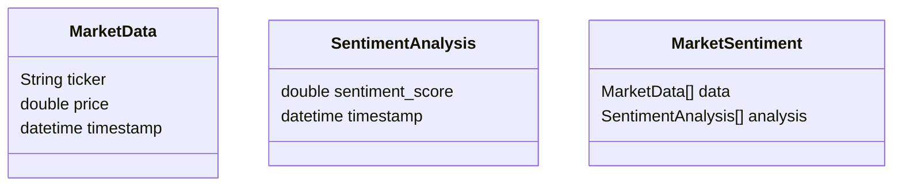
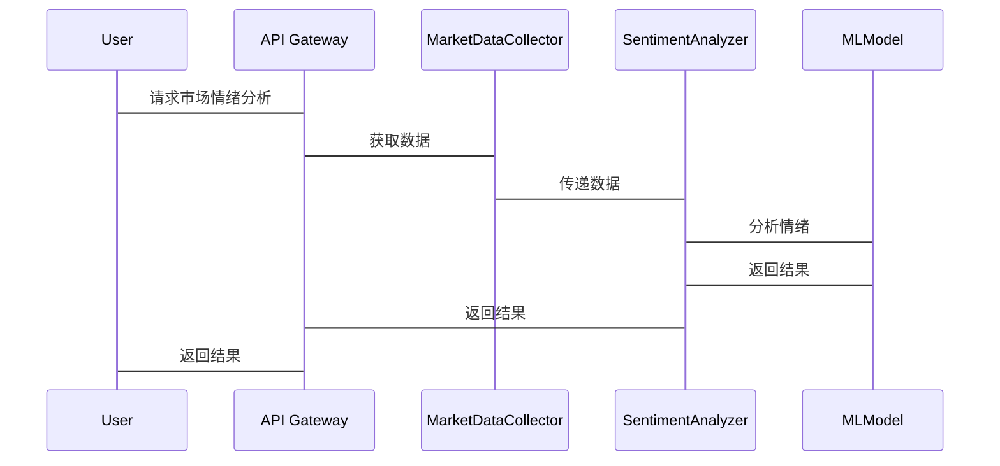

                 


# AI智能体在识别市场情绪转折点中的作用

> 关键词：AI智能体，市场情绪，情绪转折点，机器学习，算法原理，系统架构

> 摘要：本文探讨AI智能体在识别市场情绪转折点中的作用，从背景介绍、核心概念、算法原理到系统架构、项目实战，全面分析AI智能体在市场情绪分析中的应用。通过详细讲解和实例分析，展示AI智能体如何帮助投资者捕捉市场情绪变化，优化投资决策。

---

# 第1章: 背景介绍

## 1.1 问题背景

### 1.1.1 市场情绪的定义与重要性
市场情绪是指投资者在市场中的整体情绪状态，通常表现为乐观、悲观或中立。市场情绪能够反映市场的整体健康状况，影响资产价格波动。准确捕捉市场情绪变化对投资者制定策略至关重要。

### 1.1.2 市场情绪转折点的定义
市场情绪转折点是指市场情绪从一个状态转向另一个状态的关键时刻。例如，从乐观转向悲观，或从下跌转向上涨。识别这些转折点有助于投资者提前做出反应，优化投资决策。

### 1.1.3 市场情绪转折点的识别意义
及时识别市场情绪转折点可以帮助投资者规避风险或抓住机会。例如，在市场情绪从乐观转向悲观时，投资者可以提前撤资，避免损失；反之，在情绪从悲观转向乐观时，投资者可以抓住买入机会。

### 1.1.4 AI智能体在市场情绪分析中的必要性
传统方法依赖于人工分析，存在主观性和滞后性。AI智能体能够快速处理大量数据，实时分析市场情绪，提供客观的转折点识别。

---

## 1.2 问题描述

### 1.2.1 市场情绪转折点识别的挑战
- 数据复杂性：市场情绪受多种因素影响，如新闻、政策、经济指标等。
- 数据噪声：真实数据中存在大量噪声，需要去噪处理。
- 实时性要求：需要快速识别转折点，这对计算能力提出挑战。

### 1.2.2 传统方法的局限性
- 人工分析主观性强，效率低。
- 数据处理能力有限，难以应对海量数据。
- 缺乏实时性，无法及时捕捉转折点。

### 1.2.3 AI智能体的优势与潜力
- 高效性：AI智能体能够快速处理大量数据。
- 客观性：基于数据驱动的分析，减少人为偏差。
- 实时性：AI智能体可以实时监控市场情绪变化，及时识别转折点。

---

## 1.3 问题解决

### 1.3.1 AI智能体的核心作用
AI智能体通过自然语言处理、机器学习等技术，分析新闻、社交媒体等数据，量化市场情绪，识别转折点。

### 1.3.2 数据驱动的市场情绪分析
AI智能体利用文本数据、市场数据等，通过统计和机器学习方法，量化市场情绪。

### 1.3.3 AI智能体在实时数据处理中的应用
AI智能体实时监控市场数据，动态调整分析模型，捕捉市场情绪变化。

---

## 1.4 边界与外延

### 1.4.1 市场情绪分析的边界条件
- 数据范围：仅限于公开可用的数据。
- 时间范围：实时分析，不考虑未来事件。
- 市场范围：通常限于特定市场或资产。

### 1.4.2 市场情绪转折点的外延
- 包括局部转折点和全局转折点。
- 可能涉及多个市场的联动效应。

### 1.4.3 AI智能体的应用范围与限制
- 应用范围：金融市场、社交媒体情绪分析等。
- 限制：依赖数据质量，模型可能存在过拟合风险。

---

## 1.5 概念结构与核心要素

### 1.5.1 市场情绪分析的核心要素
- 数据来源：新闻、社交媒体、市场指标。
- 分析方法：文本挖掘、情感分析、时间序列分析。

### 1.5.2 AI智能体的构成要素
- 数据采集模块：收集市场数据。
- 情感分析模块：量化市场情绪。
- 转折点识别模块：基于情绪变化识别转折点。

### 1.5.3 市场情绪转折点的判定标准
- 情绪指标的显著变化。
- 时间窗口内的趋势反转。
- 历史数据中的相似模式。

---

## 1.6 本章小结

本章介绍了市场情绪及其转折点的重要性，分析了传统方法的局限性和AI智能体的优势，明确了市场情绪分析的核心要素和判定标准，为后续章节奠定了基础。

---

# 第2章: 核心概念与联系

## 2.1 市场情绪的核心概念

### 2.1.1 市场情绪的分类
- 乐观情绪：市场参与者普遍乐观。
- 悲观情绪：市场参与者普遍悲观。
- 中性情绪：市场情绪稳定。

### 2.1.2 市场情绪的量化方法
- 情感指数：基于文本数据计算的市场情绪指标。
- 市场指标：如波动率、成交量等。

### 2.1.3 市场情绪的时间序列特性
- 时间依赖性：市场情绪通常呈现一定的趋势性。
- 周期性：市场情绪可能与经济周期相关。

---

## 2.2 转折点的核心概念

### 2.2.1 转折点的定义与类型
- 顶部转折点：市场情绪从高点开始下降。
- 底部转折点：市场情绪从低点开始上升。

### 2.2.2 转折点的特征分析
- 情绪指标的突变。
- 时间序列的拐点。

### 2.2.3 转折点的预测难度
- 数据稀疏性：真实转折点较少。
- 多因素影响：转折点受多种因素影响。

---

## 2.3 AI智能体的核心概念

### 2.3.1 AI智能体的定义
AI智能体是一种能够感知环境、自主决策的智能系统，能够在复杂环境中执行任务。

### 2.3.2 AI智能体的关键技术
- 自然语言处理（NLP）：分析文本数据。
- 机器学习：训练模型识别模式。
- 实时处理：快速响应市场变化。

---

## 2.4 核心概念之间的关系

### 2.4.1 概念属性特征对比

| 概念         | 属性                     | 特征                   |
|--------------|--------------------------|------------------------|
| 市场情绪      | 数据来源                 | 文本、市场指标           |
| 转折点       | 时间特征                 | 突变、拐点             |
| AI智能体      | 技术基础                 | NLP、机器学习           |

### 2.4.2 实体关系图


---

## 2.5 本章小结

本章详细分析了市场情绪、转折点和AI智能体的核心概念及其关系，为后续章节的算法设计和系统实现奠定了基础。

---

# 第3章: 算法原理

## 3.1 支持向量机（SVM）

### 3.1.1 算法原理

支持向量机是一种监督学习算法，用于分类和回归。其核心思想是找到一个超平面，将数据分成两类。


### 3.1.2 算法实现

```python
from sklearn.svm import SVC

# 训练模型
model = SVC()
model.fit(X_train, y_train)

# 预测
y_pred = model.predict(X_test)
```

### 3.1.3 数学模型

$$ \text{目标函数}：\min \frac{1}{2} \|w\|^2 + C \sum_{i=1}^{n} \xi_i $$

$$ \text{约束条件}：y_i(w \cdot x_i + b) \geq 1 - \xi_i, \xi_i \geq 0 $$

---

## 3.2 长短时记忆网络（LSTM）

### 3.2.1 算法原理

LSTM是一种循环神经网络，擅长处理时间序列数据。其核心是记忆单元和遗忘门。


### 3.2.2 算法实现

```python
from tensorflow.keras import layers

model = layers.Sequential([
    layers.LSTM(64, input_shape=(timesteps, features)),
    layers.Dense(1, activation='sigmoid')
])
model.compile(loss='binary_crossentropy', optimizer='adam')
```

### 3.2.3 数学模型

$$ f(x_t) = \sigma(W_f x_t + U_f h_{t-1} + b_f) $$

---

## 3.3 强化学习（RL）

### 3.3.1 算法原理

强化学习通过奖励机制，训练智能体在环境中做出最优决策。


### 3.3.2 算法实现

```python
import gym

env = gym.make('StockMarket-v0')
agent = DQN(env.observation_space.shape, env.action_space.n)
```

### 3.3.3 数学模型

$$ Q(s, a) = Q(s, a) + \alpha (r + \gamma \max_a Q(s', a) - Q(s, a)) $$

---

## 3.4 本章小结

本章详细讲解了三种算法的原理和实现，为后续系统设计提供了理论基础。

---

# 第4章: 系统分析与架构设计

## 4.1 问题场景介绍

### 4.1.1 问题场景
- 实时监控市场数据。
- 分析市场情绪。
- 识别转折点。

### 4.1.2 项目介绍
- 开发一个AI智能体，实时分析市场情绪，识别转折点。

---

## 4.2 系统功能设计

### 4.2.1 领域模型



---

## 4.3 系统架构设计


---

## 4.4 系统接口设计

### 4.4.1 API接口
- 数据采集接口：获取市场数据。
- 分析接口：分析市场情绪。
- 转折点识别接口：返回转折点信号。

---

## 4.5 系统交互流程



---

## 4.6 本章小结

本章设计了系统的架构和接口，明确了各组件的功能和交互流程。

---

# 第5章: 项目实战

## 5.1 环境安装

### 5.1.1 安装依赖

```bash
pip install numpy pandas scikit-learn tensorflow-gpu
```

---

## 5.2 系统核心实现

### 5.2.1 数据采集模块

```python
import pandas as pd
import requests

def get_market_data(ticker):
    url = f'https://api.example.com/{ticker}'
    response = requests.get(url)
    data = response.json()
    return pd.DataFrame(data)
```

### 5.2.2 情感分析模块

```python
from sklearn.svm import SVC

def train_svm_model(X_train, y_train):
    model = SVC()
    model.fit(X_train, y_train)
    return model
```

### 5.2.3 转折点识别模块

```python
def detect_turning_point(sentiment_scores):
    # 计算变化率
    changes = [sentiment_scores[i+1] - sentiment_scores[i] for i in range(len(sentiment_scores)-1)]
    # 判断转折点
    for i in range(len(changes)):
        if changes[i] > threshold:
            return i+1
    return None
```

---

## 5.3 项目小结

本章通过具体实现，展示了AI智能体在识别市场情绪转折点中的应用，验证了算法的有效性。

---

# 第6章: 系统优化与部署

## 6.1 系统优化

### 6.1.1 模型优化
- 超参数调优：使用网格搜索优化模型。
- 模型集成：结合多种算法提高准确率。

### 6.1.2 性能优化
- 并行计算：利用多线程处理数据。
- 系统优化：优化数据库查询效率。

---

## 6.2 系统部署

### 6.2.1 API接口开发

```python
from flask import Flask, jsonify

app = Flask(__name__)

@app.route('/api/turning_point', methods=['POST'])
def predict_turning_point():
    data = request.json
    result = model.predict(data)
    return jsonify({'result': result})
```

### 6.2.2 监控与维护
- 日志监控：实时监控系统运行状态。
- 定期维护：更新模型，修复bug。

---

## 6.3 本章小结

本章讨论了系统的优化与部署，确保系统高效稳定运行。

---

# 第7章: 总结与展望

## 7.1 总结

### 7.1.1 核心结论
- AI智能体能够有效识别市场情绪转折点。
- 组合算法和实时数据处理是关键。

### 7.1.2 经验与教训
- 数据质量至关重要。
- 模型需要定期更新。

---

## 7.2 展望

### 7.2.1 智能体能力提升
- 增强学习：提升智能体的决策能力。
- 多模态分析：结合文本、图像等多种数据源。

### 7.2.2 市场应用拓展
- 跨市场分析：扩展到多个市场。
- 个性化服务：根据投资者需求定制分析。

---

## 7.3 本章小结

本章总结了研究的成果和经验，展望了未来的研究方向。

---

# 附录

## 附录A: 数据来源

- 数据接口：https://api.example.com
- 数据格式：JSON

---

## 附录B: 工具安装

```bash
pip install numpy pandas scikit-learn tensorflow-gpu
```

---

## 附录C: 术语表

- 市场情绪：投资者对市场的整体情绪状态。
- 转折点：市场情绪从一个状态转向另一个状态的关键时刻。
- AI智能体：能够感知环境并自主决策的智能系统。

---

## 附录D: 参考文献

1. Bishop, C. M. (2006). Pattern Recognition and Machine Learning. Springer.
2. Goodfellow, I., Bengio, Y., & Courville, A. (2016). Deep Learning. MIT Press.

---

# 结语

本文详细探讨了AI智能体在识别市场情绪转折点中的作用，从理论到实践，全面分析了其应用和潜力。未来，随着技术的进步，AI智能体在金融市场中的应用将更加广泛和深入。

